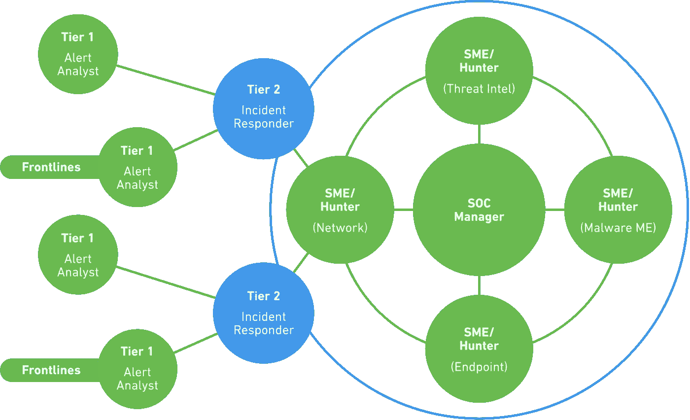
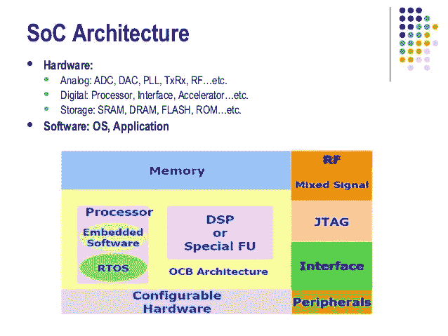
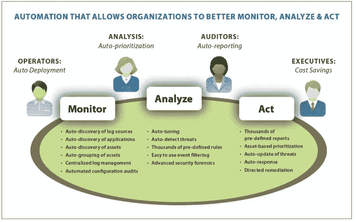

# 关于 SOC 及其业务实施的完整指南

> 原文：<https://medium.com/hackernoon/complete-guide-on-soc-and-its-implementation-for-your-business-37b063cb9128>

有了**大数据**，SOC 在商业中变得必不可少，但是这个缩写是什么意思呢？这里是 **SOC 或者安全运营中心**的定义。

大数据和数据处理的实践需要高度的安全性。在这方面，SOC 是必不可少。这个**安全运营中心**，或者说监管公司内部的信息系统以防止网络攻击。

# 作战安全中心的 SOC 定义

IT 计算机的使用(不要与 plow 和政治公司的计算机混淆)由公司的一个部门执行，该部门将确保所有安装的基础设施中的计算机安全。专业领域从网络层延伸到桌面软件。它可以监控另一个 SOC 的活动:[片上系统](https://en.wikipedia.org/wiki/System_on_a_chip)。(值得注意的是，所有 NDLR 智能手机中都有片上系统)。

**SOC 管理器**的主要活动是从安全元素收集信息，分析它们并检测潜在的异常。然后你要发现可能的安全漏洞。该部门还负责定义发生事故或违规时的安全措施，以便快速发出警报或解决问题。为此，两到三个 it 分析师团队每天轮流工作，具体取决于 IT 所在行业的重要程度。在连续运营的机场尤其如此。

# SOC 的优势和劣势

事件跟踪和入侵检测中的主要角色需要预测规则的实现。它位于防火墙和 VPN 之上。该监控系统在恶意软件传播事件中具有快速的声誉。它可以更快地识别威胁，并且在大多数情况下，它可以在短时间内从拒绝服务攻击中恢复。

在 SOC 架构中，SIM 或安全信息管理工具可以记录事件并分析相关数据。这些信息管理和安全系统由一个身份管理系统补充，用于监控分配给员工的 IT 资源池中的潜在恶意活动。它还应该包含用于监控网络流量、连接、员工行为等的工具。

为了帮助你的分析师，额外的工具正在出现。第三方发行商的目标是将他们的解决方案与已经安装的 SOC 集成。

如果运营安全中心是抵御企业入侵的最有效屏障，那么安装这样一个系统是非常昂贵的，通常需要不到半年的时间。您的 **SOC 分析师**必须对现有的基础设施、所需的安全级别以及已经应用的措施进行审核。安装后，他们必须确保系统可以定期更新，以包含最新的攻击场景数据库。

# 在企业中建立大数据 SOC 的难度

然后你可以在内部安装一个 SOC，所以开发它或者集成一个现有的解决方案。其他解决方案据说是外包的，也就是说，由服务提供商公司管理。Atos、Symantec、Wipro、Tata、McAfee、威瑞森、戴尔、Orange 和 Verisign 只是提供**外包 SOC 解决方案**的一些公司。在这种情况下，专业人士的报价会有所不同。

该法规通常强制要求使用 SOC。大多数需要保护敏感数据和/或遵守支付卡行业安全标准(PCI DSS)的公司。在网络上，电子商务巨头们尤为关注。

相比之下，SOC 不再被认为是保护自身免受攻击的最可靠的解决方案，因为它需要精确的配置并且难以实现。这需要一个稳定的组织，需要内部安全专家和外部服务提供商之间的密切合作。

此外，要保护的数据量呈爆炸式增长，而黑客自己则使用大量数据来“破坏”公司的基础架构。云的使用还需要提供被称为 [CloudSOC](https://en.wikipedia.org/wiki/Information_security_operations_center#CloudSOC) 的特殊安全单元。在机器学习和预测的时代，这种架构的演变正在出现。

最后，美国国家信息系统安全局(ANSSI)提醒说，安全运营中心不能替代对员工进行反复教育的预防措施。因此，安全中心的负责人肩上的压力很大。

由于 2018 年 5 月 25 日《通用数据保护条例》或 [GDPR](https://hackernoon.com/post-gdpr-whats-left-to-do-accd1a0aebad) 的应用将迫使 **SOC 经理**采用分析和归档与安全事件相关的信息的方式，这就更是如此。特别是，他们必须与数据控制者达成一致，以便根据数据的关键程度调整安全级别。看看在改编 GDPR 时，安全操作中心是否会被更广泛地采用。

# 如何成功部署安全运营中心(SOC)

面对日益增加的计算机威胁，以及新的法规约束(如加强个人数据保护的《通用数据保护条例》( GDPR ))的出台，任何组织都必须改进对数据保护的控制。信息系统的安全。

安全运营中心(SOC)由一组专家组成，他们扮演着监控信息系统整体安全的“控制塔”的角色，而监督小组则负责监控信息系统的运行。

SOC 提供的服务围绕四类活动组织:

# 侦查

日志的收集和分析

关联信息，将安全事件作为一个整体进行分析，而不是单独进行分析

可疑分子警报的触发和限定

客户通知和沟通

注:根据组织信息系统(OIV，SIIV)的重要性，ANSSI 要求通过认证的安全事件检测提供商。

# 反应

减少攻击所有阶段(准备、进行中和之后)的反应时间

立即处理记录的警报，并将未知案例的警报上报给分析师

与监督团队一起处理安全事件

安全事件后的调查

# 预防

与计算机安全[事件响应平台](https://www.siemplify.co/blog/4-things-soc-managers-should-care-about-in-2019/) (CSIRT / CERT)相关的安全观察

SOC 工具在操作条件(MCO)下的维护

保持 SOC 工装的安全状态(MCS)

优化检测规则，并考虑由 CSIRT / CERT 提供的危害指标(IoC)

# 沟通和报告

定期报告 SOC 活动

通过服务指示器(警报、事件、调查等)、技术指示器(MCO / MCS)和演进指示器(收集边界的扩展、新的检测规则等)的安全控制面板

为了能够提供这些服务，SOC 依赖于三个基本组件:

IT 安全方面的专业人力资源(操作员、分析师、专家)

技术工具，包括允许收集、汇总、关联和日志分析的安全事故和事件管理(SIEM)

每个主要步骤都有清晰的文档和记录流程

SOC 的建立是一个对公司组织具有横向影响的项目，会对运营产生影响。管理层的明确支持对于保护此类组织产生的经常性费用至关重要。

考虑到公司的具体环境(业务领域、法规要求、团队规模、IT 安全成熟度、当前实施的解决方案、监控范围等)，必须从最早的阶段就解决几个问题。项目的:

为实施监控而选择的技术和业务边界是什么？

内部、外部或混合团队？

SOC 托管(内部/外部)？

服务范围和预期服务水平(工作时间、罚款、24/7)？

估计预算(施工和运营)

建立 SOC 的项目必须是一系列的建设(建造)阶段，然后是开发(运行)阶段，从有限和受控的周界保护设备开始，逐渐拓宽周界。

在一些简单的用例上实现概念验证(POC)可以验证技术(跟踪收集、事件时间戳)和组织(事件管理流程、沟通、上报)要求，以及 SOC 工具(SIEM、收集飞地、传输渠道)。

最后，持续改进是 SOC 的一个主要特征，检测规则的永久发展考虑了新的威胁和/或事件后的经验反馈，减少了误报，更不用说记录了。(反射卡、事故管理流程……)

推荐视频: