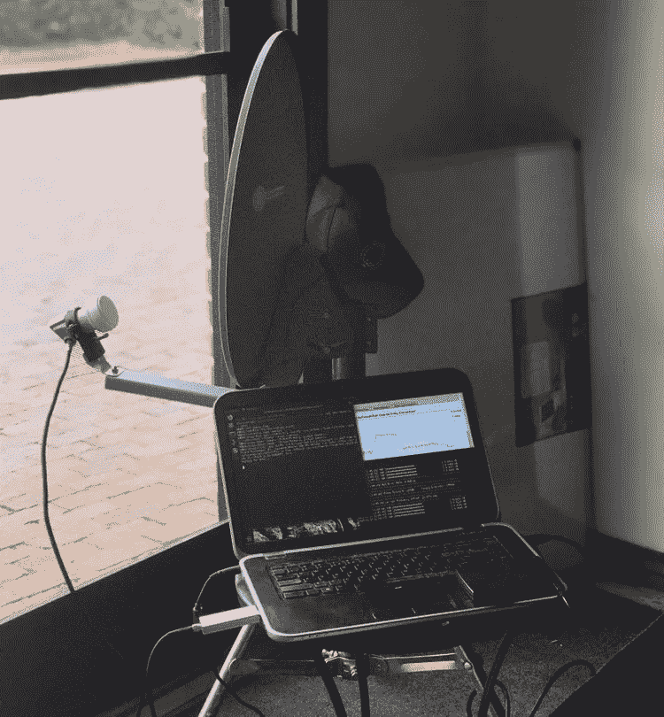
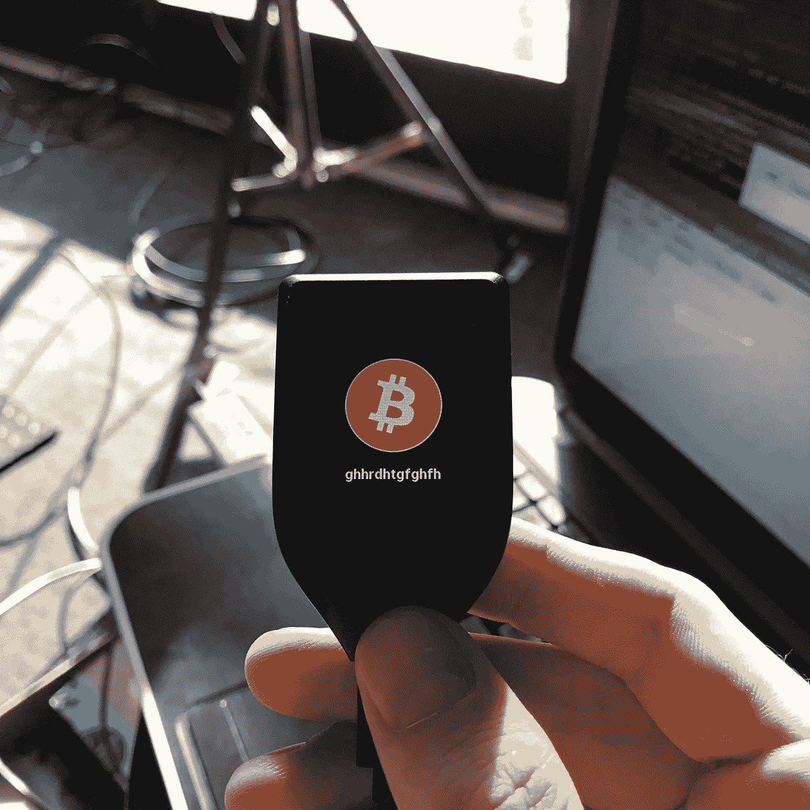
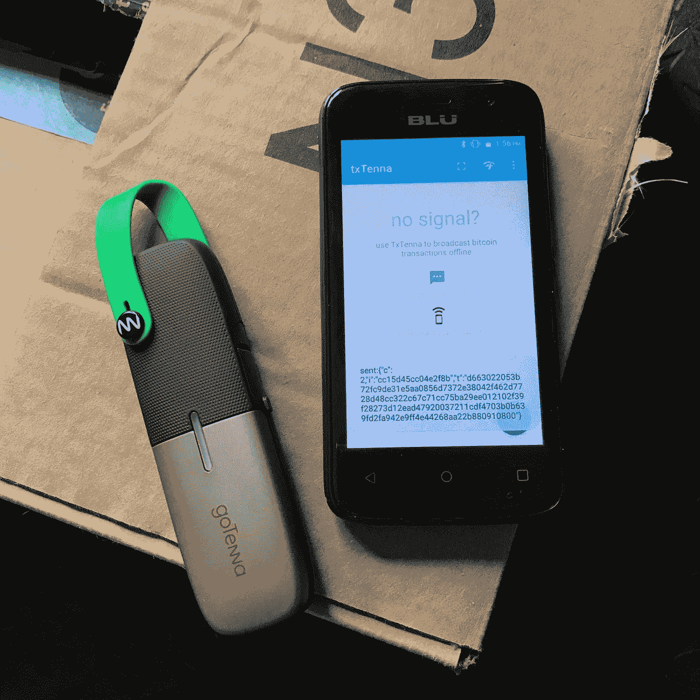
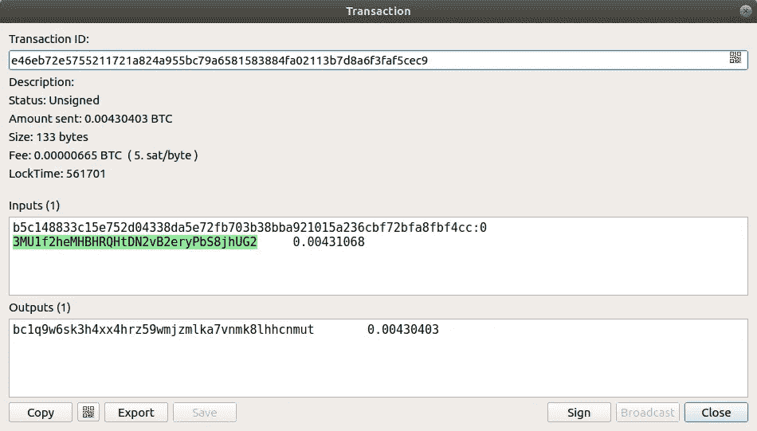
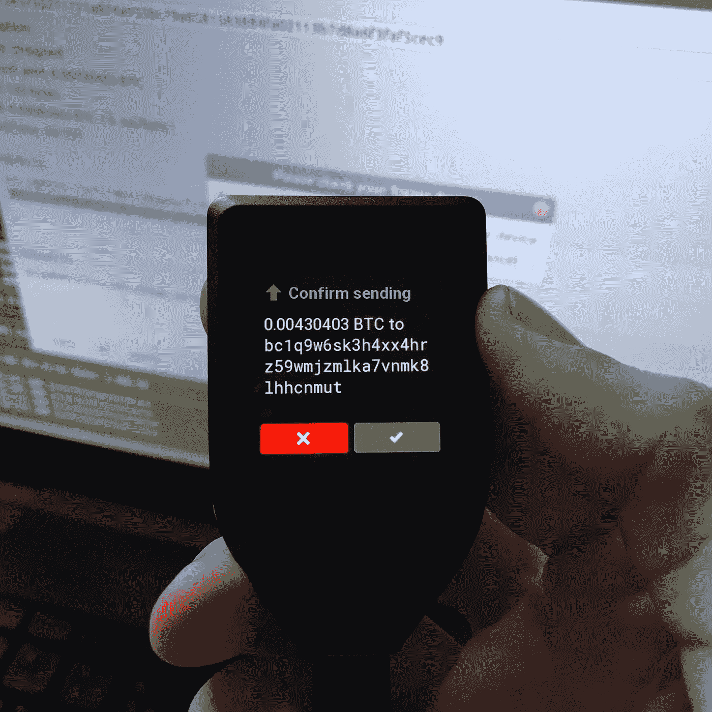
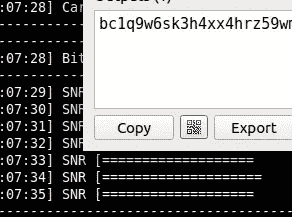
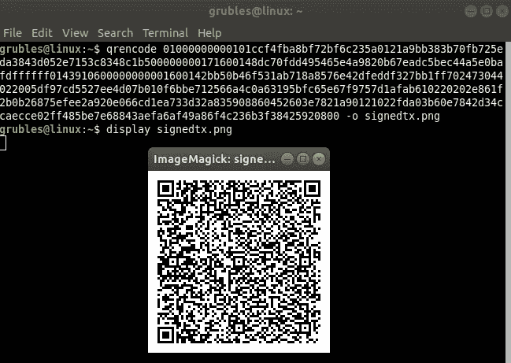
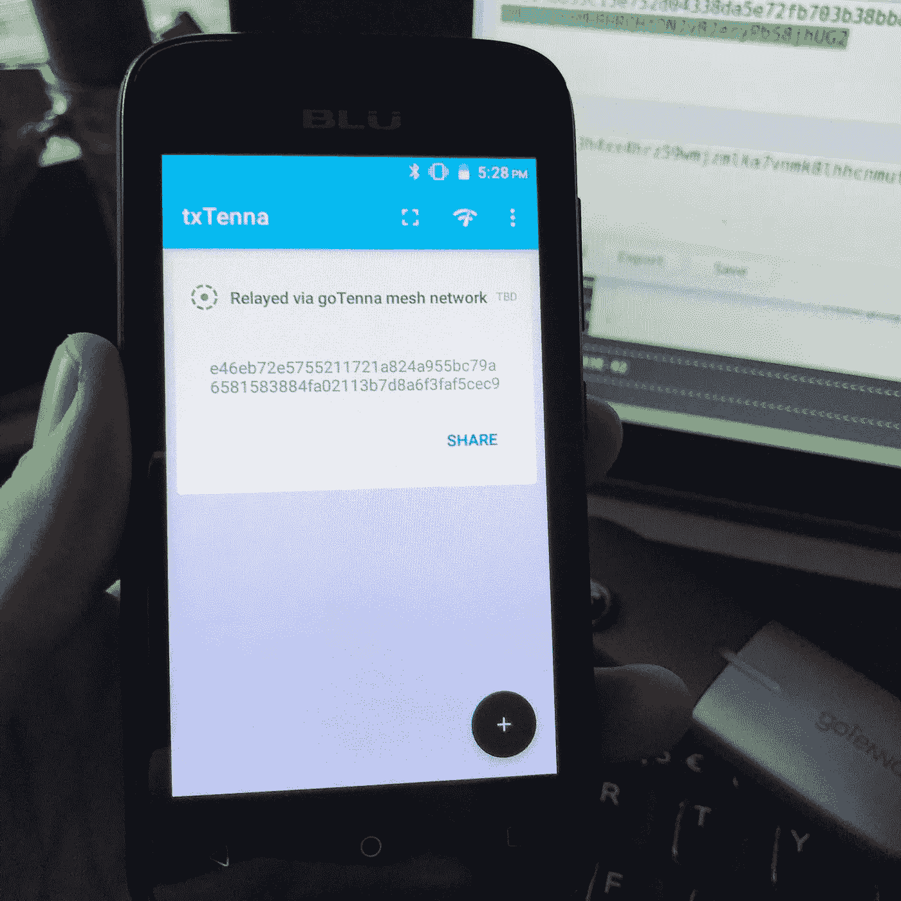
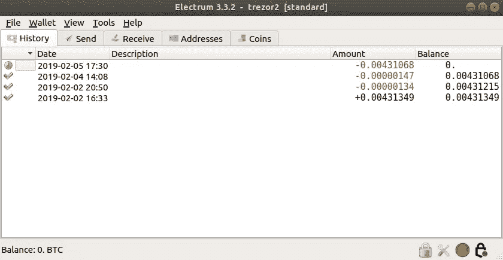

# 完全离线的比特币交易

> 原文：<https://medium.com/hackernoon/completely-offline-bitcoin-transactions-4e58324637bd>



随着 Blockstream 卫星和广泛广播、被动接收的比特币数据的出现，比特币应用的新时代可能会到来。没有高速宽带连接的地区现在可以可靠地验证比特币区块和交易，并通过普通的廉价硬件谨慎地接收 BTC。有了 Satellite API，这些领域现在可以接收任意数据——当前市场数据、私人消息以及来自尚未想到的激动人心的新用例的数据。全部免费。广播是免费的，软件也是免费的，代码可供社区审计和改进。

第一次，这个星球上的大多数人都可以使用*他们自己的完全验证节点*接收比特币，而无需昂贵的数据计划。但是他们是怎么发比特币的呢？有几个既便宜又方便的方法可以做到这一点。交易可以通过 SMS、网状网络设备甚至 sneakernet 进行广播(只需在闪存盘或打印的 QR 码上传输签名的原始交易数据)。

GoTenna 出售一种简单易用的网状网络设备，该设备与一款名为 TxTenna 的软件一起，可以向 GoTenna 的本地网状网络广播比特币交易。[对 lora wan](https://twitter.com/tulipan81/status/1058729901874917376)——一种类似的网状网络技术——的兴趣和工作也在增加。

通过这种硬件设置，任何人都可以在没有互联网连接的情况下发送和接收比特币。它可以抵抗网络中断，并且还可以在断电时保持正常运行，因为所有的硬件都是用电池供电的。如果停电时间更长，硬件当然可以依靠汽油发电机或太阳能电池板运行。

在本教程中，我们将使用以下内容:

**硬件:**

*   块流卫星接收机
*   GoTenna 网
*   安卓设备(我用的是便宜的 30 美元的酷派)
*   硬件钱包(可选)

**软件:**

*   Linux(这里用的是 Ubuntu 18.04)
*   Electrum 个人服务器
*   银白色钱包
*   `qrencode`(简称`sudo apt install qrencode`)生成二维码
*   [TxTenna 智能手机应用](https://github.com/MuleTools/txTenna)

# 离线🛰

首先，在没有互联网连接的情况下，被动接收比特币数据需要一个 Blockstream 卫星接收器。这里有全面的文档，还有我几年前写的指南:

[](https://hackernoon.com/building-your-own-bitcoin-satellite-node-6061d3c93e7) [## 打造自己的比特币卫星节点

### 外行人的指南

hackernoon.com](https://hackernoon.com/building-your-own-bitcoin-satellite-node-6061d3c93e7) 

## 银金矿

安装卫星接收器后，您可以开始安装 Electrum 个人服务器和 Electrum Wallet:

[](https://github.com/chris-belcher/electrum-personal-server) [## Chris-belcher/electrum-个人-服务器

### 最轻量级的单用户 electrum 服务器-Chris-belcher/electrum-personal-server

github.com](https://github.com/chris-belcher/electrum-personal-server) [](https://github.com/spesmilo/electrum) [## spesmilo/electrum

### 银金矿；比特币瘦客户端。在 GitHub 上创建一个帐户，为 spesmilo/electrum 的发展做出贡献。

github.com](https://github.com/spesmilo/electrum) 

# 初始化硬件钱包

如果你想使用硬件钱包，Electrum 支持大多数流行的产品:Trezor、Ledger、Coldcard，甚至可能还有 OpenDIME。

对于本教程/演示，我使用了一个 Trezor 模型 t。



My aptly named Trezor

Trezor 的博客有一个很棒的初始化硬件钱包的教程，在这里:

[https://blog . tre zor . io/using-tre zor-with-electrum-v3-a0b 9 BC FFE 26 e](https://blog.trezor.io/using-trezor-with-electrum-v3-a0b9bcffe26e)

现在你应该有一个完全脱离电网的比特币节点和钱包；能够接收 BTC 和验证块。🛰

# 出站事务广播



现在我们想花一些我们的 BTC。利用可用的工具和软件，我们可以通过本地网状网络广播签名的原始交易。

根据您当地的地理和“密度”，GoTenna 的范围可达 4 英里，森林地区或有建筑物的城市地区将会缩小 GoTenna 的范围。有*种*方法来修改 GoTenna，以连接外部天线进行更长距离的通信。注意，如果第一次没有成功，可以多次广播事务。你也可以将原始交易保存到你的移动设备上，并把它带到你能到达的地方，或者通过短信广播。

将 GoTenna 硬件与一款名为 TxTenna 的软件相结合，可以在没有蜂窝网络或 WiFi 连接的情况下实现比特币交易广播和中继。TxTenna 还支持通过短信进行交易中继。

只需使用 Google Play 或其他方式在您的 Android 智能手机上下载 TxTenna 应用程序，并将您的 GoTenna 与蓝牙配对。

## 广播前签署比特币交易

使用 Electrum Wallet，比特币交易可以用硬件钱包设备签名，并保存在本地以转换为二维码。为此，像平常一样用 Electrum 签署比特币交易，但不要用 Electrum 广播。

这笔交易是通过匿名“[后苏联](https://twitter.com/notgrubles/status/1088902367188267008)”通过 Blockstream 卫星向全球广播 BTC 的一个地址:



Transaction ready to be signed by a hardware wallet

## 签署交易。



Confirm sending

签名后，您可以点击 Electrum UI 左下方的“复制”来复制原始交易十六进制，以便生成二维码。



Click “Copy”

现在用下面的命令生成一个 QR 码:

```
$ qrencode <paste raw tx data here> -o signedtx.png
```

然后用您的 GUI 显示它:

`$ display signedtx.png`



现在，您可以使用 TxTenna 应用程序扫描二维码，并将其广播到您的本地网状网络，最终它将到达 TxTenna API 端点。

用 TxTenna 扫描二维码，通过 GoTenna Mesh 播放:

事务现在被广播到网状网络！



一旦交易被包含在块中，您的离线 satnode 将在 Electrum Wallet 中显示该交易。



Confirmed!

## 澄清刚刚发生的事情:

我运行一个 Blockstream 卫星接收器，它接收卫星 API 广播的比特币数据和任意数据。一个匿名的人在某个不为人知的地方广播了一份日志和 BTC 的地址。

使用他们的 BTC 地址，我用我的 satnode 生成了一个离线事务，用一个硬件钱包对它进行了签名，最后将它广播到我的本地网状网络。该事务包含在一个块中，从太空传送下来，我的卫星节点验证了数据。Electrum 钱包显示交易已确认！

不需要昂贵的互联网订阅。🏄‍♂️

感谢阅读！

-格鲁布斯