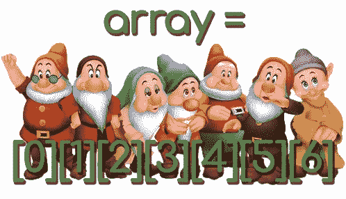

# PHP 中的复合变量(数组、对象等等)

> 原文：<https://medium.com/hackernoon/composite-variable-in-php-arrays-object-and-more-da203f779110>


所以，

在本系列的前几集[中，你学习了什么是**标量变量**。](http://anastasionico.uk/blog/php-variables)

字符串、整数、布尔等。它们是任何编程语言的基础。

现在是时候引入复合类型的变量了。

这种类型的变量有点复杂，但是在理解了这个概念之后，你就可以在你的脚本中充分利用它们的能力了。

正如你将看到的，

这种类型的变量只不过是组合成一个组的一组标量变量。

有两种类型的变量属于这个组，它们是:**数组**和**对象**，

还有，

为了完成变量部分，您现在将看到另外两种类型的变量，它们是**资源**和**空值**。

如你所见，复合变量只不过是一组标量变量，

当我们想要对许多相同类型的元素进行分组和处理时，

想想你同学的名字列表，假设你有(或仍然有)20 个。

它的执行效率不会很高，更不用说管理 20 个不同的字符串变量的难度了，更简单的是创建一个变量，在本例中是一个数组，并在其中插入所有 20 个名称。



现在想想你身份证上的所有信息，

名字，姓氏，地址，年龄，身高。

所有信息类型各不相同，从字符串到整数再到影响**一个唯一的** **对象**(在本例中是一个个体或人)。

在这一集里，你将学会如何利用这些复合变量，创造出压力更小、乐趣更多的更好的程序。

# 面向专业开发人员的 PHP 基础知识

这篇博客文章是名为“ *PHP 开发专家基础知识*”系列文章的一部分。

在这个系列中，你将学习 PHP 的基础知识，但是你也会看到许多只有在书本和高级教程中才能找到的小技巧和特性。

根据你的水平，你可能只是想偶尔阅读或者干脆跳过它们。

你不必记住这里写的所有东西！

只需阅读，找出某些功能或技术的存在，并返回到这些网页时，你觉得已经准备好进入下一个层次。

[web 开发专家 PHP 基础知识(1 '部分)](http://anastasionico.uk/blog/php-basics-for-web-developer)
[PHP 7 的构造与注释](http://anastasionico.uk/blog/php-construct-comments)
[如何使用变量(PHP 7)](http://anastasionico.uk/blog/php-variables)
[PHP 中的复合变量(数组、对象等)](http://anastasionico.uk/blog/composite-variable-in-php)

这篇博文也分为 4 个主要部分

[数组变量](http://anastasionico.uk/blog/composite-variable-in-php#array)
[对象变量](http://anastasionico.uk/blog/composite-variable-in-php#object)
[资源变量](http://anastasionico.uk/blog/composite-variable-in-php#resources)
[空变量](http://anastasionico.uk/blog/composite-variable-in-php#null)

开始吧！

# 数组变量

数组是将值与键相关联的有序映射，

有三种不同类型的数组，它们是**索引的、关联的**和**多用途的**。

PHP 提供了大约 80 个功能，它们有着最不同的用途，所以在你自己创建数组操作之前，你应该寻找一些现成的东西。

在 PHP 7 中，可以用两种不同的方式声明数组，

使用短语法和长语法

```
$automobile = ['Mercedes', 'Ford', 'Alfa']; 
$automobile = array('Mercedes', 'Ford', 'Alfa');
```

即使使用不同的语法，上面创建的两个数组也是完全一样的。

只指定了值而没有指定与值相关联的键，PHP 自动从 0 开始用递增的数字索引每个值，

这意味着如果我们想从前面的数组中获得值“Ford ”,我们必须指示索引 1。

要检索数组中的值，我们必须用方括号表示索引或键。

```
echo $automobile[1]; 
// Ford
```

让我们看另一个例子:

```
$motorbike = [   
    'Manufacturer' => 'Ducati', 
    'Model' => '999', 
    'Class' => 'Sport' 
];
```

在这种情况下，我们指向数组内部的键，

这被称为一个**关联数组**，为了检索这个数组的值，我们需要使用指定的键。

```
echo $motorbike['Model']; 
// 999
```

没有必要一次指定所有的数组值，即使在数组已经使用“=”赋值命令创建之后，也可以添加值。

```
$motorbike['Transmission'] = '6-speed';
```

考虑在同一个数组中创建数字和键也是可能的。

```
$array = [0 => 'id', 'name' => 'John', 'surname' => 'Doe']; 
$array[] = 2018; 
print_r ($array); 
Array ( 
    [0] => 'id', 
    ['name'] => 'John', 
    ['surname'] => 'Doe', 
    [1] => 2018 
);
```

请注意，

PHP 自动给新值赋予索引 1。

到目前为止，您已经看到我们在数组中添加了标量类型变量作为值，

但是，

PHP 还提供了在数组中添加数组的可能性，

它的结果叫做矩阵。

```
$menu = [ 
    'cappuccino' => [ 'espresso', 'steamed milk', 'milk foam' ],    
    'macchiato' => [ 'espresso', 'steamed milk' ], 
    'americano' => [ 'espresso', 'hot water', 'more hot water' ] 
];
```

要获得卡布奇诺的第三种成分，可以使用以下命令:

```
$Menu[cappuccino][2]; 
// milk foam
```

第一个索引指的是 *$menu* 数组的第一级，第二个索引指的是带有指示键的数组内的索引，

在这种情况下，“*卡布奇诺*”，

请记住，数组在 0 的基础上工作，这意味着要检索第三个值，您必须指定索引 2。

[*你可以在托弗·德罗西亚*](https://www.ostraining.com/blog/coding/arrays/) *写的这个教程中找到一些其他的例子。*

我计划写一系列博客文章，详细描述 PHP 7.1 中所有可用的数组函数，

为了得到它们何时出版的通知 [*订阅我的时事通讯*](http://anastasionico.uk/learn-php) 并获得 PHP 开发人员最佳书籍的免费评论。

# 对象变量

在面向对象的[编程](https://hackernoon.com/tagged/programming)中，**对象是一个类**的实例。

它是一个独特的元素，与它可以与之通信的其他对象相分离。

**为了定义一个对象，有必要确定其特征，也称为属性，以及对象可以执行的动作，通常称为方法。**

实例是给定类的给定对象，每个实例都与其他实例分离，但与同一类的其他对象共享其一般特征。

继续使用前面用于数组的例子，我们可以说福特制造的汽车和梅赛德斯制造的汽车是两个不同的对象

但是，

与此同时，

两者都可以由 automobile 类实例化，

汽车类的两个元素都有方向盘和引擎，

但是这些属性互不相同。

如前所述，

所有汽车类的对象都有一个引擎，但是每个对象都有不同的引擎大小和功率。

这些概念以及封装和多态等其他概念必须在深入的面向对象编程教程中得到最好的描述。

从技术上讲，在面向对象的编程中，程序的实例是对象对应的类在 ram 内存中的表示

我不再赘述对象和面向对象编程，因为我已经在我的网站上发表了一系列名为“[*【OOP 完全指南*](http://anastasionico.uk/blog/the-complete-guide-to-object-oriented-programming) ”的博客文章，详情请见下面的链接。

# 资源变量

资源是一种特殊类型的变量。

**这些变量包含对外部资源的引用**

这些资源由 PHP 语言提供的特殊函数创建和使用。

目前在 PHP 7.3 中有大约 103 个特殊函数，从创建 PDF 到创建和解析 XML，这些函数管理套接字、流、打印机、开放 SSL、MySQL 和许多其他函数。

这里列出了 PHP 中所有可用的资源类型

**要检查一个变量是否为资源类型，使用函数 *is_resource()* 返回一个 bool 类型的变量(因此为真或假)。**

使用资源时另一个非常重要的函数是 *get_resource_type()* ，它返回一个指示资源类型的字符串。

资源包含打开和管理文件、数据库连接等的引用。

当一个资源不再有引用时，PHP 引擎能够终止并删除它，这意味着不需要手动释放内存。

显然，来自持久数据库连接的链接是这个规则的一个例外，因此必须进行相应的管理

# 空


Null 是一种特殊变量。

**空变量的唯一可能值是 null。**

创建空变量有三种方法:

第一个并将常量 NULL 赋给变量，

第二个是对变量使用 unset()函数

第三种情况发生在变量尚未设置的时候。

这种类型的变量只有一个不区分大小写的空值。

还有，

从 PHP 7.2 开始，不能对空变量进行强制转换。

有两个主要的函数处理空变量。

第一个是函数 *is_null()* ，如果参数指示的变量为空，则返回一个布尔值，

第二个函数是 *unset()* ，它接受任何其他类型的变量并使其为空。

空变量表示没有值，而不是表示值本身。

将这种类型的变量视为内存中的空槽或丢失的信息。

这就是为什么空变量被认为是未设置的。

它们没有价值，

事实上，变量的存在只是为了让你可以给它赋值，在你的代码中，这是非常重要的，因为变量可能是数组的元素，也可能是对象的属性。

如果你想了解更多细节，这里没有官方手册上的描述。

# 结论

我们到了，

这是一个简短的插曲，

但是你刚刚学到的东西将会在你之前的几年甚至几十年的编程中为你服务。

我知道，

您现在想知道如何在代码中实现这些新知识，

你可以用它们做什么，为什么首先要用它们。

如果这是你第一次看到复合变量，你也想知道为什么要把你的生活复杂化，为什么不用标量来代替。

这是一个提示。

**练习创建它们，理解数组和对象的区别。**

当你需要创建一个时，你需要创建另一个。

下一步是学习如何在代码中使用这些变量(标量和复合变量)。

**在控制结构或循环内部使用它们。**

这方面的教程将很快发布，敬请期待！。

一旦完成，

PHP 7 提供了大约一百个函数来编辑、创建、修改你想要的所有变量。

我们还没有到那一步。

坚持练习，

*不要紧张，享受学习过程*

[](http://eepurl.com/dIZqjf)

*现在你知道了基础，是时候开始练习了，*

[*利用 Blue Host 的强大功能和速度，创建一个帐户，在那里你可以锻炼，并以每月不到一杯星巴克咖啡的价格在实时服务器上看到你的进步。*](https://www.bluehost.com/track/anastasionico/)

*最初发表于*[*anastasionico . uk*](http://anastasionico.uk/blog/composite-variable-in-php)*。*