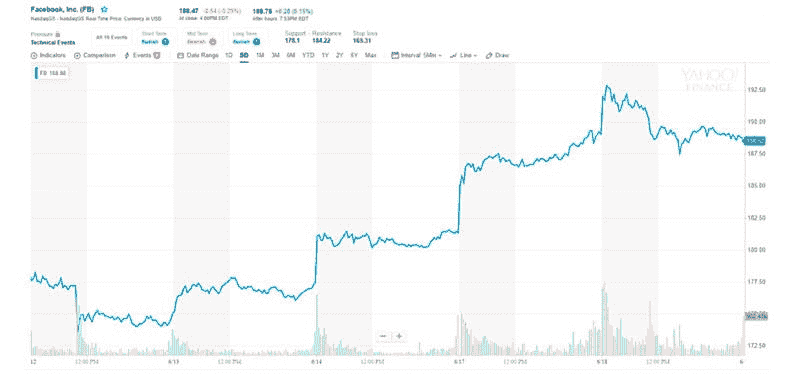
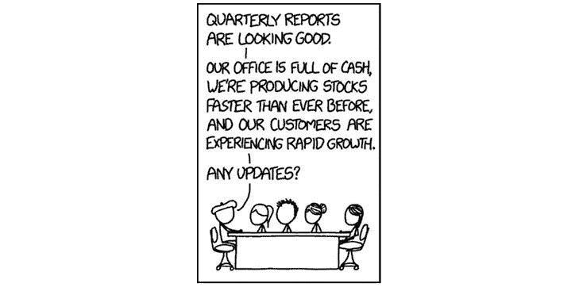

# 仅使用区块链产品概念化市场生态系统

> 原文：<https://medium.com/hackernoon/conceptualizing-a-marketplace-ecosystem-using-only-blockchain-products-b5f2944c7e18>

现代企业要想成功，就必须比以往任何时候都更具竞争力。互联网永远改变了商业运作的方式，那些拒绝适应这些变化的公司将会被甩在后面。回顾过去，看看哪些技术对企业的成功至关重要，这总是显而易见的，但展望未来可能会更加棘手。

区块链会成为商业管理工具的重要组成部分吗？

可以肯定的是，区块链将会一直存在，只有当大公司将区块链加入他们的技术名册时，它的持久性才会增加。例如，脸书最近宣布与超过 25 家其他大公司(Lyft、Visa、Paypal 等)联合推出自己的加密货币 [Libra](https://techcrunch.com/2019/06/18/facebook-libra/) 。

Libra 将在区块链上提供一系列功能，类似于中国公司[的微信](https://wechat.com/)，其下载量已经超过 10 亿次。底线是区块链对每个企业来说都是必不可少的，所以现在让我们看看如何将它实施到您的企业中。

[https://www.ccn.com/crypto/global-policymakers-are-up-in-arms-about-facebooks-libra-coin/2019/06/18/](https://www.ccn.com/crypto/global-policymakers-are-up-in-arms-about-facebooks-libra-coin/2019/06/18/)

# 2019 年及以后的企业必备工具

你没有时间去筛选每一个工具、列表和推荐，看看哪一个最适合你。你很忙，我们明白。考虑到这一点，我们谦虚地提出了六个最重要的工具，以帮助您的业务增长的快速列表，我们将比较传统的选择和区块链的对应。

我们选择使用 Sessia 作为区块链的对应示例，因为它结合了基本的工具和免费的易用性。

# 在线支付

你不接受付款就不能做生意。当然，如果你能接受每笔购物都用现金来降低费用，那就太好了，但是随着网上销售的[增长](https://www.digitalcommerce360.com/article/e-commerce-sales-retail-sales-ten-year-review/)，忽视这个载体是愚蠢的。研究表明，年轻一代更欢迎加密货币，这可能是未来在线销售的关键。

**session pay**就像区块链上的 Paypal。SessiaPay 将其自身与钱包互联，并接受加密货币作为其市场内客户订单的支付方式。

企业可以免费使用，并可以接受国际支付、ETH 和 KICKs(他们的本地加密货币)。

# 电子商务网站

除非你习惯于设计网站，否则创建自己的电子商务网站远非易事。除了编写自己的平台代码之外，Shopify 等解决方案可以让你轻而易举地推出自己的在线商店。

然而，一些用户可能会纠结于如何*将所有东西*连接在一起:网站、销售渠道、移动接入，以及如何奖励他们的客户。

在区块链方面， **Sessia 在线商店建设者**可以减轻很多头痛。像 Shopify 一样，即使没有经验的用户也可以通过浏览器或手机创建免费的电子商店。通过移动平台建设更进一步，并与**会议市场**相结合，让您能够为您的客户选择三种级别的返现佣金奖励。

# 现金返还/奖励系统

传统的返现奖励系统已被证明是与市场的客户击中，但现实是，你的信息被出售，而你没有得到适当的奖励。

区块链有能力帮助纠正这种不适，并引领我们走向更大的数据隐私和安全。

为了获得更简单、统一和不变的体验，每个人都得到公平的奖励，区块链产品如 [Pei](https://getpei.com/) 和 [Loyyal](https://loyyal.com/) 通过建立在现有奖励系统的基础上提供解决方案。忠诚度计划为其用户提供了一种通过推荐(比如你的朋友在商店贴出一张收据，你点击它，然后购买)获得奖励的方式。

奖励是双向的:推荐人获得返现奖励，而推荐人获得回扣。

[https://www.comparehero.my/credit-card/articles/cashback-credit-card-guide](https://www.comparehero.my/credit-card/articles/cashback-credit-card-guide)

# CRM 系统

当你开始积累可观的客户群后，知道如何恰当地管理他们是很重要的。一些最好的 CRM 系统提取大量看似不相关的数据，并将其组合起来，为企业创造增加销售的机会。HubSpot CRM、Salesforce CRM 和 Freshsales 都是在传统市场上这样做的公司。Sessia 有一个类似的功能，将 CRM 数据整合到他们的业务应用程序中。企业可以找到从销售额到周转率、订单数量、客户购买历史、活跃期和非活跃期等各方面的详细统计数据。

HubSpot CRM 及其竞争对手非常出色，但它们也有不足之处，因为它们的成本可能很高，而且没有直接奖励客户。此外，他们倾向于依赖客户对许多不同平台的使用(社交媒体、电子邮件、网站浏览等。).

企业需要的一切都可以在“报告”部分找到，所有这些数据都可以用来创建特定客户体验的完整画面，从而帮助该客户创造更好的体验，进一步鼓励他们进行购买。

# 物流管理

任何运输任何东西的企业，无论是大到一件家具，还是小到耳环，都必须处理物流管理。像 Etsy、Ebay 和 Amazon 这样的公司已经有了一个复杂的流程来处理他们每天成千上万的订单。亚马逊甚至走得更远，外包其运输服务，即所谓的履行。

虽然许多小企业手工管理他们的物流，打印他们自己的运输标签，并手动跟踪每个标签以确保它到达最终目的地，但他们现在有了这些第三方替代品。

无论如何，它伴随着费用和企业主每天多次检查另一个收件箱的责任。这是区块链可以消除拥挤和成本的地方。

正如 SessiaLogistics 中所见，作为一个企业，您可以集成来自外部来源的 API 物流数据。因此，当客户联系您时，您将能够轻松查看他们的订单历史、物流详情，甚至查看他们的 CRM 报告，以了解您过去是否与他们有过问题。

# 简单是成功的关键

说到你的生意，你担心的越少，你就会越成功。当你不再浪费时间去查看 15 个不同的收件箱和应用程序，回复 5 个不同平台上的消息，怀疑你的销售增长是否达到目标时，你最终可以专注于改进你的产品。

[https://xkcd.com/1997/](https://xkcd.com/1997/)

一体化集成解决方案不仅可以节省您的时间，而且现在可以将您的业务展示给新的受众，这些受众的增长速度与加密货币市场一样快。使用基于区块链的工具有助于您扩展这一革命性技术的知识。

毕竟，你对未来投资越多，你就越能最终改善你的业务。