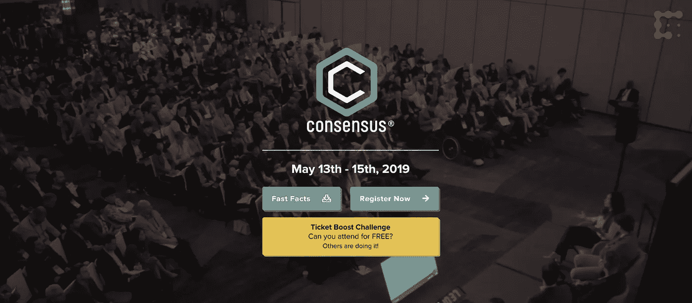

# 共识区块链大会，2019:你想知道的一切

> 原文：<https://medium.com/hackernoon/consensus-blockchain-conference-2019-everything-you-need-to-know-45a2fd016f07>

如果你想参加今年加密领域最大的区块链会议之一，可以考虑参加 2019 年 5 月的[共识区块链会议](https://www.coindesk.com/events/consensus-2019)。Consensus 成立于 2015 年，已经迅速成为区块链最重要的会议之一，吸引了区块链世界几乎所有的大公司、创始人、投资者和开发商(在某种程度上)。它旨在成为区块链行业的“大帐篷”，打破企业和个人之间的壁垒，旨在实现点对点的交流。

让我们看看重要的细节，以及在 2019 年参加 Consensus 时可以期待什么。

# 共识大会 2019 详情

## 时间和地点

Consensus 2019 将于 2019 年 5 月 13 日(星期一)至 5 月 15 日(星期三)在[纽约时代广场喜来登酒店](https://www.marriott.com/hotels/travel/nycst-sheraton-new-york-times-square-hotel/)和[纽约希尔顿中城](https://www3.hilton.com/en/hotels/new-york/new-york-hilton-midtown-NYCNHHH/index.html)举行。

## 谁和什么

你可以在 CoinDesk 网站的上找到[的基本议程，上面列出了会议的各种主题、暂定时间表以及各自的发言人。在今年的 Consensus 2019 大会上，您可能会看到一些著名的演讲者:](https://www.coindesk.com/events/consensus-2019/agenda)

*   [**Tim Byun**](https://www.linkedin.com/in/tim-byun-1004aa28)**:**ok coin 的 CEO，
*   [**杰克·切尔文斯基**](https://twitter.com/jchervinsky) **:** 证券诉讼律师，
*   [**科萨拉**](https://www.linkedin.com/in/kosala-hemachandra-503929153)**:**MyEtherWallet(MEW)创始人兼 CEO、
*   [**Vinny Lingham**](https://twitter.com/VinnyLingham?ref_src=twsrc%5Egoogle%7Ctwcamp%5Eserp%7Ctwgr%5Eauthor)**:**思域 CEO 兼联合创始人，
*   [**凯特琳龙**](https://caitlin-long.com/) **:** 怀俄明区块链联盟联合创始人，
*   [**丹·莫尔黑德**](https://www.panteracapital.com/team/) **:** 潘迪拉资本 CEO、
*   [**黎明宋**](https://www.linkedin.com/in/dawn-song-51586033) **:** 绿洲实验室 CEO。

这只是你今年参加 2019 年共识大会时可以期待的一些发言者中的沧海一粟。

[2019 共识会议将突出三个主要类别](https://www.coindesk.com/events/consensus-2019/agenda)和讨论领域:商业、市场和技术。进一步细分，“商业”主题将看到区块链资本形成、用户游戏、加密制裁、公共部门的区块链以及采用挑战等问题，而“市场”将解决如何监管加密、加密泡沫的狂热、华尔街和加密之间的交集以及区块链的监管问题。最后，“技术”将解决正在发生的各种平台战争(例如可扩展性、去中心化、安全性)、区块链在 10-50 年后的样子、为什么隐私很重要以及加密挖掘。

时间表中涉及的一些有趣的主题包括:

*   密码遇上电子竞技，
*   Crypto 遇到了 OFAC，
*   防范 51%的攻击，
*   区块链的 GDPR 含义，
*   矿工是如何风化的，
*   基于区块链的彩票和赌场的未来，
*   稳定币的用途:超越套利，以及
*   华尔街遭遇加密。

请记住，以上只是未完成列表中的一小部分，仍然会有变化。你可以点击查看 2018 年各种演讲者和主题的[回顾。](https://www.coindesk.com/events/consensus-2019/agenda)

## 如何注册共识 2019

要注册 2019 年共识区块链大会，请前往 [CoinDesk 的“注册”页面](https://www.coindesk.com/events/consensus-2019/register)，其中列出了各个类别的价格。门票从 299 美元的“建设”票(仅授权进入喜来登酒店)到 1299 美元的“早期采用者”票不等。请注意，与会者可以推荐他们网络中的人，这样做最终可以节省票价。

大多数主流信用卡和借记卡以及比特币(BTC)都接受支付。2019 年 4 月 26 日之后不接受支票和银行转账付款。

# 区块链共识 2019 提示

在参加了 2018 年几个最大的区块链会议和活动(包括 Consensus Singapore)后，我们在 [BlockchainSEO](http://blockchainseo.net/) 为新人提供了一些建议和提示。

首先，一开始可能会是一次极其令人难以承受的经历，所以我们建议用某种游戏计划来达成共识。你想从中获得什么？有没有什么具体的项目是你很想聊一聊，向他们讨教的？你是专门去那里寻求资助的吗？人们很容易被活动本身的喧嚣所吸引，在某些点上有点难以驾驭，所以请确保记下一些你希望实现的目标和要点。

第二，如果有机会，一定要参加聚会后的派对。通常，区块链的项目和个人在白天会有自己的任务，很难追踪或深入谈论某些话题，所以参加一个会后派对是更好的方式之一，可以近距离接触你在白天可能无法接触的个人。

第三，确保准备好你公司和产品的所有必需品。名片、简短的推介等)，因为里面经常很忙乱，和某人就你的项目进行两个小时的谈话可能是不可能的。认真对待问题的实质，而且要快。

最后，在共识区块链大会上冷不防接近某人并不奇怪。毕竟，你们都是为了同一个原因。在 2018 年的共识新加坡，我们发现大多数人都很兴奋地谈论几乎任何事情，好的远远超过坏的(就自我而言)。共识是跳出你的外壳，结识志同道合的人的好方法。

-地下墓室

*原载于 2019 年 3 月 7 日*[*【blockchainseo.net*](http://blockchainseo.net/consensus-blockchain-conference-2019/)*。*