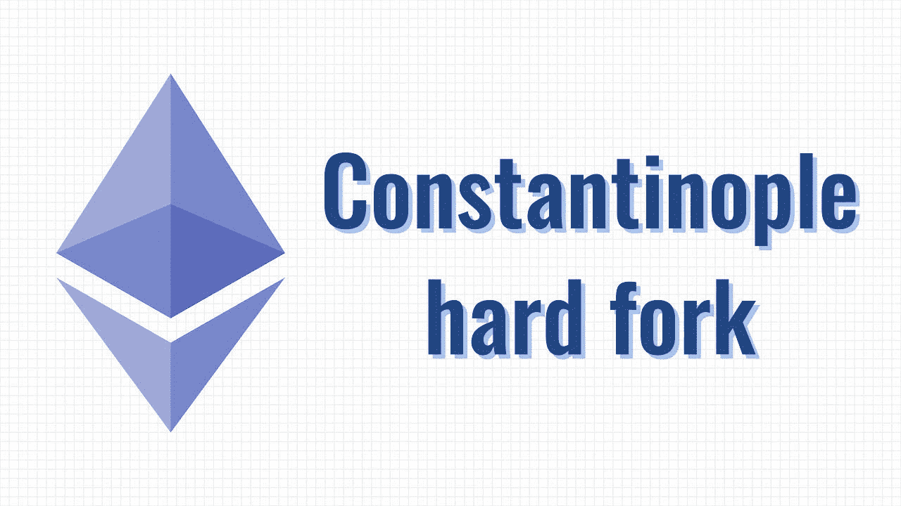

# 君士坦丁堡不会来了

> 原文：<https://medium.com/hackernoon/constantinople-is-coming-ea1b65420c19>

## 你所需要知道的关于即将到来的以太坊的一切

## 更新

君士坦丁堡分叉将被推迟& EIP 1283 将不会是君士坦丁堡的一部分，当它发生的时候。新的分叉日期将选择在星期五！

[ChainSecurity](https://medium.com/u/8b14ef67c636?source=post_page-----ea1b65420c19--------------------------------) 发现以太坊改进提案(EIP) 1283 如果实施，可能会给攻击者提供[代码](https://hackernoon.com/tagged/code)的漏洞，窃取用户资金。以太坊开发者在一次电话会议上同意至少暂时推迟硬分叉。

 [## 君士坦丁堡启用新的再入攻击

### 即将到来的对以太坊网络的君士坦丁堡升级为某些商店运营引入了更便宜的燃气成本…

medium.com](/chainsecurity/constantinople-enables-new-reentrancy-attack-ace4088297d9) 

以太坊第五次升级到了。

期待已久的以太坊君士坦丁堡硬地叉定于 1 月 16 日在 7080000 街区举行。查看一下我们在[土拨鼠](https://medium.com/u/30a0e71df490?source=post_page-----ea1b65420c19--------------------------------)网的朋友提供的这个[酷定时器](https://fork.groundhog.network)。

**本次计划升级将把 5 个 EIP 整合到以太坊区块链中。**

## EIP 145

这一改进意味着智能合同的执行成本将降低 10 倍。

## EIP 1052

这个 EIP 允许智能合约通过提取另一个智能合约的散列来相互验证。

## EIP 1234

这个 EIP 会把格挡奖励从 3 点减少到 2 点，并且延迟难度炸弹。

## EIP 1014

由 [Vitalik Buterin](https://medium.com/u/587a00dbce51?source=post_page-----ea1b65420c19--------------------------------) 开发的升级改进了以太坊众多扩展解决方案之一的状态通道的适用性。

## EIP 1283

该方案降低了商场运营的燃气成本。这种减少使得在一个事务中进行多次更新的成本更低。

# 难度炸弹

这可能是以太坊社区中谈论最多的讨论了。**难度炸弹一旦被激活，将无法开采新的能导致以太坊区块链被冻结的方块。**

EIP 1234 把这个难度炸弹又推迟了十二个月，之后会再次投票。

此外，被问得最多的问题是，“**我需要对我的 ETH 做什么吗？**

**号**根据 [MyCrypto](https://medium.com/u/19919043dcef?source=post_page-----ea1b65420c19--------------------------------) 的这篇博文，

> “你的 ETH 将同时存在于新的 ETH [区块链](https://hackernoon.com/tagged/blockchain)和旧的 ETH 区块链。所有的交换(比特币基地，北海巨妖，ShapeShift)，服务( [MyCrypto](https://www.mycrypto.com) ，MetaMask，Trust Wallet)，以及节点提供者( [Infura](https://infura.io/) ， [Etherscan](https://etherscan.io) ， [Quiknode](https://quiknode.io/) )都会更新它们的节点，这样你就可以简单地使用更新后的节点/软件，甚至不会注意到。”

# 总之，随着我们转向 PoS，以太坊君士坦丁堡是以太坊区块链发展的又一步，速度和效率都有所提高。😃

感谢阅读。你可以在 Twitter 上关注我，我在那里谈论加密、创业和技术。