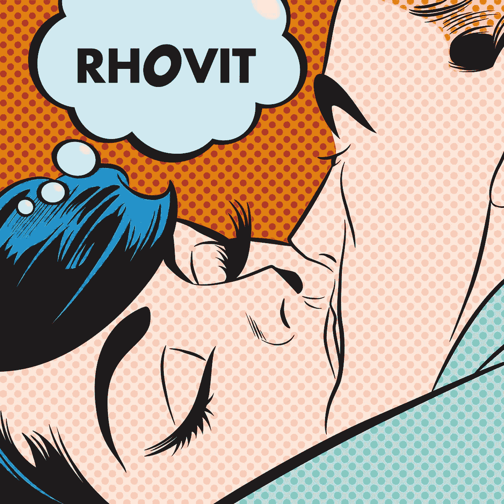

# 内容交付符合加密货币奖励

> 原文：<https://medium.com/hackernoon/content-delivery-meets-cryptocurrency-rewards-156ed6c1bcfc>

## Rhovit 平台为内容交付提供了一个优雅的解决方案，为用户和内容创作者提供了一个基于加密货币的奖励机制。

我们居住的世界在变化，而且变化很快。一度受限于实体拷贝、有线网络和电影胶片的媒体，已经被互联网解放了。随着消费者切断电缆以支持内容流媒体服务，新系统已经兴起，正在迅速废弃曾经盛行的旧结构。

同样，数字新闻已经取代了报纸和杂志时代，将曾经的主流印刷业务降到了日益缩小的利基市场。

## 数字媒体的光明新世界

服务和网络的范围不断扩大。在当今媒体丰富的环境中，我们可以选择娱乐平台。除了旧的网络和有线电视频道，各种各样的选择已经在互联网上开花结果。

授权主流媒体的公司清楚地认识到，必须建立一个交付系统来进入这个新的市场，因此网飞，以前的 DVD 交付服务，开始在线传输越来越多的内容，与此同时，曾经免费的广告丰富的 Hulu 网站转变为订阅服务。

在内容创作激增的过程中，范式发生了转变。随着 YouTube 上的流媒体工具开始聚集数百万粉丝，一种新型的名人出现了。以前从来没有发言权的人突然被允许开始他们自己的博客，通过变得受欢迎和建立大量的追随者，他们被主流认可，他们从博客作者转变为有影响力的人。

为了迎合这些人，Tumblr 等平台以及后来的 Medium 成为了一个相对的肥皂箱，任何人都可以与更广泛的受众分享他们的激情、专业知识或关注点。随着时间的推移，其他服务出现了，内容贡献者可以从人群的慈善中获得回报，或者生成 Steemit 和 Trybe 等帖子。

虽然流媒体服务和数字出版物蓬勃发展，我们已经看到一些相对的巨头出现，但即使像 YouTube 这样的大型平台也不会没有刺。

这些天来，由于模糊的版权声明系统，内容创作者似乎无法获得突破，这往往导致他们的内容非货币化。

与此同时，花费时间和精力写有价值文章的作者可能永远不会看到他们在博客平台上的整体努力超过几美元。数百万人可能会阅读一篇文章，但这并不保证作者会从他们的贡献中看到任何实质性的回报。

另一方面，任何在一系列平台上消费内容并负责产生广告收入的用户，他们的参与看不到任何回报。他们经常被挖掘出大量出售给公司的私人数据。

这个值不会返回给用户，而是有助于传播这个系统，这个系统跟踪用户的数据点，以跟踪商业趋势。

通过实施一个奖励参与平台的内容创作者和消费者的系统，Rhovit 脱颖而出。

## **构建动态网络背后的挑战**

目前，Rhovit 正在建立一个娱乐、新闻、广告和广播网络，用精英制度奖励内容消费者和创作者。使用 Rhovit 独特的激励驱动平台，内容创作者可以利用新的收入载体，根据帖子的受欢迎程度被动赚取收入。

与 Trybe、Steemit 和 Medium 不同，Rhovit 为读者和作者提供了一种同时获得回报的方式。然而，与其他更成熟的内容交付平台相比，Rhovit 缺乏一个强大的文章和视频库，在该平台上共享内容不像在竞争网站上那样简单。该团队仍在努力开发解决这些障碍的方案。

Rhovit 面临的另一个问题是向用户提供免费积分，这样他们就可以解锁内容。每一分价值半美分，当用户消费时，他们的价值 100%直接流向内容创作者。当这些积分用完时，用户将不得不等待下一周的积分支付，或者立即支付。这可能会在最初的免费积分用完之后剔除平台上的一些参与者，可能会限制内容创作者的收入范围。

用户自己决定 Rhovit 上内容创作者的报酬率。由于每次浏览都有积分形式的“报酬”,这意味着浏览次数与作者的实际收入直接相关，但与其他网站相比，这也可能导致整体浏览次数减少。

尽管存在这些挑战，那些受够了 YouTube 等平台的追随者可能会将 Rhovit 的精英奖励系统视为一个可行的替代方案，以取代他们的视频被非理性地取消或删除。如今，一个更小的内容库意味着内容创作者在这个蓬勃发展的生态系统中拥有先发优势。此外，当用户用完免费积分时，给予用户购买更多积分的选择将满足市场中的任何潜在需求。

## **通过奖励保持用户参与**

浏览该平台的用户受到激励，不断点击，这样他们就可以在 Rhovit 加密货币计划中获利。根据每个用户的参与情况，每周向每个用户分配积分；您花费的积分越多，分配给您的积分就越多。

这意味着你必须花掉它们来获得它们，而且有大量的文章、各种各样的主题和视频可供选择，你会毫不费力地做到这一点。

花费点数解锁文章和视频不仅仅是奖励内容创作者。用户每花费 2 点就可以获得 1 个战利品，一旦积累到 20 个战利品，你就会获得一个 RBIT 代币，这是一种在 NEM 区块链的加密货币，可以在主要交易所交易。申领您的 RBIT 代币，将它们发送到您的 NEM 钱包中，或者将它们保留在平台上，并将其用于独家内容，如漫画、视频、数字商品等！

每个注册的新用户都会获得 50 分的特别奖励，这样他们就可以开始行动，从越来越多的可用文章和视频中策划自己的定制内容流。根据您自己的独特偏好，花费点数制作您自己的内容集合。

通过建立一个精英奖励系统，Rhovit 让那些满足内容消费者需求的人有机会茁壮成长。在这个蓬勃发展的生态系统的早期，内容创作者拥有竞争优势。要了解更多关于成为内容创作者的信息，请立即登录[rhovit.com](http://rhovit.com/)。

## ***披露:***

作者是 Rhovit 团队的顾问，在这个项目中有既得利益。