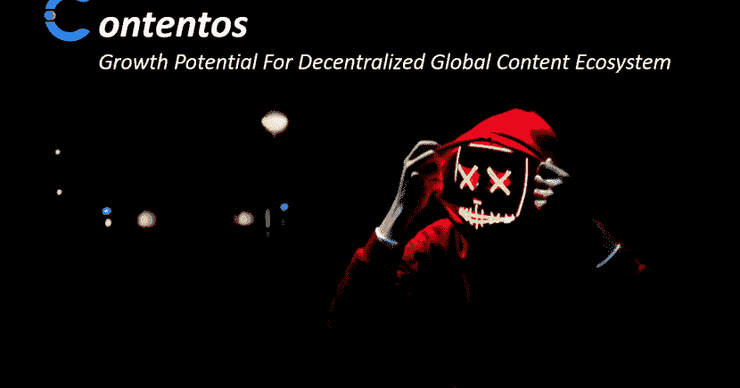

# 分散内容生态系统的增长潜力

> 原文：<https://medium.com/hackernoon/contentos-growth-potential-for-decentralized-global-content-ecosystem-4de5c6de5e4d>

近年来，很多内容营销已经转向视频流。感谢 YouTube 向大众开放了视频表达，为内容创作者提供了新的收入来源。今天，YouTube 上的顶级视频内容明星(根据福布斯的数据)年收入高达 1000 万美元。

It 据估计，到 2019 年，大部分内容营销将是视频(约占 80%)，其中很大一部分视频内容将由移动用户消费。根据研究，2017 年，55%的视频流量由移动互联网用户消费，到 2020 年将达到 79%。

如果《T2》杂志发布的统计数据可信的话，商业必须随着新时代快速发展。

*   **90%的消费者表示产品视频直接影响购买决策。**
*   与其他访问方式相比，通过手机观看的视频中有 92%是共享的。
*   95%的消费者通过视频保留交流信息，而只有 10%的消费者通过阅读保留信息。

# 行业当前面临的挑战:

今天，互联网的普及和数十亿全球用户产生的流量导致了脸书和 YouTube 等互联网巨头的崛起。这些公司控制着数字内容的访问和广泛的可见性或分发。这就引出了一个问题，到底允许多少言论自由。

尽管通过这些集中内容平台产生了巨大的广告收入，但它长期以来一直受到收入分配不均和缺乏版权保护的困扰。

# 区块链如何帮助解决这些挑战:

区块链技术创造了一个系统，内容创作者能够直接向买家出售内容，而无需中央公司的干预。

**构建代币化经济:**通过利用区块链， [Contentos](https://www.contentos.io/) 构建了一个生态系统，所有参与者(创作者、观众)都被授予 COS 代币。所发行的代币可以通过以下方式在平台中用作支付方法。
(1)广告公司购买这些代币作为对生态系统的支出。
(2)观看者可以使用 COS 代币支付订阅费或为其作品给创作者小费(奖励)。

**自动支付智能合同:**当观众观看任何视频时，如果推广者的广告出现，内容创建者将通过智能合同自动获得报酬。因此，内容创作者不必担心支付不准确或延迟支付。

此外，由于所有交易都作为公共记录记录在区块链上，这使得支付完全透明，任何人都可以验证支付的准确性。智能合同也可以促进额外的补偿规则。例如，当创作者的内容超过 10，000 次浏览时，广告商向创作者支付额外奖励

**参与计划:**创建者可以与他们的追随者建立参与计划，例如，如果观众在他们的社交媒体上分享内容链接，他们将获得 COS 令牌。这有助于更广泛地传播内容，并帮助创作者增加他们的追随者。

**内容所有权:**通过使用区块链，所有内容信息(如所有者)将被安全地保存在区块链中，这将允许相关方检查是否有任何无可争议的谁是内容合法所有者的记录。

**内容销售:**在 Contentos 中使用智能合约也可以实现创作者之间的内容销售。例如，视频创作者可以发布配乐请求，并允许音乐创作者投标参与。利润分享也可以通过智能合同来实现。

# 这为多个机会打开了窗口:

## **(1)飘带:**

通过业余爱好或职业来直播他们视频游戏的人被称为流民。2010 年代中期，这种做法在 Twitch 和后来的 YouTube 等网站上流行起来。

**直播市场规模:**游戏直播行业价值 101 亿美元，预计 2019 年将再增加 30 亿美元。(来源:Streamlabs)。 *Twitch 仍然是游戏玩家中最受欢迎的流媒体平台。*

抱怨 Twitch 等中央平台收取大量佣金的流媒体用户可以在 Contentos 平台上直播他们的游戏，并从赞助商或广告、订阅和捐赠中获得 COS 令牌(收入)。

如今，Twitch 的标准订阅费为每月 4.99 美元，由平台和流媒体工具对半分摊。这是开放的变化取决于观众和订户数量。 ***通过加入 Contentos，流媒体商保留观众(或关注者)支付的 100%订阅费。***

## (2) dApp 开发者:“集成了 Contentos 的 dApp 游戏”

dApp 游戏开发者可以集成直接连接到 Contentos 平台的内置流媒体选项。因此，***dApp 游戏的任何用户都可以在 Contentos 中流式播放他们的游戏，并开始从广告或小费(捐款)中赚取*** 。

此外，今天许多 dApp 游戏开发商努力向正确的观众推广他们的游戏，这些观众是可以作为“早期采用者”吸引和保持的目标人物(dApp 用户)。有了 Contentos，dApp 开发者现在可以很容易地在平台中找到有影响力的人，他们可以 ***向 dApp 用户推广他们的游戏，并迅速获得早期用户。***

## ③音乐艺术家:

如今，音乐家无需与唱片公司签约，也能靠音乐谋生。然而，制作你的音乐需要一个团队的努力，包括经理、公关、代理等等。使用 Contentos，音乐家可以请求视频编辑服务，专业视频开发者可以参与竞标。通过这样的机制， ***音乐人可以快速得到自己想要的团队成员。***

此外，音乐家可以提供 ***社区项目，这将有助于新艺人成名*** 。例如用 COS token 奖励粉丝的参与活动(例如，分享、喜欢),或者向最高参与度的粉丝提供独家优惠，例如，仅独家粉丝可获得的前 24 小时音乐访问。

# 关于 Contentos:

Contentos 是一家区块链初创公司，旨在开发一个去中心化的数字内容生态系统，让所有成员，包括创作者、消费者和广告商，都能为他们的贡献获得公平的报酬。

目前，该平台生态系统已经托管了 346 万+视频和 1.59 亿+直播流。*它在包括中国游戏社区在内的全球玩家中非常受欢迎。*最近 Twitch 在中国被禁(2018 年 9 月),这在很短的时间内极大地影响了游戏社区，直到 Contentos 出现。

**要了解更多关于 Contentos 的信息，请访问** [**网站。**](https://www.contentos.io/)

> *免责声明:我确实持有一些 COS 令牌。*

文章也发表在[这里](https://cryptopurview.com/contentos-growth-potential-for-decentralized-global-content-ecosystem/)。