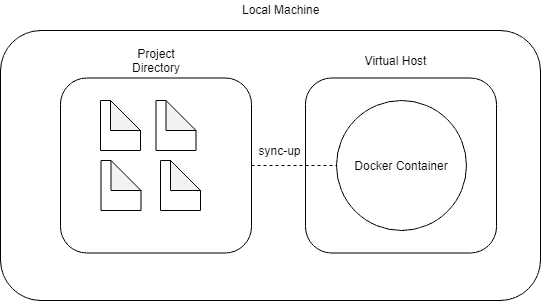
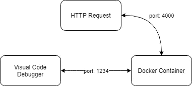
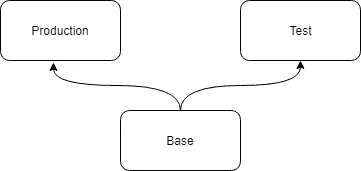

# 使用 Docker 和 VSCode 进行持续开发

> 原文：<https://medium.com/hackernoon/continuous-development-with-docker-and-vscode-go-version-164ee78d09bf>

## — Go 版本

Source Image: [https://www.getwrecked.com/self-compiling-go-docker-container/](https://www.getwrecked.com/self-compiling-go-docker-container/)

## **TL；**博士提出的解决方案是关于:

1.  建立 Docker 容器并与主机目录上的项目文件集成
2.  使用 VSCode for Go 中的调试模块
3.  基于用途(基础、调试、生产)分离 Docker 映像

 [## Wei surya/go-docker-持续发展

### 使用 Docker 和 VSCode 的持续开发环境，Go 版本-Wei surya/Go-Docker-持续开发

github.com](https://github.com/weisurya/go-docker-continuous-development) 

作为一名需要与使用其他操作系统(如 Ubuntu 或 MacOS)的开发人员一起工作的 Windows 用户，我通常会对我的工作能否在其他操作系统上运行感到沮丧。即使我和其他人使用相同的操作系统，关于不同环境的问题仍然很常见。所以，Docker 是一个解决方案，对于像我这样不想花很多时间调试这个重复问题的开发人员来说。

# 建立 Docker 容器并与主机目录上的项目文件集成

当我使用 Docker 进行开发时有一个缺点——我仍然在我的主机中编写和运行代码。我认为 Docker 无法解决我对不同环境的担忧。当我仍处于开发阶段时，我不希望如此频繁地构建——我希望有一种方法，在这种方法中，我只能使用 Docker 容器作为环境，但仍然可以按需编码。对于这一个，你可以在这里检查。

Created by using: Draw.io

上图高度概括了这种方法的工作原理。在当前项目目录和容器中的目录之间进行挂载绑定。因此，无论何时您在本地机器上进行任何更改，它都会直接反映到 Docker 容器中。因此，它解决了以下问题:

1.  机器之间的环境不同。
2.  持续开发，而不把代码和构建在一起作为一个 Docker 镜像。

# 使用 VSCode for Go 中的调试模块

此外，作为一个微软可视化代码用户，我喜欢使用他们的调试模块。它真的帮助我开发了一个大规模的项目，一步一步地跟踪流程。但是，默认情况下，它只支持 Node.js 运行时，并且可以调试 Javascript、TypeScript 和任何其他 JavaScript 支持的语言。幸运的是，VSCode 有一个开源市场，我们可以在那里找到调试器扩展。我在这里写关于[的循序渐进教程](https://github.com/weisurya/go-docker-continuous-development#use-debug-module-from-vscode)。

Created by using: Draw.io

上图高度概括了这种方法的工作原理。想法很简单，我们想为 [go-delve](https://github.com/go-delve/delve) 做一个后门来监听容器内部的系统。在这里，我将容器暴露给另一个端口，在本例中是 1234。

# 基于用途(基础、调试、生产)分离 Docker 映像

此外，因为我想在 Docker 中调试，所以我不想把它和我只想放在生产容器中的堆栈混在一起。所以我根据目的把 Dockerfile 文件分开了。我把每个文件的想法和用法写在[这里](https://github.com/weisurya/go-docker-continuous-development#use-debug-module-from-vscode)。

Created by using: Draw.io

上图高度概括了这种方法的工作原理。通过这种方法，我们可以确保:

1.  你的码头工人形象会保持小。
2.  您只将相关的包放在每个环境中。
3.  您仍然保持生产和测试映像之间的标准。

我希望这篇教程能帮助你更好地享受你在 Go 语言中的开发时光！我很高兴听到你的反馈。

尽管如此，编码快乐！

Surya 在职业生活中是一名软件工程师，在个人生活中是一名技术布道者。今年，他建立了一个决议，叫做“[学会忘却并保持分享](https://www.linkedin.com/pulse/learn-unlearn-keep-sharing-soen-surya-soenaryo/)”。如果你有兴趣或者想了解他的进展，你可以访问他的个人网站[soensurya.com](http://soensurya.com)，或者 [LinkedIn](https://linkedin.com/in/weisurya) 。

# 参考

 [## 戈朗

### Go (golang)是一种通用的、更高级的命令式编程语言。GitHub 报告…

docs.docker.com](https://docs.docker.com/samples/library/golang/)  [## Visual Studio 代码中的调试

### Visual Studio 代码中最棒的事情之一就是调试支持。设置断点，单步执行，检查变量和…

code.visualstudio.com](https://code.visualstudio.com/docs/editor/debugging)  [## 使用绑定挂载

### 绑定挂载从 Docker 早期就已经出现了。与…相比，绑定装载的功能有限

docs.docker.com](https://docs.docker.com/storage/bind-mounts/#choose-the--v-or---mount-flag)  [## 使用 Visual Studio 代码

### 使用 Visual Studio 代码的 Go 扩展，您可以获得像智能感知、代码导航、符号…

code.visualstudio.com](https://code.visualstudio.com/docs/languages/go)  [## Docker 的 Seccomp 安全性配置文件

### 安全计算模式(seccomp)是 Linux 内核的一个特性。您可以使用它来限制在…内可用的动作

docs.docker.com](https://docs.docker.com/engine/security/seccomp/)  [## 去钻研/钻研

### Delve 是 Go 编程语言的调试器。-去钻研/钻研

github.com](https://github.com/go-delve/delve/blob/master/Documentation/usage/dlv.md)