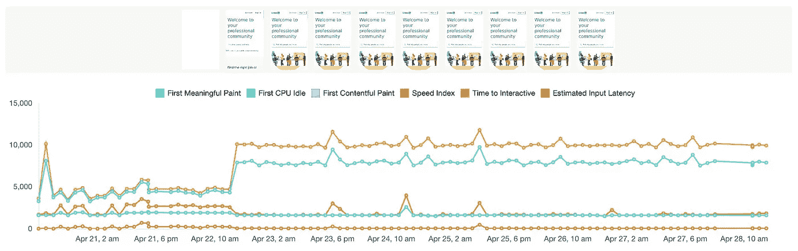
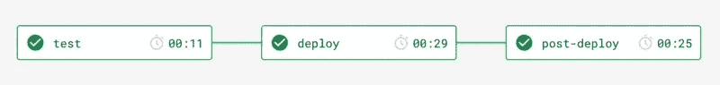

# 持续的前端网站性能测试

> 原文：<https://medium.com/hackernoon/continuous-front-end-website-performance-testing-f50008beb0>

## 连续工作流程中以用户为中心的网站性能监控

网站性能应该从“以用户为中心”的角度来分析。用户通常会寻找视觉反馈，让他们确信一切正常，否则他们会放弃。过去，我们从一个小孔来观察网站的表现。如今，随着我们适应各种设备和网络条件，用户体验的设计和开发有了很大的不同。

> 加载时间因用户而异，取决于他们的设备能力和网络条件。像加载时间或 DOMContentLoaded 时间这样的传统性能指标是非常不可靠的，因为它们发生的时间可能与用户认为应用程序加载的时间一致，也可能不一致。
> 
> ~ [以用户为中心的性能指标|网络基础|谷歌开发者](https://developers.google.com/web/fundamentals/performance/user-centric-performance-metrics)

# 网站绩效指标

下面的指标代表了页面加载生命周期的重要点。每个人都回答了关于用户体验的问题。

*   **第一幅令人满意的画**:这是真的吗？导航启动成功了吗？服务器有响应吗？
*   **第一幅有意义的画**:有用吗？有足够的内容让用户参与进来吗？
*   **互动时间**:是否可用？用户可以和页面交互吗，还是页面还在忙着加载？
*   **长任务(不在)**:令人愉快吗？交互是否流畅自然，没有滞后和抖动？

[Lighthouse](https://developers.google.com/web/tools/lighthouse) 是一个手动或编程使用的工具，用于提供这些类型的以用户为中心的指标。每个指标在 Lighthouse 文档中都有详细描述——以[到交互](https://developers.google.com/web/tools/lighthouse/audits/time-to-interactive)的时间为例。

# 前端

这是正确的前端工程师—您的工作变得更加困难。许多性能指标受到我们构建 DOM、优化、捆绑和加载资源的方式的影响。

Thanks?

下面是我们作为前端工程师应该考虑的几个重要例子。Lighthouse 及其这些指标的文档可以提供更全面的概述。

## 图像和视频

除了延迟加载，我们可以通过简单地优化和重新格式化图片来提高网站性能。根据我的经验，这个罪魁祸首对表现不佳的网站影响最大。考虑[以“下一代”格式提供您的影像](https://developers.google.com/web/tools/lighthouse/audits/webp)。

另一个严重的影响可能来自我们加载图像和视频等大型资源的方式。如果可能的话，延迟加载会非常有效。点击阅读[更多关于延迟加载的信息。](https://developers.google.com/web/fundamentals/performance/lazy-loading-guidance/images-and-video/)

## 捆绑 JavaScript 和 CSS

我看到的另一个导致许多网站性能不佳的罪魁祸首是资产捆绑和加载的方式。我发现将资产捆绑成更小块的技术在提高性能方面非常有效。如果可以的话，在页面加载时加载关键资源，而按需加载非关键资源会产生巨大的差异。例如，通过使用像 [Webpack](https://webpack.js.org/) 这样的现代构建工具，我们可以用像[代码分割](https://developers.google.com/web/fundamentals/performance/optimizing-javascript/code-splitting/)和[树抖动](https://developers.google.com/web/fundamentals/performance/optimizing-javascript/tree-shaking/)这样的技术来完成这个任务。

# 网站性能监控

通过使用 [Lighthouse 集成，比如 Foo 的自动化 Lighthouse Check](https://www.foo.software/lighthouse) ，你可以随着时间的推移自动测试你的网站的性能。它提供了重要指标的时间表视图，如“第一次有意义的绘制”、“第一次 CPU 空闲”、“第一次有内容的绘制”、“速度指数”、“交互时间”和“估计的输入延迟”。在下面的 Twitter 示例中，您可以看到将性能漂移与特定时间和日期相关联是多么有益。在这个例子中，我们看到交互时间和第一个 CPU 空闲时间在 4 月 22 日上午 10 点左右以毫秒为单位上升(这很糟糕)。

Twitter Performance Drift

你可以在自动灯塔检查上看到其他主要网站的[性能示例。添加页面来监控性能很容易。有关指南，请参见](https://www.foo.software/dashboard/demo)[文档](https://www.foo.software/automated-lighthouse-check-getting-started/)。

# 在连续的工作流程中自动监控网站性能

Example Continuous Delivery Diagram from circleci

使用 Jenkins、circleci 或其他工具，结合自动化灯塔检查，您可以在管道中添加一个部署后步骤来自动测试性能。自动化的 Lighthouse Check 将触发一个性能审计，用一个标记(通常是一个构建号)保存它，并使它可以在时间线图中与任何其他手动、自动或从部署后步骤(API 调用)触发的性能测试一起查看。要建立这个性能回归测试步骤，您只需向自动化灯塔检查公共 API 添加一个请求。关于如何做的指导，你可以[阅读这篇文章](/free-code-camp/automatic-website-performance-regression-testing-4e30e6bf5cd#ce21)。

# 结论

在现代 web 开发中，网站性能变得越来越重要。考虑到用户浏览网站和与网站互动的不同方式，我们需要从以用户为中心的角度来看待网站的表现。