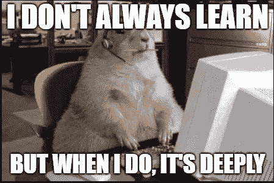
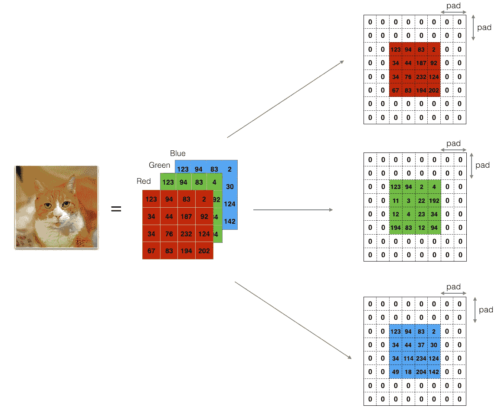
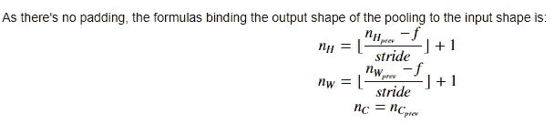
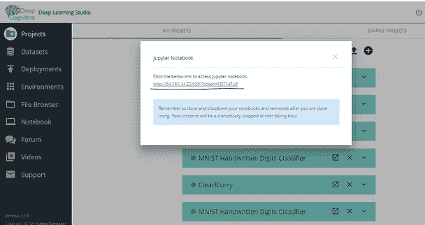

# 从头开始:可爱的数字，向前传球|第 1 部分|

> 原文：<https://medium.com/hackernoon/convnet-from-scratch-just-lovely-numpy-forward-pass-part-1-6d3a0776f90a>

高级框架和 API 使我们实现如此复杂的架构变得非常容易，但从头开始实现它们可能会让我们对 ConvNets 实际上是如何工作的有一个基本的直觉。

# -文章的大纲

我们将实现卷积神经网络的构建模块！我们将实现的每个功能都有详细的说明，引导您完成所需的步骤:

*   零填充
*   卷积向前
*   向前汇集

我们将使用 DLS·朱庇特笔记本来执行我们的模块。看看这里的 DLS。事实上，它附带了深度学习所需的预装库和框架。所以去 DL 挺好的。

 [## 深度认知的视频漫游

### 大家好！在本文中，我将与您分享几个视频，带您浏览深度认知的平台…

towardsdatascience.com](https://towardsdatascience.com/a-video-walkthrough-of-deep-cognition-fd0ca59d2f76)  [## 使用 RNNs 生成故事|带代码的纯数学|:

### 嗨读者！

hackernoon.com](https://hackernoon.com/generate-stories-using-rnns-pure-mathematics-with-code-cb6f1e967b22) 

# **补零**

零填充在给定图像的边框周围添加零。

**Zero padding Visualization**

**补零的重要性:**

*   它防止输入在更深的层中传递时收缩得更快。另一个特例是“相同”填充，即使在卷积后也不会减少输入大小。
*   它还有助于防止图像边界处的信息丢失，否则，与边界内的信息相比，边界处的信息将没有那么重要。

让我们直接进入代码:

# 卷积的单步

在这一部分中，我们将实现卷积的单个步骤，其中我们将滤波器应用于输入的单个位置。这将用于构建卷积单元，它:

*   获取输入体积
*   在输入的每个位置应用过滤器
*   输出另一个卷(通常大小不同)

**Figure 2** : **Convolution operation**
with a filter of 2x2 and a stride of 1 (stride = amount you move the window each time you slide)

# 卷积神经网络—正向传递

在前向传递中，我们将采用许多滤波器，并在输入端进行卷积。每个“卷积”给你一个 2D 矩阵输出。然后，您将堆叠这些输出以获得 3D 体积:

# 汇集层

池(POOL)层减少了输入的高度和宽度。这有助于减少计算，也有助于使特征检测器对其在输入中的位置更加**不变** **。两种类型的池层是:**

*   Max-pooling layer:在输入上滑动(f，f)窗口，并将窗口的最大值存储在输出中。
*   Average-pooling layer:在输入上滑动一个(f，f)窗口，并将窗口的平均值存储在输出中。

**pool forward module**

完整的深度学习工作室的 Jupyter 笔记本！

 [## manik 9/conv nets _ 从头开始

### 用 Numpy 实现 ConvNets。为 Manik9/ConvNets_from_scratch 开发做出贡献，创建一个…

github.com](https://github.com/Manik9/ConvNets_from_scratch) 

**Open DLS Notebook and Upload your Jupyter Notebook**

如果你喜欢这篇文章，请👏和分享😄。更多关于深度学习的文章请关注我的**和 [**LinkedIn**](https://www.linkedin.com/in/maniksoni/) 。**

**感谢阅读😃**

**快乐的 Numpy。**