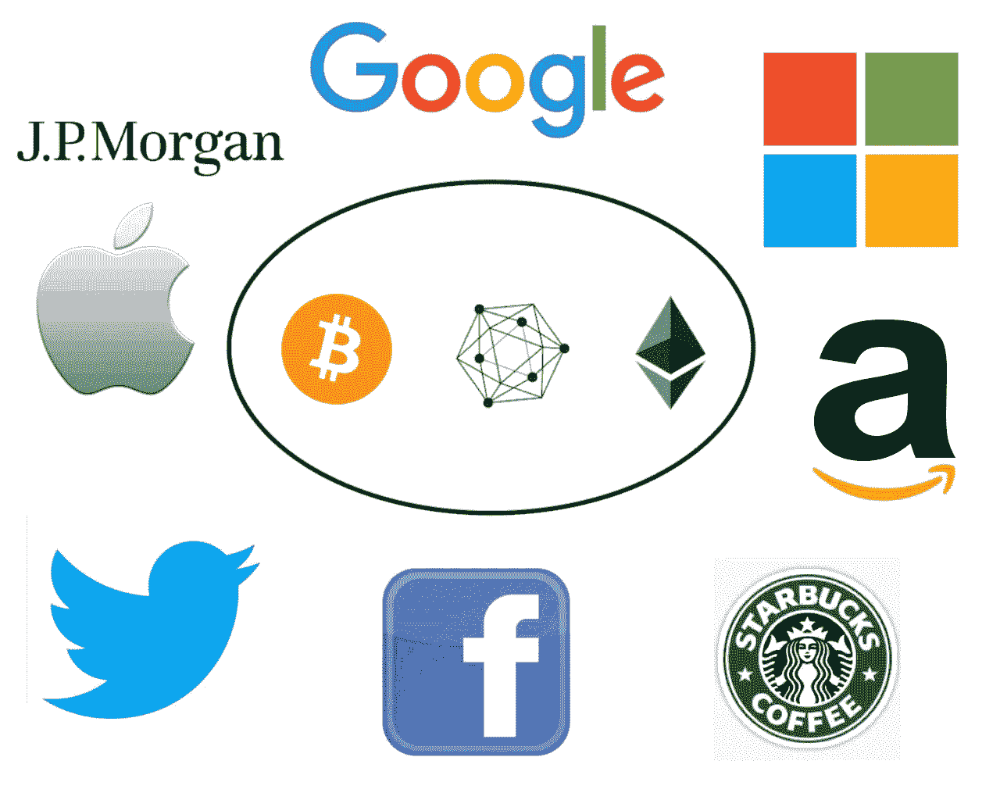

# 企业对采用加密货币和区块链的影响

> 原文：<https://medium.com/hackernoon/corporate-influence-on-the-adoption-of-cryptocurrencies-and-blockchains-aaddec193271>

比特币[消除了单一中央权力机构](https://bitcoin.org/bitcoin.pdf)在货币创造和使用中的作用，但其命运将在很大程度上受到集中化企业第三方行动的影响。

我回顾了一些世界上最大的公司如何将区块链集成到他们的运营中，并思考该技术，以提供一个起点来评估他们在推动加密货币和区块链技术的采用方面可能发挥的作用。

# Square/CashApp、Twitter

Twitter 和 Square 的联合创始人兼首席执行官杰克·多西自白皮书发布以来一直关注比特币，最近在加密货币领域变得非常活跃，无论是从专业角度还是个人角度。

2018 年 1 月，Square 通过其移动支付服务 CashApp 实现了[购买、出售和持有比特币](https://finance.yahoo.com/news/why-square-embrace-bitcoin-brilliant-182530364.html?guccounter=1&j=28396&sfmc_sub=4804217&l=60_HTML&u=1323271&mid=100005534&jb=251)。他们在一年中向[出售了价值 1 . 66 亿美元的比特币，从中净赚约 100 万美元。多尔西](https://www.coindesk.com/square-sold-over-166-million-in-bitcoin-last-year)[最近详细讲述了他是如何理解比特币的，为什么他认为互联网和社会需要一种本地的、开放的数字货币，以及由加密货币实现的新商业模式。](https://stephanlivera.com/episode/52)

当被问及将[闪电网络](https://lightning.network/)支付整合到 Twitter 的可能性时，他回答道:

> “我认为有很多，这真的很有吸引力，我们希望在这方面花更多的时间……我们终于有了技术，更广泛地在区块链层面上，我认为这些技术可以帮助我们解决我们在 Twitter 上面临的一些挑战，包括信任和身份，当然也提供了更多的经济激励，而不仅仅是 Twitter 今天提供的 reach。
> 
> 在公司内部和公司周围，这是一个非常活跃的对话，我们希望明智地对待它，并再次确保我们正在构建一些感觉非常简单、容易理解并且在正确的时间进行的东西。但这绝对是我会感到兴奋并乐意看到的事情。"( [36:28](https://stephanlivera.com/episode/52) )

多尔西[投资了闪电实验室](https://www.coindesk.com/a-version-of-bitcoins-lightning-network-is-ready-for-real-money)，[在推特](https://twitter.com/jack/status/1098324828182831104?)上接受比特币提示，使用 [tippin.me](https://tippin.me/) ，[持有比特币的火炬](https://twitter.com/jack/status/1092892320842706944)，并且已经[每周购买价值 1 万美元的比特币](https://finance.yahoo.com/news/twitter-ceo-jack-dorsey-buying-140005439.html)以期待大规模采用。他还在推特上发布了他购买即插即用的全比特币/闪电节点和 Trezor 硬件钱包的消息。

# 星巴克

星巴克、微软和波士顿咨询集团[正在支持 Bakkt](http://fortune.com/longform/nyse-owner-bitcoin-exchange-startup/) ，这是一家旨在促进世界上最大的金融机构采用加密货币的初创公司。Bakkt 归纽约证券交易所的所有者 ICE 所有

作为对大部分股权的交换，[星巴克将允许消费者使用 Bakkt 的软件](https://twitter.com/mdudas/status/1102566322175660032)用比特币在商店付款，该软件可将加密货币立即转换成美元。消费者将能够在星巴克“消费”他们的比特币，但该公司的最终账目将不会涉及加密货币。

# 克罗格

Kroger 是美国收入第二大的杂货商，由于支付处理器收取过高的费用，它已经在 200 多家商店放弃了 Visa 信用卡。声明发布后不久，Anthony Pompliano [在推特上发出邀请](https://twitter.com/APompliano/status/1101651904940134400)让 Morgan Creek Digital 的团队飞过来帮助他们整合比特币的闪电网络作为支付选项。

Kroger Digital 的一位产品经理很快作出了回应，将话题转移到了与公司首席数字官的会面上。

# 三星电子

在将早期报道斥为“[谣言和猜测](https://cointelegraph.com/news/samsung-dismisses-galaxy-s10-crypto-wallet-reports-as-rumor-and-speculation)之后，三星宣布他们的旗舰 [Galaxy S10 将包括一个内置的加密货币钱包](https://www.theverge.com/2019/2/25/18233131/samsung-galaxy-s10-bitcoin-cryptocurrency-wallet-features)，支持以太坊和精选的分散应用。之前的报道表明比特币将会得到支持，但对于三星区块链钱包的最初版本来说，情况并非如此。

# 忠诚

富达投资是世界上最大的资产管理公司之一，管理着超过 2 万亿美元的资产。他们已经为想要投资比特币和其他数字资产的机构投资者建立并正在测试“[企业级托管和执行服务”。该公司于 2017 年](https://www.fidelitydigitalassets.com/overview)[开始开采比特币和以太](http://fortune.com/2017/10/06/fidelity-bitcoin-ethereum/)，最近[投资了区块链分析初创公司](https://www.coindesk.com/blockchain-data-startup-coin-metrics-fidelity-crypto) Coin Metrics。

# 摩根大通

杰米·戴蒙因贬低比特币为危险的欺诈而成为头条新闻，他的公司一直致力于开发区块链产品。摩根大通是 2017 年初发起的[企业以太坊联盟](https://entethalliance.org/)的创始成员，并开发了公共以太坊区块链的[分支，Quorom](https://www.jpmorgan.com/global/Quorum) ，允许用户轻松部署许可的区块链。

他们最近发布了 JPM 硬币，这是一种由美元支持的私人稳定硬币，正在一个小型试点小组中测试企业对企业的支付。[戴蒙相信](https://www.cnbc.com/video/2019/02/26/dimon-jpmorgan-coin-could-one-day-be-consumer.html)有一天 JPMcoin 可以用于消费支付。

该公司还[致力于将零知识证明应用于区块链技术](https://www.coindesk.com/jp-morgan-is-quietly-testing-cutting-edge-ethereum-privacy-tech)的研究。这项工作可以让客户在不放弃敏感业务数据的情况下使用公共区块链。币安的研究小组发表了一份对 JPM 硬币的全面分析，JPM 前副总裁区块链战略主管在推特上讨论了他的想法。

# 脸谱网

2018 年初，[马克·扎克伯格(Mark Zuckerberg)宣布](https://www.facebook.com/zuck/posts/10104380170714571)他将开始研究加密货币，因为它可以“从中央集权系统中获取权力，并将其放回到人们手中”。几个月后，脸书[成立了区块链分部](https://www.reuters.com/article/us-facebook-moves/facebook-shakes-up-management-launches-blockchain-division-idUSKBN1IA05S)，他们最近[收购了区块链的一家初创公司](https://mashable.com/article/facebook-acquires-blockchain-team-chainspace/#aTeMALsnugqE)。据报道，脸书的内部加密团队“在禁止其他公司员工进入的办公室工作”，并由前 PayPal 总裁大卫·马库斯领导。

现在，脸书正在开发一种加密货币，WhatsApp 用户可以立即将其发送给朋友和家人。他们正与交易所就这种可能与一篮子外币挂钩的硬币上市进行谈判。扎克伯格最近还[讨论了用基于区块链的分布式登录服务](https://www.coindesk.com/facebook-mark-zuckerberg-blockchain-authentication)取代脸书连接的利弊。

# 谷歌

[谢尔盖·布林哀叹谷歌未能“站在区块链科技的前沿”。现在，该公司正在弥补失去的时间。他们正在为区块链公众开发区块链搜索工具，并致力于他们自己的“分布式数字账本”他们](https://www.cnbc.com/2018/07/09/brin-says-google-failed-the-bleeding-edge-blockchain.html)[与 BlockApps](https://blockapps.net/blockapps-partners-google-cloud-platform-enterprise-blockchain-solutions/) 合作，为谷歌云平台提供快速部署[区块链解决方案。](https://console.cloud.google.com/marketplace/details/bigquery-public-data/ethereum-blockchain?pli=1)

# 亚马孙

[亚马逊的托管区块链服务](https://aws.amazon.com/managed-blockchain/)允许用户使用 Hyperledger Fabric 或以太坊轻松部署 AWS 上托管的私有区块链。该公司正与万事达卡和埃森哲合作[建立透明的“循环”供应链](https://www.forbes.com/sites/leslieankney/2019/02/25/accenture-mastercard-and-amazon-partner-to-establish-transparent-blockchain-supply-chain/#7319824f1f81)。

# 微软

[微软为其 Azure 云平台](https://azure.microsoft.com/en-us/solutions/blockchain/)开发了自己的区块链管理解决方案，并与 XYO 合作，在 Azure marketplace 上提供[的地理空间应用。](/xyonetwork/xyo-and-microsoft-changing-the-course-of-history-together-f511639828a4)他们还[允许顾客使用比特币](https://support.microsoft.com/en-us/help/13942/microsoft-account-how-to-use-bitcoin-to-add-money-to-your-account)充值，在 Windows 和 Xbox 商店购物。

该公司正致力于基于区块链的分散数字身份标准，它相信该标准可以在全球捍卫人权方面发挥重要作用。他们正与西班牙最大的电信公司合作，探索区块链技术的机会。

# Reddit

Reddit 的联合创始人 Alexis Ohanian 是比特币基地的早期投资者，他是加密货币改变世界潜力的忠实信徒。他认为，当前的“加密冬天”已导致价格从历史高点暴跌 80-90%，这导致投机者逃离，并将使技术爱好者专注于“[建设真正实现这一目标所需的基础设施](https://finance.yahoo.com/news/crypto-investors-think-long-term-reddit-coinbase-alexis-ohanian-130917667.html)”

2015 年，Reddit [曾短暂尝试创造他们自己的加密货币](https://www.theguardian.com/technology/2015/feb/02/redditcoin-quietly-killed-off-and-lead-developer-fired)“Reddit Notes”。前首席执行官王义山对尝试使用区块链技术“分散公司管理”的想法感到兴奋。

# 国际商用机器公司

[IBM 基于 hyperledger 的区块链平台为食品信托、身份和贸易融资提供了一套企业解决方案和服务](https://www.ibm.com/blockchain)。他们的区块链[世界有线系统](https://www.ibm.com/blockchain/solutions/world-wire)促进了跨境支付，使用恒星网络在几秒钟内清算和结算。基于以太坊的云计算平台 iExec 集成了 IBM Cloud 来[提供安全的分散计算](https://www.ibm.com/blogs/bluemix/2018/11/iexec-integrates-ibm-cloud-to-increase-the-security-of-decentralized-computing/)。

IBM 是一个财团的成员，该财团利用区块链建立了一个卫生设施网络，并与淡水信托基金和科罗拉多大学博尔德分校合作，利用区块链技术和 IOT 技术，通过干旱水的可持续管理来抗击加州的干旱。

该公司的区块链解决方案负责人[认为](https://bitcoinmagazine.com/articles/ibm-exec-forecasts-a-million-dollar-bitcoin-when-a-sat-will-equal-a-cent/)比特币有一天可能达到 100 万美元/BTC，并表示他们可能会在未来与比特币合作。

# 沃尔玛

在与 IBM 的区块链平台进行了为期两年的成功试点项目后，沃尔玛将[要求生菜和菠菜供应商在 2019 年 9 月前将他们食品的详细信息输入区块链数据库](https://www.nytimes.com/2018/09/24/business/walmart-blockchain-lettuce.html)。这将使该公司更有效地跟踪每袋产品，并在几秒钟内确定食品的来源，而不是几天。

# 美国英特尔公司(财富 500 强公司之一ˌ以生产 CPU 芯片著称)

[英特尔开发了软件保护扩展](https://www.intel.com/content/www/us/en/security/blockchain-overview.html) (SGX)，可以提高区块链交易的隐私性和效率。该公司是三个区块链联盟的成员，即 EEA、Hyperledger 和 R3，并且[正在与 T-mobile](https://www.intel.com/content/www/us/en/security/t-mobile-sawtooth-solution-brief.html) 合作开发基于区块链的增强型身份管理技术。

[面向区块链的英特尔精选解决方案](https://builders.intel.com/docs/select-solutions-blockchain.pdf)“帮助组织准备区块链基础设施投资，利用通用硬件产生出色的总拥有成本，并利用针对重要软件库优化的交钥匙解决方案加快上市时间。”

# 苹果

苹果尚未公开宣布任何针对区块链的重大内部举措。他们最近向 SEC 提交了一份文件[，其中提到了他们为“](https://www.sec.gov/Archives/edgar/data/320193/000119312519041571/d694085dex101.htm)[负责任商业联盟的负责任矿产倡议](https://venturebeat.com/2019/02/15/apple-helps-draft-blockchain-rules-for-responsible-minerals-initiative/)”制定区块链指导方针的工作。

苹果联合创始人史蒂夫·沃兹尼亚克透露，由于不想应对高波动性的压力，他在最近的泡沫中出售了大部分 BTC 和瑞士联邦理工学院的股份。他形容以太坊是一个有朝一日会像苹果一样有影响力的平台。

# 埃隆马斯克(特斯拉、SpaceX)

埃隆·马斯克在接受 Ark Invest 的播客采访中称比特币“非常聪明”。他不认为特斯拉涉足 crypto 是明智的，但他对该技术的支持可能会导致该领域未来的努力。

# 2018 年行业调查

德勤对来自世界七个国家的 1000 多名高管进行的调查发现，74%的公司认为区块链技术有令人信服的商业用途。毕马威会计师事务所对数百家全球技术领先企业的调查发现，48%的受访者认为区块链“很有可能”在未来三年内改变他们公司的经营方式。普华永道[调查](https://www.pwc.com/gx/en/issues/blockchain/blockchain-in-business.html)的 84%的受访者“积极参与区块链事务”。

# 开放的颠覆，还是封闭现状的重建？

分类账和货币是作为我们社会制度的关键基础的技术，因此区分目前正在发挥作用的不同趋势至关重要。

一些公司正在接受公开的区块链和比特币和以太坊等加密货币，致力于彻底反思我们与货币互动、开展业务和组织以实现共同目标的方式。其他人使用许可链主要是为了提高现有操作的效率。一些公司正在试验公开的和许可的系统。

谁将扮演更重要的角色？接受开放协议的多尔西、奥汉尼斯、克罗格、星巴克和忠诚，还是推出更集中产品的摩根大通和沃尔玛？脸书、谷歌、推特和亚马逊会在多大程度上拥抱公共区块链，他们会用它们构建什么样的面向消费者的应用？我们会看到特许连锁店和公共连锁店之间的重要互动吗？

人们很容易认为自由的区块链毫无意义，我也不觉得它们很令人兴奋。但事实是，与他们合作的公司有能力影响公众的看法和行为，特别是在发达国家，他们目前并不太关心“去中心化”、货币理论或央行政策。

采用不仅仅是构建创新技术。它主要由心理和社会因素驱动:信任、贪婪、激情、恐惧和部落主义。我们选择建立的系统和讲述的故事将决定加密货币和区块链在我们生活中扮演的角色。世界上最大的公司使用区块链技术的方式将对其发展和长期社会影响产生重大影响。

> “这将是技术对人类还是技术对人类？
> 
> 由我们来决定。**我们**能解决问题。**我们**可以把人性烤进代码里。**我们**能够努力确保这场新运动带领我们走向一个更加公平、公正和进步的未来”[畅通无阻:区块链将如何改变你的企业(以及如何应对)](https://www.amazon.com/Unblocked-Blockchains-Change-Business-about/dp/0998042005)(第 291 页)