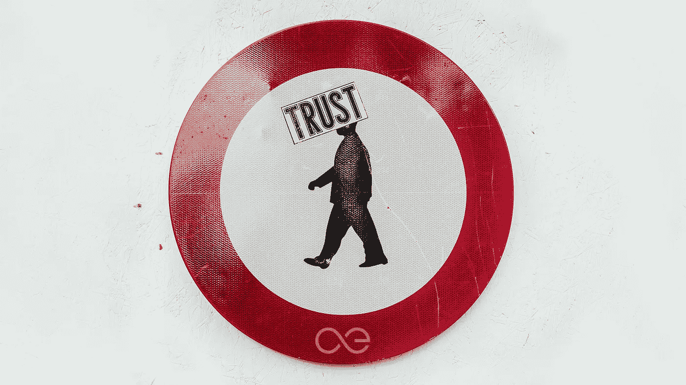
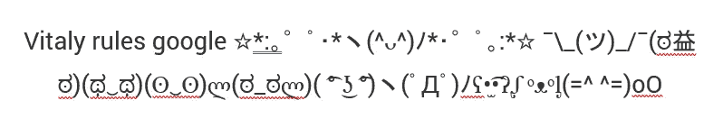
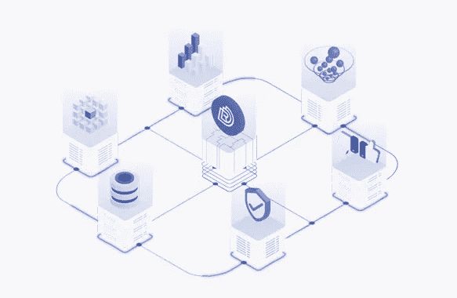

# 基于区块链的声誉系统能阻止反乌托邦的未来吗？

> 原文：<https://medium.com/hackernoon/could-a-blockchain-based-reputation-system-prevent-a-dystopian-future-d58522b88e2c>

## 今天是有影响力的人，明天是穷光蛋。你不应该认为你的网络声誉是理所当然的。它只是借来的。

除非你是唐纳德·特朗普(Donald Trump)或琼·杰特，否则你很可能真的会在乎自己的名声。我们都是。事实上，这是我们的基因。我们部落狩猎采集社会的生存依赖于声誉。语言被发明的主要原因之一是为了让我们能够闲聊:

> “看到那边那个家伙了吗？他和另一个家伙出去打猎，突然一只巨大的剑齿虎袭击了他们，你知道那个懦夫做了什么吗？跑了！”

那时，一个人的一生取决于关于他们的谣言，取决于其他人认为他们是勇敢还是懦弱。与此同时，又是流言蜚语为部落间的合作、生存和进化为我们今天繁荣的稳定社会铺平了道路。

# **名声不如从前了**

随着 21 世纪全球化和数字游牧的加速，个人声誉肯定已经失去了它的社会影响力。我们没有一个与我们的在线身份相联系的统一的信誉评分。相反，我们能够在各种平台和各种在线社区中拥有不同声誉的多个身份，这些身份并不真正相互交谈或交换数据。

如果我们设法在一个平台或一个社区搞砸了我们的声誉，它可能不会在其他地方伤害我们。没有什么可以阻止我们简单地删除我们的个人资料，并用新的电子邮件地址或电话号码创建一个新的个人资料，从而在几分钟内有效地将我们的负面信誉评分重置为中性。我们最多花费一些额外的时间和精力。彻底改造自己的合理代价，不是吗？

然而，在建立声誉方面的这种宽容可能是一把双刃剑。一方面，它让人们享受在线自由，获得数字化的“重生”。俗话说“人非圣贤孰能无过”，我们应该能够在互联网上和生活中进化和改变。

另一方面，这种不受控制的环境意味着任何信誉系统都可能被机器人和假账户弄得毫无用处。对于我们大多数人来说，社交媒体是主要的信息来源，当我们意识到没有一个账户可以免于黑客攻击或操纵时，这是非常可怕的，因此没有人是值得信任的。

> 正如乌苏拉·勒奎因所说:“文字是事件，它们做事情，改变事情。他们改变说话者和听话者；它们来回输送能量并放大它。”

正如我们已经看到的，假新闻和钓鱼被证明能够推翻整个社会和政治制度。

# **假装直到你成功**

Ebay、亚马逊、Fiverr、Yelp 甚至 Twitter 和 Instagram 等社交媒体平台经常成为恶意用户或竞争对手的目标，他们试图改变和扭曲真实的声誉价值。伪造和操纵信誉评级的多个实例正导致电子商务平台和服务市场用户怀疑现有在线信誉系统的真实性。现在大量的关注者或喜欢者也很容易被操纵。

This egg has more “reputation” than you. Feel sad. Don’t follow it.

还记得正在进行的对俄罗斯干涉美国大选的调查吗？通过机器人和巨魔的军队来控制公众舆论不是科幻小说。今天正在发生。

Google it.

对这些系统的所有信任都被无可挽回地破坏了。这导致公司失去提供高质量产品或服务以培养合法信誉分数的动力。社交媒体中的公众人物也是如此。他们可以买到名誉。反正大家都在做！对于企业来说，购买虚假评级或部署能够保持其声誉(至少第一眼看上去)健康和品牌值得信赖的机器人甚至更划算。根据新的[研究](https://fashionjournal.com.au/life/report-finds-fake-influencers-are-costing-brands-up-to-200-million-usd-per-year/)，美国品牌每年因虚假社交媒体账户损失约 2 亿美元，这些账户声称自己是有影响力的。2017 年，社交媒体支出达 21 亿美元，11%的盈利账户是非法的。在这种情况下:

> 尽管平台运营商尽了最大努力来人工发现虚假评级和账户，但集中式声誉系统本质上变得多余。

# **扔在区块链上**

毫不奇怪，当谈到互联网上的信任问题时，这通常是区块链走向聚光灯下的机会。区块链确实可以提供比托管在私人数据库中的传统信誉跟踪系统更具体的优势。

想象一下，你是一名自由职业者，为数百名客户提供服务，多年来，在某个平台上作为一名严肃的专业人士赢得了声誉。你在平台上获得的声誉越多，你就越依赖于它的存在和它的运营者(以及那些在他们之上的人)的突发奇想。如果自由职业平台因为任何原因消失了，你辛苦赢得的声誉也会随之消失。而且，你还完全依赖于平台的政策，这些政策经常变化。如果存储你的声誉的私人数据库的所有者决定这样做，他们可以完全删除你的个人资料以及你辛苦获得的信任。

> 这些私有数据库是您的单点故障。创建公共区块链是为了解决集中式信托存管的缺点。

社交媒体平台也是如此。各个公司为了推广自己的产品而奖励的所谓“影响者”，就是 ***完全依赖*** 所运营的平台。有意无意地违背他们的政策，你就会失去“数字地位”。

You don’t see much of this guy anymore, do you?

最近，美国阴谋论者亚历克斯·琼斯的品牌“信息战争”(Infowars)被从脸书、YouTube、Spotify、Twitter 和苹果上移除。该节目被发现违反了服务的行为政策。PayPal 随后也切断了与该节目的联系，从而切断了亚历克斯·琼斯的一个重要收入来源。所有这些服务已经支持这个节目很多年了。用教堂山北卡罗来纳大学媒体与新闻学院教授丹尼尔·克里斯的话说:

> 这对信息战的范围和亚历克斯·琼斯的政治力量有着潜在的巨大影响。这极大地限制了信息战争在公共领域的可见度。[ [来源](https://www.theguardian.com/us-news/2018/aug/11/alex-jones-claims-hes-being-silenced-as-bans-push-him-to-alternate-platforms)

在不评论亚历克斯·琼斯制作的内容质量的情况下，这个案例提醒每个人，我们都被第三方“容忍”,我们使用第三方的平台。

> 我们的声誉完全属于第三方。

区块链平台，特别是可互操作的平台，可以改变这一点。至少，它们提供了一种新的基础设施，在此基础上可以开发新型的信誉系统。不为单一实体所拥有的基础设施，这种基础设施是不可改变的、透明的，并且基于秘密的经济激励机制。这为新型信誉系统提供了一个极好的基础——那些由用户自然拥有和控制的信誉系统。

分散信誉跟踪消除了托管信誉敏感内容的网站为了自己的利益而删除、提高或降低信誉分数的可能性。[most]区块链的公共性质允许任何用户通过跟踪创建声誉的所有公共转移(交易)来确定另一个用户的声誉的来源。这种透明性使用户能够做出明智的决定，比如，关于产品制造商、服务提供商或评论作者的决定。当然，在所有情况下，这是一个建立系统规则和调整所有将使用它的用户的激励的问题。这需要 R&D，而这正是区块链的意义所在。

> 代币销售爆炸中产生的大部分价值将准确地进入这种研究——为更健康的人类互动创造可持续的系统。

# **外界影响**

声誉系统，取决于它们被设计的方式，可能存在也可能不存在于区块链(链上)。如果它们被开发成链上的功能——所有的互动，例如投票、关注、喜欢、分享等，都将被记录在区块链中，并变得完全可追溯。然而，这将需要更具可扩展性的区块链系统。

一些下一代区块链平台认为，以分散化为代价来适应可伸缩性是最好的发展方向。 ***他们会失败*** *。*我们已经拥有了可扩展的平台——我们声誉的唯一拥有者。

> 我们需要的是建立在可扩展的、开源的、分散的、抵制审查的基础设施上的声誉系统。“微波创意”没有创新。

部分外链运作的信誉系统呢？当声誉得分由外链来源生成时，它们可以在区块链上更新吗？是的，这是可能的，所谓的神谕。Oracles 是数据提供者机制，可以作为连接到区块链节点的链外实体来实现。Oracles 可以是执行各种操作的用户(或机器),从验证某个数据片段是否正确以及现实世界中是否发生了某个事件，到回答特定的问题、执行各种操作和解决争端。他们可以监听链上的查询事务，从现实世界中获取答案，并将其发送回区块链。Oracle 提供商为区块链平台增加了一个重要的功能，并且可以在信誉系统的创建中发挥重要作用。

 [## 区块链先知

### 神谕对于区块链共享经济的实现至关重要。

blog.aeternity.com](https://blog.aeternity.com/blockchain-oracles-657f134ffbc0) 

使用区块链技术，神谕可以在区块链注册，以回答针对他们的查询。用户或智能合约付费向甲骨文询问，比如说，某人当前的信誉分数，然后费用(以代币支付)补偿甲骨文与外界沟通的努力。

## 占卜师

已经有一个 oracle 支持的信誉系统在区块链上运行。它属于 Augur，一个不可信的、去中心化的预言和预测平台。信誉令牌(REP)是占卜者的本地令牌。用户在选择预测结果时，用他们的 REP tokens 作为赌注，作为回报，从市场上收取结算费用。对市场进行“报告”的 REP token 持有者(通过将他们的 REP 押在市场的一个可能结果上)被称为报告者。

> Augur 的声誉系统旨在确保诚实、准确的结果报道始终是记者最有利可图的选择。

Augur oracle 允许信息从现实世界迁移到区块链，而无需依赖可信的中介。

## 链环

区块链信誉系统的另一个有趣的例子是 ChainLink，这是一个分散的 oracle 服务，它获取区块链应用程序外部的信息并将其放在链上。它记录并发布 oracle 提供商和节点的用户评级，为用户提供了一种全面评估 oracle 性能的方法。ChainLink 的创建者设想了一个声誉系统，其中包括一个基本的链上组件，用户的评级可用于智能合同参考，也可以轻松访问链外组件，在链外组件中，大量数据可以得到有效处理和更灵活的加权。用他们自己的话说:

> 在任何市场中，高声誉的服务都受到强烈的激励，以正确地表现并确保高可用性和高性能。负面的用户反馈会给品牌价值带来巨大的风险，与不当行为相关的惩罚也是如此。因此，我们预计会出现一个良性循环，在这个循环中，运作良好的先知会建立良好的声誉，而良好的声誉会激发持续的高绩效。

# **标记声誉**

## DREP

有一个有趣的区块链项目试图解决分散声誉是如何工作的。它叫 DREP。DREP 团队正在开发一个技术层，可以量化、货币化和聚合不同平台用户的声誉价值，包括电子商务、游戏、内容和社交网络平台。他们的一名开发人员解释道:

> 使用 DREP 现有的信誉计算算法模板，基于用户在平台上的行为的合意性来计算用户的信誉值，该模板也可以根据平台的偏好来定制。平台令牌然后被奖励给用户；奖励的代币与信誉值正相关。这是 DREP 基金会如何标记在线声誉的:奖励的标记随着声誉值的增加而增加，声誉值是平台上积极行为的频率和质量的指标。

Confused? Learn how it DREP works in detail [here](https://www.drep.org).

由于商家或供应商的每个信誉值都是通过令牌的转移来记录的，所以在不花费大量资本和资源的情况下，无法操纵或夸大供应商的评级。DREP 基金会的虚假账户识别解决方案可以检测到创建虚假账户、订单和销售的企图，帮助用户发现具有恶意意图的供应商，并防止用户从具有不正当声誉的商家获得产品或服务。

> 作为数字社区碎片化和跨平台数字身份两极分化的解决方案，通用的不可变公共分类账(或可互操作分类账)为声誉提供了可验证的单一参考点。

所有这些对一些人来说可能听起来很棒，似乎分散的声誉实际上会解决一个紧迫的在线问题，但有任何缺点吗？

# **我们离数字独裁越来越近了吗？**

要回答这个问题，只要看看中国目前实施的社会信用评分就知道了。这可能是现代史上最大的社会工程项目，这个声誉系统是由几家中国科技公司与共产党政府合作建立的。事实上，这个全国性的信用评分系统是中国精英控制 14 亿人口的最佳方式。数百万个监控摄像头将使用人工智能和面部识别软件，根据每个公民个人的身体和数字行为来增减社交点数。然后，这些真实世界的数据将与从个人的政府记录、医疗、财务和互联网浏览历史中收集的信息汇总，并提炼为一个单一的数字，即个人信用评分。这个数字可以实时地从好变坏，这取决于这个人的行为以及这个人所交往的人的声誉得分。很容易预测中国政府会如何利用这些声誉得分来证明它认为对社会“具有破坏性”的公民被列入黑名单是合理的。

> 这个系统当然是完全集中的。

This was supposed to be fiction…

就像《黑镜》(Black Mirror)中的一集一样，一个跨越众多数字社区的通用声誉量表在解决机器人流行病的同时，没有给人为错误或按下删除按钮从头开始的能力留下任何空间。

> 从各个角度来看，我们的数字活动对我们的声誉构成了越来越大的威胁。

政府的介入和科技巨头对我们信息的垄断威胁着我们对公共和私人数字空间的完全控制。其实，目前， ***并没有*** 的“私人数字空间”。

> 嗯，这不可能发生在西方，不是吗？

如果即将在中国发生的噩梦般的反乌托邦场景也可能正在西方发生，尽管是以不同的面目出现，那会怎样？除了一个包含 30 多亿用户私人信息和社交活动的巨大数据库，脸书还能是什么？仅仅从你的智能手机上，谷歌或苹果对你的日常生活已经了解了多少？你的私人数据和网络声誉会被卖给出价最高的人吗？如果出价最高的是你自己的政府呢？

> 这不正是区块链挺身而出拯救世界的时候吗？理论上，是的。

正在建设的新型基础设施必须考虑到上述所有因素。创建它的目的必须是抵御这种攻击。现在是时候评估我们的数字行为，确保我们的社区、身份和声誉不被出价最高的人所拥有。

> 至关重要的是，我们必须确保我们不会在不知不觉中建造最终会禁锢我们的基础设施。

区块链技术将像任何其他强大的工具一样被滥用。然而，我们需要确保弹性替代品始终可用。开放、公开的区块链可以很好地抵御单点控制，但是它能在政府和大公司面前坚持多久呢？现在给出一个明确的答案还为时过早。然而，令人高兴的是，我们已经看到了前进的道路。

如果说 2018 年教会了我们什么，那就是我们不仅要拥抱，还要争取一个去中心化的声誉晴雨表。开放的区块链提供了从中央集权政府手中夺回控制权的难得机会。我们应该努力抓住这个机会，弥补集中控制的缺陷，而不是坚持到一个反乌托邦的未来。

> 对区块链感兴趣吧！你的名誉岌岌可危！

你同意我们的想法吗？取得联系:

[GitHub](https://github.com/aeternity) | [论坛](http://forum.aeternity.com/)|[Reddit](https://www.reddit.com/r/Aeternity/)|[Bitcointalk](https://bitcointalk.org/index.php?topic=1733140.0)|[电报](https://t.me/aeternity) | [推特](https://twitter.com/aeternity) | [脸书](https://www.facebook.com/aeternityproject/) | [邮件](mailto:info@aeternity.com)

*此作品与* [*乔治·科伊诺夫*](https://medium.com/u/7bdbf7f8d46a?source=post_page-----d58522b88e2c--------------------------------) 合作完成