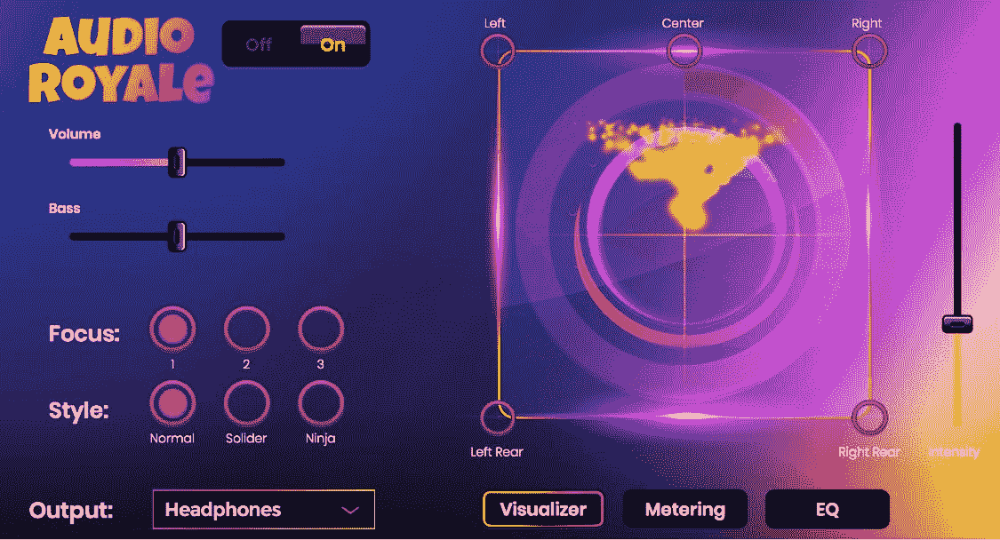

# 皇家音响会成为堡垒之夜的下一个优势吗？

> 原文：<https://medium.com/hackernoon/could-audio-royale-be-the-next-advantage-in-fortnite-fb010252882b>

“皇家战役”游戏堡垒之夜被描述为游戏历史上最杰出和意想不到的成功。[商业内幕](https://www.businessinsider.com/how-many-people-play-fortnite-2018-11?IR=T)报道称，堡垒之夜有近 2.5 亿玩家，超过美国人口的三分之二。开发商 Epic Games 的估值已经上升到了[150 亿美元。](https://www.smh.com.au/business/companies/it-s-an-epic-deal-fortnite-maker-scores-1-76-billion-from-investors-20181027-p50car.html)

人们被堡垒之夜吸引是因为他们不用付钱就能玩游戏。它很容易理解，有丰富多彩的人物，栩栩如生的武器，和如画的场景。人们在哪里找到如何玩？YouTube 声明,堡垒之夜打破了某场比赛单月上传视频最多的记录。

但是一旦你看了你的那份视频，你就会有更多的欲望。任何希望在竞争中获得优势的人都可以探索个性化他们的游戏音频，以适应他们的游戏风格。事实上，音频可以成为从 noob 到 pro 的任何级别玩家的秘密武器。

**堡垒之夜鲜为人知的秘密**

脚步声、枪声——尤其是猎枪声，这些声音活动将堡垒之夜与其他基于 PC 的 RPG 游戏区分开来。对于玩家来说，音频是享受整个游戏体验的锦上添花。也就是说，音频是体验的重要部分。如果音频对你来说感觉很好，当然这种体验会转化为你在游戏中的表现。

尽管如此，你可能听说过关于堡垒之夜音频质量的抱怨。你可能不知道的是，在第八季中，游戏开始传输 7.1 环绕声信号，但如果没有一副昂贵的耳机，大多数玩家将永远不会体验到游戏的真正 3D 声音。那么，您如何利用这一特性，而不花大价钱买一副耳机呢——这可能要花 2000 到 3000 美元呢？

**皇家音响在堡垒之夜的地位**

幸运的是，一家名为 HEAR360 的公司发明了 Audio Royale——这是世界上第一款专门为堡垒之夜定制的个人电脑声音驱动程序。Audio Royale 处理游戏的声音，通过耳机提供身临其境的音频体验中的 7.1 环绕声。Audio Royale 的一大优势是它提供的深度音频个性化选项。它不仅提供低音增强和降低滑块来调整低音的深度，创造更具戏剧效果的体验，而且该软件还有六种预设，可以以九种不同的方式组合来帮助:

1.增加你的情境意识

2.定位穿墙的脚步声

3.查明枪声的来源。

**界面**

如果你是一个狂热的皇家战役玩家，你会喜欢这种亲身体验和控制角色互动的能力。Audio Royale 有一个易于熟悉的界面，允许用户根据自己的喜好进行调谐和拨号设置。

从可以在 360 中看到玩家周围声音来源的可视化工具，到允许您根据自己的喜好定制游戏声音体验的均衡器。音频接口让您掌控游戏体验。

**皇家音响配有:**

Visualizer:使游戏玩家能够 360 度全方位地看到声音的来源。

计量:实时显示每个环绕声声道的音量。

均衡器:允许游戏玩家定制游戏声音，以激发他们的本能。

有趣的是，在我的电脑上安装了每月 3.99 美元的声音驱动程序后，普通的耳机现在可以像 2400 美元的耳机一样传输音频。如果你一直在攒钱买一副昂贵的耳机，只是为了在堡垒之夜享受声音体验，我建议试用一下 Audio Royale。

**结论**

自 2018 年初以来，我一直是 PC 上活跃的堡垒之夜玩家，至少可以说，这种刺激已经上瘾了。像 one [Audio Royale](http://www.getaudioroyale.com) promises 这样的音频体验将把它带到另一个水平，对于那些花时间拨入自己的个人设置的人来说，这要愉快得多。