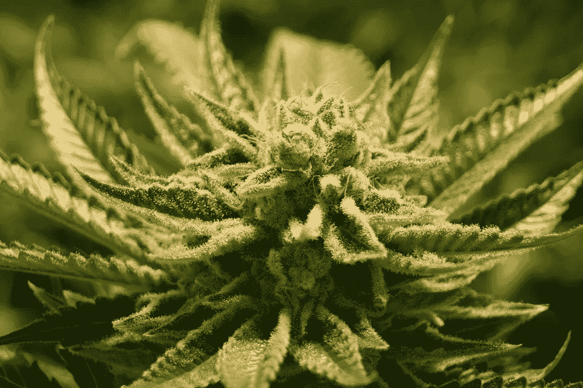

# 大麻私人标签如何成为大麻零售的未来

> 原文：<https://medium.com/hackernoon/could-cannabis-private-labeling-be-the-future-of-weed-retail-da073de2d4bf>

今天早些时候，我看到了一家名为“稳定增长”的公司。他们刚刚筹集了一大笔钱来扩大他们在俄克拉荷马州的商业杂草种植业务。

这让我开始思考。

我发现大麻市场和零售商品市场有很多相似之处。具体来说，Shopify/亚马逊生态系统。

有成千上万的直运商和私人贴标机出售廉价的中国商品。他们从全球速卖通购买商品，然后运行 Shopify/Oberlo 设置。或者，他们将预先包装好的货物集装箱进口到 FBA 仓库。

t 恤怎么样？几块钱就能买到一件质地柔软的棉质衬衫。单纯卖一件 t 恤并不特别。

还有大麻配件？一模一样。Shopify drop shippers 出售大量质量不一的管子、大麻和研磨机。

简单地说，这些是任何人都可以买卖的商品。很难将你的这些知名产品与市场上的其他产品区分开来。你低价买入，以 4:1 或 5:1 的价格加价，然后在脸书做广告来转移客户。

大宗商品受益于规模经济，尤其是在零售环境中。当生产技术和工艺都相对便宜，任何人都可以获得时，这是一场以最低价格和最广泛的消费者覆盖面击败竞争对手的竞赛。除了销售一种生活方式的小众品牌恰好使用所述商品作为代理。

所以，综上所述，我认为大麻可以走同样的路。

因为归根结底，大麻是一种商品。

此外，我预测，在这种现象下，营销策略将决定一家大麻公司的成败。要么控制最低价格，要么建立一个杀手利基品牌。类似于酒精的销售方式。

将会有一部分线下零售存在，以填补市场中的邻近空白。但我认为，大部分销售将在某个细分市场的大型公司和少数酷品牌之间进行。

所以在这种分裂中，我最感兴趣的是网上将会发生什么。具体来说，针对小众品牌的半壁江山。

因为与酒精不同，大麻是一种新生产品，消费者还不知道什么是好什么是坏。

酒精消费者已经广泛接受了不同类型和水平的质量教育。威士忌不同于伏特加。蒂托的比戈登的好多了。诸如此类。

大麻没有那种教育和意识水平。因此，对于数百万愿意购买最能引起他们共鸣的产品的人来说，这是一个成为首选品牌的巨大机会。
数字营销是实现这一增长的完美渠道，因为品牌需要销售能教育购买者的信息。不仅仅是购买者想要的产品。

在这一切之中，供应商有一个潜在的机会来推动这一品牌的增长。供应商喜欢稳定增长，是这家公司引发了这种想法。

品牌生存下来，要么成为大公司的一部分，要么随着变化无常的时代潮流而消亡，但只要供应商的现金流赋予它们生命，它们就能生存下去。

沿着这条线，最成功的供应商可以以更低的价格推出自己的品牌，沿着价值链向下到达最终用户。

在当前的法律环境下，像亚马逊/谷歌/脸书这样的公司不会碰大麻。这是斗志昂扬的初创公司向大公司发起冲击的一个重大机会。

整个数字生态系统有可能支持大麻产业，我们已经看到它在 Weedmaps 等公司中出现。

所以我的问题是。谁会是大麻的速卖通？谁会是奥博洛？谁将成为 Shopify？谁会成为条纹？因为在这些业务的交汇点是未来十年大麻的整个利基品牌市场。

*最初发表于*[*【AndrewIshimaru.com】*](https://andrewishimaru.com/could-cannabis-private-labeling-be-the-future-of-weed-retail/)*。*