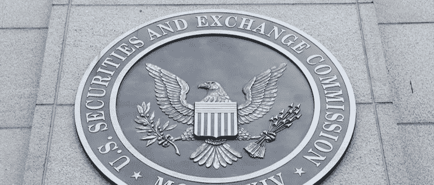
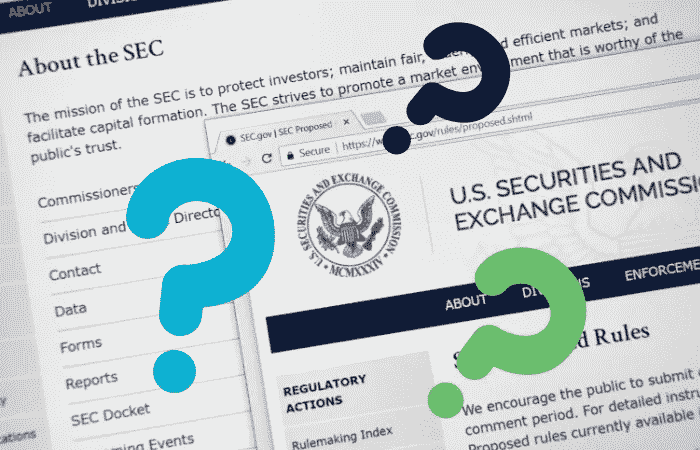
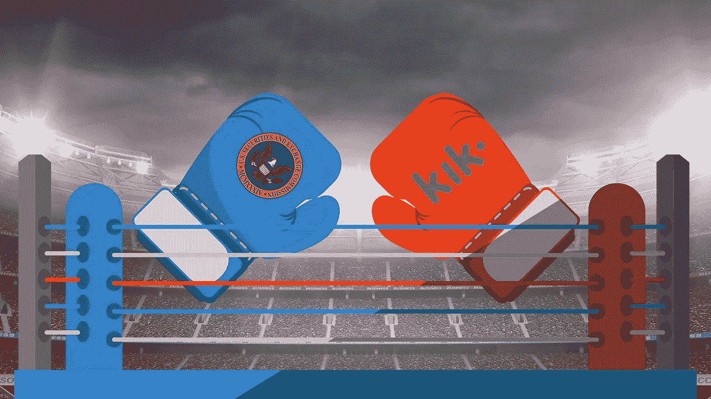

# Kik 真的能打败 SEC 吗？

> 原文：<https://medium.com/hackernoon/could-kik-actually-beat-the-sec-4599fe10853c>

## 我们将会看到一场对密码法来说具有突破性的战斗。广受欢迎的消息应用 Kik 和美国证券交易委员会(SEC)即将展开正面交锋。SEC vs Kik。

许多法律和密码专家已经加入进来。到目前为止，看起来筹码都在 SEC 手里。但是他们可能忽略了一些关键的考虑因素。

基于这个原因，我会密切关注此案的进展。SEC 对 Kik 的裁决将产生深远的影响。如果 Kik 获胜，它可能会导致 SEC 对加密项目的态度发生重大转变。

随着事态的发展，内部人士可以继续在这里查看。我会更新这篇文章，以反映案件的进展。如果你有任何意见或问题，不要犹豫，请在下面留下，我会直接回复。

# 为什么 SEC vs Kik 这么重要的案子？

就其本身而言，得知 SEC 正在追查另一个未注册的 ICO 并不是什么大事。事实上，这将符合美国证券交易委员会在过去一年中一直奉行的策略。

但是这个案子不一样。这是第一次一个重大项目与美国证券交易委员会正面交锋，实际上有获胜的机会。

正如你所想象的，这可能对更广泛的加密社区产生重大影响。

实际案例是 SEC 针对 Kik 及其“同族”加密货币的结果。SEC 将 Kin 标记为证券，将其置于 SEC 的视线之内。

当其他项目在美国证券交易委员会敲门后停止运营时，Kik 正在全力以赴。在 10 亿美元估值的支持下，Kik 决定聘请律师。

Kik 的首席执行官以引人注目的方式宣布了该项目的意图。

Kik 的创始人兼首席执行官泰德·利文斯顿由福布斯&盖蒂图片社提供

Kik 和 Kin 的创始人兼首席执行官 Ted Livingston 公开宣布了他的意图。看起来 Ted 和 Kik 团队的其他成员正在执行一项任务，[承诺以一切可能的方式对抗 SEC。](https://www.forbes.com/sites/michaeldelcastillo/2019/06/04/sec-sues-social-network-kin-for-100-million-unregistered-ico/#61c389b14ec0)

该公司随后加倍努力，发表了其对美国证券交易委员会“威尔斯通知”的[回应。这封 32 页的信提供了深入的、无可争议的令人信服的论点。它清楚地驳斥了为什么 Kin 没有通过臭名昭著的含义，即根据 Kik 的律师，Kin 不能被归类为一种证券。](http://kinecosystem.org/wells_response.pdf)

现在，我们才刚刚开始这个案子。谁也说不准事情会如何发展。

# SEC vs Kik 的利害关系是什么？

让我们清楚这场诉讼对 crypto 意味着什么。如果 Kik 赢了，整个游戏将会改变。与去年的方向相反，未注册的 ico 如果符合某些标准，就可以被视为合法。

这也将是对 SEC 势头的重大打击。作为第一个支持加密项目的裁决，Kik 无疑会给其他项目带来信心。这可能会鼓励其他项目采取类似的立场，反对美国证券交易委员会的监管。

这也可能导致 SEC 处理项目的方式发生转变。也许这是一厢情愿的想法。但是一个更加虔诚的监管环境对整个加密技术的未来是积极的。

# Kik 为什么不一样？

如上所述，到目前为止，美国证券交易委员会一直针对不太成熟的项目。这些较小的项目太小，无法独立完成。但是 Kik 有财力也有反击的意愿。

与较小的项目不同，Kik 可以负担得起强大的法律顾问。这正是它所组装的。它聘请了不止一家，而是两家世界顶级律师事务所来代表公司。其中包括库利有限责任公司和柯克兰&埃利斯 LLP 公司。

Kik 已经准备好花费数百万美元来打这场官司，但钱并不是它武器库中唯一的武器。

这些不是一家预计会失败的公司的行为。当然，这也不是一家公司不经认真斗争就能轻易翻身的行为。

一些对 Kik 有利的事情？众所周知，美国证券交易委员会在涉及大公司时会放宽规定，即使是在加密领域。

虽然 SEC 没有发布官方声明，但我们可以有把握地假设，是政治原因导致 SEC 决定不关闭以太坊。

显然，如果你足够大，你可以得到特殊待遇。

表面上，SEC 对 Kik 采取了类似的做法，因为它只选择了民事诉讼，似乎是在避免刑事案件。

如果是与一家较小的公司打交道，SEC 最有可能同时处理这两个因素。但这里的情况并非如此。相反，SEC 似乎不愿逮捕这家市值十亿美元的公司的首席执行官。鉴于他迄今表现出的坚韧，这可能是一个明智的决定。

# SEC 行动的背景:Kik 只是战争道路上的下一个目标

正如我在以前的文章中所说，我认为大多数为 SEC 工作的人都是好人。我怀疑他们真的想让社会变得更好。

在我担任公司律师期间，我见过许多 SEC 的律师。他们都很聪明，有能力，关心如何把事情做好。

不用说，到目前为止，我还没有同意美国证券交易委员会对加密监管的方法。但我确实理解它面临的困难局面。

SEC 希望保护投资者，我完全理解这种愿望。但是，SEC 仍然希望鼓励有效的市场和资本形成。说这是一个艰难的平衡行为是一种保守的说法。

不幸的是，SEC 并没有很好地平衡。它的行动表明，它几乎完全是在试图保护投资者。或者，我应该说它对保护投资者的解释。

事实上，SEC 对两家未注册 ico——air fox 和 Paragon 采取的行动为其他 ico 提供了一个路线图，让它们遵循合规之路。

1.  支付罚金
2.  在证券交易委员会注册
3.  向证券交易委员会提交季度和年度报告
4.  赋予其投资者解约权

但这些要求只适用于你通过未注册的 ICO 筹集资金的情况。尽管 SEC 认为 Kik 通过一个未注册的 ICO 筹集了资金，但 Kik 提出了一个全面的论据，证明它没有。

# SEC 为什么要这么做？

一般来说，一旦 SEC 认为代币发行是证券发行，公司有两种选择:

选项 1:它可以与决策抗争，并在此过程中破产。

现在，正如我们上面讨论的，Kik 不是一般的加密公司。它为所有加密公司举起了战争的旗帜——这就是这个案件的结果有多重要。这可能会改变 SEC 对未来加密项目的态度。

# 美国证券交易委员会什么时候开始对加密宣战的？

然后在 2018 年底，SEC 迫使我改变了对其加密监管方法的看法。这时候，该机构明确表示，它不能平衡其相互冲突的任务。

从那以后，我对 SEC 有效监管 crypto 的能力非常悲观。因为事实证明，不扼杀创新就无法做到这一点。

在那之后的几个月里，我们已经看到了一些备受瞩目的项目受到了 SEC 的攻击。其中最突出的是 Basis stablecoin 项目。与 Kik 不同，Basis 的领导层选择了走开。

在其主页上发布的一封公开信中，Basis 的领导层接受了其总法律顾问的结论，即该项目的补充债券和股票将不可避免地被 SEC 归类为证券。

这当然会使它们受制于美国证券交易委员会对注册和合规的苛刻要求。遵守 SEC 要求的成本会是一笔巨款，而且也会严重影响项目的活动。

作为未注册证券，核心团队必须采取措施，确保债券和股票令牌只提供给“合格投资者”。这将意味着创建一个可接受投资者的“集中白名单”，并监控每笔交易，以确保其符合 SEC 的规范。

Basis 并不是因为财务或管理不善而关闭的。严格的监管限制将 80 年的判例法应用于一个新的技术系统，迫使该公司破产。

尽管美国证券交易委员会(SEC)声称，为了保护投资者，它对陈旧规则的应用是必要的，但显而易见，过度保护往往弊大于利。Basis 的投资者是经验丰富的风险投资人，他们了解稳定的货币，并希望将资金投入到项目中，但他们最终被剥夺了机会。

当然，你必须向下滚动经过通知，说明它关闭，由于负担过重的规定。

毫无疑问，我完全支持 SEC 关于关闭欺诈活动和骗局的规定。这种程度的监管有助于该行业合法化，同时为机构资本提供了一个入口。但是，当它惩罚公司的创新和为市场带来急需的解决方案时，我就划清了界限。

SEC 对加密监管的做法让合法的企业家和风险投资者感到紧张，因为没有人希望在 SEC 的调查中成为错误的一方。但这种担心要么导致他们不敢启动新项目，要么导致他们搬到其他司法管辖区去创业。不管怎样，结果都是严重扼杀美国的创新。

幸运的是，Kik 的领导层勇于接受挑战，为整个行业而战。与 Basis 和其他项目不同，这可能是该行业一直在等待的情况。

# Kik 是否进行了未注册的 ICO？

关于 Kik 是否表演了未注册的 ICO，网上有很多评论。但在这一点上，很难说裁决会朝哪个方向落。

毕竟，如果 SEC 认为自己没有胜算，它就不会如此强烈地追究此案。但另一方面，打这场官司也不是一个小决定。

Kik 已经花了 500 万美元与 SEC 谈判，而这仅仅是个开始。

# 抛开经济学不谈，真正的问题是:谁会赢得这场官司？

根据我目前对该案的评估，我认为证交会将在本案中败诉。考虑到这一点，我真的很惊讶 SEC 会继续追查此案，因为如果它败诉，这对监管者来说是一个很大的风险。

如果证交会真的胜诉，那就意味着这个系统被严重操纵，对证交会有利。不是危言耸听，但是没有一个项目能够战胜他们。这是个可怕的想法。对于 crypto 的未来，我希望 Kik 得到一个公平公开的审判，这样它就能赢，我认为它应该赢。

不过，还有一点需要考虑。这就是本案中的情感。Kik 对 SEC 的回应无异于挑衅。这似乎并没有得到监管机构的认可。

我对这种情况的理解是，证交会很尴尬。Kik 对油井通知的积极回应迫使 SEC 采取行动。事实上，如果它想挽回面子，它别无选择。如果美国证券交易委员会做出让步，它会显得软弱无力。在一个新兴的行业，至少在监管者看来，这是他们负担不起的。

# SEC 和 Kik 现在处于什么位置？

SEC 已经正式起诉 Kik。这是一个重要的里程碑。这意味着监管机构已经结束了调查。甚至在研究了 Kik 清晰的回应后，监管者决定继续前进。

在我看来，我认为这是 SEC 的一个错误。但正如我所说，它有一些非常聪明和能干的人在那里工作。很明显，它相信它有一个好的案例，否则它不会前进。

或者，SEC 可能会采取不同的策略，迫使 Kik 屈服。在这一点上，美国证券交易委员会正准备对 Kik 进行惩罚。它想为随后的未来加密项目设定期望。

考虑到这一点，它将会耗尽 Kik 的资源。如果它不能彻底获胜，它将使该项目不再可行，并迫使和解。这就是“无辜直到破产”的策略。

也就是说，SEC 不太关心让 Kik 提交的手段，只要它提交了。不管是哪种结果，和解还是有利的裁决，都将是 SEC 的胜利。如上所述，Kik 已经在这个案子上花费了 500 万美元，而且还会花更多的钱来打这场官司。

# SEC vs Kik 会有怎样的结局？

不管案件的结果如何，对 Kik 来说，辩护将会是昂贵且分散注意力的。这无疑会对创始人和项目产生影响。

我们仍处于案件的早期阶段。因此，在我们能够说这将如何长期影响 Kik 之前，还有许多里程碑要走。从短期来看，我们可以预计他们将处于完全防御状态。

从这里，我们可以期待 SEC 提交诉讼文件，指控 Kik 违反了证券法。Kik 随后将对这些指控做出回应，解释为什么这不是真的。这将是我们第一次看到双方的全部情况，届时我们将能够更好地评估这一情况。

在 SEC 提出指控、Kik 做出回应后，双方将进入“发现”阶段。此时，SEC 和 Kik 的代表将开始请求信息、传票、文件、摘要、回应和驳回案件的判决的过程。

整个过程可能需要数年时间才能解决。当这项工作完成并尘埃落定时，这将是密码项目监管清晰化的重要一步。

# SEC vs Kik 对于新的加密项目意味着什么？

在这一点上，我们不知道 SEC 和 Kik 的结果会是什么。虽然我对 Kik 获胜抱有希望，但我不想完全低估 SEC 的坚韧。考虑到这一点，任何新项目都应该密切关注这个案例的发展。

我之前提到过，要帮助你的加密项目成功，你需要的不仅仅是有才华的工程师和营销人员。鉴于监管的不确定性，你需要可操作的法律建议来指导你。

Kik 的总法律顾问似乎很有能力处理 SEC 的投诉，但即便如此，Kik 还是聘请了两家全球顶尖的律师事务所代表它。

经验丰富的法律专业人士提供的指导，不仅在你与美国证券交易委员会正面交锋时至关重要。从签署合同到建立商标，项目的一切都应该依靠法律顾问。这在处理合规和许可等具体问题时尤为重要。

也就是说，不管你有没有总法律顾问，对你将面临的法律问题有一个基本的了解是很重要的。这些知识将帮助你做好准备，找到最好的团队，让你的项目走向成功。

# SEC vs Kik 对密码法律内部人士意味着什么？

美国证券交易委员会最终决定与一个有能力的竞争对手正面交锋，这个竞争对手有很强的实力和财力。

SEC 和 Kik 的案子关系重大，这个案子的重要性不可低估。无论结果如何，各地加密项目的监管弧都将受到影响。

不仅如此，获胜的 Kik 还可能标志着 SEC 对整个加密项目的态度发生了转变。换句话说，这将开创一个重要的法律先例，成为美国加密监管的转折点。

但如果证交会胜诉，这将证明，即便是装备精良、证据确凿的公司，也无法成功保护自己免受证交会的影响。这显然回避了问题，小家伙有什么机会？

我们还不知道这将如何发展。但我会密切关注此案，确保我们了解每一个进展。

*最初发表于*[*【https://cryptolawinsider.com】*](https://cryptolawinsider.com/sec-vs-kik/)*。*