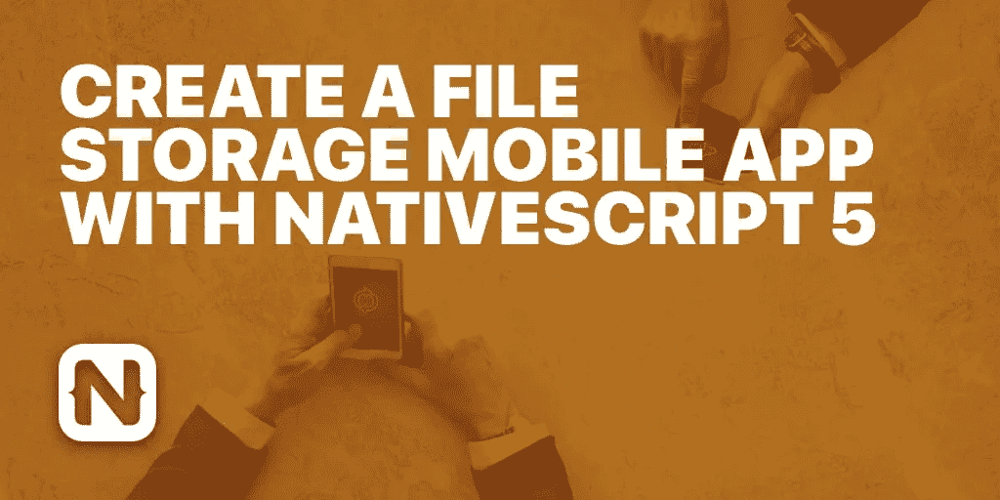

# 如何使用 NativeScript 5 创建文件存储移动应用程序

> 原文：<https://medium.com/hackernoon/create-a-file-storage-mobile-app-with-nativescript-5-f14ee3be5bd0>

[](https://blog.jscrambler.com/create-a-file-storage-mobile-app-with-nativescript-5/?utm_source=medium.com&utm_medium=referral)

在我们之前的【NativeScript 文章中，我们预览了这个框架。对于本文，让我们创建一个小的演示项目。首先，让我们为演示设置一个场景。

SimpleFileTransfer 是一个虚拟文件锁。用户可以注册该服务，并获得 100 MB 的免费虚拟存储空间。然后用户可以在服务器上下载和上传文件。用户可以通过填写表格来增加存储空间。

在继续之前，让我们记下应用程序的功能:

*   注册:用户可以注册应用程序。
*   登录:验证用户。
*   详细信息页面:提供用户详细信息，如当前配额和总空间。此外，我们可以显示文件列表。
*   下载文件:将文件从服务器下载到设备。
*   上传文件:将文件从设备上传到服务器。
*   增加配额:将用户的存储配额增加指定的量。

你可以在 [GitHub](https://github.com/JscramblerBlog/SimpleFileTransfer) 上找到完整的代码。

# 构建后端

后端必须提供管理路由、提供基本身份验证和存储以及促进文件传输的功能。

基于上述要求，我们将使用以下堆栈:

*   节点:服务器
*   [快递](https://expressjs.com/):中间件
*   顺序化 : ORM 中间件
*   SQLite:数据库

我们还将使用像 [multer](https://github.com/expressjs/multer) 和 [bcrypt](https://github.com/kelektiv/node.bcrypt.js/) 这样的库来实现特定的功能，这些将在后面解释。

# 正在初始化后端项目

我们将使用 express-generator 来设置项目。使用以下命令全局安装`express-generator`:

```
npm install express-generator -g
```

使用以下命令启动一个新项目:

```
express file-server
```

导航到`file-server`目录并使用`npm install`安装依赖项。此外，安装以下依赖项:

```
npm install multer async sequelize sqlite3 body-parser bcrypt --save
```

此外，我们将为以下内容创建一些额外的文件夹:

*   数据库:存储 SQLite 数据库和数据库脚本。
*   模型:存储模型。
*   上传:临时存储上传的文件。
*   存储:为特定用户存储文件。

# 从序列开始

[Sequelize](http://docs.sequelizejs.com/) 是一个用于 SQLite、MySQL、PostgreSQL 和 MSSQL 的 ORM 中间件。对于小型项目，使用 Sequelize + SQLite 组合很方便。

在我们当前的场景中，我们只需要一个模型。我们将模型用户定义如下:

```
const User = sequelize.define('user', {
   uid: { type: Sequelize.INTEGER, primaryKey: true, autoIncrement: true },
       username:  { type: Sequelize.STRING, unique: true },
       password: Sequelize.STRING,
       quota: {type: Sequelize.INTEGER, defaultValue: 104857600},
       createdAt: Sequelize.DATE,
       updatedAt: Sequelize.DATE,
})
```

我们可以使用 Sequelize 的`Model.sync`来初始化数据库中的模型表。为了初始化 users 表，我们将使用下面的代码。

```
User.sync({force: true}).then(() => {
        // Table created
});
```

我们将用户模型存储在模型文件夹的`user.js`文件中。

这部分很简单。对于注册，服务器接受用户名和密码，并将其存储在数据库中。我们将使用 bcrypt 库来加盐密码。如下所示，在将密码存储到数据库之前，我们对其进行了 10 次加盐处理。我们使用 Sequelize 的`Model.create`来存储值。一旦用户被创建，我们将在我们的服务器上为他的上传创建一个目录。

代码如下:

```
router.post('/', function(req, res, next) {
       console.log(req);
       bcrypt.hash(req.body.password, 10, function(err, hash) {
         User
         .create({ username: req.body.username, password: hash })
         .then(user => {    
         if (!fs.existsSync('storage/'+user.get('uid'))){
         fs.mkdirSync('storage/'+user.get('uid'));
         } 
           res.send({status: true, msg: 'User created', uid: user.get('uid')});
         }).catch(err => {
           res.send({status: false, msg: err });
         })
       });
     });
```

对于登录，服务器接受用户名和密码，并根据数据库进行验证。我们使用`Model.findAll`来获取数据库记录。我们用`bcrypt.compare`来比较密码。

```
router.post('/', function(req, res, next) {
     console.log(req);
     User.findAll({
       attributes: ["username", "password"],
       where: {
         username: req.body.username
       }
     }).then(dbQ => {    
         if(dbQ.length > 0) {
           bcrypt.compare(req.body.password, dbQ[0].dataValues.password, function(err, result) {
             if (result == true){
               res.send({status: true, msg: 'Login Success'});
             } else {
               res.send({status: false, msg: 'Incorrect Password'});
             }            
         });
       } else {
         res.send({status: false, msg: 'User not found'});
       }         
     });
});
```

# 定义用户路线

经过身份验证的用户可以执行以下功能:

*   上传文件
*   下载文件
*   获取详细信息
*   增加配额

让我们定义这些功能的路线:

*   上传:`POST /users/:id/upload`
*   下载:`GET /users/:id/download/:filename`
*   详情:`GET /users/:id/details`
*   增加额度:`POST /users/:id/increasequota`

# 将文件上传到服务器

我们将使用 [multer](https://www.npmjs.com/package/multer) 来处理上传。

multer 库对于处理多部分表单数据非常有用。最初，我们会将文件上传到上传文件夹。然后，文件将被移动到`/storage/uid`文件夹，其中 uid 是用户 id。

```
var storage = multer.diskStorage({
     destination: function (req, file, cb) {
       cb(null, 'uploads/')
     },
     filename: function (req, file, cb) {
       cb(null, file.originalname )
     }
   });

   router.post('/:id/upload', upload.single('fileparam'), function(req, res, next) {
     if (!req.file) {
       console.log("No file received");
       return res.send({
         success: false,
         msg: "Error Uploading files"
       });
     } else {
       console.log('file received');
       fs.rename('uploads/'+ req.file.originalname, 'storage/'+req.params.id+'/'+req.file.originalname, function (err) {
           if (err) {
                console.log(err);
               return;
           }  
           return res.send({
             success: true,
             msg: "File Uploaded"
           })   
       });   
     }
});
```

`upload.single`方法用于处理上传。此路由在 URL 调用中需要一个名为`fileparam`的文件。这可以通过在 HTML 表单中添加 name 属性来快速完成。我们将需要名称属性应用程序端。

# 下载路线

ExpressJS 为我们提供了一个设置下载路径的功能，方便称为下载。

这是我们遵循的逻辑:

*   用户登录应用程序。
*   他选择了一个文件并开始下载。
*   服务器收到一个带有用户标识和文件名的请求。
*   服务器将文件发回给用户。

该路线的代码如下

```
router.get('/:id/download/:filename', function(req, res, next) {
         const file = 'storage/'+req.params.id + '/' + req.params.filename;
         res.download(file);
});
```

# 增加用户配额路线

我们将调用`Model.update`来调整配额。默认情况下，我们为每个用户分配了 104857600 字节，相当于 100 MB。您可以在下面找到查询。

```
router.post('/:id/increasequota', function(req, res, next) {
     User.update({
       quota: req.body.quota,
     }, {
       where: {
         uid: req.params.id        
       }
     }).then(response => {
       res.send({status: true, msg: "Quota Increased"});
     }).catch(err => {
       res.send({status: false, msg: err});
     }); 
   });
```

# 用户详细信息路线

这是我们将用于获取多个数据的路线，例如:

*   用户的存储限制:从数据库中，
*   当前占用的文件空间:从`/storage/userid`目录，
*   剩余空间:只有点 1 —点 2，
*   文件列表:文件列表，

我们可以使用`Model.findAll`获取用户的存储限制。为了获取文件名和存储空间，我们使用了`fs .readdir`、`fs.stat`和`async`。

```
function getStorageSpace(relpath) {
     let space = 0;
     let fileNames = [];
     let promise = new Promise(function (resolve, reject) {
       fs.readdir(relpath, function (err, items) {
         if (err){
           reject(err);
         }
         fileNames = items;
         let filesArr = items.map(function (val) {
           return relpath + '/' + val;
         });
         async.map(filesArr, fs.stat, function (err, results) {

           for (let i = 0; i < results.length; i++) {
             if (err) {
               reject(err);
             }
             space = space + results[i].size;
           }
           resolve({fileNames: fileNames, space: space });
         });
       });
     });
     return promise;
   }

   function getStorageLimit(uid){
     let promise = new Promise(function (resolve, reject) {
       User.findAll({
         attributes: ["quota"],
         where: {
           uid: uid
         }
       }).then(dbQ => {

         if(dbQ.length < 1) {
           reject("Quota Not Found")
         } else {
           resolve(dbQ[0].dataValues.quota);
         }     
       }).catch(err => {
         reject(err);
       });
     });
     return promise; 
   }router.get('/:id/details', function(req, res, next) {
     let it;
     let relpath = 'storage/'+req.params.id;
     Promise.all([getStorageSpace(relpath), getStorageLimit(req.params.id)]).then(result => {

       res.send({storageLimit: result[1], occupiedSpace: result[0].space, fileNames: result[0].fileNames, remainingSpace: result[1]- result[0].space});
     })
});
```

**注意:**代码工作的前提是不允许用户在其文件夹中创建子目录。

实施存储限制的代码将在本文后面讨论。

# NativeScript 应用程序

对于应用程序方面，我们将采取另一种方法。一个基于角空白模板的演示项目将与用户共享。这篇文章的很大一部分将会详细介绍插件的功能。

# 消费 Web 服务

我们正在为登录/注册/用户详细信息页面使用来自简单 web 服务的数据。

正如在[上一篇文章](https://blog.jscrambler.com/introduction-to-nativescript/)中提到的，我们可以使用 [HttpClient 模块](https://docs.nativescript.org/angular/ng-framework-modules/http)来访问这些 web 服务。基本步骤如下:

*   在页面模块中导入`NativeScriptHttpClientModule`。
*   在组件或提供者中导入`HttpClient`和`HttpHeaders`。
*   像在 Angular 应用程序中一样使用 URL。
*   我们将把`Content-Type`标题设置为`application/json`。

对于 JavaScript/TypeScript 模板，我们可以使用 NativeScript 核心 [http](https://docs.nativescript.org/angular/ng-framework-modules/http#http) 模块。`http. getJson`函数提供了消费 web 服务所需的框架。或者，我们也可以使用[获取](https://docs.nativescript.org/ns-framework-modules/fetch)模块。

作为来自服务器的响应，我们将接收用户的`uid`。认证之后，我们需要存储`uid`，这样我们就可以允许移动用户访问`/users/uid route`。

# 存储数据

NativeScript 框架没有任何持久存储数据的方法。我们可以使用插件来添加这些功能。我们将会看到其中的两个插件。

*   [nativescript-sqlite](https://www.npmjs.com/package/nativescript-sqlite) :这个插件为 sqlite 库提供了一个接口。如果您的应用程序需要存储大量记录，这种方法非常有效。安装时使用:

```
tns plugin add nativescript-sqlite
```

*   [nativescript-local storage](https://www.npmjs.com/package/nativescript-localstorage):这个插件为字符串数据提供了一个键值 API，类似于`window.localstorage`。如果你的应用程序没有太多记录，这很有用。安装时使用:

```
tns plugin add nativescript-localstorage
```

演示应用程序将使用`nativescript-localstorage`。

# 将文件从设备上传到服务器

让我们将这个功能分解成子任务:

1.  从设备中选择文件。
2.  获取文件路径。
3.  通过上传网络服务上传文件。

为了选择一个文件并获得文件路径，我们将使用`nativescript-mediapicker`插件。该插件有多种模式，我们可以为特定的使用情况定制它。你可以在这里查看插件文档[。](https://github.com/jibon57/nativescript-mediafilepicker)

要选择一个文件，首先，我们需要定义扩展名。这对于两个操作系统是不同的。

对于 Android 设备，我们必须使用基于 mime 类型的文件扩展名，如 iOS 设备的`let extensions = ["xlsx", "xls", "doc", "docx", "ppt", "pptx", "pdf", "txt", "png"]`
，我们必须从统一类型标识符列表中定义扩展名:`let extensions = [kUTTypePDF, kUTTypeText];`

你可以在这里和这里阅读更多关于 UTIs [的内容。](https://developer.apple.com/documentation/mobilecoreservices/uttype)

调用`filepicker`的代码如下:

```
let options: FilePickerOptions = {
       android: {
           extensions: extensions,
           maxNumberFiles: 1
       },
       ios: {
           extensions: extensions,
           multipleSelection: false
       }
   };

   let mediafilepicker = new Mediafilepicker();
   mediafilepicker.openFilePicker(options);

   `mediafilepicker.on("getFiles", function (res) {
       let results = res.object.get('results');
       console.dir(results);
   });

   mediafilepicker.on("error", function (res) {
       let msg = res.object.get('msg');
       console.log(msg);
   });

   mediafilepicker.on("cancel", function (res) {
       let msg = res.object.get('msg');
       console.log(msg);
   });`
```

如上所述，我们将在`getFiles`事件中接收一个文件的文件路径。

我们将使用`nativescript-background-http`插件将文件发送到服务器。你可以在这里阅读插件。

前面我们定义了`/users/:id/upload`路线。如前所述，我们的服务器期待名为`fileparam`的属性中的文件。

后台`http`为我们提供了两个功能:`uploadFile`和`multipartUpload`。因为我们需要设置 name 属性，所以我们将使用`multiPartUpload`函数。

```
let session = bgHttp.session("image-upload");
    let request: bgHttp.Request = {
        url: Config.apiUrl  + '/users/' + localStorage.getItem('uid') + '/upload'   ,
        method: "POST",
        headers: {
            "Content-Type": "multipart/form-data"
        },
        description: 'FileName'
    };
    let params = [{
        name: 'file',
        filename: path
    }];
    let task: bgHttp.Task = session.multipartUpload(params, request);
    task.on("error", (e) => {
        reject(e);
    });
    task.on("complete", (e) => {
        resolve(e);
});
```

# 将文件下载到设备

我们将使用核心的[文件系统](https://docs.nativescript.org/ns-framework-modules/file-system)、[平台](https://docs.nativescript.org/ns-framework-modules/platform)和[实用程序](https://docs.nativescript.org/core-concepts/utils)模块来实现这个结果。Android 和 iOS 处理下载的方式都不一样。我们将使用来自平台模块的`isAndroid`和`isIOS`变量来分离代码。

文件系统模块为我们提供了一个`knownFolders`子模块。Android 和 iOS 都有三个预定义的文件夹可用:

*   `knownFolders.currentApp()`
*   `knownFolders.documents()`
*   `knownFolders.temp()`

另外， [iOS 子模块](https://docs.nativescript.org/api-reference/modules/_file_system_.knownfolders.ios)为我们提供了一些其他预定义的文件夹。例如:

*   `knownFolders.ios.download`
*   `knownFolders.ios.sharedPublic`

## iOS 代码

在 iOS 场景中，这很简单:

*   显示服务器文件列表。
*   将文件下载到 documents 文件夹。
*   在单独的视图中列出下载的文件
*   使用`utils.openFile`功能打开文件。

为了下载文件，我们将使用 NativeScript 框架的 [http](https://docs.nativescript.org/ns-framework-modules/http) 模块。`getFile`功能可用于从服务器获取文件，并将其保存到特定的文件位置。iOS 的代码片段如下:

```
let filePath: string = path.join(knownFolders.documents().path, fileName);
           getFile(download_url + fileName, filePath).then((resultFile) => {
                   // The returned result will be File object
   }, (e) => {
       console.log(e);
```

文件下载完成后，我们可以使用`utils`模块中的`openFile`功能在 iOS 上打开文件。

## Android 代码

Android 方面的编码有点棘手。`knownFolders`模块的位置如下。

*   当前文件夹:`/data/data/:appid/files/app`
*   文件:`/data/user/:androiduser/:appid/files`
*   温度:`/data/user/:androiduser/:appid/cache`

如您所见，所有文件夹都位于`/data`中。`/data`普通用户无法访问。此外，外部应用程序将无法访问这些文件夹中的文件。此外，安卓系统没有`openFile`功能。

到目前为止，我们能做的就是:

*   显示服务器文件列表。
*   将文件下载到用户可访问的位置。
*   列出该位置中存在的文件。

为了实现该功能，我们将使用一些本机代码。
在继续前进之前，我们必须安装`tns-platform-declarations`和:

```
npm i tns-platform-declarations --save
```

在根文件夹中创建一个`reference.d.ts`文件，并添加以下几行:

```
`/// <reference path="./node_modules/tns-platform-declarations/ios.d.ts" />`
`/// <reference path="./node_modules/tns-platform-declarations/android.d.ts" />`
```

您可以查看[自述文件](https://github.com/NativeScript/NativeScript/tree/master/tns-platform-declarations)了解更多详情。

[Android OS](https://developer.android.com/reference/android/os/Environment) 为我们提供了访问外部存储的功能。

我们将使用常量`DIRECTORY_DOWNLOADS`和函数`getExternalStoragePublicDirectory`来创建一个可公开访问的下载位置。

我们将添加一个路径“SimpleFileTransfer”来创建一个定制的`folderPath`和`filePath`。

```
const androidDownloadsPath = android.os.Environment.getExternalStoragePublicDirectory(android.os.Environment.DIRECTORY_DOWNLOADS).toString();
   const androidFolderPath = fs.path.join(androidDownloadsPath, "SimpleFileTransfer");
   const filePath: string = fs.path.join(androidFolderPath, fileName);
   getFile(download_url + fileName, filePath).then((resultFile) => {
                   // The returned result will be File object
   }, (e) => {
       console.log(e);
```

如果您检查您的文件资源管理器，将在下载文件夹中创建一个名为 SimpleFileTransfer 的新目录。你会在那里找到所有下载的文件。

# 列出下载的文件

我们将使用`file-system`模块。`file-system`模块的 Folder 类有一个 [getEntities](https://docs.nativescript.org/ns-framework-modules/file-system#read) 函数，它允许我们列出文件夹中的文件。与 Node.js 中的`fs.readdir`一样，我们只能列出文件。

对于 iOS，路径是

```
const folderPath: string = fs.knownFolders.documents().path;
```

对于 Android，路径是

```
const androidDownloadsPath  =  android.os.Environment.getExternalStoragePublicDirectory(android.os.Environment.DIRECTORY_DOWNLOADS).toString();`const  folderPath=  fs.path.join(androidDownloadsPath, "SimpleFileTransfer");`
```

为了访问文件夹功能，我们使用

```
let internalFolder = fs.Folder.fromPath(folderPath);
```

然后，我们使用`getEntities`来获取文件列表:

```
internalFolder.getEntities()
               .then((entities) => {
                   // entities is array with the document's files and folders.

                   entities.forEach((entity) => {
                   let  fileSize  =  fs.File.fromPath(entity.path).size;
                       this.listArray.push({
                           name: entity.name,
                           path: entity.path,
                           lastModified: entity.lastModified.toString(),
                           size : fileSize
                       });
                   });                  
               }).catch((err) => {
                   // Failed to obtain folder's contents.
                   console.log(err.stack);
               });
```

此外，我们还使用了 File 类的 size 属性来获取文件大小。

# 强制实施存储限制

可以通过两种方式强制实施存储限制:

*   上传文件到服务器→检查剩余空间→拒绝服务器端上传。
*   使用 webservice 检查剩余空间→检查文件大小→取消 app 端上传。

为了实施前者，我们可以修改上传路径如下:

```
Promise.all([getStorageSpace(relpath), getStorageLimit(req.params.id)]).then(result => {
     if (result[1] - result[0].space > req.file.size){
       fs.rename('uploads/'+ req.file.originalname, 'storage/'+req.params.id+'/'+req.file.originalname, function (err) {
         if (err) {
           return res.send({
             success: false,
             msg: "Error Uploading files"
           });
         }  
         return res.send({
           success: true,
           msg: "File Uploaded"
         })   
     });
     } else {
       return res.send({
         success: false,
         msg: "Storage Limit Exceeded"
       });
     } 
     })
```

为了实施后者，我们获取由`mediafilepicker`插件选择的文件的文件大小，并使用 details webservice 检查它的剩余空间。

```
`let  fileSize  =  fs.File.fromPath(results[0].file).size;`if(fileSize < remainingSpace){
    // Send To server
   }`else {
   // alert user about lack of space
   }
```

# 结束语

这个演示涵盖了相当多不同的概念。

我们将解决方案分为一系列功能。我们为 UX 使用核心 NativeScript，与后端、文件系统管理和路由交互。我们通过安装插件来扩展框架的功能，比如挑选文件。更进一步，我们使用了一些本地代码来解决一个特定的问题。

使用 NativeScript 使我们能够更快地为两个平台开发应用程序，而不是单独开发。

如果您想了解如何保护您的 NativeScript 源代码免受客户端攻击，请注册参加我们即将举办的关于“[保护您的移动应用](https://www.progress.com/campaigns/kinvey/best-practices-for-securing-your-mobile-apps?utm_medium=listings&utm_source=jscrambler&utm_campaign=kinvey-webinar-secureapps)的最佳实践”的免费网络研讨会。也一定要查看我们的[教程](https://blog.jscrambler.com/protecting-your-nativescript-source-code-with-jscrambler/?utm_source=medium.com&utm_medium=referral)。

*原载于*[](https://blog.jscrambler.com/create-a-file-storage-mobile-app-with-nativescript-5/?utm_source=medium.com&utm_medium=referral)**。**