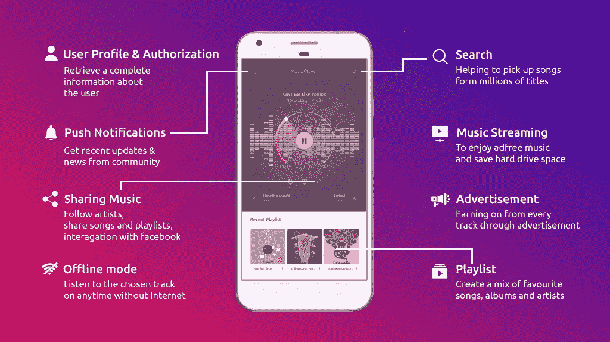
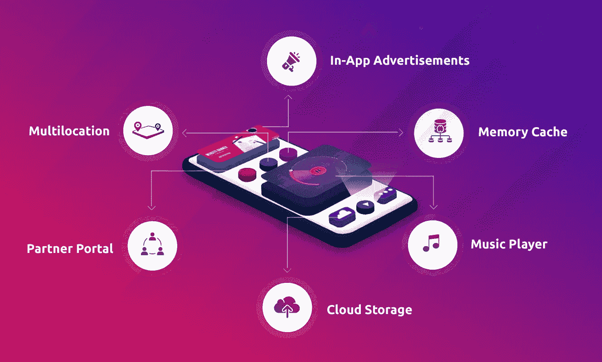

# 创建一个类似 Spotify 的音乐流媒体应用和网站，让你的收入翻倍

> 原文：<https://medium.com/hackernoon/create-a-spotify-like-music-streaming-app-website-that-actually-doubles-your-revenue-c358d4e925de>

*利用完整的技术、功能和盈利模式，像 Spotify 一样构建您自己的音乐流媒体应用/网站，以最大限度地提高您的收入。*

> **截至 2018 季度；作为音乐流媒体应用的领导者，Spotify 仅在美国就拥有 4770 万的月用户数。预计在未来几年，这一数字将在全球范围内持续增长。**

那么一个单一的音乐流媒体平台是如何趾高气扬成为音乐现象的呢？那也是在盗版音乐比以往任何时候都容易获得的时代。答案取决于该公司如何改变音乐爱好者消费音乐的方式。在线流媒体平台为听众提供了单独购买音乐曲目和点播的空间，这与传统的整张专辑 CD 购买平台不同。在线音乐流媒体服务就是这样诞生的。

***那么如何创建自己的数字音乐流媒体应用呢？***

有了这样一个有前途的商业模式，企业家们自然会将他们的兴趣投入到开发音乐流媒体网站&比如他们自己的 Spotify。在今天的环境下，如果一个人希望[创建一个自己的音频流媒体平台](https://blog.contus.com/create-audio-streaming-platform/)，他们一定会遵循 Spotify 创造的一些关键元素。

因此，让我们深入了解让这款音乐流媒体应用登上数字音乐宝座的一些关键因素。

# Spotify——重新定义音乐的平台

Spotify 是一款音乐流媒体应用，不仅拥有庞大的用户数量，还通过全球订户赚取了高达 7000 万美元的收入。Spotify 装饰自己的功能与它的算法非常兼容，它可以在任何给定的时刻在全球范围内提供 1000 首音乐曲目。

**你有没有想过是什么让 Spotify 成为音乐流媒体应用市场的全球统治者？**

> **特点？**

是的，毫无疑问，Spotify 的功能是真正的表演者，在全球范围内提供大量音乐曲目，支持音乐流媒体平台。

# 作为主流音乐流媒体网站/应用程序，它的一些亮点功能起到了推动作用

Spotify like Music Streaming App Features

## 注册和社交登录:

社交登录允许用户通过他们拥有帐户的任何主要社交媒体论坛访问音乐流媒体平台。这通过获取用户在这些论坛中建立的基本信息和喜好来促进个性化。

## 用户资料和授权:

该特性通过自动导出电子邮件地址、姓名和国籍等表单细节，使用户配置文件的授权变得轻而易举。

## 音频流:

[音频流](https://blog.vplayed.com/what-is-audio-streaming/)既原始又先进。这种流媒体模式可以轻松播放最新的大片

## 有效搜索选项卡和组织:

弹性搜索引擎携手个性化平台是一个既定的成功策略。SEO 优化搜索触发基于后端反馈的多个元标签和类型的结果，给出精确的结果。

## 播放列表:

拥有一个个人收藏的曲目列表可以确保用户更频繁地返回。根据用户所属的订阅模式，在线和离线音乐流上都可以拥有这些播放列表。

## 下载:

网络零阻碍零烦恼随时听感兴趣的特定曲目，是永远的成功学。在任何智能设备上下载以实现离线可用性加快了用户速度。

## 广告:

这项功能有多种选择，如前滚动、中滚动和后滚动，以货币化您的音乐流媒体平台。

## 推送通知:

推送通知就像一种磁力效应，用诱人的信息吸引用户，比如艺术家、社区和朋友的最新更新，即使他们没有在应用程序上直播。

## 邀请朋友:

有了这项功能，您可以一边听自己喜欢的歌曲，一边与朋友保持联系。邀请可以通过社交媒体和电子邮件 id 发送。

## 歌曲作者简介:

为艺术家创作传记可以让听众更近距离地接触他们所听的音乐，同时也通过提供品牌知名度来鼓励艺术家。

# 一个令人惊讶的好方法来建立你的音乐流媒体网站

随着对新音乐流媒体应用需求的增加，出现了 1000 多个点播音乐流媒体平台，以满足音乐爱好者的特定需求和不同口味。这反过来又催生了现成的音乐流媒体解决方案，可以构建可定制的应用程序和网站。

介绍 Contus Vplay，这是一种可定制的音频流解决方案，经过十年的市场研究，在音乐流的细节上进行了投资。这种努力脱颖而出，使 Vplay 成为独一无二的产品，使他们构建的产品成为经过认证的成功战略。

# **是什么让 CONTUS VPlay 在铺天盖地的音乐流媒体解决方案市场中脱颖而出？**

[**C**](https://www.contus.com/video-on-demand-solution.php?utm_source=Create%20Music%20Streaming%20App&utm_medium=InContentLink&utm_campaign=Hackernoon) ONTUS VPlay 是一款音乐流媒体解决方案，它配备了先进的技术，如用于流媒体服务器的 PVNS、qts、用于广播音乐曲目的 HLS 和 RTMP 协议、AWS、Minio 和 Azure 存储，或在客户场所定制的服务器，以提供完整的端到端可扩展体验。数据管理工具加快了曲目流的优化速度，并在任何平台上提供最佳版本的音乐。

## 超越技术堆栈的基础:

**内存缓存:**

大多数监听器并不知道内存缓存，在内存缓存中，Contus Vplay 使用系统的特定区域来保存从 web 或附近的类似用户尽快下载的最新数据处理。这种处理可以通过提供无缓冲的完美音乐流能力来增强音乐收听体验。例如，Spotify 的音乐流媒体曲目位于不同的位置，从而最小化流媒体数据库。

> **除了所有这些特点，音乐流媒体应用程序还提供了(Contus Vplay —领先的音乐流媒体服务提供商)的某些功能。**

**内存缓存:**

存储器高速缓存是支持音乐流行业的一种不太为人所知的技术，但也不太重要，它是一种通过算法将流音乐以高速缓存的形式存储在听众的物理设备中的过程。当这些听众请求相同的音轨时，这很方便。缓存从本地设备播放，减少了每次请求从父服务器获取内容的时间。

**云存储:**

上传和存储无限的音频文件在高度安全的存储。托管您的文件，不会出现存储空间不足或音频流不清晰的情况。

**应用内对话:**

沟通是关键。尽管用户可以与同龄人分享图片和文字，但他们更倾向于在应用上花费更多的时间。

**切换仪表板报告:**

放下精心准备的等待。现在，通过 Contus Vplay 精心设计的仪表板，您可以获得关于观众观看历史、参与时间和联系人视图的提醒，该仪表板反映了用户的见解

**可靠的音乐播放器:**

Contus Vplay 采用自己定制的 HLS 播放器，配备自适应比特率技术，以不同的分辨率提供原始的解决方案。该解决方案还可以在任何平台上运行。

**社交分享:**

让您的用户私下或公开地与他们的朋友圈分享他们最喜欢的音乐曲目&查看他们的联系人分享了什么。

**合作伙伴门户:**

和你最喜欢的创作者一起加入俱乐部！Contus Vplay 提供令人瞠目结舌的合作伙伴计划，外部/独立创作者可以在您的[音频流媒体平台](https://www.vplayed.com/audio-streaming-solution.php)上进行流媒体播放。追求双赢

**直播:**

CONTUS VPlay 提供的一个特殊功能，用于跨平台实时广播现场活动、乐队和其他音乐发布活动。

**自有品牌:**

[以您自己的品牌名称建立一个音乐流媒体应用](https://www.vplayed.com/build-music-streaming-app.php)/网站，通过吸引人的个性化可视化(UI/UX)吸引您的全球观众群，以维持有利可图的音乐流媒体业务。

**多地点适应性:**

CONTUS VPlay 提供了一个绝对的主机和服务器的可能性，这意味着在所有国家，你可以在任何地理区域创建你的音乐流媒体服务。

# 货币化模块触发你的收入

**应用内广告:**

在你的应用程序中运行广告，并通过它赚钱。广告可以以视频/图像的形式作为横幅广告，增加你的收入

**保费货币化模式:**

通过广告运营、优惠券/促销、高级订阅等获得最大收益！我们的六步货币化选择为您提供最佳模式来充分利用您的应用。

***那么，最后建立一个音乐流媒体 App/网站要花多少钱呢？***

由于其灵活性，自适应比特率流是媒体流中普遍喜爱的特征。但是，为了向您的用户提供这种灵活性，随着分辨率选项数量的增加，成本也会增加。

因此，简而言之，创建一个像 Spotify 这样的音乐流媒体应用的确切成本取决于平台所有者的需求。

云存储和音乐流媒体授权等因素可能在资金规模上更高，但它们在建立音乐舞台的旅程中是必不可少的。Contus Vplay 根据 prim 的这些要求来满足其客户。

准备好构建自己的 Spotify like 应用程序了吗？[**Contus Vplay**](https://www.contus.com/video-on-demand-solution.php?utm_source=Create%20Music%20Streaming%20App&utm_medium=CTA&utm_campaign=Hackernoon)**经过十年的市场研究，在音乐流媒体的细节方面投入了大量的精力。这一努力脱颖而出，使 Contus Vplay 成为独一无二的产品，使他们构建的产品成为经过认证的成功战略。**联系我们**了解更多信息。**