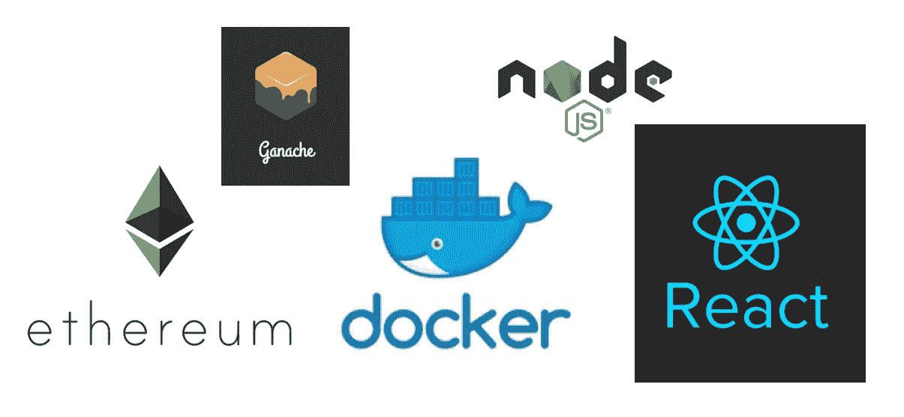
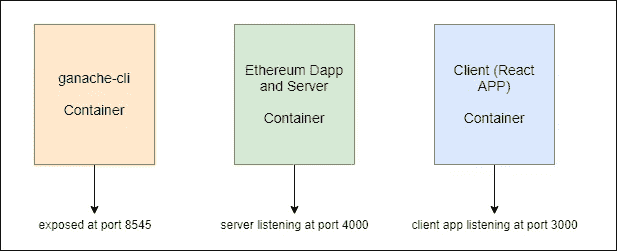
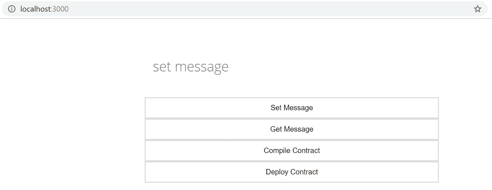
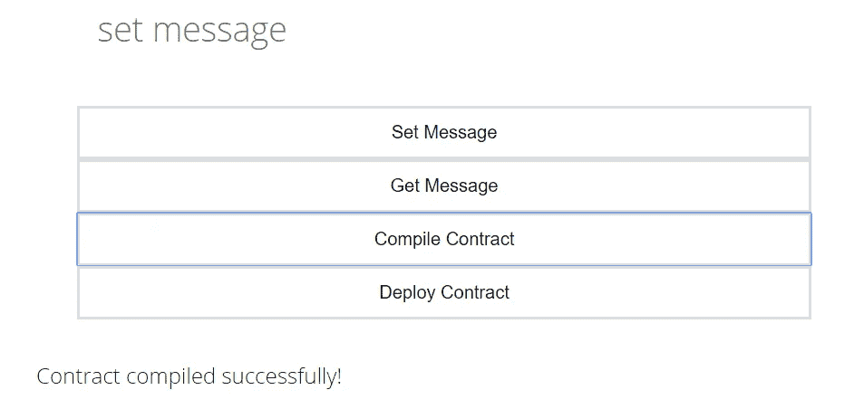
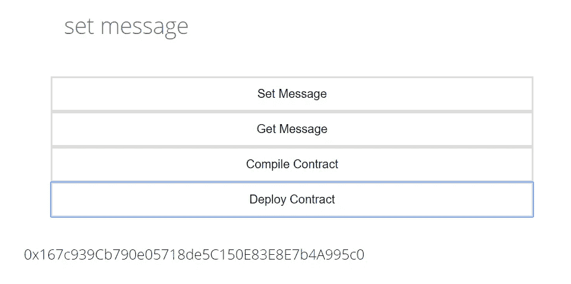
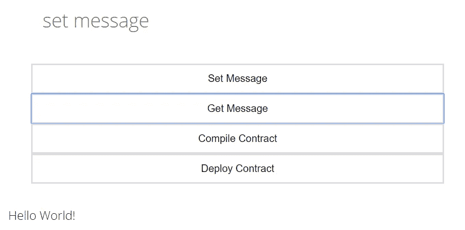
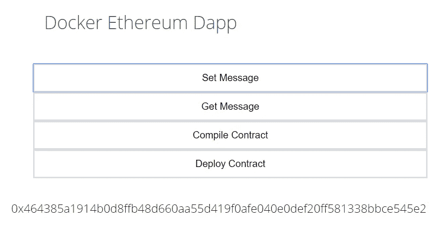
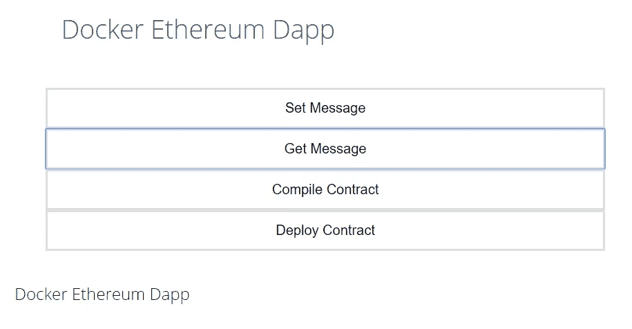

# 用 React 和 Docker 创建一个以太坊 Dapp

> 原文：<https://medium.com/hackernoon/create-an-ethereum-dapp-with-react-and-docker-211223005f17>



Images Google Sources

在本教程中，我们将创建一个以太坊 Dapp，并在一个单独的 docker 容器中运行它的不同组件。

你可以使用这个 [GitHub 链接](https://github.com/schadokar/docker-ethereum.git)来克隆这个项目。

感谢那些文章和课程帮了大忙的人:

[布兰登·莫雷利](https://medium.com/u/e9031892baf5?source=post_page-----211223005f17--------------------------------)负责 HTML 和 CSS ( [建立一个天气网站](https://codeburst.io/build-a-weather-website-in-30-minutes-with-node-js-express-openweather-a317f904897b)

Stephen Grider[参加 Udemy 的](https://medium.com/u/d058882d8cd2?source=post_page-----211223005f17--------------------------------)[以太坊](https://www.udemy.com/share/1000CIAkUTc1xbQng=/)和[码头工人](https://www.udemy.com/share/100r4uAkUTc1xbQng=/)课程。

在开始之前，让我们了解我们将要构建什么，以及我们的 Dapp 的结构将会是什么样子。

在 Dapp 中将有三个模块:

1.  加纳切-cli
2.  以太坊-Dapp 和服务器
3.  客户端(反应应用程序)

上述 3 个模块将在单独的 docker 容器中运行。



D app

> 当所有服务都可以在一个容器中构建时，为什么我们要为每个服务构建单独的容器？

是的，所有这些都可以在一个容器中构建，一切都很简单。只是为了好玩，我们使用不同的容器。

# **项目设置**

创建一个项目文件夹，命名为**“docker-ether eum”**。

**目录结构**

```
docker-ethereum
- client
- ethereum
- server
- .dockerignore
- docker-compose.yml
- Dockerfile
- Dockerfile.ganache
- package.json
```

## package.json

创建一个`package.json`并粘贴下面的代码:

package.json

我们已经完成了项目依赖项的安装。

要构建任何应用程序，我们的网络都应该做好准备。所以，我们先从我们的 ganache-cli 作为网络开始。

# 1.加纳切-cli

这是一个测试网络，有 10 个帐户，每个帐户有 100 个以太网。这是最好的发展，在那里你不必等待交易挖掘。

> Ganache 是一个用于以太坊开发的个人区块链，你可以用它来部署合同、开发应用程序和运行测试。

在我们的应用程序中，ganache-cli 将在 docker 容器中运行。

在项目目录中，创建一个`Dockerfile.ganache`。

在这个 docker 文件中，我们将编写在容器中设置和运行 ganache-cli 的所有指令。

Dockerfile.ganache

在第 2 行，为了构建这个 ganache-cli 映像，我们将 node:alpine 作为基础映像。

在第 5 行，我们将/app 文件夹设置为图像的工作目录，所有的指令都将在这里运行。

在第 8 行，我们正在全球安装 **ganache-cli** 。

在第 12 行，我们将`ganache-cli -h 0.0.0.0`设置为图像的默认命令。

> Ganache-cli 的默认主机是 127.0.0.1，但对于 docker 实例，它是 0.0.0.0

我在[上一篇](/@shubhamchadokar04/run-the-ganache-cli-inside-the-docker-container-5e70bc962bfe)中已经详细解释了以上所有说明。如果你在这里发现任何困难，请检查它。

我们的网络已配置好。

# 2.以太坊 Dapp 和服务器

## 以太坊 Dapp

在项目目录中创建一个`Ethereum`文件夹。

**目录结构**

```
Ethereum
- build
- contracts
  - Message.sol
- compile.js
- deploy.js
- logic.js
- receipt-ganache.json
- web3.js
```

以太坊目录中:

## **合同**

在合同文件夹中创建一个新文件夹`contracts`和一个新文件`Message.sol`，并粘贴下面的代码。

Message.sol

我们正在创建一个简单的消息契约。在这个智能契约中将有 3 个函数(1)构造器(2) setMessage (3) getMessage

在消息智能合约第一次运行时，那一次`constructor`会将该消息设置为初始消息。

`setMessage`功能将设置一条新消息。

`getMessage`是一个视图函数，它将返回由`constructor`或`setMessage`设置的消息变量的值。

## 编译. js

创建一个新文件`compile.js`并将下面的代码粘贴到其中。这将编译`Message.sol`智能合同，并将编译后的合同作为`Message.json`保存在`build`文件夹中。

compile.js

## web3.js

创建一个`web3.js`文件，作为应用程序和以太网之间的桥梁。

> web3.js 是一个库的集合，它允许你使用 HTTP、WebSocket 或 IPC 连接与本地或远程以太坊节点进行交互。

web3.js 可以 2 种方式使用，(1)服务器端 web3js:在服务器端签名的事务(2)客户端 web3js:在浏览器端签名的事务。在这个 web3js 中，由 Mist 或 Metamask 等第三方调用。在客户端的 web3js 中调用 html 页面。

对于这个项目，我们使用服务器端的 web3js。

将以下代码复制并粘贴到`web3.js`

web3.js

> 记下 web3 提供商`http://ganache:8545`。这里， **ganache** 是运行 ganache-cli 的容器的名称。

## 部署. js

创建一个`deploy.js`文件，并将下面的代码粘贴到其中。它将采用编译后的合同`Message.json`并将合同部署到网络。

deploy.js

`deploy.js`从`web3.js`文件中导入`ganache-cli`和`web3network`的`web3`实例为`ganache`。

## logic.js

创建一个新文件`logic.js`并将下面的代码粘贴到其中。它包含了与网络上部署的`Message`契约进行交互的所有逻辑。

logic.js

`logic.js`内部有 3 个功能

1.  `getContractObject`它将返回使用`deploy.js`部署在网络上的合同对象/实例。然后，该对象将调用智能协定。
2.  `setMessage`它需要 1 个字符串参数，并将其作为消息设置给智能合约中的`message`变量。
3.  `getMessage`将返回由`constructor`或`setMessage`设置的信息

`ethereum`模块完成。

现在，需要设置`server`，它将调用`ethereum`模块。

# 计算机网络服务器

在项目目录下创建一个`server`文件夹。

**目录结构**

```
server
- routes
  - contract-API.js
  - smart-contract-API.js
- index.js
```

## 路线

在`server`文件夹内创建一个`routes`文件夹。

**合同-API.js**

创建一个`contract-API.js`文件并粘贴到代码下面。

contract-API.js

为了编译和部署契约，我们创建了 API，而不是手动编译并在网络上部署它。

如果您还记得，我们的`Message`智能契约的构造函数需要一个初始消息。为了简单起见，默认情况下我们将初始消息设置为`Hello World!`。您可以在部署路由器中更改它。

## 智能合同 API.js

创建一个`smart-contract-API.js`并粘贴下面的代码。

smart-contract-API.js

`smart-contract-API.js`路由器会从`logic.js`调用`setMessage`和`getMessage`

## 索引. js

在`server`文件夹中创建一个`index.js`文件，并粘贴以下代码。

这是以太坊 dapp 的服务器。

在顶部，我们正在导入路线`contract-API.js`和`smart-contract-API.js`。服务器在端口`4000`监听。

服务器模块在这里已经完成。

让我们把它归档。

## Dockerfile 文件

在根项目目录中创建一个`Dockerfile`，并粘贴下面的代码。

server Dockerfile

docker 映像将根据 Dockerfile 创建。

*   `node:alpine`要创建一个图像，我们需要一个基础图像，附带一些先决条件的软件。我们的服务器和以太坊依赖于`node`，这就是为什么我们使用`node:alpine`作为基础映像。`alpine`简而言之，是运行一个节点应用程序所需的最小库。
*   `WORKDIR /app`将基础映像的`/app`目录设置为工作目录。
*   第 8 & 9 行安装以太坊 dapp 的必备软件，如`python`需要安装`web3`库。
*   `COPY ./package.json .`将`package.json`复制到`/app`目录中
*   `RUN npm install`安装`package.json`中提到的依赖项
*   `COPY . .`复制完整的根目录并粘贴到`/app`目录中
*   `CMD ["npm","start"]`设置默认命令

如果你注意到我们正在复制包含`node_modules`的完整根目录。这将使图像变大，而且毫无意义，因为我们是从图像中复制的`package.json`安装的。

在构建 docker 镜像时忽略文件或文件夹，就像 docker 中的`.gitignore`一样，这里有`.dockerignore`文件。

## 。dockerignore

创建一个`.dockerignore`文件并粘贴下面的代码。

```
node_modules/client/
```

它将忽略我们将在下一节创建的`node_modules`和`client`目录。如果我们不忽略`client`目录，那么它也会复制客户端应用程序。

现在，我们可以转到最后一个模块 React 应用程序`client`。

# 3.客户端(反应应用程序)

对于 react 应用程序，我们使用 Dapp 的`create-react-app`工具。

> Create React App 是一款工具(由脸书的开发人员开发)，在开发 React 应用时，它会给你一个很好的开端。它为您节省了耗时的设置和配置。——[树屋](https://blog.teamtreehouse.com/getting-started-create-react-app-tool)

**安装 Create React 应用**

我们需要在全球安装`create-react-app`。打开您的终端或控制台并运行:

```
npm install -g create-react-app
```

从项目目录中，打开终端或控制台，创建名为`client`的 react 应用程序，并运行下面的命令。

```
create-react-app client
```

**目录结构**

```
client 
- public
  - favicon.ico
  - index.html
  - manifest.json
- src
  - App.css
  - App.js
  - App.test.js
  - index.css
  - index.js
  - logo.svg
  - **message.js**
  - serviceWorker.js
- **.dockerignore**
- **Dockerfile**
- package-lock.json
- package.json
- README.md
```

一旦`client`被创建，你会看到一个类似上面的文件夹结构，除了`src`、`Dockerfile`和`.dockerignore`里面的`message.js`。

有关 react 的更多信息，请点击以下链接:

*   [https://Facebook . github . io/create-react-app/docs/getting-started](https://facebook.github.io/create-react-app/docs/getting-started)
*   [https://blog . teamtreehouse . com/getting-started-create-react-app-tool](https://blog.teamtreehouse.com/getting-started-create-react-app-tool)

## index.html

从`public`文件夹中打开`index.html`，将标题改为`Message App`。在`<head>`标签中添加下面的链接。这是应用程序中使用的字体。

```
<link href='https://fonts.googleapis.com/css?family=Open+Sans:300' rel='stylesheet' type='text/css'>
```

## App.css

从`src`文件夹中打开`App.css`并粘贴此[连杆](https://gist.github.com/schadokar/7635212e2a284bf6055f806f8fc1f664)中的`css`。

## message.js

在`src`文件夹中创建一个`message.js`并粘贴下面的代码。这是将作为应用程序前端的文件。

> 注意:我不擅长 React，所以我只能给出其中使用的方法的细节。

message.js

组件是任何 react 应用程序的构建块。要创建一个组件，它需要来自`react`库中的`Component`模块。当服务器在`4000`端口运行时，端点被设置为`http://localhost:4000`。

向服务器发出任何请求都要使用`axios`库。要了解更多信息，请点击此[链接](https://www.npmjs.com/package/axios)。

从`client`目录打开终端并运行以下命令:

```
npm install axios --save
```

我们通过扩展`Component`创建了一个`Message`组件，并在底部导出了`Message`。

在`Message`组件`message`和`output`中有两种状态。

状态是定义和控制组件行为的数据。在此[链接](https://facebook.github.io/react-native/docs/state)中了解更多关于状态的信息。

`message`状态将存储在表单中输入的消息，该状态将用作一个参数，将 POST 请求从`localhost:4000/`发送到`setMessage`。

`output`状态将存储并显示来自服务器的响应。

`message.js`中使用了以下方法:

*   `onChange`根据输入的输入设置`message`状态
*   `onsubmitcompile`向`localhost:4000/compile`发送请求以编译智能合同
*   `onsubmitdeploy`向`localhost:4000/deploy`发送部署智能合同的请求
*   `onsubmitsetmsg`向`localhost:4000/`发送请求，将`message`州作为参数，将消息设置到智能合约
*   `onsubmitgetmsg`向`localhost:4000/`发送请求，以从智能合同中获取消息

## App.js

从`src`文件夹中打开`App.js`并粘贴以下代码。应用程序的`Route`设置为`/`。在这条航线上，它将服务于`message.js`组件。

创建路线时使用了`react-router-dom`库。

从`client`目录打开终端，运行以下命令:

```
npm install react-router-dom --save
```

## Dockerfile 文件

有了这个 docker 文件，我们的客户端模块就完成了。

在这个 Dockerfile 文件中，我们将编写创建 react 应用程序映像的指令。

在`client`目录下创建一个`Dockerfile`并粘贴下面的代码。

Dockerfile

所有命令都是不言自明的。根据这个 docker 文件，将构建一个 docker 映像。客户端(react-app)将使用这个映像在容器内部运行。

`COPY`命令也在复制`node_modules`。创造一个`.dockerignore`。

**。dockerignore**

在客户端目录下创建一个`.dockerignore`文件，并粘贴下面的代码。

```
node_modules/
```

我们的客户端模块也完成了。

一切都准备好了。现在，我们要做的最后一件事是，构建这些 docker 映像，并将它们作为单独的容器运行。

## docker-compose.yml

在根项目目录中创建一个`docker-compose.yml`,并粘贴下面的代码。

docker-compose.yml

你可能会想为什么我们甚至需要`docker-compose.yml`。

它只是让应用程序有点流畅。怎么会？

> Compose 是一个定义和运行多容器 Docker 应用程序的工具。

我们为应用程序的 3 个模块创建了 3 个 Dockerfile。如果我们不使用`docker-compose.yml`，那么我们必须分别构建 3 个图像，然后在 3 个不同的终端中分别运行它们。所以，这是一个拖累。

在`docker-compose.yml`中，我们可以定义所有容器的配置，并且都可以用一个命令运行。

*   `version`docker 编写文件的版本
*   `services`所有容器的定义。

有 3 个服务/容器:

**1。加纳切**

*   `ganache`是容器的名称
*   `build`在哪里找到要构建的 Dockerfile 文件。如果我们不给出 Dockerfile 的名称，那么默认情况下它会构建`Dockerfile`。对于`ganache`，我们已经创建了`Dockerfile.ganache`。它的语法会有一点不同。`build`下有`context`是`Dockerfile`的`Dockerfile`和`dockerfile`名称的路径。
*   容器是与外界隔离的，这意味着无论我们试图从容器外部发出什么请求，它都不会响应。这就是为什么我们设置了`ports`，它将外部的端口映射到容器的端口。在这里，我们将端口`8545`映射到`8545`，如果我们从外部向`8545`发出任何请求，它会在`8545`将请求发送到容器。

**2。dapp**

*   `dapp`是容器的名称。
*   `build`在当前目录`.`中找到`Dockerfile`
*   `ports`映射`4000:4000`处的端口
*   `depends_on`开始后`ganache`

**3。做出反应**

*   `react`是容器的名称
*   `build`在`client`目录中找到`Dockerfile`
*   `ports`在`3000:3000`映射端口
*   `depends_on`开始后`dapp`

要了解更多关于`docker-compose.yml`的信息，请点击此[链接](https://docs.docker.com/compose/overview/)。

所以，最难的部分已经过去了。现在，有趣的部分让我们运行应用程序。

从根项目目录打开终端，并运行以下命令:

```
docker-compose up --build
```

它将在当前目录中检查并运行`docker-compose.yml`文件。第一次，需要一些时间，所以要有耐心。

一旦一切运行完毕，打开浏览器并进入`localhost:3000`，你会看到 react 应用程序正在运行。



localhost:3000

*   **编译合同:**您将看到编译成功的消息。



compile contract

*   **部署契约:**它会发回它被部署的契约的地址。



deploy contract

***注意:*** ***编译或部署命令后，在运行任何其他命令前等待几秒钟，因为这两个命令都将重新启动服务器。为什么？***

***在编译时，它会将编译好的契约保存在 build 中，如果服务器没有重启，那么它将使用最后编译好的契约来部署契约。***

***部署时，保存保存有部署合同地址的回执，如果服务器没有重启，将会与上次部署的合同进行交互，因为服务器仍然使用上次部署的合同地址。***

*   **获取消息:**如果你记得我们将初始消息设置为`Hello World!`



Hello World!

*   **设置消息:**设置消息，返回该交易的交易哈希。我将消息设置为**“Docker ether eum Dapp”*****“0x 464385 a 1914 b 0d 8 FFB 48d 660 aa 55d 419 f 0 AFE 040 e 0 def 20 ff 581338 bbce 545 e 2”***为事务哈希。



Set Message

使用“获取消息”检查消息



Get Message

我们用 React 和 Docker 成功创建了以太坊 Dapp。

你不必每次都构建`docker-compose.yml`。下次你只需运行下面的命令来运行应用程序。

```
docker-compose up
```

你可以从 [GitHub 链接](https://github.com/schadokar/docker-ethereum.git)中克隆完整的项目。

> 希望你喜欢这个教程。请评论文章中的任何改进。如果你学到了有趣的东西，请鼓掌分享。