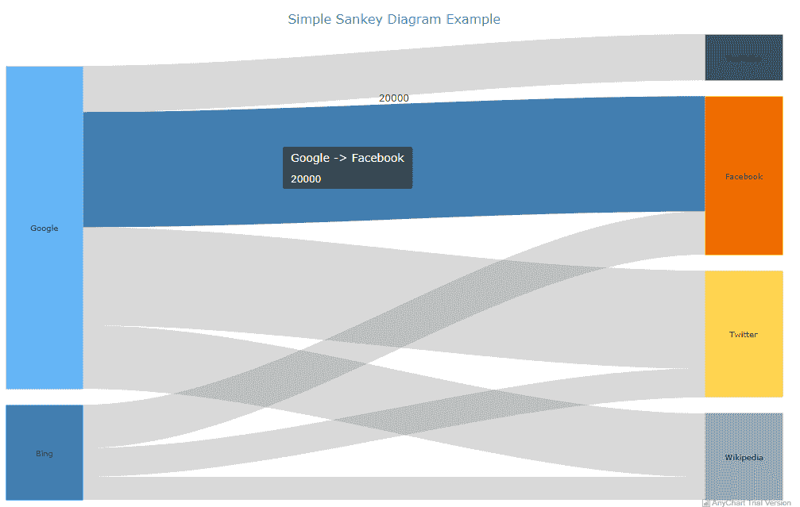
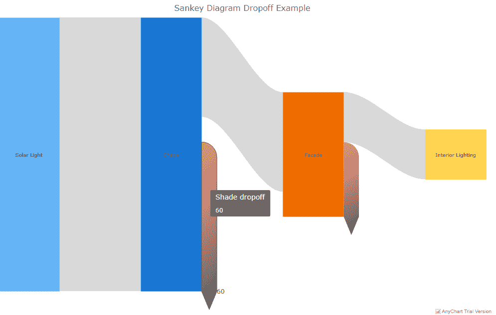
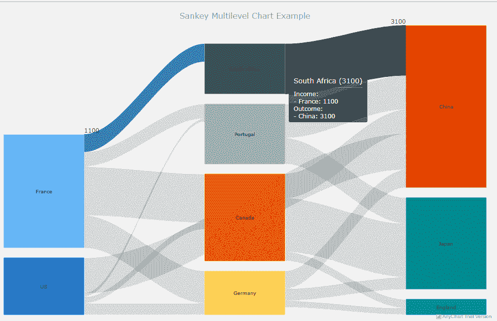

# 如何使用 JavaScript 创建酷的交互式桑基图

> 原文：<https://medium.com/hackernoon/create-javascript-sankey-diagram-b68c0d508a38>

桑基图在数据可视化任务中越来越受欢迎。因此，对于前端 web 开发人员来说，知道如何创建这种类型的图表是至关重要的。实际上，这是一个非常简单明了的过程，尤其是如果您正在使用一个好的 JavaScript 图表库的话。

在我的教程中，我将向您展示如何毫不费力地创建漂亮、直观、交互式的 JS (HTML5) Sankey 图。

# 什么是桑基图

让我们先快速弄清楚 Sankey 是什么，这样您就可以理解它的用途，然后我们再来看 JavaScript 图表本身。

桑基图或桑基图是一种数据可视化类型，它按比例显示从一组值到另一组值的流量和数量。出于好奇，它是以出生于爱尔兰的船长兼工程师马修·桑基的名字命名的，他在 19 世纪末制作了一张图表，展示了蒸汽机的能源效率。

在散点图中，相互链接的事物被称为节点，它们用线或箭头连接。线条或箭头的宽度与从源到目标的流量成比例；即宽度越大，流量越大。

在流程的每个阶段，线条或箭头可以通过其路径连接或分离。您还可以添加颜色，将图表分成不同的类别，或者演示从流程的一种状态到另一种状态的转换。

因此，Sankeys 在显示系统中的主要转移或流方面是有用的，它可以帮助将支配性的贡献者指向整个过程。因此，这种类型的图表非常适合可视化两个域之间的多对多关系，或者系统中一组阶段的多条路径。

例如，Sankey 图表可用于说明从源头到目的地的能量流动、货物从一个地点到另一个地点的转移以及其他不同的过程及其状态。

# 如何构建一个简单的 JavaScript 桑基图

桑基图看起来很复杂，似乎很难创建。然而，网上有几个[桑基图表库](https://en.wikipedia.org/wiki/Sankey_diagram#Sankey_diagram_drawing_tools)可供你用来轻松绘制交互式桑基图表。

本质上，使用几乎所有支持这种图表类型的 JavaScript 数据可视化库来绘制 Sankey 图的步骤基本上是相同的。因此，在掌握了如何使用它们中的任何一个之后，您可以简单地将该过程推广到其他库，并构建其他一些不同寻常的东西。

对于这个 Sankey 图教程，我将使用 [AnyChart](https://www.anychart.com/) JavaScript 图表库。AnyChart 是轻量级的，通用的，易于使用的。特别是，我喜欢它广泛的[文档](https://docs.anychart.com)，它带有一个用于测试的[代码平台](https://playground.anychart.com)，广泛支持的图表类型，以及其他几个迷人的数据可视化特性。

现在，让我们动手看看如何使用 AnyChart 来绘制基于 JavaScript 的交互式 Sankey 图表。

下面是要遵循的步骤。

## 1.创建一个容器

让我们首先在 HTML 页面上创建一个引用 Sankey 图的容器。

```
<div id="container"></div>
```

## 2.连接到 JavaScript 图表库

连接到 JS 图表库有助于将其特性部署到我们的工作空间。我们可以通过下载相关的包并保存在本地或者使用内容交付网络(CDN)服务来连接到一个库。CDN 通常是首选，因为它可以从离用户最近的数据中心部署库文件，从而提高内容的可用性和性能。

AnyChart 利用了一种极简的、基于模块的技术，允许您只连接那些您在项目中需要的图表类型和特性，令人印象深刻地降低了您的应用程序中所需的 JavaScript 代码的大小。

为了创建桑基图，我们需要在页面的 **< head >** 部分添加以下核心和桑基图模块。

```
<script src="https://cdn.anychart.com/releases/v8/js/anychart-core.min.js"></script>
<script src="https://cdn.anychart.com/releases/v8/js/anychart-sankey.min.js"></script>
```

## 3.创建数据

现在，让我们创建将在 Sankey 图上显示的数据数组。AnyChart JS 图表库需要定义以下数据字段:

*   **来自** —指定数据流的来源
*   **到** —指定数据流的目的地
*   **权重** —指定数据的值

在 AnyChart 中，数据行标识连接两个节点的数据流，其名称在 **from** 和 **to** 字段中定义。**权重**值代表每个流的宽度；其中，宽度越大，流量越大。

自动排列成多列的节点具有与流入或流出流量的总量成比例的变化高度；也就是量越大，高度越高。

例如，这里是一些网站每天从两个流行的搜索引擎接收的网络流量的任意数据:

```
var data = [
 {from: "Google", to: "Facebook", weight: 20000},
 {from: "Google", to: "Twitter", weight: 17000},
 {from: "Google", to: "YouTube", weight: 8000},
 {from: "Google", to: "Wikipedia", weight: 11000},
 {from: "Bing", to: "Facebook", weight: 7500},
 {from: "Bing", to: "Twitter", weight: 5000},
 {from: "Bing", to: "Wikipedia", weight: 4000}
 ];
```

## 4.调用 Sankey 函数

要绘制桑基图，我们需要调用 **anychart.sankey()** 图表构造函数，并将**数据**参数传递给它，如下所示。

```
var sankey_chart = anychart.sankey(data);
```

## 5.自定义节点

现在让我们调用 **nodeWidth()** 方法来配置节点的宽度。节点的宽度可以设置为百分比或像素。

```
sankey_chart.nodeWidth("20%");
```

此外，我们可以调用 **nodePadding()** 方法来设置节点之间的垂直填充。在这种情况下，我们为垂直填充提供了值 20。

```
sankey_chart.nodePadding(20);
```

## 6.设置容器 id 并开始绘制 JS 图表

让我们将 Sankey 图指向我们在 HTML 页面上创建的容器 id，并开始绘制漂亮的图表。

```
sankey_chart.container("container");sankey_chart.draw();
```

最后，我们将把整个代码包装在 AnyChart 的 **onDocumentReady** ()函数中，以确保在网页准备好显示内容时呈现图表。

以下是使用 JavaScript 创建简单 Sankey 图的完整代码:

```
<html>
<head>
<script src="https://cdn.anychart.com/releases/v8/js/anychart-core.min.js"></script>
<script src="https://cdn.anychart.com/releases/v8/js/anychart-sankey.min.js"></script>
</head>
<body><div id="container"></div><script>anychart.onDocumentReady(function(){
 //creating the data
 var data = [
 {from: "Google", to: "Facebook", weight: 20000},
 {from: "Google", to: "Twitter", weight: 17000},
 {from: "Google", to: "YouTube", weight: 8000},
 {from: "Google", to: "Wikipedia", weight: 11000},
 {from: "Bing", to: "Facebook", weight: 7500},
 {from: "Bing", to: "Twitter", weight: 5000},
 {from: "Bing", to: "Wikipedia", weight: 4000}
 ];//calling the Sankey function
var sankey_chart = anychart.sankey(data);//customizing the width of the nodes
sankey_chart.nodeWidth("20%");//setting the chart title
sankey_chart.title("Simple Sankey Diagram Example");//customizing the vertical padding of the nodes
sankey_chart.nodePadding(20);//setting the container id
sankey_chart.container("container");//initiating drawing the Sankey diagram
sankey_chart.draw();});</script>
</body>
</html>
```

下面是图表在浏览器上的外观:



正如你在上面的图片中看到的，默认情况下，这个 Sankey 图表是交互式的。

它的一些默认交互行为包括显示权重值的工具提示，当鼠标悬停在流上时高亮显示流，以及用不同的颜色显示节点。

# 如何在视觉上增强 JS Sankey 图表

既然我们已经知道如何使用 AnyChart JS 库来绘制简单的 Sankey 图，那么我们就来谈谈如何增强它们在表示数据可视化任务方面的能力。

例如，您可以通过自定义图表的外观、添加衰减和创建多级图表来改进图表。

下面就来分别说一下。

## a.定制外观

[AnyChart 三键图](https://docs.anychart.com/Basic_Charts/Sankey_Diagram)可定制以改善其外观。例如，节点和流的可视外观可以配置为根据它们的正常和悬停状态显示不同的颜色。

为此，**正常()**方法和**悬停()**方法可以与**填充()**方法(用于设置填充)和**描边()**方法(用于设置描边)一起使用。

以下是配置图表视觉外观的代码:

```
<html>
<head>
<script src="https://cdn.anychart.com/releases/v8/js/anychart-core.min.js"></script><script src="https://cdn.anychart.com/releases/v8/js/anychart-sankey.min.js"></script>
</head>
<body><div id="container"></div><script>anychart.onDocumentReady(function(){
 //creating the data
 var data = [
 {from: "Google", to: "Facebook", weight: 20000},
 {from: "Google", to: "Twitter", weight: 17000},
 {from: "Google", to: "YouTube", weight: 8000},
 {from: "Google", to: "Wikipedia", weight: 11000},
 {from: "Bing", to: "Facebook", weight: 7500},
 {from: "Bing", to: "Twitter", weight: 5000},
 {from: "Bing", to: "Wikipedia", weight: 4000}
 ];//calling the Sankey function
var sankey_chart = anychart.sankey(data);//customizing the width of the nodes
sankey_chart.nodeWidth("20%");//setting the chart title
sankey_chart.title("Sankey Diagram Customization Example");//customizing the vertical padding of the nodes
sankey_chart.nodePadding(20);//customizing the visual appearance of nodes
sankey_chart.node().normal().fill("#64b5f5 0.6");
sankey_chart.node().hovered().fill(anychart.color.darken("#64b5f7"));
sankey_chart.node().normal().stroke("#455a63", 2);//customizing the visual appearance of flows
sankey_chart.flow().normal().fill("#ffa000 0.5");
sankey_chart.flow().hovered().fill(anychart.color.darken("#ffa000"));
sankey_chart.flow().hovered().stroke("#455a63");//setting the container id
sankey_chart.container("container");//initiating drawing the Sankey diagram
sankey_chart.draw();});</script>
</body>
</html>
```

以下是配置的图表在浏览器上的外观:


## b.添加衰减

每当缺少流动的目的地时，就形成了衰减。因为没有提供目标节点，所以 dropoff 通常显示损失。因此，要设置一个删除，需要在**到**字段中包含一个值为 **null** 的数据行。您还需要在字段的**中设置数据流源的名称，并在**权重**字段中设置 dropoff 的值。**

您还可以自定义衰减以适合您的偏好，例如配置其视觉外观。

以下是用于添加衰减的代码，这些代码显示了太阳能在到达建筑物内部之前的传输过程:

```
<html>
<head>
<script src="https://cdn.anychart.com/releases/v8/js/anychart-core.min.js"></script><script src="https://cdn.anychart.com/releases/v8/js/anychart-sankey.min.js"></script>
</head>
<body><div id="container"></div><script>anychart.onDocumentReady(function(){
 //creating the data
var data = [
 {from: "Solar Light", to: "Shade", weight: 110},
 {from: "Shade", to: null, weight: 60},
 {from: "Shade", to: "Facade", weight: 40},
 {from: "Facade", to: null, weight: 30},
 {from: "Facade", to: "Interior Lighting", weight: 20}
];//calling the Sankey function
var sankey_chart = anychart.sankey(data);//customizing the width of the nodes
sankey_chart.nodeWidth("50%");//setting the chart title
sankey_chart.title("Sankey Diagram Dropoff Example");//customizing the vertical padding of the nodes
sankey_chart.nodePadding(20);//customizing the visual appearance of dropoff
sankey_chart.dropoff().normal().fill(
 {keys: ["#dd2c01 0.5", "#455a62 0.9"], angle: 275}
);
sankey_chart.dropoff().hovered().stroke("#455a61");//setting the container id
sankey_chart.container("container");//initiating drawing the Sankey diagram
sankey_chart.draw();});</script>
</body>
</html>
```

这是拖放在浏览器上的样子:



## c.创建多级桑基图表

此外，您可以使用 AnyChart JS 库来创建具有多层次链接的 Sankey 图。

在下面的例子中，我创建了一个桑基图，显示了每年从一个国家迁移到另一个国家的任意数量的人。节点排列在三列中，并根据需要自动添加其他级别。

代码如下:

```
<html>
<head>
<script src="https://cdn.anychart.com/releases/v8/js/anychart-core.min.js"></script><script src="https://cdn.anychart.com/releases/v8/js/anychart-sankey.min.js"></script>
</head>
<body><div id="container"></div> <script>anychart.onDocumentReady(function(){
 //creating the data
var data = [
 {from: "France", to: "Canada", weight: 3000},
 {from: "France", to: "Germany", weight: 2000},
 {from: "France", to: "South Africa", weight: 1100},
 {from: "France", to: "Portugal", weight: 900},
 {from: "US", to: "China", weight: 2200},
 {from: "US", to: "Canada", weight: 400},
 {from: "US", to: "Germany", weight: 700},
 {from: "US", to: "Portugal", weight: 200},
 {from: "Canada", to: "China", weight: 1500},
 {from: "Canada", to: "Japan", weight: 3300},
 {from: "Canada", to: "England", weight: 550},
 {from: "Germany", to: "China", weight: 1100},
 {from: "Germany", to: "Japan", weight: 750},
 {from: "Germany", to: "England", weight: 400},
 {from: "South Africa", to: "China", weight: 3100},
 {from: "Portugal", to: "China", weight: 2100},
 {from: "Portugal", to: "Japan", weight: 1600}
];//calling the Sankey function
var sankey_chart = anychart.sankey(data);//customizing the width of the nodes
sankey_chart.nodeWidth("50%");//setting the chart title
sankey_chart.title("Sankey Multilevel Chart Example");//customizing the vertical padding of the nodes
sankey_chart.nodePadding(20);//setting the container id
sankey_chart.container("container");//initiating drawing the Sankey diagram
sankey_chart.draw();});</script>
</body>
</html>
```

以下是多级桑基图表在浏览器上的外观:



# 包扎

正如您在这篇 JS 图表教程中所看到的，使用一个好的数据可视化库创建直观的交互式 Sankey 图并不是什么难事。通过一个开发人员友好的解决方案，您可以创建精彩的图表，并将您的数据可视化工作提升到一个新的水平。

当然，我们只是触及了桑基图的表面。您可以访问 AnyChart 文档，了解如何充分利用 Sankey 图表，以及其他几种类型的图表。

您还可以尝试一下[其他 JavaScript 图表库](https://en.wikipedia.org/wiki/Comparison_of_JavaScript_charting_libraries)，并评估它们在帮助您将所需的可视化添加到 web 应用程序中的能力。

你有什么意见或问题吗？

请把它们贴在下面。