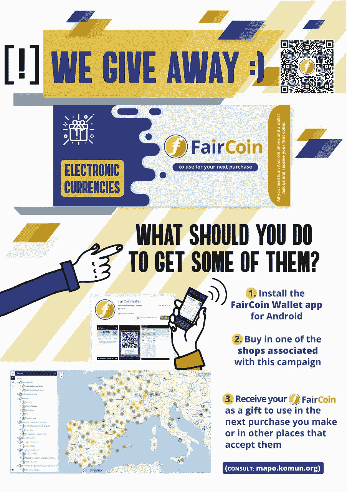

# 用加密货币创造忠诚的客户

> 原文：<https://medium.com/hackernoon/create-loyal-customers-with-cryptocurrencies-1b685d903cdf>

> 人们想要加密货币。在这个比特币开始的故事中，人们强烈希望不要被抛在后面，但大多数人不知道如何开始，尽管，这是真的，仍然有几个姐夫拒绝这个问题(或者他们这么说)。

是时候让你成为他们信任的入口了。想想吧。我将解释这样做的方法，此外，将提高您的销售和创造客户忠诚度。你卖什么或提供什么并不重要。加密货币不可避免地会吸引人们，你只需要帮助他们感觉他们没有错过火车。

方法:**使用加密货币作为折扣券**。这很简单。

**必备材料:**

1.  一种很好的加密货币
2.  易于安装在任何手机上的钱包
3.  很想留住客户，同时向他们提供一些非常有用的基础知识。

**你应该选择哪种加密货币？**

它可以是任何一个比较有名的，但理想情况下，我们需要一个有稳定参考价值的，因为我们不希望它的参考价值或每笔交易的费用不断或突然波动。一些最有趣的可能是 Monero，Digibyte 或 FairCoin。

前两个有安卓和 iOS 的钱包，而 Faircoin 只有安卓的钱包。然而，我们将选择后一种硬币作为例子，因为其特殊性，除了参考市场价值之外，它还有一个由社区确定的固定价值(1 费尔= 1.2 欧元)，并且因为在许多实体场所和在线网站上有更多的机会使用费尔硬币作为货币。这给了你一个加分，因为客户不仅可以在你的商店使用它或获得你的服务，也可以在其他商店或网上使用它。

> 如果我们选择任何其他加密货币，正如我所说，我们会有一些优点和一些缺点。市场价格的波动可能会导致作为礼物送出的货币贬值，或者相反，随着时间的推移而升值。这可能会激励你的客户把它们存起来，而不是立即使用。但你必须意识到这一点，并考虑将它们转化为法定货币，同时维持回收它们所需的物流，这也是一种额外的压力。我认为使用 Faircoin 是一个好主意，除非你对加密货币有丰富的经验。

让我们继续吧

在您的 Android 手机上安装钱包[ [说明](https://fair-coin.org/en/faircoin-wallets) ]您只需学习好这个简单的程序，以便告诉您的客户如何安装钱包并进行备份或保存 12 个种子字(取决于钱包、核心或 Electrum…后者尤其适用于有空间问题的手机)。

> 从一些公平开始。您可以[以官方价格获得 FairCoin，从而支持一项公益事业](https://kolabora.komun.org/komun/)(您的贡献将以 Faircoin 的形式回报)，您也可以[在这里](https://bazar.komun.org/en/buy-faircoin/229-faircoin.html)或[官方 FairCoop 网站](https://getfaircoin.net)购买 FairCoin。如果你已经接受公平，你可能已经有一些可以用来建立客户忠诚度。

从现在开始，你的生意有了特别之处。

现在你的商店或服务将变得更有吸引力。确定您可以向同意安装钱包的客户提供多少折扣%。并张贴一个漂亮的标志，比如说:*我们给你电子硬币(FairCoin)，你可以在下次购买时使用。你只需要一部安卓系统的手机和一个电子钱包。询问我们并获得您的第一枚硬币。*

[Download the sign](https://nubo.komun.org/s/KjaKHbqFc5teEDB)

因此，举例来说，让我们假设你决定给予公平的 10%的金额购买欧元。请记住，1 费尔= 1.2 欧元或 1 欧元= 0.83 费尔。但是不要担心，电子钱包会自动进行转换。

1.你卖 100 欧元的东西。顾客付给你 100 欧元。客户收到 8.3 公平

2.同一个顾客又一天回来，买了价值 20 欧元的东西。他/她付给你 10 欧元+ 8.3 英镑。你付给他/她的公平报酬是他/她付给你的欧元的 10%,即:0.83 公平

3.顾客返回购买另一件价值 20 欧元的商品。他/她付给你 19 欧元+ 0.83 英镑。你给他/她 1.58 公平

如果你仔细观察这个例子，你会发现你卖出了价值 140 欧元的物品，除了拿回你赠送的 9.13 欧元外，你还得到了 129 欧元。顾客还剩 1.53 英镑，他会寻找机会再次购买商品，以便使用这笔钱。

顾客也可以从连续的购买中积累它们，以便在他/她有必要的数量时公平地购买一些东西。这取决于客户。你提供了延期 10%的名义折扣(或你决定的任何折扣)，实际上相当于 8.47%，这将极大地激励顾客继续在你的商店购买或雇佣你的服务。与此同时，每个参与者都获得了关于加密货币实际使用的基础知识，这在当今是必不可少的。你可以相信我:也许不是每个人都会参与，但那些参与的人会与你、你的商店或你的服务建立一种特殊的纽带，这种纽带将永远被记住，他/她会为此而感激。

我是接受所有人的公平硬币，还是只接受我给了一些的顾客的公平硬币？

理想情况下，您应该接受来自世界各地的 FairCoin，因为您的客户也可以在参与这一有吸引力的经济模式的其他地方使用它们。然而，这是可能的，也是合乎逻辑的，你想设定限制，只拥有你想要的，可以使用或保存的公平硬币。公平硬币是一种像欧元或任何其他货币一样的货币，但很明显，目前它的使用并不广泛。因此，设置一些限制是一个很好的规则。

*   你可以接受任何人的 FairCoin(因为你接受 FairCoin，所以他们肯定会光顾你的商店),最高限额由你自己设定。例如，您可以检查您有多少，并确定您不想累积超过 1000。正确，从那以后不要接受任何不是你的常客的人的东西。或者你可以决定你只接受 10-20-50 或任何你想接受的销售比例。这是关于那些不是你的顾客的人，也就是那些你没有给他们公平的硬币的人。
*   你可以不受限制地接受自己客户的 FairCoin，因为毕竟，他们的 FairCoin 相当于你作为在你的商店购买的奖励而给予的折扣券。

你如何区分你送出的公平币和其他来源的公平币？

非常容易。最简单的方法是保留一份你的客户名单和你给他们的公平硬币。它可以是手写的清单，电子表格，任何对你来说最简单的东西。如果你有疑问，问问他/她是否是你的客户，并在名单中寻找这个名字。

你也可以为你的商店制作卡片，并将背面分成 6、8 或 10 个方块。在每张卡片上，你写下顾客的公平硬币余额，并在上面盖章。客户每次去买的时候都会给你看，这样你就可以在他/她给你付款(有没有 FairCoin)并且你把对应他/她的都交了之后再更新。

**试着想象更好的事情**

沉思所有你能想到的推广你的业务或服务的广告活动。大多数已经非常破旧了。销售不再起作用了，因为人们不太相信他们，他们也没有动力。现在你知道了。这里描述的建议非常简单、有趣和有用。所有各方都是赢家，这是一个非常值得赞赏的价值。

**其他有用参考:** [fair . coop](https://fair.coop/en/)
[fair coin](https://fair-coin.org/)
[是什么阻止了加密货币的大规模采用？](https://techcrunch.com/2017/04/20/whats-keeping-cryptocurrencies-from-mass-adoption)
[加密货币作为长线游戏](https://cointelegraph.com/news/cryptocurrency-as-the-long-game)

*Sofokles Dans，科学家、作家、黑客主义者。自从比特币探出头来，他就在加密货币的世界里混了。他定期参与 FairCoop 的开发和 FairCoin 的实际使用，以及许多其他加密货币的实践经验。*

**如果你喜欢那篇文章，请他喝杯咖啡:**
**比特币:**3 gruarrbnrkhqptq 57 fqrdwpr 58 apkknbw
**比特币现金:**qrht 40 dmfsvyclunwauzpj 968 RTV 0 LJ 9 GQ 4 ZL 7 w3p
**破折号:**xn 5 mugyugw 7 pvncfkvfqtf 9t 6 th 9 w9