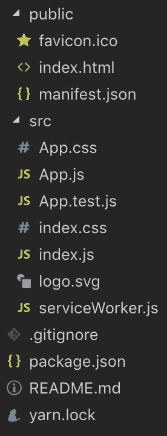
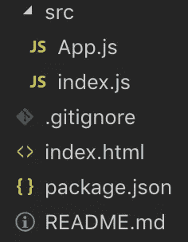

# 创建 React 应用程序太臃肿了

> 原文：<https://medium.com/hackernoon/create-react-app-is-way-too-bloated-5db07c3511>


当 Create React App first [在 2016 年 7 月推出](https://reactjs.org/blog/2016/07/22/create-apps-with-no-configuration.html)时，它被认为是初学者入门 React 的最佳方式。

在那个时候，人们鼓励初学者用 Webpack 从头开始构建一个 React 应用程序，或者从互联网上下载许多样板文件中的一个。Create React 应用程序的出现就像一股清新的空气。

几年后，我们在让事情变得更简单、更容易使用的过程中停滞不前。我们对优化和添加功能的永无止境的渴望使得 Create React 应用程序难以使用，并且让大多数初学者(以及一些有经验的用户)感到害怕。

# 臃肿的文件结构

从 Create React 应用程序中弹出一直是一种极其不和谐的体验。

如果你曾经敢运行`npm run eject`，你可能熟悉配置墙和众多文件，这些文件对任何地方的初学者来说都是令人望而生畏的。

但假设我们从不弹出，以下是您开箱后得到的内容:



I get dizzy just looking at this.

立刻，你会看到两个独立的文件夹:`public`和`src`。

在`public`文件夹中，除了我们的`index.html`之外，你还会看到`favicon.ico`和`manifest.json`。

在`src`文件夹中，你有两个 CSS 文件，四个 Javascript 文件，还有一个`logo.svg`只是为了好玩。

此时，您已经可以想象大多数初学者可能在想什么了:

> “我以为我是来学习 React 并快速开始制造组件的？”

当然，这些文件对于从事*生产*应用程序的经验丰富的 web 开发人员来说都非常重要。

测试是任何可靠的 web 应用程序的支柱，当创建一个进步的 web 应用程序时，服务人员是绝对必要的。

但是 Create React App 最常见的用例是什么呢？开发人员多久开始一次需要这种级别的可配置性和优化的全新项目？

不经常。

> 大多数时候，我们都在创建概念验证、教程、示例应用程序和准系统 bug 复制应用程序。

我并不是说 Create React App 没有用途，但是对于人们经常使用它的许多用例来说，它实在是太臃肿了。我们不能一直将创建 React 应用视为一种一刀切的方法。

# 初学者的视角

让我们从初学者的角度来思考这个问题。让我们假设我们以某种方式忽略了`public`文件夹，而专注于`src`。

也许从这个角度来看，我们可以开始明白为什么创建 React App 可能并不总是最好的默认选项。

## CSS 文件

首先，迎接你的是两个 CSS 文件，你的第一个问题可能是:“我的样式应该放在哪里？”。

过一会儿，您可能会认为`index.css`是放置全局样式的地方，而`App.css`是放置特定于组件的样式的地方。然而，这实际上并不正确，因为`App.css`并不是自动的组件范围。如果包含它，样式将应用于整个应用程序。

为什么项目不能从一个 CSS 文件开始？或者如果我们只是在做一个示例 app 或者 bug 重现 app，可能根本不需要 CSS 文件。

## Javascript 文件

我们可能会发现`index.js`是我们应用程序的入口点，而`App.js`是我们的顶层组件。这部分不难，但是另外两个文件是怎么回事？

听起来确实像是一个测试，但是等等，我还没学会反应呢！React 有测试框架吗？是用 Jest 还是摩卡？我总是需要测试才能使用 React 吗？

哦，这还不是全部。这个`serviceWorker.js`是什么？在谷歌上快速搜索“服务人员”告诉我，这与离线功能和渐进式网络应用有关。

我几乎没有开始制作任何组件，你是在告诉我，我制作的每个 React 应用都应该是一个进步的 web 应用吗？！

## 挫折

在这一点上，我认为初学者使用 Create React 应用程序进行学习将会非常困难。

这是否比开发自己的 Webpack 配置更好？当然，但在 2019 年，我认为我们有更好的选择。

# 一个真正最小的解决方案



The file structure of a Nano React App

有时(即经常)您希望快速投入 React，在没有任何干扰的情况下生产一些组件。

> 这也是 [Nano React App](https://github.com/adrianmcli/nano-react-app) 产生的原因。

这是建立在[包](https://parceljs.org)之上的，它是一个网络应用捆绑器(像 Webpack 一样),包括许多开箱即用的智能默认设置。如果您的计算机有多个内核，它也可以比 Webpack 快得多。

为了让你对 Parcel 的受欢迎程度有个概念，在撰写本文时:Parcel 在 Github 上有[29753 颗星](https://github.com/parcel-bundler/parcel/stargazers)，而 Webpack 有[46955 颗星](https://github.com/webpack/webpack/stargazers)。也就是说，这无论如何都不是一个默默无闻的项目。

生成的 app 代码很少 ***不再需要弹出*** 。只包括两个脚本，一个开发服务器和一个生产构建脚本。


## 它还有什么没有的？

除了不能弹出:

*   没有林挺
*   没有测试
*   没有服务人员

让我再次重申，这些对于生产应用程序来说是非常重要的。但是对于一个小的教程或者一个简单的 bug 复制应用，这些东西会增加你的难度。

如果您决定要这些东西，您可以轻松地集成它们，而不必“退出”和彻底改变项目的文件结构。

## *试试看！*

要使用 [Nano React App](https://github.com/adrianmcli/nano-react-app) ，只需运行:

```
npx nano-react-app my-app
```

**注意:** `npx`是与 node 的现代版本捆绑在一起的一个命令，它允许您运行一个二进制文件，而不必先执行`npm install`。

这将把一个[模板](https://github.com/adrianmcli/nano-react-app-template)应用解压到您选择的目录中(在这个例子中是`my-app`)。我们支持与 Create React 应用程序相同的 Babel 转换，因此可以随意使用组件方法的类属性。

我们不为你运行`npm install`，所以模板工程的解包速度极快。也没有`package-lock.json`或`yarn.lock`档。这样做是有意的，因为我们不想固执己见于你应该使用`yarn`还是`npm`。

感谢阅读！