# 用 JSF + Primefaces + JPA + MySQL 十步创建 J2EE CRUD 应用程序

> 原文：<https://medium.com/hackernoon/creating-a-j2ee-crud-app-in-10-steps-with-jsf-primefaces-jpa-mysql-39a1421b8845>

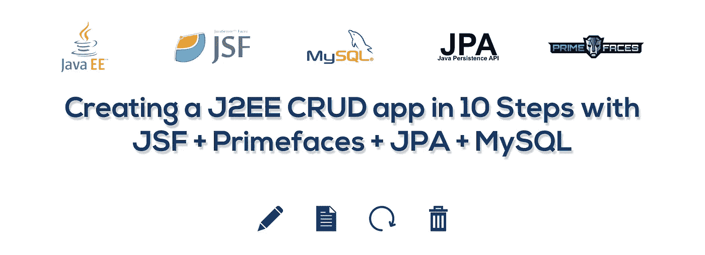

在本教程中，你将学习如何使用 Java Server Faces (JSF)、Primefaces 框架、Java Persistent API (JPA)和 MySQL 数据库管理系统制作一个简单的 CRUD 应用程序。

我们的应用程序将是一个基本的应用程序，将从 MySQL 数据库创建，读取，更新和删除。

# 先决条件

要继续学习本教程，您需要以下内容:

## 一.技能

*   Java 开发中的概念&基本概念
*   基本的 SQL 概念
*   HTML 和 CSS 语言中的概念

## 二。软件

*   **爪哇 JDK**
*   **Netbeans 8.2** :这将是我们的 IDE
*   Glassfish Server 4.0 :这将作为我们的应用服务器
*   WampServer 3.1.4 :它将是我们的数据库服务器，包含 MySQL 数据库管理系统
*   **MySQL 连接器**

**NB:** J2EE 不是 Java SE 也不是 JavaScript，别搞混了😁

在开始之前，我们假设您已经设置了数据库并配置了服务器。

# 1.创建我们的连接资源

首先要做的是创建一个连接资源，允许我们将数据库链接到我们的应用程序。

我们将通过在浏览器中键入此 url 来打开我们的 Glassfish 服务器管理控制台。

```
http://localhost:4848
```

创建一个名为“CRUD”的新连接池


Creating a new connection pool from our Glassfish server admin panel

进入下一步，输入您的数据库服务器用户名、密码和 URL。以下是数据库 URL:

```
jdbc:mysql://localhost:3306/crud?zeroDateTimeBehavior=convertToNull
```

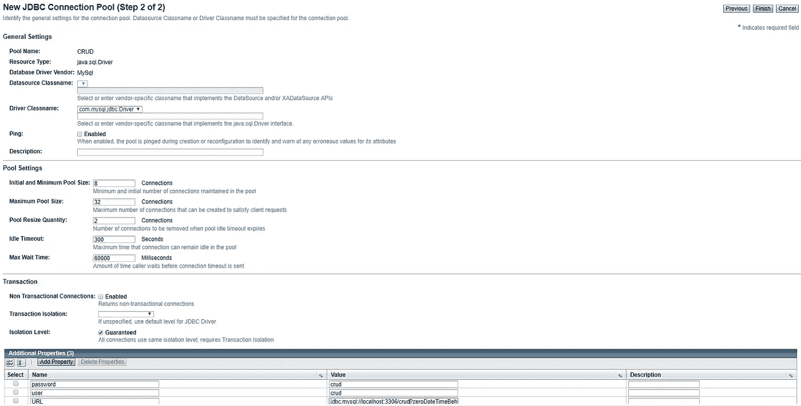

Creating a new connection pool from our Glassfish server admin panel

然后创建一个名为`CRUD_App`的 JBC 资源。

我们已经完成了连接资源的创建。

接下来，我们将在 Netbeans IDE 和数据库之间创建一个连接。

*   打开左侧的服务选项卡
*   展开“数据库”，然后展开“MySQL 服务器”
*   右键单击数据库“CRUD ”,并选择 connect 选项

我们已经完成了数据库连接的创建。

让我们继续构建我们的应用程序。

# 2.创建我们的项目

打开 Netbeans 并创建一个新的企业应用程序。

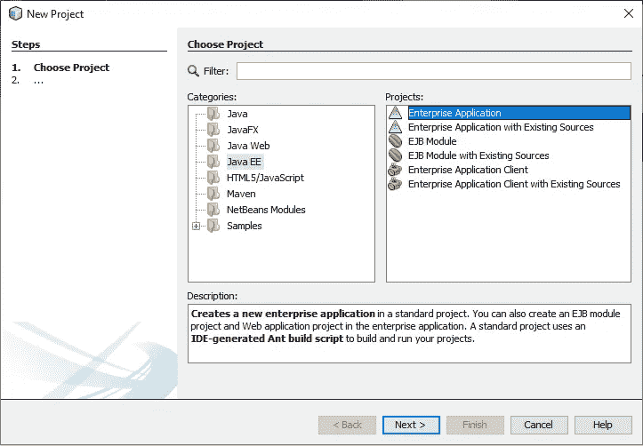

Creating a new enterprise application — Choose project

我们将称我们的项目为“CRUD”。

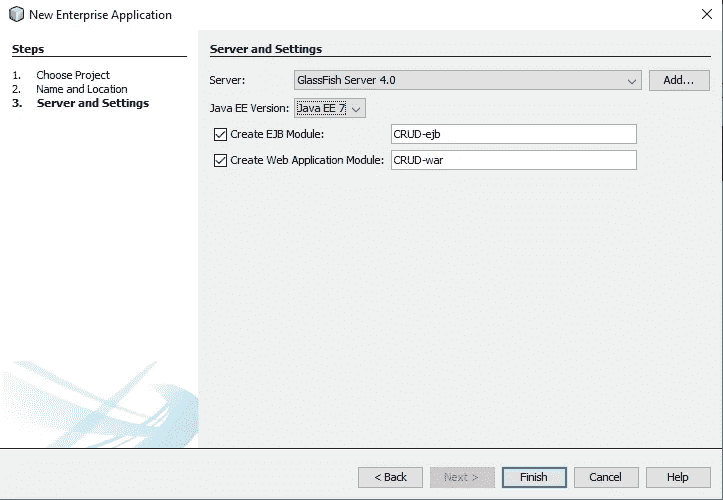

Creating a new enterprise application — Server & settings

选中“创建 EJB 模块”和“创建 web 应用程序模块”。EJB 模块将作为我们的 bean 容器，而 web 模块将作为我们的视图容器。如需进一步解释，您可以点击此[链接](https://docs.oracle.com/javaee/7/tutorial/overview003.htm)

至此，我们已经成功地创建了我们的项目，这是一些真正东西的开始。

让我们看看我们的数据库👀

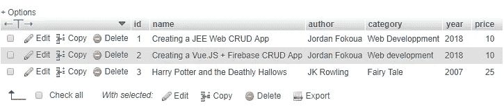

Book table from MySQL database

我们的数据库“CRUD”包含一个名为“Book”的表，该表有 6 列。

# 3.创建我们的实体类

现在，让我们从数据库中创建我们的实体类。这是一个映射到数据库表的 Java 类。

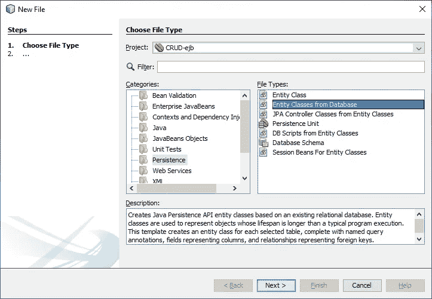

Creating entity classes from our database

> 您还记得上面我们在 glassfish 服务器中所做的配置吗？现在让我们看看是用！

下一步是选择我们的数据库表来创建我们的实体类。在数据源字段中，我们将选择我们上面创建的`CRUD_App`连接池。

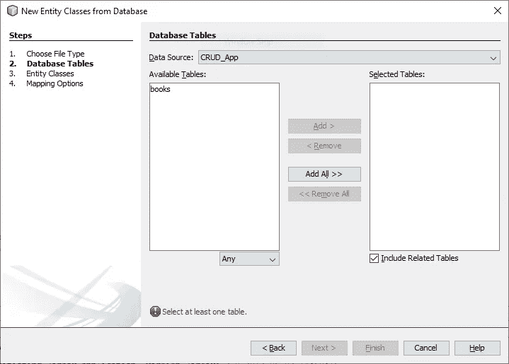

将 book 表添加到所选的表中，并进入下一步。

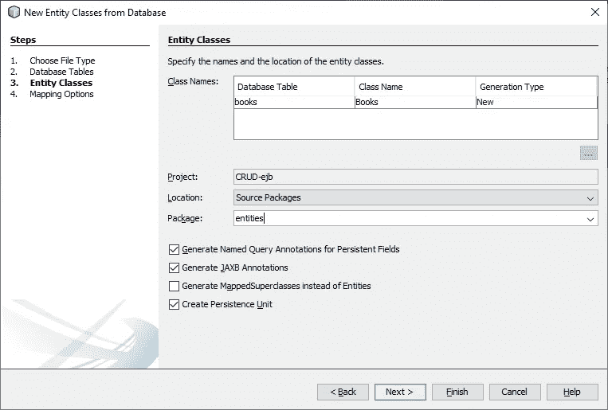

让我们将我们的类生成到一个名为“实体”的新包中

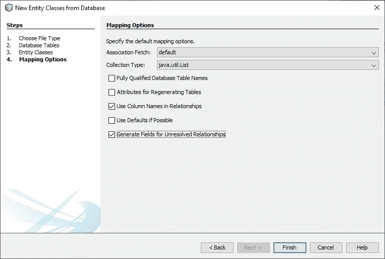

将 association fetch 设置为“default”，将集合类型设置为`java.util.list` (这描述了我们从数据库中检索实体的方式)。

我们已经成功地生成了我们的实体类“Book”，让我们来看看它。它包含[命名查询、](https://www.objectdb.com/java/jpa/query/named)实体变量及其约束、一个构造函数、getters 和 setters 以及一些函数。

# 4.创建我们的会话 bean(JPA)

会话 Bean 是向客户端提供服务的服务器端组件。它可以为应用程序工作流提供不同的步骤:

*   证明
*   实体列表
*   污垢等…

要创建我们的会话 bean，创建一个新文件&选择“实体类的会话 bean”。

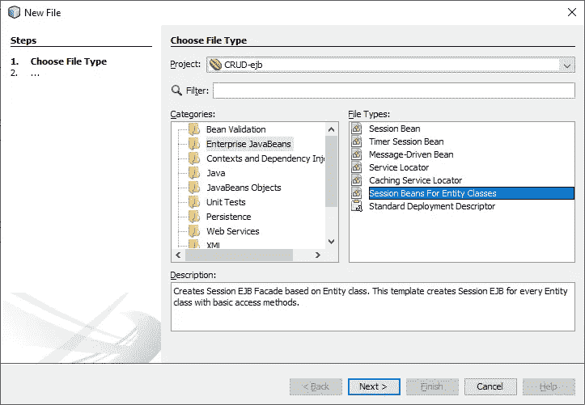

Creating a session bean

选择相应的实体类(账簿)并进入下一步

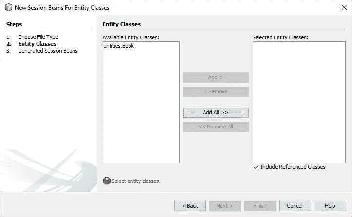

Creating a session bean from an existing entity class

让我们在一个名为`sessionbean`的新包中创建会话 bean。将界面设置为`Local`。

但是为什么是本地的呢？因为客户端部署在同一个虚拟机中。例如部署在与会话 Bean 相同的应用服务器中的 Web 应用

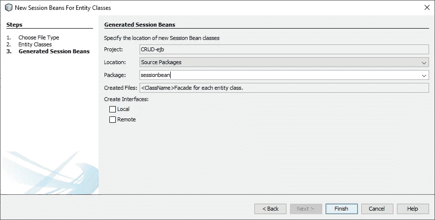

Finalizing our Session bean

现在，让我们看看我们的新包，我们可以找到三个新类:

*   **AbstractFacade** :包含所有实体类抽象方法的抽象类。
*   **Book facade:**一个类，其中 AbstractFacade 中的方法将被实现，与 Book 实体类相关。
*   **bookfacadelocal:**该接口包含会话 Bean 作为方法提供的所有服务。

我们已经完成了 EJB 模块的“初始化”。让我们转到我们的 web 模块(WAR)并创建我们的视图和控制器。

迷惑？别担心，随着我们的继续，你的疑惑会被消除的😉

# 5.创造我们的观点

在 WAR 模块中，右键单击“Web Pages”文件夹，创建一个名为“index.xhtml”的新 JSF 页面，并删除现有的`index.html`文件。

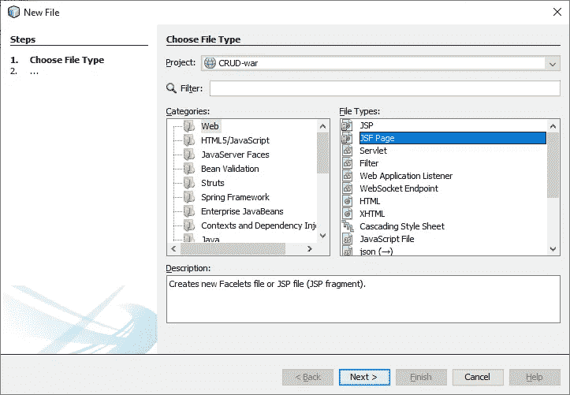

Creating our new JSF page

> [JavaServer Faces (JSF)](https://www.oracle.com/technetwork/topics/index-090910.html) 是一个用于构建 Web 应用程序的新标准 Java 框架。它通过提供一种以组件为中心的方法来开发 Java Web 用户界面，从而简化了开发。

这是我们的文件夹应该看起来的样子

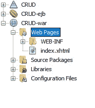

在“配置文件”文件夹中，打开`web.xml`文件，确保默认页面设置为我们创建的新 jsf 页面。

```
<welcome-file-list>
        <welcome-file>faces/index.xhtml</welcome-file>
</welcome-file-list>
```

# 6.创建我们的 JSF 托管 Bean

**托管 Bean** 是由 JavaServer Faces 技术管理的组件

> [托管 Bean](http://www.tutorialspoint.com/jsf/jsf_managed_beans.htm) 是一个向 JSF 注册的普通 Java Bean 类。换句话说，托管 Bean 是由 JSF 框架管理的 Java bean。受管 bean 包含 getter 和 setter 方法、业务逻辑，甚至是支持 bean(bean 包含所有 HTML 表单值)。
> 
> 受管 beans 充当 UI 组件的模型。可以从 JSF 页面访问受管 Bean。

我们右键单击我们的 WAR 模块来创建一个新文件，并从列表中选择“JSF 管理的 Bean”

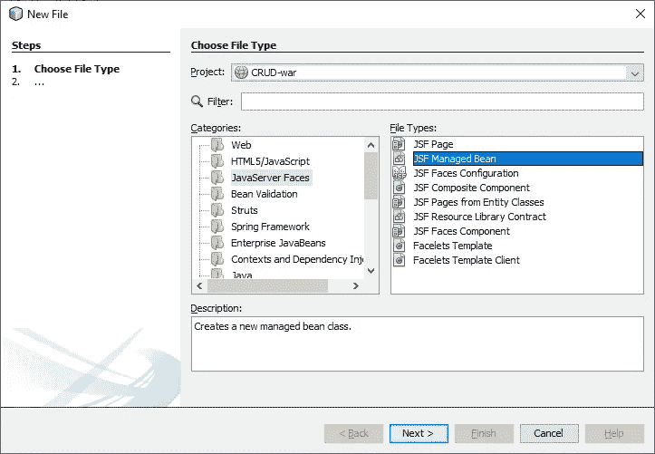

让我们创建一个名为`controller`的新包，并调用托管 bean `bookController`。将范围设置为`Session`

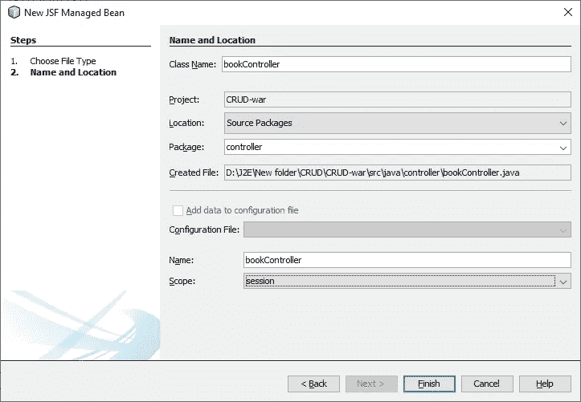

现在，让我们通过在托管 bean 类中插入以下代码来注入会话 bean:

```
@EJB
private BookFacadeLocal booksFacade;
```

我们可以观察到一个奇怪的词，`@EJB`。这就是所谓的注释，用于将我们的会话 bean 注入到受管 bean 中。

接下来，我们创建一个新的 book 对象，并声明它的所有属性及其 getters 和 setters，如下所示:

```
package controller;import entities.Book;
import javax.inject.Named;
import javax.enterprise.context.SessionScoped;
import java.io.Serializable;
import java.util.List;
import javax.ejb.EJB;
import sessionbean.BookFacadeLocal;@Named(value = "bookController")
@SessionScoped
public class bookController implements Serializable {**@EJB
private BookFacadeLocal booksFacade;**private Book book = new Book();
    private String name;
    private String author;
    private Integer year;
    private String category;
    private long price;public bookController() {
    }public String getName() {
        return name;
    }public void setName(String name) {
        this.name = name;
    }public String getAuthor() {
        return author;
    }public void setAuthor(String author) {
        this.author = author;
    }public Integer getYear() {
        return year;
    }public void setYear(Integer year) {
        this.year = year;
    }public String getCategory() {
        return category;
    }public void setCategory(String category) {
        this.category = category;
    }public long getPrice() {
        return price;
    }public void setPrice(long price) {
        this.price = price;
    }}
```

# 7.导入 Primefaces

仍然在我们的 WAR 模块下，让我们向我们的项目添加一个名为 Primefaces 的新库。右击 Libraries 文件夹，然后选择“添加库”选项，添加“Primefaces 6.2”。

> [PrimeFaces](https://www.primefaces.org/) 是一个流行的 JavaServer Faces 开源框架，拥有 100 多个组件、触摸优化的 mobilekit、客户端验证、主题引擎等等。

这个框架将为我们提供 UI 组件，帮助我们更快地构建视图和实现目标。

# 8.创建我们的 CRUD 方法

在这一步，我们将创建我们的**CRUD**(**Create Read Update 和 Delete** )函数。

在此之前，让我们创建一个方法`emptyVariable()`。这个方法将帮助我们在需要的时候清空变量

```
**public void emptyVariables()** {
        this.author = "";
        this.category = "";
        this.name = "";
        this.price = 0;
        this.year = 0;
    }
```

首先是 **C** 。让我们创建`createBook()`方法。

```
**public String createBook()** {
        this.book.setAuthor(this.author);
        this.book.setCategory(this.category);
        this.book.setName(this.name);
        this.book.setPrice(this.price);
        this.book.setYear(this.year);
        this.booksFacade.create(this.book);
        this.emptyVariables();
        return "index.xhtml?faces-redirect=true";
    }
```

在这个函数中，我们可以看到我们之前创建的`book`对象，使用它的 setters 为将要创建的新实体分配了属性值。

二、 **R** 。让我们创建`getAllBooks()`方法。

```
**public List<Book> getAllBooks()** {
        return this.booksFacade.findAll();
    }
```

第三， **U** 。让我们创建`updateBook()`方法。

```
**public String updateBook(Book book)** {
        this.booksFacade.edit(this.book);
        return "index.xhtml?faces-redirect=true";
    }
```

最后但并非最不重要的，是 **D** 。`deleteBook()`

```
**public String deleteBook(Book book)** {
        this.booksFacade.remove(book);
        return "index.xhtml?faces-redirect=true";
    }
```

我们可以对上述函数进行一些观察。

I .我们创建的 CRUD 函数只作为我们实体会话 Beans 的桥梁

二。我们的 CRUD 函数返回一个字符串。这只是为了刷新我们的页面，以便能够观察我们函数的结果

```
package controller;import entities.Book;
import javax.inject.Named;
import javax.enterprise.context.SessionScoped;
import java.io.Serializable;
import java.util.List;
import javax.ejb.EJB;
import sessionbean.BookFacadeLocal;@Named(value = "bookController")
@SessionScoped
public class bookController implements Serializable {@EJB
private BookFacadeLocal booksFacade;

private Book selectedBook;private Book book = new Book();
private String name;
private String author;
private Integer year;
private String category;
private long price;public bookController() {
    }public Book getSelectedBook() {
        return selectedBook;
    }public void setSelectedBook(Book selectedBook) {
        this.selectedBook = selectedBook;
    }public String getName() {
        return name;
    }public void setName(String name) {
        this.name = name;
    }public String getAuthor() {
        return author;
    }public void setAuthor(String author) {
        this.author = author;
    }public Integer getYear() {
        return year;
    }public void setYear(Integer year) {
        this.year = year;
    }public String getCategory() {
        return category;
    }public void setCategory(String category) {
        this.category = category;
    }public long getPrice() {
        return price;
    }public void setPrice(long price) {
        this.price = price;
    }**public List<Book> getAllBooks()** {
        return this.booksFacade.findAll();
    }**public void emptyVariables()** {
        this.author = "";
        this.category = "";
        this.name = "";
        this.price = 0;
        this.year = 0;
    }**public String createBook()** {
        this.book.setAuthor(this.author);
        this.book.setCategory(this.category);
        this.book.setName(this.name);
        this.book.setPrice(this.price);
        this.book.setYear(this.year);
        this.booksFacade.create(this.book);
        this.emptyVariables();
        return "index.xhtml?faces-redirect=true";
    }**public String updateBook()** {
        this.booksFacade.edit(this.selectedBook);
        return "index.xhtml?faces-redirect=true";
    }**public String deleteBook(Book book)** {
        this.booksFacade.remove(book);
        return "index.xhtml?faces-redirect=true";
    }
}
```

# 9.构建我们的观点

现在，让我们建立我们的索引页面。我们将创建一个表单向我们的表“Book”添加数据，并创建一个数据表来显示我们的表 Book。该表还允许我们更新和删除所选的书。

```
<html 
      xmlns:h="http://xmlns.jcp.org/jsf/html"
      xmlns:p="http://primefaces.org/ui"
      xmlns:f="http://xmlns.jcp.org/jsf/core">
    <h:head>
        <title>CRUD</title>
    </h:head>
    <h:body>
        <h1>CRUD</h1>
        <h:form>
            <h:panelGrid columns="12" cellpadding="5">
                <h:outputText value="Name " />
                <p:inputText value="#{**bookController.name**}"/><h:outputText value="Author " />
                <p:inputText value="#{**bookController.author**}" /><h:outputText value="Category " />
                <p:inputText value="#{**bookController.category**}"/><h:outputText value="Year " />
                <p:inputText value="#{**bookController.year**}"/><h:outputText value="Price " />
                <p:inputText value="#{**bookController.price**}"/><p:commandButton value="Add" icon="fa fa-fw fa-plus" action="#{**bookController.createBook()**}"/>
            </h:panelGrid>
        </h:form><h:form  id="form">
            <p:dataTable value="#{**bookController.getAllBooks()**}" var="**book**" style="margin: 2em;" rowKey="#{**book.id**}">
                <p:column headerText="Name">
                    <h:outputText value="#{**book.name**}"/>
                </p:column><p:column headerText="Year">
                    <h:outputText value="#{**book.year**}"/>
                </p:column><p:column headerText="Author">
                    <h:outputText value="#{**book.author**}"/>
                </p:column><p:column headerText="Category">
                    <h:outputText value="#{**book.category**}"/>
                </p:column><p:column headerText="Price">
                    <h:outputText value="$#{**book.price**}"/>
                </p:column><p:column style="width:100px;text-align: center">
                    <p:commandButton icon="fa fa-pencil" update=":form:bookEdit" oncomplete="PF('editDialog').show()">
                        <f:setPropertyActionListener value="#{book}" target="#{bookController.selectedBook}"/>
                    </p:commandButton>
                    <p:commandButton action="#{**bookController.deleteBook(book)**}" icon="fa fa-trash"></p:commandButton>
                </p:column>
            </p:dataTable><p:dialog header="Edit Book" widgetVar="editDialog" modal="true" showEffect="fade" hideEffect="fade" resizable="false">
                <p:outputPanel id="bookEdit" style="text-align:center;">
                    <p:panelGrid  columns="2" rendered="#{not empty **bookController.selectedBook**}" columnClasses="label,value"><h:outputText value="Name: " />
                        <p:inputText value="#{**bookController.selectedBook.name**}" /><h:outputText value="Category: " />
                        <p:inputText value="#{**bookController.selectedBook.category**}" /><h:outputText value="Author: " />
                        <p:inputText value="#{**bookController.selectedBook.author**}"/><h:outputText value="Price: $" />
                        <p:inputText value="#{**bookController.selectedBook.price**}" /><h:outputText value="Year: " />
                        <p:inputText value="#{**bookController.selectedBook.year**}" />
                    </p:panelGrid><p:commandButton value="Update" icon="fa fa-fw fa-pencil" action="#{**bookController.updateBook()**}"/>
                </p:outputPanel>
            </p:dialog>
        </h:form>
    </h:body>
</html>
```

# 10.运行我们的应用

在这个阶段，我们完成了 CRUD 应用程序的构建。所以，让我们看看我们在做什么。清理和构建应用程序，部署和运行。

让我们看看我们的风景👀

**创建&读取零件(C & R)**

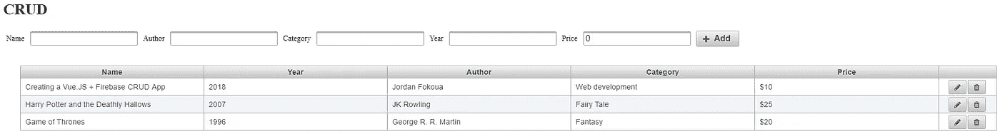

Index page

我们有一个输入表单来创建一本新书，然后是一个包含我们书籍的数据表。最后一列包含两个按钮，用于更新和删除一本书。

让我们尝试从我们的视图中插入一些数据到我们的数据库中。

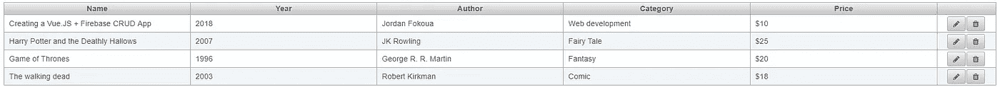

Datatable after adding new entity

【T2 更新部分(U)】

要更新一个实体，点击编辑按钮，会出现一个模态。从那里，您可以更新选择的实体

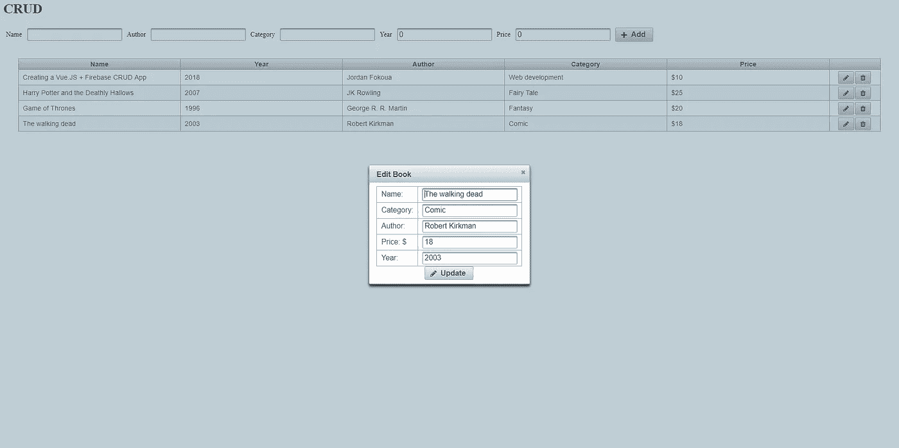

Update book modal

**删除部分(D)**

删除可以通过点击删除按钮来完成，该按钮从我们的控制器中调用相应的函数

```
**public String deleteBook(Book book)** {
        this.booksFacade.remove(book);
        return "index.xhtml?faces-redirect=true";
    }
```

我们已经到了教程的结尾。现在你可以用上面提到的各种技术来建造你自己的 J2EE 了🔥

要获得更多帮助，请给我发邮件到 jfokoua@gmail.com，或者直接发信息到我的推特上。

您可以从这个 [Gitlab](https://gitlab.com/blvck237/crud) 存储库中获得项目。

❤制造