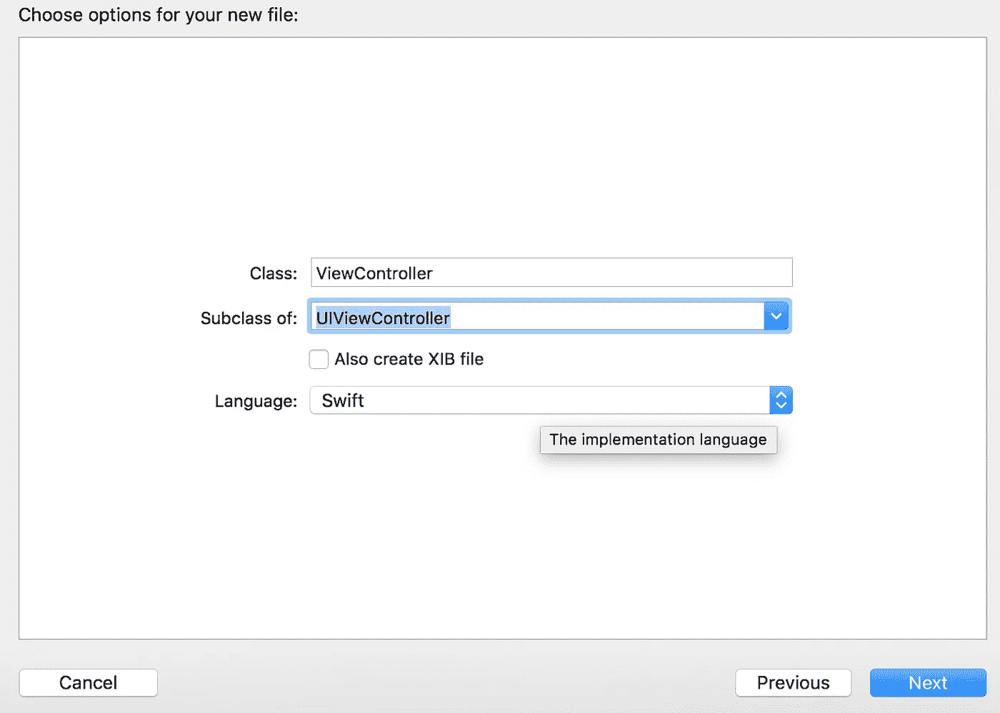
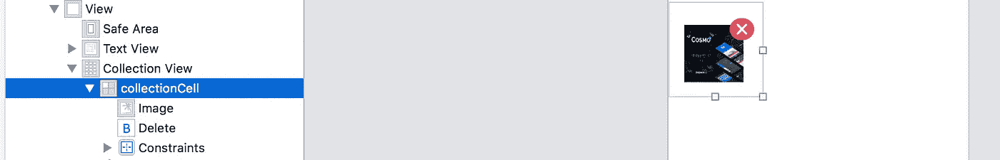
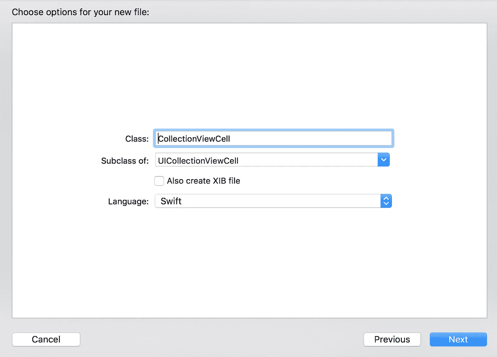
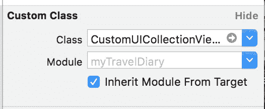
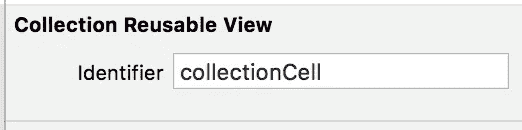
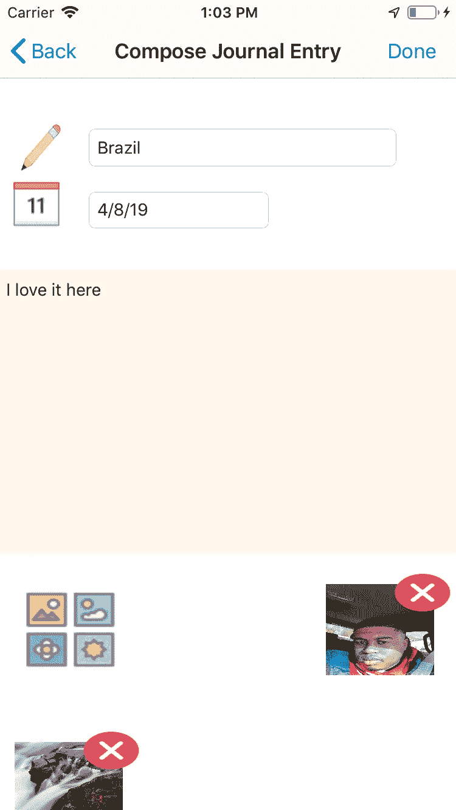

# 使用 Firebase & INSPhotoGallery 在 Swift 中创建照片库

> 原文：<https://medium.com/hackernoon/creating-a-photo-gallery-in-swift-using-firebase-insphotogallery-2a39196bcf1>


我目前正在开发一款名为 i-Travel Journal 的旅行应用程序，其中一个我想添加的功能是允许用户上传和删除 T2 图库中的照片。我在互联网上搜索一篇博文，这篇博文不仅在后端使用了 [Firebase](https://hackernoon.com/tagged/firebase) ，还使用了令人敬畏的 INSPhotoGallery Pods 框架来完成工作，但令我沮丧的是，我找不到一篇展示所有复杂细节的博文。因此，为了帮助我的程序员同事，我决定发布一个帖子来帮助某人建立并运行他们的照片库。

为了使这篇博文简短，我将提供 Firebase 文档的链接来帮助您开始，如果您还没有将它集成到您的应用程序中的话。

[Firebase SDK iOS 入门](https://firebase.google.com/docs/ios/setup)

[Firebase 实时数据库入门](https://firebase.google.com/docs/database/ios/start)

# **1。首先初始化一个新的视图控制器&初始化 UICollectionView 的委托**



```
import UIKit
import Firebase
import FirebaseDatabase
import FirebaseFirestoreclass ViewController: UIViewController, UICollectionViewDataSource, UICollectionViewDelegate, UIImagePickerControllerDelegate{
var ref: DatabaseReference!
@IBOutlet weak var collectionView: UICollectionView?
 var URLs = []()
 lazy var gallery: [INSPhotoViewable] = [] override func viewDidLoad() {
       collectionView!.delegate = self
       collectionView!.dataSource = self
    }
}
```

当你第一次初始化类***view controller***时，你会得到一个空白的 UIViewController 类，我们想使用一个***UICollectionView***来显示我们的图库，所以我们使用适当的委托方法***UICollectionView delegate***以及***UICollectionView data source***来在我们的视图控制器中覆盖某些功能。我们还将使用***ui image picker***从用户图库中选择一个图像，因此我们使用***ui image picker controller delegate。***

我还初始化了一些变量，我们稍后会用到。

下面的方法是我们将用来实现画廊以及一些助手方法，我也将创建:

```
func collectionView(_ collectionView: UICollectionView, numberOfItemsInSection section: Int) -> Int {return gallery.count + 1//Add the additional 1 to use it as the placeholder for the gallery selector image}
```

```
func numberOfSections(in collectionView: UICollectionView) -> Int {return 1
//We are only using one section of collections views for this example
//If you want to add filters to your gallery you could increase the section count}
```

```
func collectionView(_ collectionView: UICollectionView, cellForItemAt indexPath: IndexPath) -> UICollectionViewCell {}
```

```
func collectionView(_ collectionView: UICollectionView, didSelectItemAt indexPath: IndexPath) {}
```

```
func collectionView(_ collectionView: UICollectionView,layout collectionViewLayout: UICollectionViewLayout,sizeForItemAt indexPath: IndexPath) -> CGSize {
return CGSize.init(width: 150, height: 150)
//This is the default size, you can change it to fit your needs}
```

# **2。跳进主通道。故事板并用我们的组件初始化我们的 UIViewController】**



既然我们已经找到了方法，我们现在就进入正题。故事板和设置我们的组件。首先，我们从空白故事板的组件列表中拖动一个 ViewController。在侧菜单上，我们使用自定义类选项卡，并选择我们刚刚创建的自定义视图控制器的名称，您可以随意命名，但要确保它在整个应用程序中保持一致。

接下来，我们在 ViewController 上拖动一个 UICollectionView，这将自动在它下面创建一个 UICollectionViewCell 组件，我们将使用它来显示 CollectionView 的每一行所需的内容。

对于 UICollectionView 中的一个单元格，我们希望一个 UIImageView 显示一个图像以及一个删除图像的删除按钮。因此，在出现的单元格中，我拖动了一个 UIImageView 和一个 button 组件。我利用自动布局约束来定位按钮，你可以把按钮放在图像的任何角落，你可以使用你的判断力。对于删除按钮的图标，我从这里的[获得图标](http://icons8.com)，并将其拖动到 Assets.xcassets 文件中。我还为图库图片的单元格使用了一个占位符缩略图，您可以通过点击 UIImageView 并在右侧菜单中选择它来使用您选择的任何图片，只要确保它在 Assets 文件夹中即可。

# **3。创建自定义 UICollectionViewCell**



```
import UIKitclass CustomUICollectionViewCell: UICollectionViewCell {@IBOutlet weak var image: UIImageView!@IBOutlet weak var delete: UIButton!}
```

现在我们有了我们想要的 UICollectionViewCell 的结构，我们需要创建一个定制类来模拟它的结构。所以我们所做的就是创造我们自己的。

现在我们已经创建了这个类，我们回到我们的 Main。Storyboard 类，并开始将我们刚刚创建的自定义类连接到我们刚刚拖放的 UICollectionViewCell 组件，方法是转到右侧面板并选择它。



接下来，我们开始连接刚刚在自定义类中创建的 UIImage 和按钮。我们还想给 UICollectionViewCell 一个惟一的名称，这样我们以后就可以在代码中使用它，所以在下面的菜单中将其设置为。



# **4。我们返回到我们的助手方法&委托方法**

既然我们已经通过定制类完成了故事板和代码中需要做的所有连接工作，现在我们可以开始操作我们之前创建的方法了。

首先也是最重要的，看一下下面的文档，并在照片图库中安装[的可可豆荚。这就是我们将用来实际显示点击时的画廊。](https://github.com/inspace-io/INSPhotoGallery/)

# **助手方法(一大堆)**

这三种辅助方法是肉🍖和土豆🥔的应用程序。Firebase 是 dope 应用程序，它允许我们定义想要保存的记录的结构，以便轻松自由地操作和检索。为了不在每次添加新图像时覆盖所有图像，我们必须尝试以一种易于检索的方式构建图像，如下所示:

```
-Gallery
   ID -> URLGallery-
[**5C3E4F78-FC18-46C7-8545-26D229861465**](https://console.firebase.google.com/u/0/project/mytravelapp-e365b/database/mytravelapp-e365b/data/users/DTObuv266HZYF0TjHvG6cXzcxyk1/entries/-LbjHVLUJ9ZeJnQ5g3Nz/gallery/5C3E4F78-FC18-46C7-8545-26D229861465)**:**"[https://firebasestorage.googleapis.com/v0/b/mytravelapp-e365b.appspot.com/o/gallery%2F6CE2EAA7-14B8-4820-9737-466FD95AA11E.jpg?alt=media&token=b621d365-aaee-4666-9817-d8dee0022afc](https://firebasestorage.googleapis.com/v0/b/mytravelapp-e365b.appspot.com/o/gallery%2F6CE2EAA7-14B8-4820-9737-466FD95AA11E.jpg?alt=media&token=b621d365-aaee-4666-9817-d8dee0022afc)"
```

每个图像都在 gallery 子对象下，每个子对象都有一个惟一的 id，指向 Firebase 存储中的一个 URL 位置

# **提取图库**

fetch gallery 方法检查 Firebase 中是否有属于子属性 gallery 的元素。它遍历并尝试填充我们之前创建的 gallery 数组，但是在我们完成操作之前，我们希望在调用 imageToURL 方法之前防止 Gallery 显示重复的记录。 [**可以参考 Firebase 文档了解如何查询数据的语法。**](https://firebase.google.com/docs/database/admin/retrieve-data)

因此，它使用 contains 方法扫描图库，查看辅助功能引用在图库中是否有任何重复。虽然可访问性引用通常用作图像的描述性文本，但是我们在这个实例中使用它来惟一地跟踪 Firebase 中使用的 ID。

# **图像浏览**

正如在 INSPhotoGallery 文档中看到的，他们使用 INSPhoto 对象来初始化他们的图库。为了显示 UICollectionCell 的每个元素缩略图，我们必须点击 Firebase 提供的 URL，以便下载图像并在应用程序中显示它。因此，每次向视图添加元素时，我们都刷新 CollectionView，以便用最新的图像更新 UI，这就是为什么使用 DispatchQueue.main.async，以便它在主线程上激活。

# **上传图像至防火墙库**

这个方法实际上处理上传到 Firebase 的数据。目标是当用户从 UIImagePicker 中选择一个图像时，他们能够立即将数据上传到 Firebase。实时数据库中的数据在很大程度上依赖于成功上传到 Firebase 存储的图像。当图像成功上传后，完成处理程序将返回一个下载 url，其中包含到实际图像的链接，该链接被附加到现有的图库数组中。如果上传过程有任何问题，将会触发一个警报，使用以下代码通知用户:

```
func displayAlert( title: String, message: String){let alert = UIAlertController.init(title: title , message: message, preferredStyle: .alert)let dismiss = UIAlertAction.init(title: "dismiss", style: .default, handler: nil)alert.addAction(dismiss)present(alert, animated: true, completion: nil)}
```

# **CellForRowAt**

在这个方法中，我们为我们看到的每个单元格设置视图。IndexPath 是跟踪索引号的工具，用于遍历我们拥有的单元格数组。还记得我们之前创建的自定义单元格名称吗？我们用它来标识我们创建的单元定制组件的结构。

因此，对于第一个单元格行，我希望显示图库图像，允许用户与单元格交互，并隐藏删除按钮。

对于所有其他单元格，我希望显示删除按钮。我添加了一个名为 handle click 的方法，我将在后面详细讨论这个方法，它实际上处理单击时记录的删除。



# 手柄点击

此方法适用于每个附加了删除按钮的按钮。为了防止用户轻易删除元素，我使用了一个***ui alert controller***作为用户的安全卫士。如果选择了***‘是’***，使用通过 **CellForItemAt** 方法中的 **IndexPath.row** 应用的 sender.tag，则使用通过可访问性标识符传递的唯一 id 来标识元素，它在 Firebase 中找到记录并将其设置为 Nil。当从 Firebase 中删除一个元素时，会调用 FetchGallery 来更新 UI 以删除该元素。Fetch Gallery 使用一个观察处理程序，该处理程序一旦设置好，就会监听对记录的任何更新，如删除、添加或更新现有记录。

# DidSelectItemAt

**didSelectItemAt** 处理用户点击图片时发生的事情。如果索引为 0，将显示图像拾取器。我将在下面详细讨论这个问题。INSPhotoGallery 的魔力还没有真正展现出来，但这就是它现在大放异彩的地方。因为我为图库图像创建了一个占位符，indexPath 的偏移量为 1，所以为了准确显示数组的实际大小，我将数组的总计数减 1。

这实际上是从 INSPhotoGallery 文档中复制和粘贴的。在坚果壳中，他们的代码所做的是遍历图库数组的索引，并检查其中是否真的有图像。如果有图像，它会使用他们设置的特殊视图控制器以全尺寸显示。

# **图像拾取控制器**

这是最后也是最后一部分，为了上传图片，你需要一张图片！为了获得该图像，我们使用 UIImagePicker，并允许用户有机会从他们选择的图库中挑选一个图像。

如果用户成功地选择了一个图像，我们同时做两件事，我们将图像添加到 Gallery 数组，然后我们使用存储引用调用上面定义的 uploadImageToFirebase 方法。之后，我们重新加载集合视图，以便新的更改可以生效。

# **结论**

今天，我们使用 Firebase 实时数据库以及 Firebase 存储和 PhotoGallery 中流行的图片库框架创建了一个图片库。虽然这可能看起来很复杂，但您可以通过查看一个简单的应用程序来了解 Firebase 集成到应用程序中的速度有多快。


我也邀请您试用我的应用程序 [I-Travel Journal](https://testflight.apple.com/join/KCqNit2x) 的测试版。如果你愿意帮忙，测试一下，并在下面的[链接](https://docs.google.com/forms/d/e/1FAIpQLScu3QYn-tV5l1np8vw5y9urBJ3Br5X18_i4AIvONOnAybzIUw/viewform?usp=sf_link)留下反馈。感谢您阅读我的帖子，查看我以前的帖子以获取有用的信息。