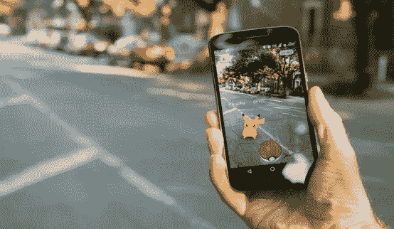
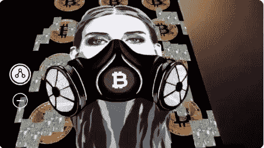

# 创造和消费增强现实艺术变得越来越容易！

> 原文：<https://medium.com/hackernoon/creating-consuming-augmented-reality-art-just-got-easier-f0ed9cbc60c8>

## 我不是程序员，也不是开发者。我创作艺术和音乐。换句话说，我只是一个愚蠢的艺术家。但是，我发现一个应用程序可以让我看起来像一个尖端的艺术屁。

## 一眨眼的功夫，我就从一个简单的画粗糙的画和做肮脏的嘻哈节拍的人变成了一个创造未来商品和艺术印刷品的人，他们有能力把我的艺术和音乐结合在一起！

When you first see your art come to life using AR.

解释 AR 最简单的方法是将其比作几年前风靡孩子们的口袋妖怪应用程序。通俗地说，简单地使用你的手机，你可以下载一个应用程序，安装并运行它，然后悬停在一个区域或一个特定的图像上。当你通过手机查看该区域或图像时，屏幕将会显示你手机上已编程的任何内容。它几乎就像一个 QR 码，你可以悬停在一个图像上，然后显示预编程的信息，在这种情况下是音频和/或视频。

Bruh.. it’s there, but like, it’s totally not even there.

几周前，我受邀成为旧金山 2019 年比特币大会的特邀艺术家。几天前，我突发奇想，注册了 Artivive 应用程序。这是我在网上随便找的一款 AR 应用。我没想太多，把注册当作一件事来做，并在我有空的时候进一步研究它。但是，在比特币活动上——我亲眼看到了[崔佛·琼斯](https://twitter.com/trevorjonesart)和[乔西·贝里尼](https://twitter.com/josiebellini)在他们的作品中使用了 AR 技术，我立刻有了在我新下载的 Artivive 应用程序中创作一些东西的想法。我一回家就那样做了。谢谢你的启发。

Still image of Josie Bellini’s art coming to life in the Artivive App.

现在，我拿了两个作品，分别是[“抽不出一个比特币”](https://twitter.com/ScrillaVentura/status/1149479991324729345)和[“负责的蜜獾头”](https://twitter.com/ScrillaVentura/status/1144824818379972609)，并将它们与 Artivive 应用程序配对，以创建一些很酷的新方式来查看[我的东西](https://rarescrilla.com/)。HHBIC 是我第一次尝试这款应用，它让我的蜜獾栩栩如生，后面还有一枚火箭射向月球。第二部分是 CSAB 艺术，完整播放“不能吸比特币”[音乐视频](https://www.youtube.com/watch?v=hPimmS0TyPs)！无论图片是在衬衫上、贴纸上、磁铁上、画布上、电脑屏幕上，这款应用都能发挥作用。我想，即使是训练有素的纹身师也能复制图像，并让它在你的身体上栩栩如生。

Head Honey Badger In Charge painting gets animated.

现在，我知道你在想什么..这个多少钱？$29.99?$9.99?$2.99?不，这个接头可以作为消费者免费使用，艺术家最多可以免费创作 3 件作品。

下一步是探索应用程序的 3D 功能。

3d Augmented Reality

很简单。它可以免费使用和创作，而且有必要查看我自己基于 AR 的创作。下载 Artivive 应用程序，开始创造你自己的现实！

附注:我不为 Artivive 工作；)