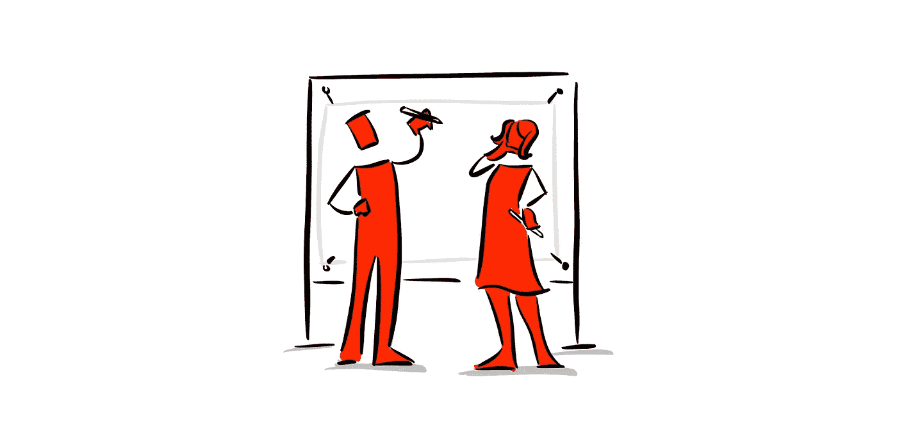

# 创造理想的 SaaS 客户体验

> 原文：<https://medium.com/hackernoon/creating-desired-saas-customer-experience-b353f754b9ac>

## 如何创造一条前所未见的成长之路？

良好的客户体验会带来多方面的财务增长。

## 惊讶🤩

第一点也是最基本的一点是，你必须瞄准让你当前的客户群惊叹不已的目标。

太多的 SaaS 企业以满足为目标。真的吗？这就是你能做的最大潜力？你是想简单地“玩”还是想在市场中“赢”？

《T2》如何让《T3》震惊，那才是让人激动的。冠军做得更多。

你如何致力于让你的顾客感到惊讶？

## 忠诚😌

*第二个是忠诚，这实际上是由共同的需求定义的。*

如果你仍然拥有所有曾经尝试过你的顾客，你的生意会有多大？

许多公司交付 30–40%范围内的共享需求。如果你能翻倍，这将是一个奇妙的增量增长，这一切都基于忠诚度，让相同的客户一次又一次地购买你的产品。

我们生意上的问题不是吸引新顾客。我们的问题是，当我们吸引他们时，我们能做些什么让他们回来吗？成为狂热的粉丝，成为瘾君子。

## 支持👍🏻

*第三，可能是最强大的是倡导。*

伟大的客户体验始于宣传，客户与其他客户交谈，这具有倍增效应。远远超过任何广告和营销。

# 客户体验是横向的

*为了让客户体验发挥作用，它必须存在于整个组织中。*

当客户体验只是一个营销问题，而你将营销之类的解决方案应用于它时，你最终会错过运营。

如果这仅仅是一个操作问题，你会像解决方案一样操作，你会错过情感联系，目的和所有其他事情。

## **公司需要采取几个步骤来改善客户体验。**

1️⃣:首先是了解谁是你的客户。细分，需求空间工作。深入了解谁会使用你的产品是你需要做的第一件事。

2️⃣:第二步是开始今天存在的**描绘客户体验之旅。**客户体验之旅有许多接触点。所以在这个阶段，你必须清楚地了解你所有的接触点。

3️⃣:最后一步是对这些接触点的评估。什么样的接触点对你的客户真正重要？一般有几个。这些接触点大约占你所有接触点的 10%,但是你必须从两个方面来评估它们:

1.  我必须赢得与竞争对手的接触点吗？所以这其中有竞争的一面。
2.  我有能力提供这个接触点吗？

今天，大多数 SaaS 公司设计他们的客户体验要么是临时的，要么是力所能及的。

**如果你做到了这些步骤，你将能够创造出一种与你今天所交付的产品有着巨大差异的客户体验。**

# ✍🏻外卖食品

*   追求惊喜，而不仅仅是满足。激情就是一切。你想烧水吗？你不会在 100 度的时候得到它；你需要所有的 212 度。
*   生意成功的关键是留住你已经得到的顾客。
*   领先的软件公司通过寻找对他们的受众真正重要的接触点，并按照客户希望这些接触点发生的方式进行设计，创造了他们想要的客户体验。
*   在提供客户体验时，如果你将满意度、忠诚度和宣传结合在一起，你将拥有一条前所未有的成长之路。

***为媒介独家出版。***

*作者:*[*Alex Gilev*](https://30kstrategy.com/about)*，用户体验(UX)顾问，专注于为想要大成果的 SaaS 公司创建创新软件。*

*Alex 曾开发和交付战略&设计财富 500 强公司(Johnson & Johnson、Compeed、PayPal)、湾区公司、美国顶级数字设计机构，并帮助初创公司处于种子期。*

他还在哈佛商学院学习了“颠覆性战略”，在 Strategyzer 学院学习了“商业模式”和“价值主张设计”。

*感谢您的阅读！*

[*推特*](https://twitter.com/alexgilev1)[*网站*](https://30kstrategy.com/articles)*[*LinkedIn*](https://www.linkedin.com/in/alexandergilev/)*