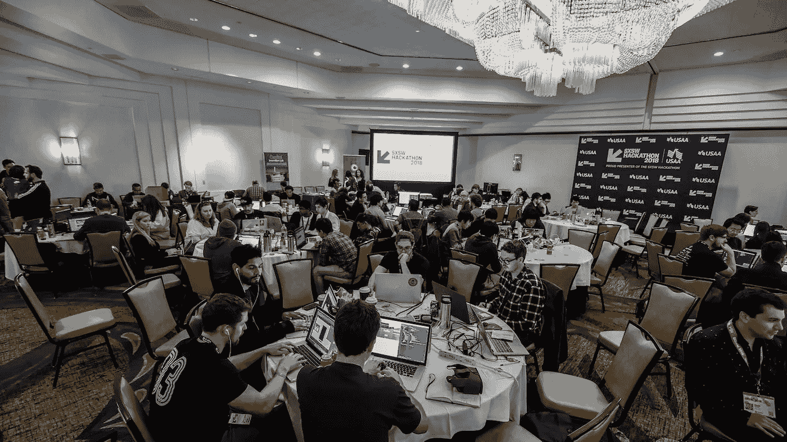
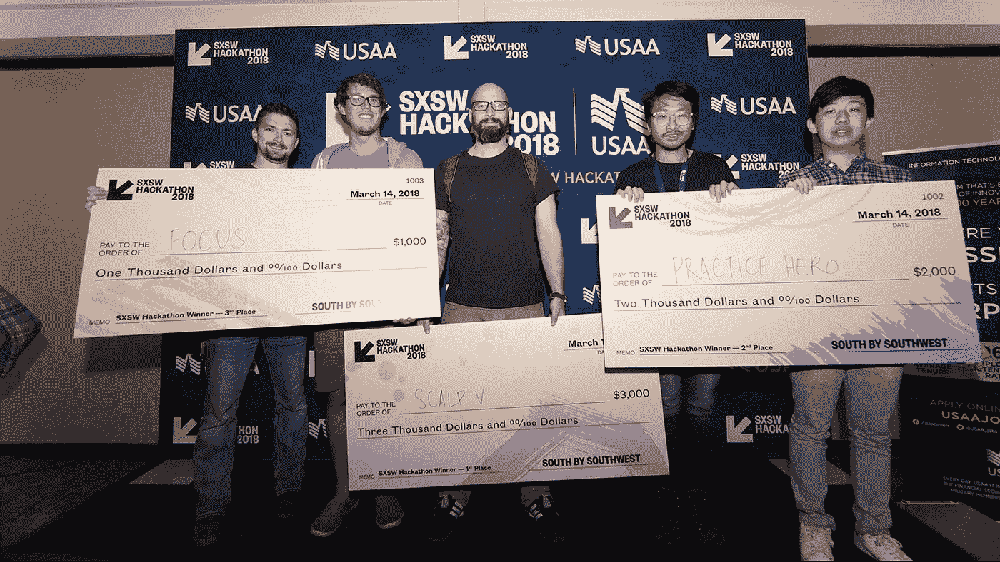
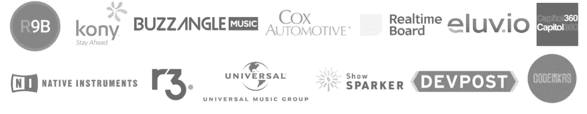

# 创造力、创新和思考 SXSW 宣布 2019 年黑客马拉松

> 原文：<https://medium.com/hackernoon/creativity-innovation-thinking-sxsw-announces-2019-hackathon-bde353e5bb94>

SXSW® has been uncovering some of the best tech creators and programmers through its SXSW Hackathons — **SXSW Hackathon 2018**

德克萨斯州奥斯汀 —对于奥斯汀的黑客们来说，这将是拥挤而激动人心的一周！西南偏南(SXSW)大会和节日(2019 年 3 月 8 日至 17 日)宣布 [SXSW 黑客马拉松](https://www.sxsw.com/conference/sxsw-hackathon/)即将回归。随着 3 月 12 日至 13 日在 [Omni Austin Hotel Downtown](https://bit.ly/2Iravfc) 举行的令人兴奋的 24 小时马拉松比赛，开发人员、编码人员和技术创意人员将团队合作，围绕会议涵盖的主题开发技术，包括音乐、VR、AR、AI 和区块链。

> “SXSW 黑客马拉松为我们创造了大量业务，我们目前能够继续创业，而不需要加速器或资金，”Constant Venture LLC 的首席执行官 Ryan Constant 说。

SXSW 黑客马拉松已经是第六届了，这是一个将你的想法付诸实践并争夺有价值奖品的绝佳机会。鼓励创新，激励开发人员和编码人员将他们的项目推向新的高度。黑客马拉松汇集了创造力和新颖性的力量，以前的 SXSW 黑客马拉松获胜者根据他们的项目成立了公司。Legit Tix，现在被称为 [Constant Venture LLC](http://constantventure.com/) ，由于竞争，已经设想了更大的图景。首席执行官 Ryan Constant 解释说:“(SXSW 黑客马拉松)为我们创造了大量业务，我们目前能够继续作为一家初创公司，而不需要加速器或资金。”。

今年的黑客马拉松将为参与者带来更大的挑战。随着来自日本、墨西哥、德国、加拿大和美国的开发人员的加入，SXSW 将继续发掘一些对技术和其他行业充满热情的最优秀的技术创造者、程序员和开发人员。

Topics covered include Music, VR, AR, AI, Blockchain, and much more.

参与的黑客将获得广泛的资源，包括来自 SXSW 官方导师的指导，公共 API 和工具，以及 SXSW 的合作伙伴 API 和 SDK。凭借 6000 美元的奖金，三个获胜团队将获得今年行业评委小组颁发的现金和赞助商奖。

今年的评委包括**斯科特·巴伯**、[索尼影视娱乐](http://www.sonypictures.com/)的副总裁制作&创新； **Josh Constine** ，TechCrunch[的自由编辑](https://techcrunch.com/)； **Louise-Marie Marguet** ， [EmoJam](http://www.emojam.com/) 的 CEO **Lauren Vitek** ，TravelBank[的创始员工](https://travelbank.com/)；**乔恩·戈特弗里德**，[美国黑客大联盟](https://mlh.io/)的联合创始人；**安德鲁·杜伯**，[音乐科技节](https://musictechfest.net/)的导演；以及**环球音乐集团新数字业务和创新高级副总裁 Tuhin Roy** 。黑客马拉松是与 [CODEMKRS](http://codemkrs.com/) 的创始人**特拉维斯·劳伦丁**联合制作的。

> “环球音乐集团很高兴与 SXSW 合作，通过支持有才华的开发者和企业家参加 2019 SXSW 黑客马拉松来鼓励新一波音乐应用和技术的发展”——环球音乐集团新数字业务和创新高级副总裁 Tuhin Roy。

所有合格的提交的黑客将由评委团审查和评级。在考虑今年黑客马拉松的前三名获胜团队后，最终的展示和颁奖活动将于 3 月 13 日星期三**下午**1:30 举行，并对所有 SXSW 徽章持有者开放。获胜者还将被邀请参加 3 月 14 日至 15 日的 SXSW 黑客马拉松孵化器，在那里他们将在行业导师的指导下调整他们的项目并追求他们的创作。有兴趣的黑客可以[在这里](https://www.sxsw.com/conference/sxsw-hackathon/)申请，截止日期为 3 月 5 日。

(Left to Right) The winners from last year’s Hackathon, including Focus, Scalp V, and Practice Hero — **Randy and Jackie Smith**

2019 SXSW 黑客马拉松由高级网络安全服务提供商 Root9B ( [R9B](https://www.root9b.com/) )赞助。今年的冠名赞助商通过其专有的搜索平台 ORION 专门从事威胁检测和消除。

其他 SXSW 黑客马拉松赞助商还包括 [Buzz Angle Music](https://www.buzzanglemusic.com/) 、 [Capitol360](https://www.capitolroyale.com/) 、 [Cox Automotive](https://www.coxautoinc.com/) 、 [Devpost](https://devpost.com/) 、 [Eluvio](http://www.eluv.io/) 、 [Kony](https://www.kony.com/) 、 [Native Instruments](https://www.native-instruments.com/en/) 、 [RealtimeBoard](https://realtimeboard.com/) 、 [R3](https://www.r3.com/) 、 [Show Sparker](https://showsparker.com/) 和[环球音乐集团](https://www.universalmusic.com/)

因此，对于所有具备条件的黑客来说，请确保在 3 月 5 日之前注册。*滚打包，滚黑客！*