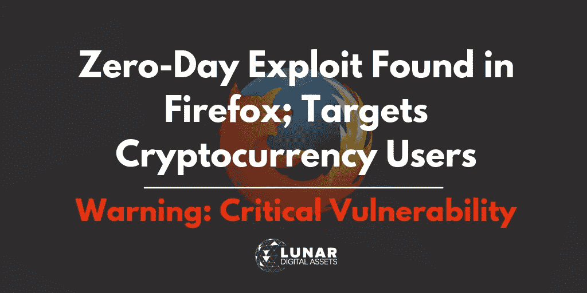
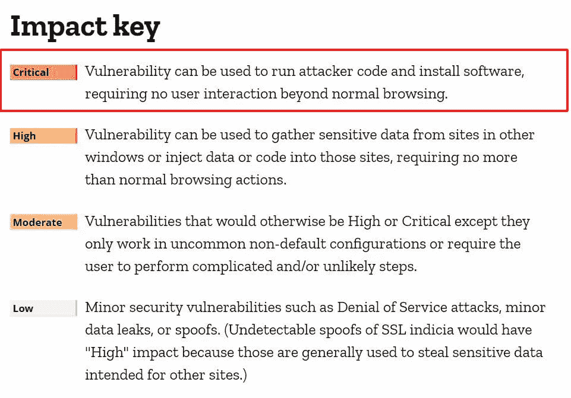

# 关键安全更新:比特币基地安全团队在 Firefox 中发现零日漏洞

> 原文：<https://medium.com/hackernoon/critical-security-update-coinbase-security-team-discovers-zero-day-exploit-on-firefox-ed888d32f18d>

## 发现针对加密用户的零日漏洞利用

比特币基地安全公司和谷歌的安全研究员塞缪尔·格罗发现了一个针对 [Mozilla Firefox](https://firefox.com) 浏览器的零日漏洞，该漏洞使用 Javascript 对象导致类型混淆。这一漏洞被追踪为[CVE-2019–11707](https://cve.mitre.org/cgi-bin/cvename.cgi?name=CVE-2019-11707)，被视为“在野外”专门针对[加密货币](http://lunardigitalassets.com/insights/a-few-cryptocurrency-facts-you-need-to-know/)用户。

*“零日漏洞利用”*是一个术语，用于首次发现的关键漏洞，对于团队来说，快速行动并发布补丁至关重要。对于浏览器用户来说，下载补丁并更新浏览器同样重要。Firefox 将这种利用评为最高类别:“关键影响——漏洞可用于运行攻击者代码和安装软件，除了正常浏览之外，不需要任何用户交互。”

上一次 Firefox 零日漏洞是在 2016 年，这使得它对于 Mozilla 的旗舰浏览器来说相当罕见。没有太多关于漏洞本身的共享，很可能是由于新漏洞的敏感性质，并阻止更多恶意黑客使用该漏洞。然而，我们确实知道，由于数组 pop 中的问题，这种利用会导致 Javascript 中的类型混乱，从而导致可利用的崩溃，[Mozilla 工程师](https://www.mozilla.org/en-US/security/advisories/mfsa2019-18/)在今天的安全公告中报告了这一点。

今天早些时候，Mozilla 团队在 Firefox 版本 67.0.3 中发布了一个补丁。再次强调，所有火狐用户，无论是否是加密货币用户，尽快更新他们的浏览器至关重要。

(像现在，是的你。)

编辑:互联网安全中心提供了更多关于该漏洞的信息。

> 在 Mozilla Firefox 和 Firefox Extended Support Release(ESR)中发现了允许执行任意代码的漏洞。由于 Array.pop 中的问题，在操作 JavaScript 对象时可能会出现类型混淆漏洞。这可能允许可被利用的崩溃(CVE-2019-11707)。成功利用此漏洞可能允许执行任意代码。根据与用户相关的权限，攻击者可以安装程序；查看、更改或删除数据。或者创建具有完全用户权限的新帐户。其帐户被配置为在系统上拥有较少用户权限的用户比那些拥有管理用户权限的用户受到的影响要小。

*最初发表于* [*农历数字资产*](http://lunardigitalassets.com/news/critical-security-update-coinbase-security-team-discovers-zero-day-exploit-on-firefox/) *。*