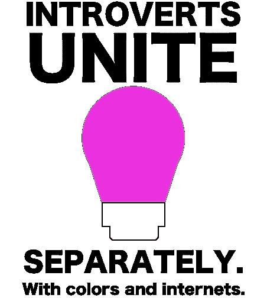
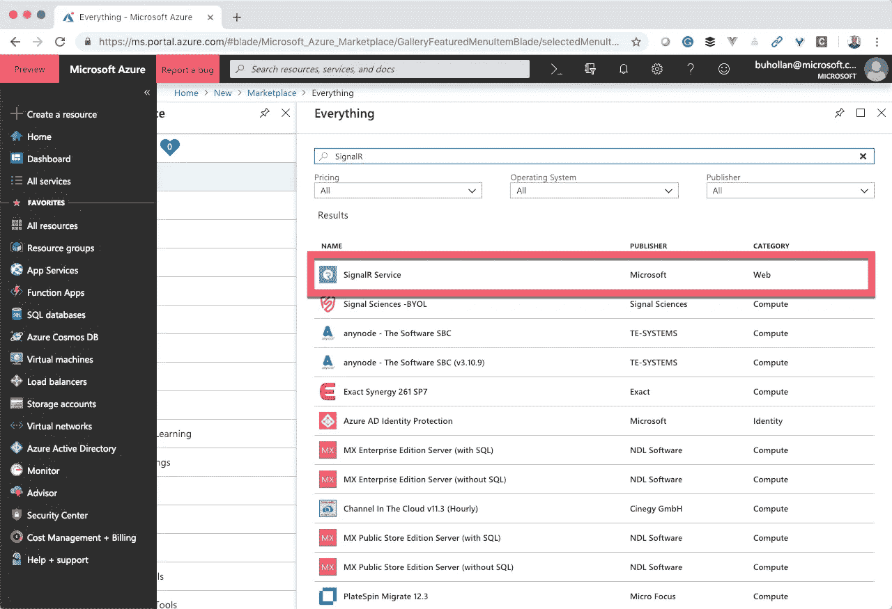
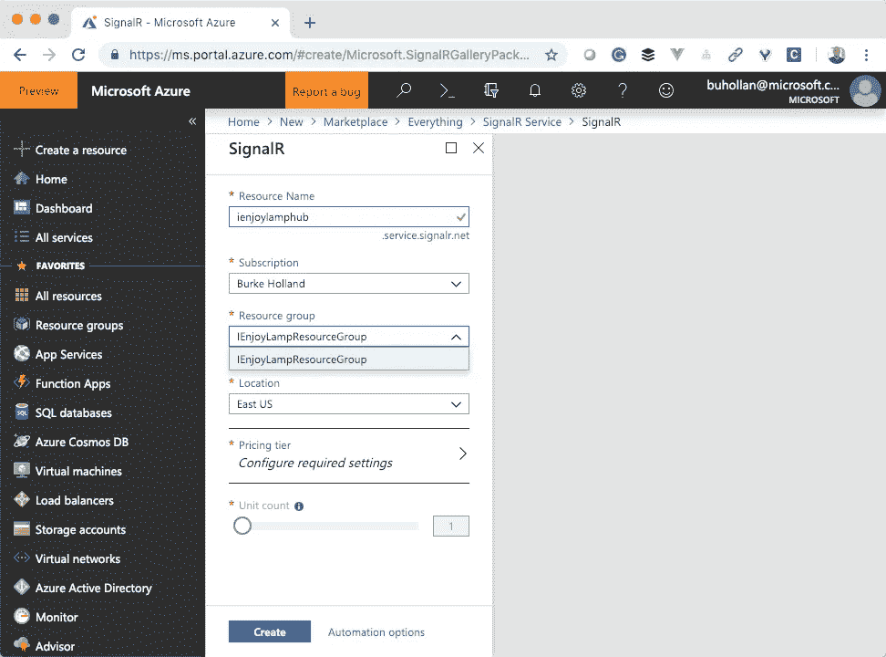
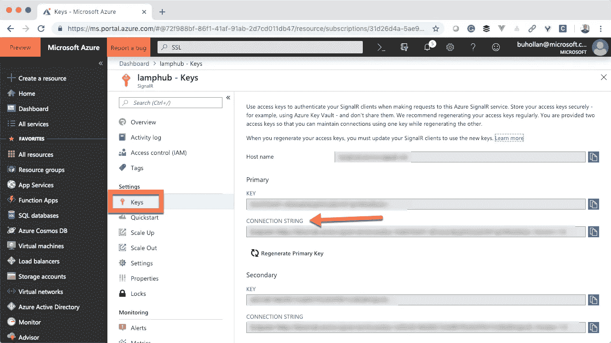

# 用无服务器和灯泡来丰富你的装饰

> 原文：<https://medium.com/hackernoon/crowd-source-your-decor-with-serverless-and-lightbulbs-cb27b34522e7>

知道如何装饰一个空间是如此的困难。墙壁应该是什么颜色？哪种家具最适合这些房间尺寸？这张[让·克劳德·云顿抱着小狗](https://www.redbubble.com/people/memesense/works/28522255-jean-claude-van-damme-holding-a-dog?finish=semi_gloss&p=poster&size=small&utm_source=google&utm_medium=cpc&utm_campaign=g.pla+notset&country_code=US&gclid=Cj0KCQiA1NbhBRCBARIsAKOTmUv4zBAt2LIGlnl8xkc4Lxuvy9CMylYNU0EpdSOxN7wKND1pT1W8mK0aAmDOEALw_wcB)的照片挂在哪里最好？


这些问题我都不知道答案——也许除了第三个(“床上”)，但我确实解决了自己的一些装修难题，让互联网通过一个联网的[灯泡](https://hackernoon.com/tagged/lightbulb)设定我办公室的颜色。

## 用 LIFX 营造气氛

我有一个简单的 [LIFX 迷你彩色灯泡](https://www.lifx.com/products/lifx-mini-color-e26)。我应该提一下，你可以自己买一个，代码为 **IENJOYLAMP** 的可以节省 20%,这要感谢 LIFX 的人。如果你这样做，我不会从中赚到任何钱，但这使 LIFX 更喜欢我，确保每个人都喜欢你难道不是生活的真正意义吗？

我用我的 LIFX 灯泡做了几十个项目。这是我最喜欢的事情之一。我创建了一个名为“[www.ienjoylamp.com](http://www.ienjoylamp.com)”(因为 ilovelamp.com 已经被占领了)的网站，它的用户界面只设置了我的灯的颜色。


[ienjoylamp.com](http://www.ienjoylamp.coms)不仅允许你改变灯泡的颜色；顺便说一句，你现在就可以做。

直播流由 Nest 提供动力，延迟明显。如果任何人有一个简单的直播设置更好的想法，不会那么慢，请让我知道。

所以我建了这个——主要是因为强烈的厌倦感和太多的盒装红酒——然后我在推特上发布了它……没人在乎。

大约一个月后，我又发了一条微博…

这条推文被杰夫·桑德奎斯特收到并转发，整个互联网都聚焦在我的灯泡上。这告诉我们，如果你真的想让某个人做某件事，那就做与孩子有关的事。

这种情况一直持续至今。我没开玩笑。就在我写这篇文章的时候，我的灯泡每隔几秒钟就换一次，一个多月过去了。

每当灯泡改变颜色，我知道有人，在某个地方这样做了，在这短暂的一刻，无论那个人在世界的哪个角落，我们都有了联系。每一种颜色的变化都像是与人一整天的微小互动，尽管我们从未说过一句话。

等等——我刚刚发现了治疗内向的方法吗？！



这个项目的有趣之处在于它使用了 Vue，一个 NodeJS API 和 web sockets。事情远比看上去的要复杂。

[Azure Functions](https://docs.microsoft.com/en-us/azure/azure-functions/?WT.mc_id=hackernoon-blog-buhollan) 在这里提供 API 端点， [Azure SignalR](https://docs.microsoft.com/en-us/azure/azure-signalr/signalr-overview?WT.mc_id=hackernoon-blog-buhollan) 提供实时功能。让我们来看看这是如何工作的。

## Azure 函数 API

前端调用的主端点一点也不复杂。它有一个方法“setColor”。

这基本上就是整个 API。它是 LIFX 自带 API 的一个薄薄的包装。它只是将请求代理到 LIFX 的服务器，但是将其抽象成我们自己的 API 会带来一些好处…

1.  我可以隐藏我的 LIFX 标记，因为它隐藏在我的 API 后面。
2.  我可以控制谁可以用 Azure 函数中的 CORS 设置调用这个 API。
3.  我可以使用 Azure Functions 令牌来保证安全性，并随意轮换它们。
4.  我可以用 Azure SignalR 绑定实时添加。

## 无服务器实时运行

我的灯在推特上传播后不久，安东尼·朱在推特上对我说…

现在，开源的第一条戒律说，“无论谁请求一个特性，他们也应该提出一个拉取请求作为一个令人愉快的牺牲”。

此后不久，所说的牺牲被提出和取悦…

当你改变 ienjoylamp.com[上的灯的颜色时，](http://www.ienjoylamp.com,)它会改变网站的背景颜色来匹配。安东尼在网站上做了连线，这样无论何时何地任何人改变灯的颜色，你的背景都会改变。这意味着我们现在都以某种微小的方式联系在一起。

都是那么感性。

Anthony 通过将我现有的 API 绑定到 Azure SignalR 来实现这一点。

## 天蓝色信号机

SignalR 起源于 web 套接字上的 ASP.NET 抽象。它减少了作为开发人员必须做的样板文件和布线工作，以及处理您不愿意做的事情，比如在客户端不支持 web 套接字的情况下退回到长轮询。虽然现在是 2019 年，而且每个浏览器都支持套接字。

Azure SignalR 对此做了进一步的抽象，将整个事情转化为一个托管服务，你可以从中发送和接收消息。

你可以像其他 Azure 服务一样从 Azure 门户网站设置它。



然后服务被创建出来，像玛丽·波平斯一样坐在云端。


The greatest movie, or greatest movie ever?

为了从 Azure Functions 与这个东西对话，我们必须为 SignalR 创建一个绑定。为此，你必须为 Azure 函数安装 Azure SignalR 绑定。

```
func extensions install --package Microsoft.Azure.WebJobs.Extensions.SignalRService -Version 1.0.0-preview1-10025
```

现在您需要创建的 Azure SignalR 实例的连接字符串。这可以在门户网站中 Azure SignalR 服务的“密钥”部分找到。



将该连接字符串作为变量添加到您的`local.settings.json`文件中。

```
{
  "IsEncrypted": false,
  "Values": {
    "AzureWebJobsStorage": "",
    "FUNCTIONS_WORKER_RUNTIME": "node",
    "LIFX_TOKEN": "nunya",
    "AzureSignalRConnectionString": "Endpoint=[https://nunya.service.signalr.net;AccessKey=nunya;Version=1.0](https://lamphub.service.signalr.net;AccessKey=OuhSY0eAV+dGrlauEr4j/gDGCjLbGHX1apY4NzOExZs=;Version=1.0);"
  }
}
```

然后在前面创建的 SignalR 服务的`function.json`文件中添加一个绑定。

有了这个绑定，我们就可以向 Azure SignalR Hub 发送消息了。本文前面的代码片段中的这段代码就是这样做的。

“目标”是您希望 Azure SignalR hub 调用的方法的名称。任何你想得到这个事件通知的客户都需要收听`colorChanged`事件，我们一会儿就去。

在我们实际连接客户端之前，我们需要为客户端添加一个连接位置。按照惯例，SignalR 寻找一个“协商”端点。这在稍后会更有意义，但是现在，我们需要 API 中的第二个函数“negotiate”。这个端点所做的只是返回集线器连接信息，以及一个允许客户端与 SignalR 服务通信的令牌。

这个新函数是一个 HTTP 函数，它只是被称为“negotiate”。在`function.json`文件中为 Azure SignalR 添加一个绑定。

请注意，安东尼以我的名字命名了“枢纽”。您可以随意命名您的中心。请确保在所有绑定中使用相同的名称，这样您就可以与同一个集线器对话。

现在，为代码做好准备…

所做的只是返回 SignalR hub 的连接信息。

我为没有足够的无聊信息而道歉。你想让我就 async/await 的优点发表意见吗？没有吗？你宁愿做根管治疗？那就继续吧。

我们现在准备好连接所有这些的前端。

## 给灯接线

这个应用程序的前端是用 Vue 构建的，因为这是新的热点，而且已经有一个很棒的颜色选择器组件可用于 Vue，名为 [vue-color](https://www.npmjs.com/package/vue-color) 。它太容易使用了，以至于你的牙齿会痛。

很漂亮——是吗？现在每当有人改变颜色，我就调用[无服务器](https://hackernoon.com/tagged/serverless) API 并发送颜色值。同时我还设置了页面的背景颜色。

现在。让我们来讨论一下，每当其他地方的人忙于颜色选择器时，我们是如何改变页面的颜色的。

为此，我们需要倾听 SignalR hub 的变化，然后更新页面颜色。为此，我们需要来自 npm 的 SignalR 包。

```
npm i @aspnet/signalr
```

现在我们连接到集线器。因为我正在使用 Vue，所以我可以在 component `mounted`方法中这样做。

记住这个“colorChanged”回调将在我们改变服务器上的颜色**时被调用。我们的无服务器 API 在改变灯泡颜色时会自动触发。所以我们现在要做的就是调用设置灯泡颜色的端点。**

这几乎就是整个应用程序。在实际应用中，有一些延迟问题需要处理。例如，当您更改颜色时，您必须等待服务器响应颜色已更改，而这不是即时的。我做的是显示一个微调器，然后每当服务器响应灯泡更新时改变页面的颜色——而不是之前。这就是为什么你知道灯泡已经变成了页面上的颜色。

顺便说一下，你知道吗，你可以用 [Spin.js](https://spin.js.org/) 给你的应用添加一个简单的旋转器？现在是 2019 年，生活中有哪些事是 npm 包做不到的？上帝保佑互联网。

## 你可以做的其他事情

你可以用 SignalR 和 Azure 函数做很多其他的事情。实时开辟了全新的可能性领域。我有一堆关于这个台灯网站的想法。

当我在做这个的时候，确保你检查了这些 Azure 函数/ SignalR 资源来开始你的工作。

[](https://docs.microsoft.com/en-us/azure/azure-signalr/signalr-quickstart-azure-functions-javascript?WT.mc_id=hackernoon-blog-buhollan) [## Azure SignalR 服务无服务器快速入门- JavaScript

### 使用 Azure SignalR 服务和 Azure 函数创建聊天室的快速入门。

docs.microsoft.com](https://docs.microsoft.com/en-us/azure/azure-signalr/signalr-quickstart-azure-functions-javascript?WT.mc_id=hackernoon-blog-buhollan) [](https://docs.microsoft.com/en-us/azure/azure-signalr/signalr-overview?WT.mc_id=hackernoon-blog-buhollan) [## 什么是 Azure SignalR

### Azure SignalR 服务概述。

docs.microsoft.com](https://docs.microsoft.com/en-us/azure/azure-signalr/signalr-overview?WT.mc_id=hackernoon-blog-buhollan) [](https://docs.microsoft.com/en-us/learn/paths/create-serverless-applications?WT.mc_id=hackernoon-blog-buhollan) [## 创建无服务器应用程序学习路径

### Azure 函数支持创建事件驱动的按需计算系统，这些系统可以由各种…

docs.microsoft.com](https://docs.microsoft.com/en-us/learn/paths/create-serverless-applications?WT.mc_id=hackernoon-blog-buhollan)