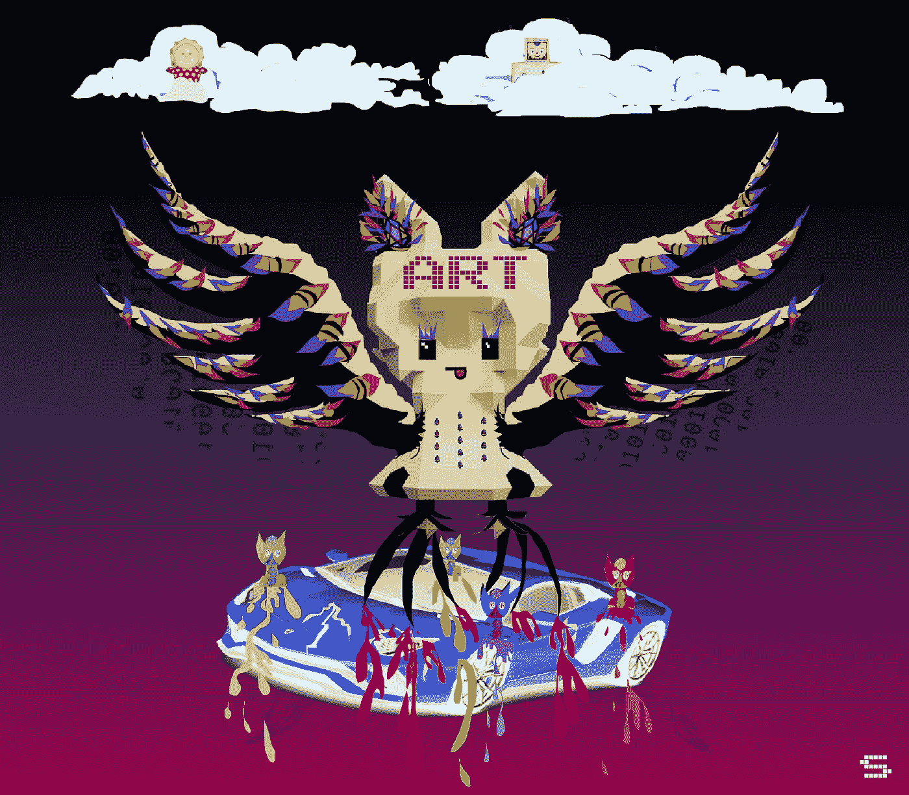
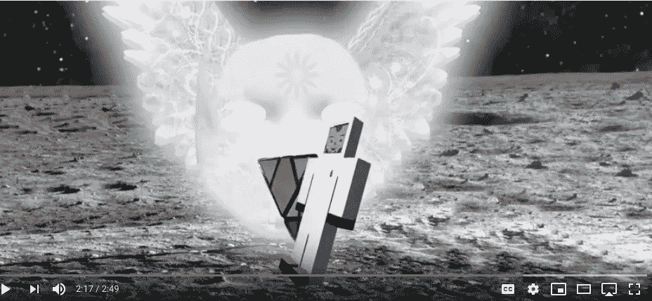
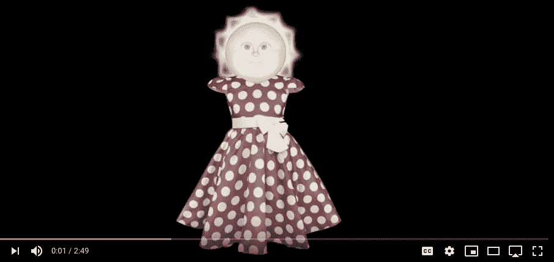
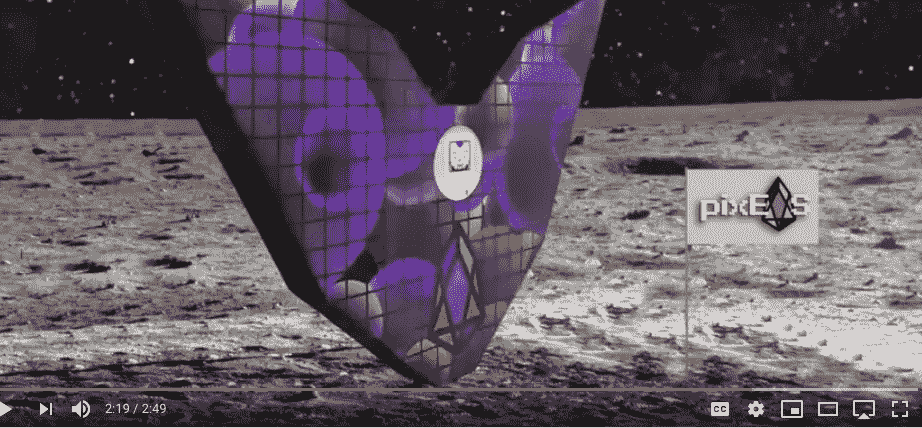
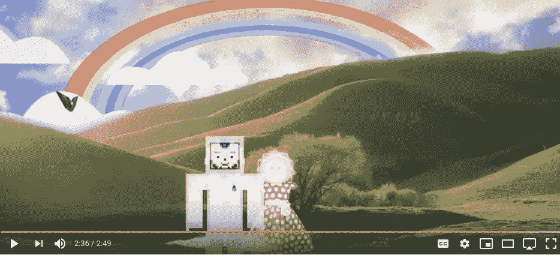

# Crypto 2019:当制作艺术时，我可以给兰博基尼一个 fuk

> 原文：<https://medium.com/hackernoon/crypto-2019-when-making-art-i-could-give-a-fu-k-about-lambos-1dd3652b61ca>

art by Stellabelle

# 如果你在秘密世界，你知道兰博基尼象征着什么:即时的秘密利润，荒谬的登月，荒谬的 6000%的回报，睡觉时炫耀的财富。

2017 年，加密交易员正在计算他们的加密投资组合中获得的 Lambos 数量。似乎每个人最疯狂的秘密幻想都变成了现实。然后熊市来袭，噗，它几乎消失了。快速浏览一下 crypto Twitter，你在任何人的订阅上都找不到一个蓝宝。蓝宝的日子进入了冬眠，所有的弱者和秘密旅游者都消失了。唯一剩下的人是真正的信徒，精明的企业家，程序员，生活在没有正常运作的金融系统的失败政府中的人，未来主义者，建筑商，顽固的赛博朋克，我们不能忘记赌博成瘾者，他们也在那里。

你会认为所有的希望都破灭了，但你错了。正是这种环境激发了我们所有人的斗志和创新精神。有时候失去一切会让你以一种新的方式来欣赏生活(只要你在这个过程中不要太沮丧)。太多的财富导致懒惰的生活，当每顿饭都有奢侈品相伴时，就不会有很多东西被建造出来。财富没有错，但大多数人类无法应对极端的财富和极端的权力。它让我们变得太懒，太自大。

# 这就把我们带到了艺术。

艺术在西方文化中被误解了。在这个过程中的某个地方，它被搞砸了，人们把有创造力的人和没有创造力的人分开了。这种分歧导致了评判，然后孩子们长大后认为他们的创造性想法是不好的。

小时候，有人告诉我，我的画“不现实，因此不好。”我对自己创造的一切都深感羞愧，从来不认为自己是艺术家。事实是，我相信每个人都是某种艺术家。我们被洗脑了，以为自己不是。

# 艺术和兰博基尼有什么关系？

没什么。但是我最近遇到了一个人，他经历了一种创造性的重生。在 2017 年的加密牛市期间，他追逐蓝宝梦想，忽视了他的创造力，以换取追逐最新的 moonshot 蓝宝加密项目。他所有的精力都花在研究区块链理工大学和投资各种加密项目上。当他进入平流层寻找 Lambos 时，他的创造才能被抛到了一边。

如果不是他在 YouTube 上制作了一个名为 [PIXEOS 拯救世界:Spaceman 先生](https://youtu.be/opf1eg6n6UM)的视频，我根本不会知道这一切，这个视频在几天内就迅速走红。它现在有近 10，000 的浏览量，而且是 4 天前才发布的。10，000 次观看听起来可能不是很多，但没有营销，没有预先存在的订户，没有付费广告，甚至没有 mBlu Spaceman 的 YouTube 频道上的任何其他视频。这是怎么发生的？为什么他的视频会火起来？

我联系了 mBlu Spaceman，了解他的视频中发生了什么，在你阅读采访之前，先看看他的视频:

# 采访 mBlu 太空人:

Stella: 你从事加密工作多久了？

**mBlu:**2013 年我买了比特币，后来就忘了。你可以说我是一个密码工。

**S:** 我现在已经看了几遍你的太空人视频，感觉背后有故事。那是什么故事？

在找到 crypto 之前，我是一名音乐家、视频制作人和艺术家，也是一个非常有创造力的人。2013 年买了比特币，后来就忘了。然后在 2016 年，我的朋友告诉我这种令人难以置信的新技术叫做以太坊，它引发了我的“蓝宝热”，并让我在漫长的冬眠后打开了我的比特币钱包。

那时，我全身心地投入到了加密领域，我的头脑一片空白，我投资了 100 多个不同的加密项目，并且一直在寻找下一颗蓝宝 moonshot 魔法子弹。我一直在追逐它们，基本上已经停止了艺术创作。我忙于学习和研究这些新的区块链项目，试图找出哪一个将登陆月球。在这段时间里，我完全失去了平衡，一个漂浮的异常点，与自己创造性的一面失去了联系。由于对下一次登月的贪得无厌的追求，我失去了对加密真正价值的认识。我加入了一些密码社区，但由于很多原因退出了，包括缓慢的交易速度。当我找到 pixEOS 时，我内心的火花再次被点燃，我感到如此受鼓舞，我制作了关于我旅程的视频。

*still from* [*Mr. Spaceman video*](https://youtu.be/opf1eg6n6UM)

好的，这无疑描绘了一幅许多人都能理解的画面。这和视频里的故事有什么关系？

**M:** 视频中的太空人和女人都是我自己的一面。当太空人(我的一部分，深入到秘密兔子洞)在外太空探索最新的秘密炒作周期时，我的创造性在地球上被忽视了(没有胳膊和腿的女人代表了被忽视的创造性)。在我的探索过程中，我发现了 EOS 项目，尽管有些模糊，但我发现了其中的指数创新力。EOS 具有自我修复的特性，为此，我认为 EOS 有潜力让世界变得更好。EOS 是我的宝贝。

这位既是战士又是探险者的太空人，正在探索生命更深层的意义。随着 2017 年的很大一部分被追逐月球照片和兰博思的梦想所定义，我开始问自己:

> “我在做什么？追新月照的内在价值是什么？”

然后我意识到，加密不是关于兰博基尼。我在寻找生命中更多的意义。我在寻找一个社区和一个不同的价值体系，一个重视我们所有人的创造力的价值体系。然后在一个很远很远的星球上，我发现了 [pixEOS](https://www.pixeos.io/) ，它让我再次完整。

视频中的女性角色没有胳膊和腿，这象征着我被严重忽视的创造性的一面。

*still from* [*Mr. Spaceman video*](https://youtu.be/opf1eg6n6UM)

**S:** 哇。我能完全理解。说说完整，完整的感觉，不想再追逐蓝宝梦了…..

完整的感觉比任何物质财富都更令人满足，包括兰博基尼。当我在创作艺术、视频或歌曲时，我完全迷失了自己。我在寻找更伟大的东西。我们都知道我们在生活中要做什么，但我们很少做需要做的事情。如果我们不做该做的事，我们就不会完整。如果我们允许自己不加判断地探索我们的创造力，如果我们把它释放到这个世界，那么它就能成为点燃他人的催化剂，给我们自己带来完整。它可以为我们的生活带来全新的意义。

## 在创作的热潮中，我可以给兰博思一个他妈的。

*still from* [*Mr. Spaceman video*](https://youtu.be/opf1eg6n6UM)

视频的结尾代表了什么？

**M:** 在视频的最后，我存在的两个自我合二为一了。太空人脱下宇航服，去了秘密宇宙的外缘，我的创造性被重新点燃，这是由现在有腿和新身体的女人象征的。那张总是沾沾自喜地微笑着的太阳脸也被取代了。我自己的这两个部分最终融合在一起，我再次感到完整，随着皮克斯在山里，愈合过程已经进入高速档。

*still from* [*Mr. Spaceman video*](https://youtu.be/opf1eg6n6UM)

因此，pixEOS 的首席执行官弗雷德将 mBlu Spaceman 的视频作为 pixEOS Paint Dapp 发布的官方国歌，而 pixEOS Paint Dapp 恰好在 2019 年 2 月 2 日这一时刻发布。mBlu Spaceman 没有被委托制作这个视频，他是自愿的，没有经过许可。

昨天刚刚推出的 PixEOS Paint Dapp。你可以从这里开始玩:[https://paint.pixeos.art/#/](https://www.youtube.com/redirect?v=ssEjGLu_2q4&event=video_description&redir_token=4a5mAjjhA2xrE-ww-Ob60b-G9Ft8MTU0OTI5MjM4M0AxNTQ5MjA1OTgz&q=https%3A%2F%2Fpaint.pixeos.art%2F%23%2F)

如果你需要一个免费的 EOS 账户，请进入 pixEOS 电报频道，为你的免费 EOS 账户申请一个代码:[https://t.me/PIXEOS](https://t.me/PIXEOS)

干杯，
Stellabelle