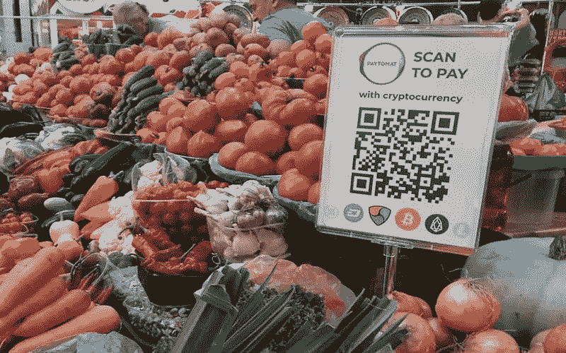
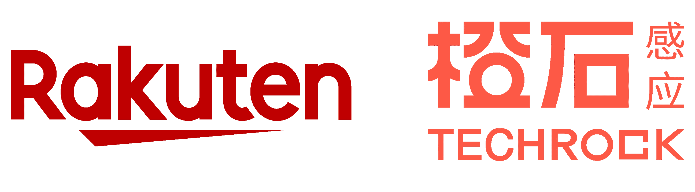
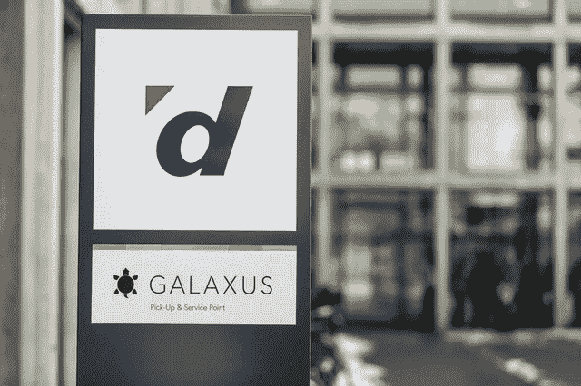
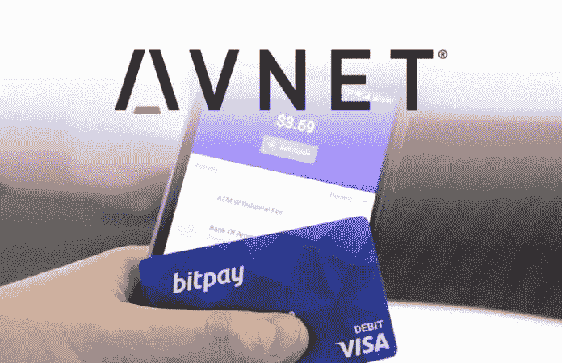
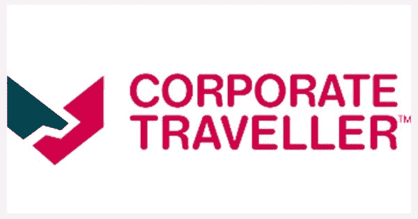
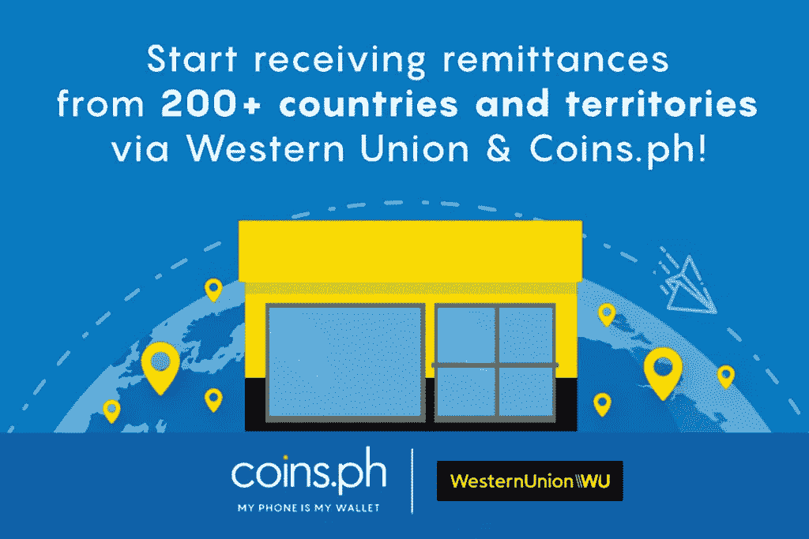
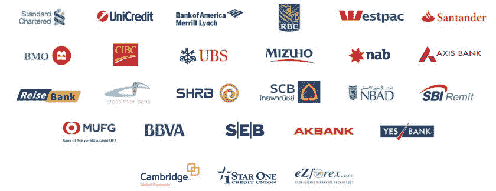
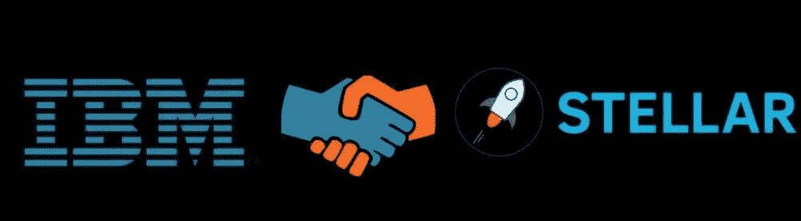

# 2019 年的加密采用——谁都采取了行动。

> 原文：<https://medium.com/hackernoon/crypto-adoption-in-2019-who-all-made-a-move-9c12f0f9ae52>

虽然许多加密交易商和持有者对快速致富更感兴趣，但比特币以及所有主要加密货币背后的主要目标是为当前高度集中并由少数实体控制的货币形式提供一种去中心化的选择。这个目标只能通过主流的采用来实现。

一堆项目像 [Aelf](https://aelf.io/) 、 [Ripple](https://ripple.com/) 、 [Tezos](https://tezos.com/) 、 [SOMA](https://soma.co/) 、 [BNB](https://www.binance.com/) 等等。就是为此而创建的。所有这些项目都在推动加密货币作为日常服务交换媒介的广泛使用。

所有这些都始于 2014 年的**Overstock.com**，它为客户通过比特币购买商品打开了大门。第一天，他们收到了价值 124，000 美元的订单。这只是开始。

快进到 2019 年；我们已经看到投资者的乐观情绪回归，机构投资者的兴趣增加，以及主流适应方面的一些重要消息。

让我们来看看在过去的四个月中发生的一些主要的主流改编。

# 乐天

[乐天](https://www.rakuten.co.jp/)是日本的“亚马逊”，注册用户超过 9000 万，全球年收入超过 1 万亿日元。乐天目前是全球第三大电子商务市场公司，业务网络涵盖电子商务、旅游、银行、证券、在线营销和职业体育。

4 月 17 日，乐天与 Tael(Wabi)合作，在[@ techrochq](https://twitter.com/TechrockHQ)零售渠道内为产品开辟了一个专门的“专区”，并致力于整合 [#Tael](https://twitter.com/hashtag/Tael?src=hash) 忠诚度积分。

乐天还因其加密货币交易服务——乐天钱包——开始注册账户而成为新闻。预计乐天将在 6 月中旬允许用户交易加密货币，未来乐天将在其在 29 个国家运营的平台上接受加密支付。[链接](https://www.investinblockchain.com/rakuten-soon-to-accept-crypto/)

# Digitec Galaxus

根据官方新闻稿，瑞士在线零售商巨头 [Digitec Galaxus](https://www.galaxus.ch/en) 开始接受比特币(BTC)、比特币现金(BCH)、比特币 SV (BSV)、以太坊(ETH)、Ripple (XRP)、币安币(BNB)、莱特币(LTC)、Tron (TRX)、NEO (NEO)和 OmiseGO (OMG)购买价值超过 200 美元的商品。

 [## digitec 和 Galaxus 现在接受加密货币

### digitec 和 Galaxus 引入了加密货币作为支付方式。瑞士最大的网上商店的顾客…

www.digitec.ch](https://www.digitec.ch/en/page/cryptocurrencies-now-accepted-on-digitec-and-galaxus-11214) 

# Avnet

[Avnet](https://www.avnet.com/wps/portal/us/) 宣布通过与区块链支付处理器 BitPay 的合作接受加密货币支付。Avnet 是一家财富 500 强公司，他们让客户选择用比特币(BTC)或比特币现金(BCHABC)支付

 [## Avnet 通过接受加密货币引领行业

### 凤凰城—(商业资讯)—全球领先的技术解决方案公司 Avnet(纳斯达克代码:AVT)正在与 BitPay 合作…

news.avnet.com](https://news.avnet.com/press-release/avnet/avnet-leads-industry-accepting-cryptocurrency) 

# 东日本铁路公司

据日本新闻节目 ANN News 报道，云和互联网服务提供商 IIJ 正与 [JR East](https://www.jreast.co.jp/e/) 合作，让旅客用 crypto 支付火车票。JR East 将允许客户以加密方式支付(比特币、莱特币、比特币现金和 Ripple)。他们的 Sucia 智能卡将有可能通过下延的虚拟货币交换实现

 [## 日本铁路公司接受游客密码

### 日本的加密货币正在以非常显著的速度增长，尤其是与世界其他地区相比…

cryptodaily.co.uk](https://cryptodaily.co.uk/2019/03/japanese-railway-firm-accept-crypto) 

# 商务旅行者

[Corporate Traveller](https://www.corptraveller.co.uk/) 是英国领先的中小企业商务旅行管理服务专业提供商之一。最近，它宣布中小企业客户可以使用比特币和比特币现金支付。他们与 BitPay 合作处理所有的加密交易。

 [## 企业旅行者与 BitPay 合作接受加密货币支付

### 伦敦—(美国商业资讯)—2019 年 4 月 15 日—英国领先的商务旅行专业提供商 Corporate Traveller

www.apnews.com](https://www.apnews.com/Business%20Wire/c8487f5070b74a1685a6212e05c64858) 

# 阿迪达斯

VeChain 因提供 NFC 芯片用于限量版《权力的游戏》阿迪达斯鞋而成为新闻，该鞋由新加坡鞋设计师 SBTG 设计。任何使用 VeChain 移动应用程序的用户都可以扫描这些 NFC 芯片，其中包含关于运动鞋的独家视频，可以播放和观看

 [## Vechain 的 NFC 芯片用于阿迪达斯运动鞋，旨在庆祝最新的《权力的游戏》…

### VeChain 项目的 NFC 芯片将用于 HBO 和新加坡运动鞋设计师开展的推广活动中…

www.investinblockchain.com](https://www.investinblockchain.com/vechains-nfc-chips-used-in-adidas-sneakers-designed-to-celebrate-the-latest-game-of-thrones-sneakers/) 

# 海尔集团

 [## VeChain、DNV GL、海尔 IoC 达成三方战略合作伙伴关系

### 用区块链和物联网技术赋能服装生命周期管理系统

medium.com](/@vechainofficial/vechain-dnv-gl-and-haier-ioc-enter-into-tripartite-strategic-partnership-ed1abc7e98b4) 

4 月 1 日，VeChain、DNV GL 和海尔 IoC 达成三方战略合作伙伴关系，以提高供应链的透明度。VeChain 的可追溯性应用程序“我的故事”将用于验证产品，防止欺诈，跟踪碳足迹以及每件海尔产品的更多信息。

# 西部联盟

汇款巨头西联汇款公司与区块链初创公司 Coins.ph 合作，使菲律宾居民能够通过 Coins.ph 数字钱包接收现金汇款。这是采用加密技术的最好消息之一，因为估计有 1000 万菲律宾人在海外工作或居住。

除了接收吴的汇款，Coins.ph 用户还可以在同一钱包中购买、出售和存储几种主要的加密货币，包括比特币、以太坊、和比特币现金。

# 涟漪和堤岸

市场上最适应的加密货币之一是 Ripple 的 XRP。Ripple 旨在挑战 SWIFT，其主要目的是促进金融机构之间安全、廉价和快速的交易。

2019 年，Ripple 继续向其投资组合中添加更多金融机构。这些银行包括欧洲进出口银行、PNC 银行、Transpaygo、联邦银行、SendFriend、Cuallix 和 Mercury FX 等。

除此之外，2019 年可以说是 ripple 出色的一年，因为它们在比特币基地上市，世界银行、国际货币基金组织和欧盟委员会等机构都与该项目建立了合作伙伴关系。这些合作伙伴关系显示了一个可靠的增长迹象，以及加密不再是不可避免的事实

 [## 国际货币基金组织、世界银行和欧盟委员会对 Ripple 的参与正使 XRP 势不可挡

### 涟漪和数字资产 XRP 将是不可阻挡的与最近得到的国际货币基金组织的支持…

bitcoinexchangeguide.com](https://bitcoinexchangeguide.com/imf-worldbank-and-eu-commission-involvement-with-ripple-are-on-pace-to-make-xrp-unstoppable/) 

# 星巴克

星巴克已经准备好接受比特币。星巴克已经投资了区块链平台 Bakkt，目前，他们正在整合区块链。预计一旦 Bakkt 上线，星巴克将成为“ **Bakkt 第一家平台商户**”。将开始接受通过 Bakkt 的加密支付。

 [## 贝克的咖啡？消息人士称，星巴克股权交易将采用加密支付

### 据称，Bakkt 和星巴克之间有数量不明的股份易手，以换取支付支持。

cointelegraph.com](https://cointelegraph.com/news/coffee-for-bakkt-starbucks-equity-deal-will-see-crypto-based-payments-source-claims) 

# 国际商用机器公司

2019 年 3 月中旬，IBM 宣布推出 **World Wire** ，这是恒星网络上的一个实时全球支付网络。

据 IBM 称

> “这是首个基于区块链的网络，将支付报文传送、清算和结算集成在一个网络上”。

世界有线网络将支持 70 多个国家的即时外汇支付和结算，支持近 50 种货币和 45 个银行端点。

 [## IBM 区块链世界线—跨境支付解决方案

### IBM Blockchain World Wire 是一个跨境支付解决方案，用于清算和结算近…

www.ibm.com](https://www.ibm.com/blockchain/solutions/world-wire) 

# JP 摩根

当摩根大通宣布推出 JPM 硬币的计划时，很多人都感到意外。

过去，摩根大通首席执行官杰米·戴蒙评论道

> “我从来没有改变过我说过的话，我只是后悔说了那些话。我不想成为反对比特币的代言人。我真的不在乎，这才是重点。区块链是真实的，它是技术，但比特币不等同于法定货币。”

现在，即使是摩根大通也意识到了区块链的潜力，推出了 JPM 币，这将是美国主要银行创造的第一种加密货币。JPM 硬币背后的主要目的是结算客户和贷方之间的支付，并将跨境支付或公司债务发行服务转移到区块链，这可能对金融科技行业产生重大影响。

 [## 摩根大通创造用于支付的数字货币

### 摩根大通

创造用于支付的数字货币|摩根大通 Morganwww.jpmorgan.com](https://www.jpmorgan.com/global/news/digital-coin-payments) 

# 结论

到目前为止，2019 年是充满机遇的一年。以上给出的都是确定的合作关系。关于更多的公司进入这个市场，有很多疯狂的谣言，比如脸书、Telegram、Visa、Amazon 甚至 SWIFT。

正如引用的那样

> “首先他们忽视你，然后他们嘲笑你，然后他们和你斗争，然后你赢了”

【2019 年将会是密码大规模应用之年吗？