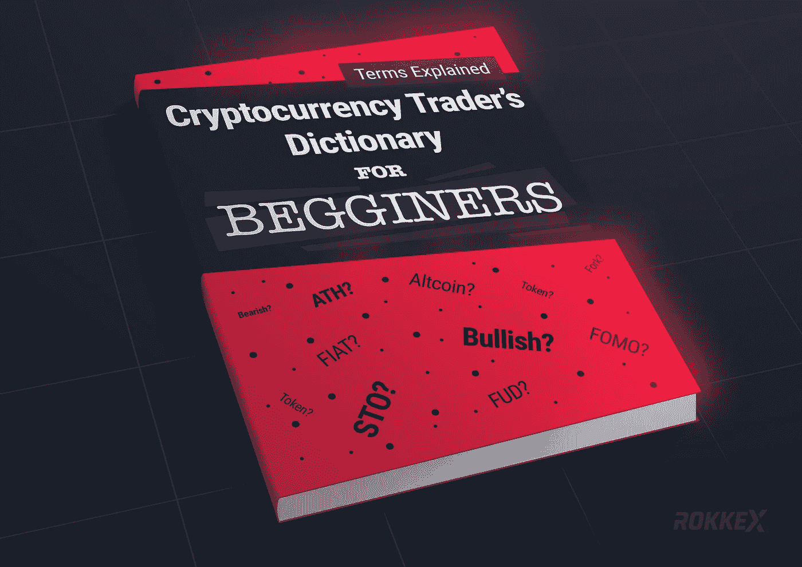
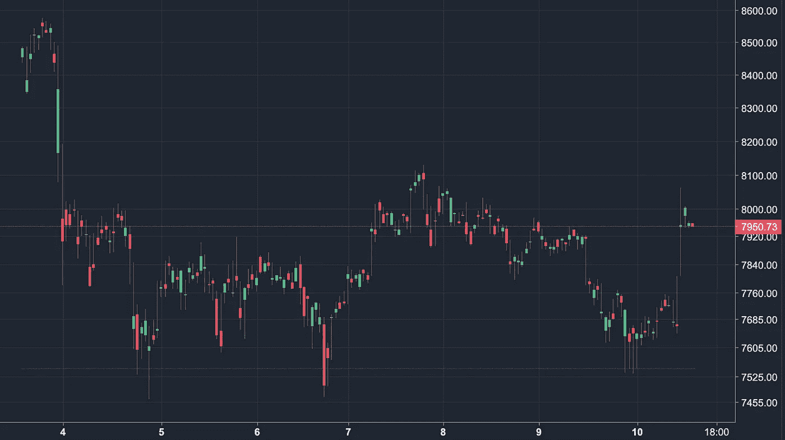
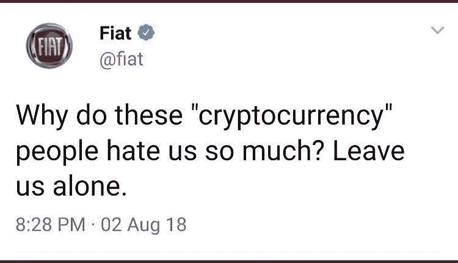
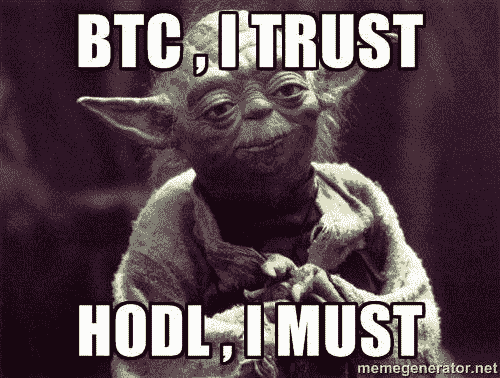
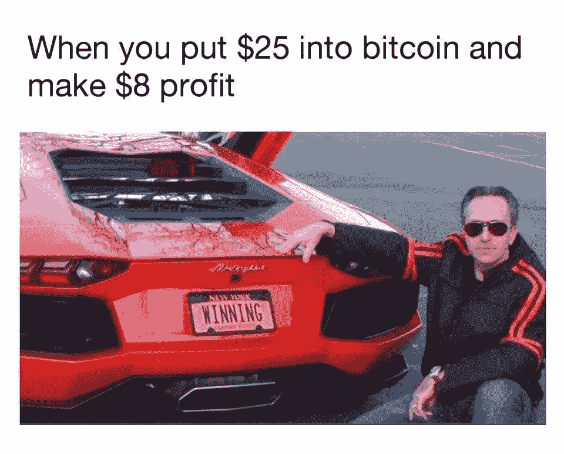

# 加密婴儿谈话:你应该知道的前 50 个术语

> 原文：<https://medium.com/hackernoon/crypto-baby-talk-first-50-terms-that-you-should-know-about-30a829320b4b>

你好密码新手，

很高兴在这里见到你！

我们 ROKKEX 决定，你们应该与加密货币的词汇保持一致。所以，首先要记住“crypto”大部分是关于密码学的，所以你最好把“cryptocurrency”这个词完全拼出来，不要把任何人搞糊涂。

其次，我们使用一些特定的术语，不熟悉区块链、比特币和其他东西的人可能会认为我们有点疯狂地梦见月亮和蓝宝，害怕 ICO 骗局(wtf 是什么？)，还总是嘟囔什么熊牛(怎么会？他们甚至不住在一起)。好吧，舒服地坐着，准备一次进入加密货币(和一点区块链)世界的短途旅行。

**答**

**空投**

以空投这样令人愉快的东西作为清单的开始是很好的。有一天，你醒来发现钱包上有一些不知名的备用硬币(见下一页)——那是空投的！这种营销技术在 2017 年非常受欢迎，因为 airdrop 激励人们进一步研究。

**奥特币**

替代货币(Altcoin)是除比特币(BTC)之外的任何加密货币。目前有几千枚代用币存在。有些人甚至拥有单独的区块链。

**AMA**

AMA 是“问我任何事情”的缩写这指的是公司成员被问到的一系列问题。答案通常会通过 Youtube 直播、博客或者 Reddit 上给出。

**反洗钱**

AML 代表**反洗钱**的政策和立法。这防止了非法获得的钱被转换成合法的修改。不幸的是，区块链去中心化的崇高目标产生了被一些交易所和钱包利用的副作用。

**B**

**看跌**

你了解这种动物。当熊攻击时，它用爪子击打受害者的顶部，将受害者钉在地上。现在想象加密货币市场是受害者，当玩家看空时，所有价格都降低。熊市就是红市。

**区块链**

一个不断增长的记录列表，称为块，使用加密技术进行链接和保护。我们喜欢这本用简单的语言解释区块链的《T21》杂志指南。

**赏金计划**

它和巧克力棒没有任何共同之处。赏金计划是项目背后的团队分配的一些任务。这可以是任何事情，从加入电报频道到翻译工作。对于任务的完成，受让人获得奖励(奖金)；然后他或她可以买一些像样的赏金。

**看涨**

让我们回到动物世界。亲爱的，公牛是一种用角攻击并将受害者从地上举到空中的动物。同样，这种情况下的受害者是加密货币市场；但是我们喜欢公牛队，因为我们预计他们的价格会上涨。

**丙**

**烛台图表**

“蜡烛图”是代表交易的一种方式。一个烛台代表一个特定的时期(一天、一小时、一刻钟等)。).烛台的“主体”代表开盘价和收盘价。峰值表示这一时期的最高价和最低价。

最好看一次:

**循环供给**

可自由交易的硬币或代币的总数。

**CMC**

CMC 是 [Coinmarketcap](https://coinmarketcap.com) 的缩写，是一个列出交易所和加密货币的网站。这应该是你的主页！

**加密货币交易所**

一个可以买卖加密货币的数字市场。它应该是安全的，而不是像 ROKKEX 那样危险😜。顺便说一下，我们有一个基本的交易观点，供年轻的加密适配器更好地搞清楚什么是什么。

**E**

**ERC-20**

准确地说，ERC-20 令牌是使用以太坊智能合约在以太坊(ETH)网络上创建的。ERC-20 是一种令牌标准，描述了这种令牌合同必须实现的功能和事件。

**乙醚**

以太(ETH)是以太坊网络的主要加密货币；仅次于比特币的第二大市场(BTC)。它也被称为以太坊网络的“加密燃料”，因为它有助于执行智能合同。

**F**

**菲亚特**

那不是汽车制造商！法定货币是一种被政府宣布为法定货币的货币:像美元或€。

**FOMO**

“害怕错过”的首字母缩写。

**叉**

分叉是将一个区块链拆分成另一个版本。我们有[一篇关于这个](https://blog.rokkex.com/binance-hack-the-advantages-of-the-rollback-f9c4b6be681d/)的优秀文章。

**FUD**

“恐惧、不确定和怀疑”的首字母缩写降低价格的宣传。

**G**

**气**

Gas 用于执行以太坊区块链上的交易。这有点像你付给矿工的费用。你设置的气体越多，你的交易完成的越快，因为奖励越高，更多的矿工将被激励更早地处理 tx。

**创世纪街区**

有史以来开采的第一个区块和区块链的开始。🙏🏻

**H**

**哈希**

Investopedia 得到了最好的结果:散列是一个基本的区块链函数，它将字母和数字的输入转换成固定长度的加密输出。

**HODL**

来源于[这篇文章](https://bitcointalk.org/index.php?topic=375643.0)中“hold”被拼错了。这是“为了亲爱的生命坚持下去”的缩写。这是一种储存加密货币直到它上月球的策略。

**我**

**ICO**

“初始硬币发行”的首字母缩写，也称为*初始代币发行/代币销售/大众销售*。初始硬币发行(ICO)是一种有争议的众筹方式，因为许多项目都被骗了。在 ICO 中，投资者会收到一定比例的新发行的加密货币，以换取加密货币。免费获得代币和硬币时不要和 airdrop 混用。

**IEO**

“首次交易所发行”的首字母缩写 IEO 是一种由加密交换托管和管理的 ICO。(更加合法，但仍然可疑)。

**K**

**KYC**

“了解客户”的首字母缩写——一系列法律法规要求企业了解其客户的身份(要求提供身份证扫描件或其他身份证明文件)。

**L**

**蓝宝**

这是兰博基尼。当价格将大幅上涨时，交易者可以购买这样的汽车。

**限价单**

对于限价单，您向交易所提出以价格 X 购买 X 枚硬币的请求。当“执行”订单时，价格不能不同，但硬币的数量不能超过订单的金额。

**米**

**市值**

市值显示了所有硬币的总价值。在撰写本文时，它是 284 057 335 282 美元。我们在 CMC 上查过，记得是什么吗？

**最大供应量**

代币或加密货币的最大硬币数量。如果定义了最大供应量，就不能再创造更多的硬币了。

**N**

**节点**

节点是网络中的计算机，它们都有区块链事务的副本，并通过验证事务来支持它。

**M**

**市值**

总供应量 x 当前价格

**采矿**

首先，通过挖矿发行新的加密货币，例如 BTC 或 LTC。其次，采矿是交易被核实并加入公共分类账的过程(区块链)。

**月光**

当价格以极高的速度上涨时，就使用“到月亮上去”这个短语。我们相信 Dogecoin 社区使这个短语流行起来。

**P**

**点对点(P2P)网络**

这个术语是整个区块链思想的基石。对等网络没有一个存储信息的中心点(像服务器那样)，相反，区块链网络的每个参与者都可以访问信息并给网络带来变化(但其他参与者会知道)。不存在控制网络的主导方；因此，不诚实行为的机会被排除。区块链上的每个动作都是透明的。

**网络钓鱼**

网络钓鱼是一种古老但仍在使用的窃取易受攻击信息的方法。犯罪分子试图通过模仿原始网站或应用程序的虚假网站或应用程序让用户放弃他们的个人信息。

**私有密钥/私有地址**

这是你打开钱包的密码。每个加密货币钱包都包含一个或多个私钥，这些私钥在数学上与钱包相关。你的私人地址必须保持安全，不能与任何人分享(主要是通过电子邮件)，所以当有人问你要私人密钥时要警惕。

**证据……**

工作证明、利益证明、委托利益证明等。是在区块链网络中达成共识和验证交易的不同系统、规则集或方法。[这里](https://hackernoon.com/pos-pow-and-12-other-blockchain-protocols-you-didnt-know-about-3634b089d119)，我们给出了现有区块链协议的详尽列表。

**招股说明书**

我们无法比 ROKKEX CLO 更好地描述它:

> “把它看做是公司的通行证，上面有投资者可能需要的所有信息，以便做出明智的决定:投资还是不投资。”

招股说明书是 STO(安全令牌提供)所需的文件，以证明项目是安全的和受法律监管的。

**公钥/公共地址**

公钥简单来说就是你的卡号；例如，你可以分享它来接收加密货币。有趣的是，公钥是从私钥计算出来的。

**R**

**路线图**

路线图是展示团队希望在一年或更长时间内实现的目标的计划。它让你深入了解即将到来的特性，以及这些特性将在何时发布。

**投资回报率**

ROI 是“投资回报”的缩写。这是你投资回报的比率。

**S**

**中本聪**

中本聪是一个父亲！等一下。一个母亲！不要！一群天才……嗯，我们还不知道中本聪是谁，但我们可以肯定的是这个人发明了比特币。

**骗局**

骗局是不诚实的人为了获得金钱、个人信息或任何感兴趣的东西而实施的犯罪计划。有些 ICO 项目是骗局，因为他们收集资金，然后带着钱退出。

**Scamcoin (Sh*tcoin)**

💩硬币与骗局和 ico 密切相关:它们是为了快速致富而创造的。诈骗币通常没有功能特性，有些甚至不存在于他们的白皮书之外。

**种子短语**

一个不合逻辑的长句子，你用它来取回你的私人钥匙并进入钱包。

**智能合约**

智能合约是一种计算机程序，它在特定条件下控制双方之间的加密货币转移。

**稳定币**

稳定的硬币是一种波动性极低的硬币，它试图与法定货币或黄金等商品挂钩。

斯蒂米特

Steemit 是一个主要用于博客的社交媒体平台，完全在 Steem 区块链上运行。表现最好的作家和活跃用户会因为他们的投入而得到奖励。

**STO**

在 ico 带来的骗局灾难之后，加密货币行业不得不开发一种替代的众筹方式。见见 STO！STO(安全令牌提供)是一个出售安全令牌(建立在区块链技术基础上的数字加密股份)以换取投资的过程。

**冷/热储存**

有两种方法可以存储密码。冷藏用于保持您的 BTC 离线(在处理大量加密货币时，这是一个明智的预防措施)。

热存储连接到互联网。几个月前，我们描述了不同类型的冷库和热库。

**T**

**股票代号**

股票代码是特定加密货币的唯一标识符；它通常由 3-4 个大写字母组成。例如 BTC(比特币的代号)和 ETH(以太坊的代号)。

**令牌**

代币是建立在以太坊等现有区块链平台之上的。例子包括 EOS、TRON 和 OmiseGO。令牌通常通过 ICO 分发，作为资助该计划的奖励。不要把它们和硬币混在一起，因为后者有区块链。

**总供应量**

总供应量表示流通中的硬币数量和不可交易的硬币数量(保留或尚未发行)。它与最大供应量不同，后者包括了未来的硬币。

所以！总供给=流通供给(+非流通供给)。最大供应量=总供应量+要开采的硬币。

**TX**

TX 代表交易——加密货币的转移。交易是加密货币的转移。

**V 代表维塔利克·布特林！(开玩笑)**

**维塔利克·布特林**

Vitalik Buterin 是一名程序员，他发明了智能合约，并与人共同创立了以太坊网络。

**W**

**钱包**

钱包就像你的银行账户。这是你可以发送、接收和存储加密货币的地方。它由您的公钥标识，用您的私钥访问。

**鲸鱼**

鲸鱼是指拥有大量硬币的人。因此，他们可以控制替代硬币的价格。

**白皮书**

白皮书是一份介绍新产品或公司的文件。它包含了所有的细节:产品将解决的问题、技术规范、路线图、令牌分发、团队等等..

**Z**

**零确认交易**

已经交付给节点但尚未并入区块的加密货币交易。也称为“未确认交易”

# 你可能也喜欢

[PoS、PoW 和其他 12 个你不知道的区块链协议](https://blog.rokkex.com/pos-pow-and-12-other-blockchain-protocols-you-didn-t-know-about-3634b089d119/)

[加密货币交易所 VS 证券交易所](https://blog.rokkex.com/cryptocurrency-exchange-vs-stock-exchange-3e6e72d78743/)

> **在**[**ROKKEX**](https://www.rokkex.com/?utm_source=Medium&utm_medium=blog&utm_content=kl)**，我们极其重视安全性，我们的加密交换建立在“安全第一”的原则之上。我们希望与更广泛的公众分享我们的专业知识，让世界变得幸福、安全和智慧:)**

如果您有任何想法和建议，请联系我们

[网站](https://www.rokkex.com/?utm_source=Medium&utm_medium=blog&utm_content=kl)。[领英](https://www.linkedin.com/company/rokkex/)。[脸书](https://www.facebook.com/rokkex/)。[推特](https://twitter.com/ROKKEX_com)。[电报](https://t.me/rokkex_chat)。 [Reddit](https://www.reddit.com/r/Rokkex/) 。 [Instagram](https://www.instagram.com/rokkexofficial/)