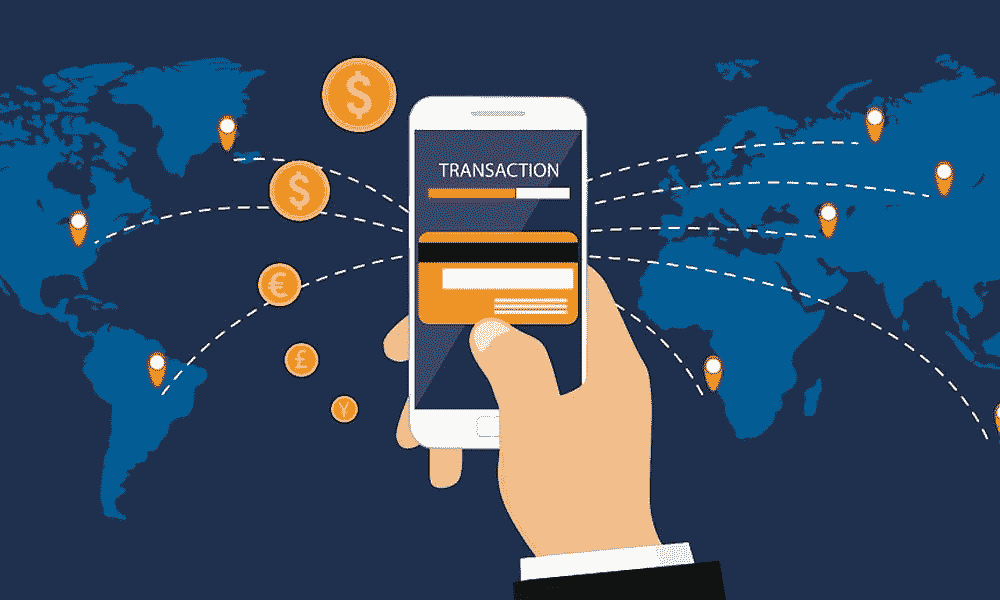

# 加密银行:旨在“为没有银行账户的人提供银行服务”的区块链项目介绍

> 原文：<https://medium.com/hackernoon/crypto-banking-an-intro-to-blockchain-projects-aiming-to-bank-the-unbanked-e9a20a83c465>

Blockchain for Financial Inclusion

## **发布**

世界上有 22 亿人没有银行账户，或者说“没有银行账户”[【1】](#_edn1)传统银行业制造了种种障碍，使得每个人都很难获得一个账户。这些障碍包括偏远地区缺乏当地银行基础设施，无法维持最低存款要求…