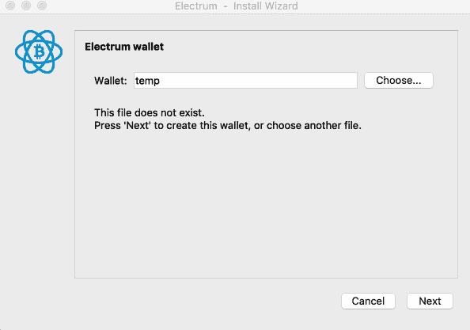
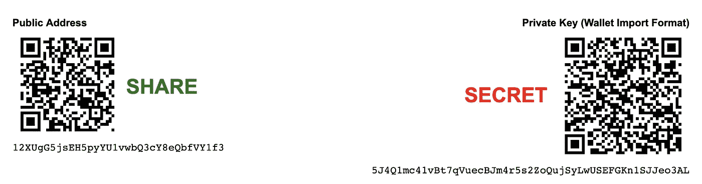
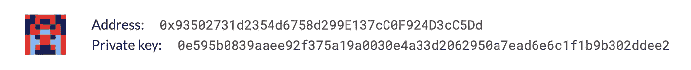
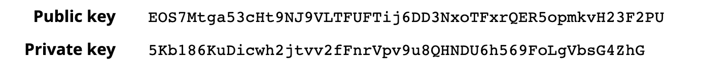
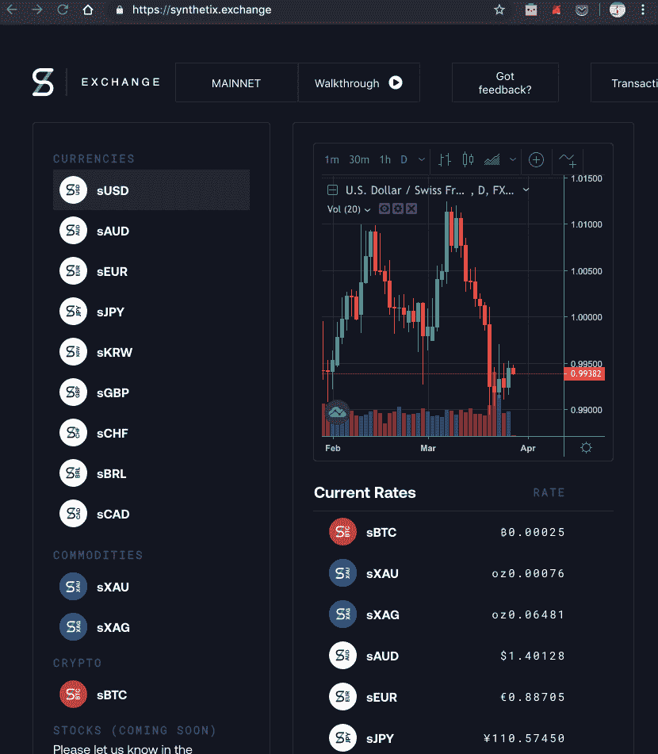
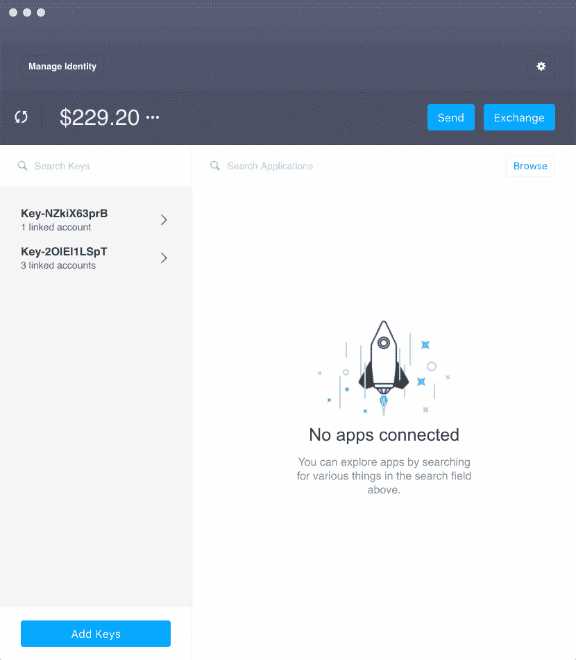
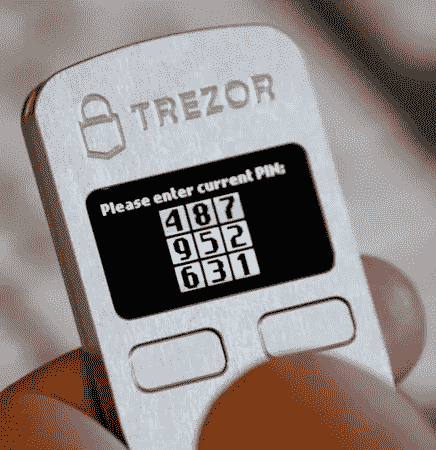
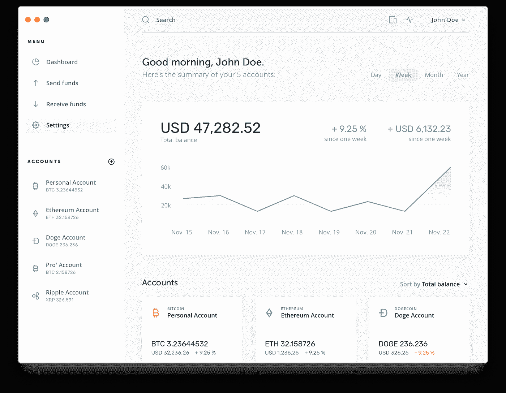
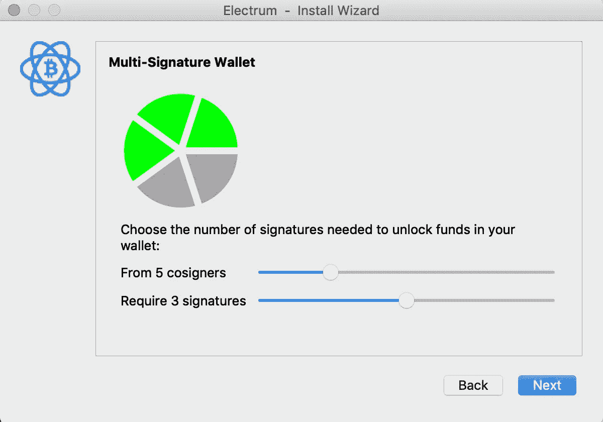

# 冒险者的密码。第 1 部分:访问

> 原文：<https://medium.com/hackernoon/crypto-for-adventurers-part-1-access-243f0ba4365c>

via [National Geographic](https://www.australiangeographic.com.au/outdoor/adventure-outdoor/2018/08/melbourne-women-to-create-australias-first-female-only-rock-climbing-festival/)

本指南是你探索加密的伴侣。本系列的第一篇文章 [*讲述了区块链科技在过去十年*](https://hackernoon.com/welcome-to-crypto-youre-on-your-own-46f3f287561d) *发展中的前景和激动人心的事情。如果你已经深入研究了这个领域，我希望这些文章能填补一些隐藏的空白。*

我的加密之旅并不简单。过去几十年，我一直从事科技行业，但坦率地说，我发现区块链的服务、产品、平台和代币的迷宫令人难以招架。

我需要为整个拼图建立一个心理模型，但我不知道从哪里开始。随着时间的推移，我了解了各代区块链人的进化，足以理解他们的共同点以及他们与众不同的地方。然而，我仍然不得不推断出密码世界中的各种阵营，并从作者的角度解读文章。🤯

作为一个通过修补学习的人，我发现在 2017-18 年加密热潮的背景下，这令人难以置信地令人生畏。

随着时间的推移，我开始建立一个心智模型，虽然不完整，但有形状和纹理。

我试图为你简化这个思维模式，我的冒险家伙伴。

我首先需要的是*权限。*在 crypto 中，这意味着拥有一个*钱包*来发送&接收加密货币以及其他区块链操作。

接下来是获得密码的方法——要么作为礼物、收入，要么直接使用常规旧法定货币购买。

然后，我必须了解市面上各种各样的加密货币。比特币(BTC)是比特币区块链和以太坊以太(ETH)的货币，但这些“ERC20”代币呢？还是泛光灯上的系绳(USDT)？它们有什么用，我能用它们做什么？

第四是使用密码的*含义*。它有多安全？我应该遵循哪些最佳实践？我必须遵循什么应急计划？

最后是日常交易。每次我想在区块链交易时，我都得付钱？我能支付的不同价格是什么？我如何让交易处理得更快？我如何能看到我交易了什么？我能看看别人做了什么吗？为什么我需要保持“签名”动作？

所以，让我们从第一个障碍开始——钱包。

> 大多数钱包应用程序都是为有经验的用户设计的，让新手们挠头(如果他们能坚持那么久的话)。忘记说服我的父母创造一个钱包——甚至我也需要先把它包起来。

via [RangeLeather](https://www.rangeleather.com/products/mens-range-wallet)

钱包可能是加密中最重要的——也是最令人困惑的——方面。它们是吸引更多人进入太空的巨大障碍。没有它们，你什么也做不了——甚至不能接收令牌——所以让用户熟悉它们的工作方式是最重要的。

遗憾的是，大多数钱包应用程序都是为有经验的用户设计的，让新手挠头(如果他们能坚持那么久的话)。忘记说服我的父母创造一个钱包——甚至我也需要先把它包起来。

钱包的用户界面令人困惑，因为它们实际上可以代表你做很多事情。首先，我们需要讨论密钥。

**我的钥匙在哪里？**
对大多数区块链人来说，你的钱包里会有一个隐藏的秘密——一把*私人钥匙——*基本上是一个很长的密码，你可以妥善保管*。*这些钱包应用程序将允许您导入现有的私钥，或者为您创建一个新的私钥。他们会强烈建议你在某个地方保存一份备份，要么写在一张纸上，安全地保存，要么放在一个密码库里(尽管正如你在下面看到的，Electrum 强烈反对以数字方式保存它！).

通常，应用程序会要求您记住一组 12-24 个单词的有序集合(种子短语或助记符)，而不是随机收集的字母和数字，应用程序可以从中生成私钥。

Creating a new Bitcoin wallet using a seed phrase. This is the desktop wallet application [Electrum](https://electrum.org/#home).

使用私钥，钱包将为您提供一个*地址——实际上是一串字符——也称为您的*公钥。*那是你要收代币的时候和别人分享的。你可以把你的公钥想象成一个邮箱，把私钥想象成打开它的工具。*

由于钱包的后台是简单的公钥/私钥加密，有大量的网站可以为您生成这些密钥对。**我建议不要将它们用于演示目的之外的任何目的**——谁知道网站管理员是否没有跟踪他们生成的私钥。(回想一下[上一篇文章](https://hackernoon.com/welcome-to-crypto-youre-on-your-own-46f3f287561d)中的内容，恶意行为者只需要你的私钥就可以将你的所有资金转移到他们选择的地址。)

为了这篇文章，我去了[walletgenerator.net](https://walletgenerator.net/)创建一个新的比特币公/私对:

An example public Bitcoin address (a public key) `that is backed by a longer password (private key). **(Example only, do not use this with real funds).**`

你可以看到上面钱包的公共地址是`12XUgG5jsEH5pyYU1vwbQ3cY8eQbfVY1f`，它是由`5J4Q1mc41vBt7qVuecBJm4r5s2ZoQujSyLwUSEFGKn1SJJeo3AL`的更长的私有密钥生成的

我对以太坊做了同样的事情，使用 [vanity-eth.tk](https://vanity-eth.tk/) 生成如下内容:

An example public Ethereum address, backed by a private key. `**(Example only, do not use this with real funds).**`

你可以看到地址和私钥在以太坊里是*十六进制*(0–9&A-F)*，在比特币里是*字母数字*(0–9&A-Z)。在这两种情况下，私钥可以由 12-24 个单词的种子短语创建，但这些网站不提供该功能。*

*此外，这里有一个来自[nadejde.github.io/eos-token-sale](https://nadejde.github.io/eos-token-sale/)的 EOS 公共/私有对的示例。EOS 键也是字母数字:*

**

*An EOS public/private pair, EOS also uses alphanumeric keys. **(Example only, do not use this with real funds).***

***将 crypt 放入 crypto**
大多数区块链使用公钥/私钥加密。当您想要接收资金时，您与发送者共享您的公钥。**您的私钥永远不会被共享** —您只能在钱包应用程序中使用它来签署交易。*

*所有区块链都采用某种加密(因此从密码学中缩写为“crypto ”)来确保处理的动作确实是由请求它的人提交的。*

*一个有趣的兔子洞是公钥/私钥加密，[如果你喜欢的话，这里有一个开始](/@vrypan/explaining-public-key-cryptography-to-non-geeks-f0994b3c2d5)。*

*你用来管理你的钱包的应用程序是超级容易混淆的，也被称为你的钱包。实际上，它只是一个可以代表你在区块链上进行交易的软件；大多数流行的都是可以互换的。然而，最重要的是它对恶意软件的安全性。也就是说，它能在多大程度上抵御恶意软件的攻击，这些恶意软件旨在获取私钥并在您在线时传输它们？*

*不管你的钱包有多安全，你仍然有可能受到攻击。去年，Windows 上有一款著名的恶意软件,只要它检测到一个高价值的比特币地址，就会在粘贴时改变你的剪贴板内容；它会有效地用一个看起来相似但被恶意软件作者控制的地址替换你的剪贴板内容，从而诱骗你给他们发送资金！😲我们将在本系列即将到来的【T21 暗示】部分讨论这些。*

*私钥是你的钱包应用程序用来签署交易的——基本上它用你的私钥**加密你在*交易*中执行的每个动作(比如给某人发送一些代币)。**然后，它将这份文件和你的地址(你的公钥)一起发布到某个区块链节点(世界上成千上万个在线节点中的任何一个),确保它确实是用你提供给它的钱包地址的私钥对加密的。假设一切正常，然后节点传播到其对等节点，其中一个*最终* 将它包含在下一个块中(通过*挖掘*)，并处理您的事务。唷。如果您没有完全理解，请不要担心——我们还将在本系列的后面部分更详细地介绍这一点。*

*好吧，从技术上来说，对于高清钱包，你的私钥会生成许多公/私密钥对。稍后会有更多的介绍。*

***dApp 那个钱包**
这是一个普通以太坊钱包的样子——它是一个 Chrome 扩展，叫做 [MetaMask](https://metamask.io/) 。在这里，我正在访问以太坊 dApp(去中心化应用程序) [synthetix.exchange](https://synthetix.exchange/) ，它想要与我的钱包进行交互。由于以太坊 dApps 运行在网络上(即“web 3.0”)，拥有一个浏览器扩展或桌面应用程序可以提供一定程度的便利。dApp 通过 JavaScript 要求我的钱包签署动作，我的钱包会在用我的私钥加密交易之前检查我，永远不会与应用程序共享实际的密钥。*

**

*Using **MetaMask** (an Ethereum wallet provided as a Chrome extension) in a browser-based Ethereum dApp. Here I am simply allowing the dApp to communicate with the wallet, not transacting.*

*这里有一个在 EOS 区块链上执行的类似操作，使用[Scatter](https://get-scatter.com)——流行的 EOS 钱包桌面应用程序——连接到 [eostoolkit.io](https://eostoolkit.io) dApp。*

**

*Using **Scatter** (an EOS wallet provided as a desktop application) in a browser-based EOS dApp. Here I am simply allowing the dApp to communicate with the wallet, not transacting.*

***灾难恢复
假设您丢失了笔记本电脑，上面有 Electrum 或 MetaMask。当你最终在一台新电脑上再次运行钱包应用程序时，两者都将为你提供*导入*现有钱包的选项。您可以通过添加私钥或种子短语来做到这一点，您可以将其存储在某个地方的纸上或私人密码库中。***

*根据您的私钥，公钥是确定性生成的——因此您甚至不必记住它。事实上，现代钱包允许你根据一个私人密钥创建几乎无限数量的地址。事实上，由于加密的方式，没有人能确定这些地址中的任何一个是相互关联的。实际上，对于您创建的每个新地址，[都会创建一个新的私有密钥](https://coinsutra.com/hd-wallets-deterministic-wallet/)，它是基于一个固定的公式(因此，如果从头开始重新创建，将会按顺序生成相同的密钥)。*

*你怎么说？[等级决定论](https://en.bitcoin.it/wiki/Deterministic_wallet)(高清)钱包来救援。对于病态好奇的人来说，这里有一个[真正彻底的深度探索](/bitcraft/hd-wallets-explained-from-high-level-to-nuts-and-bolts-9a41545f5b0)。*

**

*Creating a new MetaMask wallet. I install with a new phrase, create a second account (or public key), remove the wallet, then restore from the seed phrase and create a second account again. Note how the public keys are exactly the same in both instances.*

*因此，仅从您的私钥，您就拥有了您曾经使用过的所有公钥。而且，由于曾经发生的每一笔交易都存储在区块链上，您的钱包可以通过查询区块链中与您的地址相关的所有活动来轻松加载历史记录。*

***保持冷静**
当你使用 MetaMask(一种浏览器扩展)之类的应用程序或 Scatter 之类的桌面应用程序时，你是在你的机器上存储私钥。如果你的机器曾经连接到互联网，那么钱包被称为 *hot* 。如果你想让你的私人钥匙完全与互联网隔绝，你可以使用一个 [*冷*存储钱包](https://en.bitcoin.it/wiki/Cold_storage)。从简单地在纸上写下你的种子短语，到可以代表你签署交易但无法透露私钥的 USB 设备。后者被称为*硬件*钱包。*

**

*A **Trezor** — one type of cold storage wallet.*

*冷存储硬件钱包比像 MetaMask 这样的热钱包更安全，因为设备被阻止共享王国的密钥。设备本身，以及 PIN 和可选密码，是您签署交易所需的。你插入设备的主机仍将连接到互联网，向目标区块链广播交易(比如当你想给某人发送一些比特币或乙醚时)，但钱包仍被认为是冷的，因为从设计上来说，没有人，甚至是恶意软件，可以从设备上获取私钥。*

*当你第一次使用冷藏钱包时，你会得到一个种子短语来写下并存储在物理上安全的地方。如果您丢失了实际设备，您将需要使用该种子短语—无论是在设置新的冷存储钱包时，还是在使用热钱包时。可以想象，你的种子短语很珍贵——比你的硬件钱包还珍贵；如果你丢失了你的硬件钱包，它至少有一个 PIN 和密码保护——另一方面，你的种子短语是公平的游戏。在存放的地方和方式上都要非常小心。*

*与分别针对以太坊和比特币区块链的 MetaMask 和 Electrum 不同，像 [Trezor](https://trezor.io/) 和 [Ledger](https://www.ledger.com/) 这样的大多数硬件钱包都支持多个区块链——因此一个设备可以持有来自许多不同链的加密货币。特别有用，所以你不需要带着一个装满不同设备的钥匙链到处走。*

**

*An example dashboard from Ledger. Note the different cryptocurrencies in the bottom left.*

*最后，最后要提到的是[多重签名](https://en.bitcoin.it/wiki/Multisignature) ( *多重签名*)钱包。简而言之，一把私人钥匙可以分成几块，分发给其他人以增加安全性——想象一下一个有三把钥匙的保险箱，每把钥匙由不同的人控制。这显然是对日常交易的一个非常严格的限制，但是如果您非常重视您的安全性，这是您应该考虑的一个预防措施。这也有可能减少类似这样的事情发生——为你的基金制定一个继任计划，当有一天你做不到的时候。*

**

*Creating a 3-of-5 multi-signature Bitcoin wallet in Electrum.*

***外卖***

1.  *大多数区块链使用**公钥/私钥加密**。把它想象成你共享的邮箱地址和保密的钥匙。*
2.  *钱包可以指**公钥/私钥对或应用程序**,既可以安全地存储您的私钥，又可以用该密钥代表您签署交易。*
3.  ***大多数现代钱包都是确定性的(HD)** ，因此可以从一个私钥创建任意数量的地址。没有您的私钥，没有人能看出这些地址是相关联的(实际上它们是完全不相关的)。*
4.  *想要找回一个现代钱包，你需要的不是你的私人密钥就是种子短语。由此，您的所有公共地址都可以重新生成，并且可以从区块链加载交易历史。*
5.  ***冷藏钱包**就是那些没有联网的钱包。它们被认为比热门钱包更安全，因为攻击媒介不包括恶意软件。*
6.  *一个**硬件钱包**通常是一个 USB 供电的冷存储钱包，可以签署交易，但没有办法恢复私钥。它通常连接到一台在线主机，但设备本身为恶意软件提供了一道不可逾越的屏障。*
7.  ***Multisig 钱包**允许你将钱包的单个密钥分割成多个部分，并设置交易所需的最少部分。它们以便利为代价提供了更多的安全性。*

*这就是现在，在第 2 部分，我们将涵盖如何获得您的密码。请关注我的最新消息。*