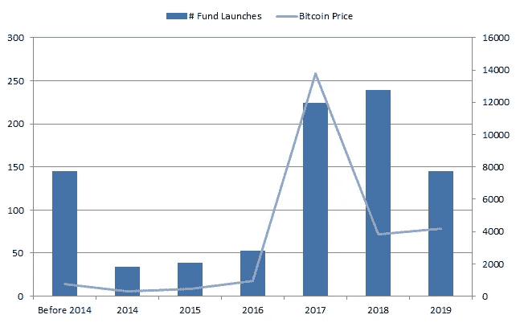
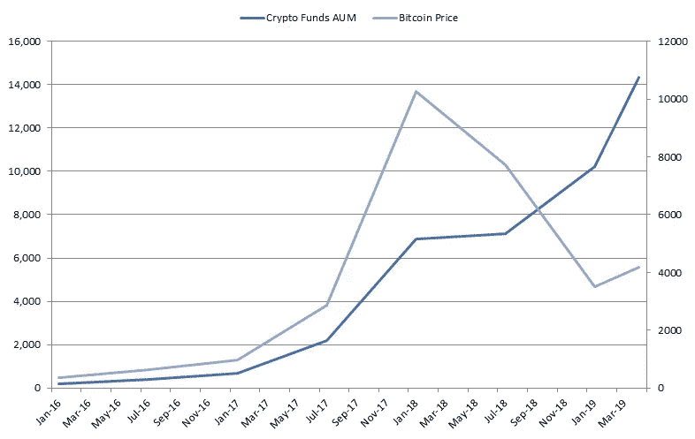
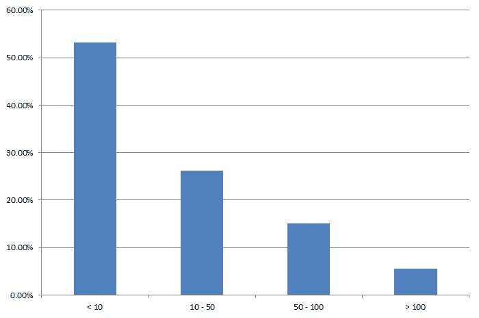
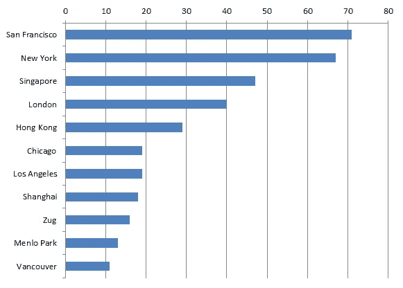
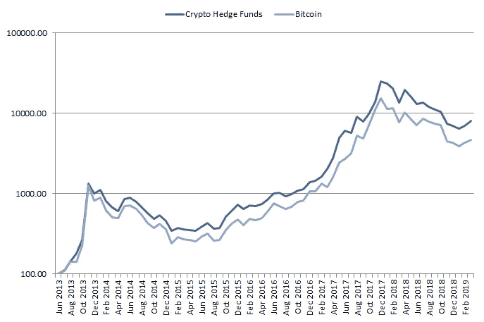
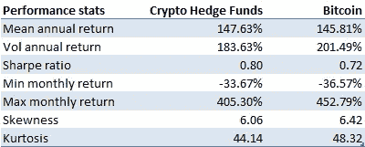
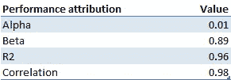
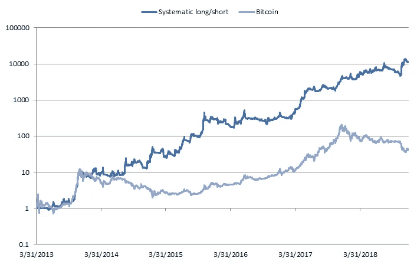
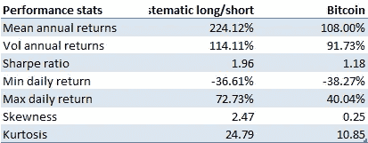
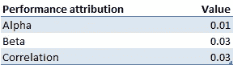

# 真的是加密对冲基金吗？

> 原文：<https://medium.com/hackernoon/crypto-hedge-funds-dont-pay-alpha-for-beta-991cff620af1>

由于对加密货币的兴趣显著增长，许多加密对冲基金在过去两年中成立。虽然其中一些基金包括来自其他对冲基金的经验丰富的团队，但他们中的许多人实际上是为了在炒作期间快速获利而设立的。

在本文中，我们将展示为什么大多数所谓的加密对冲基金实际上并不是对冲基金，而只是一篮子加密货币的被动投资者，类似于共同基金。尽管如此，他们中的许多人仍然收取对冲基金界典型的 2/20 管理费和绩效费。第一部分将介绍加密对冲基金，而第二部分将通过查看 Eurekahedge [加密货币](https://hackernoon.com/tagged/cryptocurrency)对冲基金指数来分析它们的总体表现。最后一节总结了关键要点。

# 加密对冲基金统计

[加密对冲基金](https://www.blueskycapitalmanagement.com/systematic-crypto/)是由多个投资者组成的集合投资工具，目的是通过投资加密货币来交付与加密市场不相关的回报。加密货币对冲基金是积极管理的产品，目的是产生与加密市场(alpha)方向无关的卓越风险调整回报。这与[加密指数基金](https://www.blueskycapitalmanagement.com/crypto-index-fund-why-you-should-not-invest-in-it/)形成对比，后者是被动管理的产品，目的只是提供对加密资产类别(beta)的投资。

图 1 显示了加密基金的发行数量，以及比特币的价格。从图中可以看出，两个测量值之间有很高的相关性(ρ = 0.70)。这应该是意料之中的，因为比特币价格的上涨表明，人们对加密领域的兴趣更大，加密基金的容量也可能更大，因此推出加密基金的经济动机也更强。

Figure 1 Number of crypto hedge fund launches vs Bitcoin price

图 2 显示了一段时间内加密对冲基金管理的资产(AUM)与比特币价格的对比。有趣的是，尽管经历了 2018 年的熊市，加密对冲基金仍设法吸引了资本。这可能是由于对加密空间的普遍兴趣，投资者可能希望长期投资。

Figure 2 Crypto hedge funds AUM vs Bitcoin price

图 3 显示了加密对冲基金的 AUM 分布。正如它所显示的，加密基金比传统对冲基金要小得多，其中大多数在 AUM 的资产不到 1000 万美元，只有 5%超过 1 亿美元大关。

Figure 3 Distribution crypto hedge funds by AUM

图 4 显示了加密对冲基金的城市分布。从中可以看出，他们分散在全球各地，盛行于旧金山、纽约、伦敦、新加坡等主要金融和科技中心。

Figure 4 Distribution crypto hedge funds by city

# 业绩归因加密对冲基金

我们现在分析加密对冲基金行业作为一个整体的表现，看看他们是否为市场提供了不相关的回报(alpha)，正如他们应该做的那样，或者他们是否只是重新包装了被动的加密货币回报(beta)。在本分析中，我们使用 Eurekahedge 加密货币对冲基金指数来代表典型加密对冲基金的表现，使用比特币来代表加密货币市场。分析期为 2013 年 6 月至 2019 年 4 月。

图 5 显示了随着时间的推移，加密对冲基金与比特币相比的表现。从中可以看出，2 个系列看起来非常相似，使人怀疑加密对冲基金作为阿尔法产品的有效性。

Figure 5 Performance crypto hedge funds vs Bitcoin

表 1 显示了与比特币相比，加密对冲基金的性能统计。如表所示，这两种产品呈现出非常相似的特征，具有相似的回报和波动性。

Table 1 Performance stats crypto hedge funds vs Bitcoin

图 6 显示了比特币回报和加密对冲基金之间的关系，而表 2 通过线性回归分析对其进行了量化。从他们身上可以看出，加密对冲基金实际上是 beta 的提供者，而不是应该有的 alpha 产品。他们的贝塔系数实际上是 0.9，阿尔法系数与贝塔系数相比很小(0.01)，与加密市场的相关性是 0.98。这应该是共同基金或加密指数基金向其投资者提供某种加密市场敞口的预期。这些产品通常比对冲基金结构更便宜，因为它们不需要为基金的积极管理花费昂贵的资源。

Figure 6 Relationship returns crypto hedge funds vs Bitcoin

Table 2 Performance attribution crypto hedge funds

在下一节中，我们分析了一个假设的系统长/短加密投资策略、一个可能的加密对冲基金策略的表现，并查看它是否如预期的那样提供了 alpha，这与前面的分析相反。

# 业绩归因系统多空加密投资策略

图 7 显示了假设的[系统性多空加密投资策略](https://www.blueskycapitalmanagement.com/systematic-crypto/)应用于交易量排名前 14 位的加密货币的交易成本后验表现净值。这种策略被比作对比特币的被动买入并持有投资。从图中可以看出，与比特币相比，这种策略的表现会更好，这在牛市和熊市中也是一致的。这是对冲基金策略应该达到的效果，换句话说，不管市场状况如何，都能带来不相关的正回报。

Figure 7 Hypothetical performance systematic long/short crypto investment strategy vs Bitcoin

表 3 显示了假设的系统长/短加密策略的性能指标，并将其与比特币的被动投资进行了比较。如上表所示，系统性多头/空头的表现会好于被动的比特币投资。在回报方面，它将实现 224%的年平均回报率，几乎是比特币的两倍。从风险角度来看，它的波动性会比比特币略高。由于在风险大致相同的情况下带来了更好的回报，该策略的夏普比率将达到 1.96，远高于比特币的 1.18。

Table 3 Hypothetical performance stats systematic long/short crypto investment strategy vs Bitcoin

表 4 显示了与比特币相比，假设的系统性长/短加密策略的性能归因统计。从结果中可以看出，这种策略会带来真正的正 alpha 值。事实上，比特币回报的贝塔系数和相关性几乎为零，这是对冲基金等阿尔法投资产品的预期。

Table 4 Performance attribution hypothetical systematic long/short crypto investment strategy vs Bitcoin

总之，根据之前的结果，假设的系统性长/短加密投资策略将产生 alpha 而不是 beta，因此是适当的加密对冲基金策略的良好候选。

# 结论

基于前面的分析，我们可以得出以下主要结论:

*   **过去 2 年推出的许多加密对冲基金:**得益于加密货币价格的上涨，许多加密货币基金在 2017 年和 2018 年推出。尽管市场处于熊市，他们也成功增加了 2018 年的 AUM。
*   **加密对冲基金交付贝塔而不是阿尔法:**加密货币对冲基金对比特币的价格表现出几乎相同的表现，贝塔接近 1，阿尔法接近 0，相关性接近 1。这表明，加密对冲基金实际上提供的是贝塔系数，而不是阿尔法系数，而这正是它们的投资者所支付的。
*   [**系统性多头/空头加密投资策略**](https://www.blueskycapitalmanagement.com/systematic-crypto/) **通过交付 alpha 代表一种可能的加密对冲基金策略:**考虑分配给加密对冲基金的投资者应只支付 alpha 而非 beta。例如，这是由系统的长/短加密投资策略提供的，该策略假设在分析期内向加密市场提供不相关的回报(alpha ),而不是 beta。

[订阅我们的简讯](https://www.blueskycapitalmanagement.com/subscribe/)获取我们在量化投资管理方面的最新见解。如需了解我们投资产品的更多信息，请发送电子邮件至[info@blueskycapitalmanagement.com](mailto:info@blueskycapitalmanagement.com)或填写我们的[信息申请表](https://www.blueskycapitalmanagement.com/invest/)。

*最初发表于* [*蓝天资本*](https://www.blueskycapitalmanagement.com/crypto-hedge-funds-dont-pay-alpha-for-beta/) *。*

# 放弃

本文旨在学术和教育目的，而不是投资建议。我们提供的或来自我们网站的信息不应替代投资专业人士的建议。本文讨论的假设模型并不反映测试期间存在的任何实际产品或策略的投资业绩，也不能保证如果存在这种产品或策略，它会表现出类似的业绩特征。投资任何产品或策略的决定不应基于本文包含的信息或结论。这既不是出售要约，也不是购买证券权益的邀约。