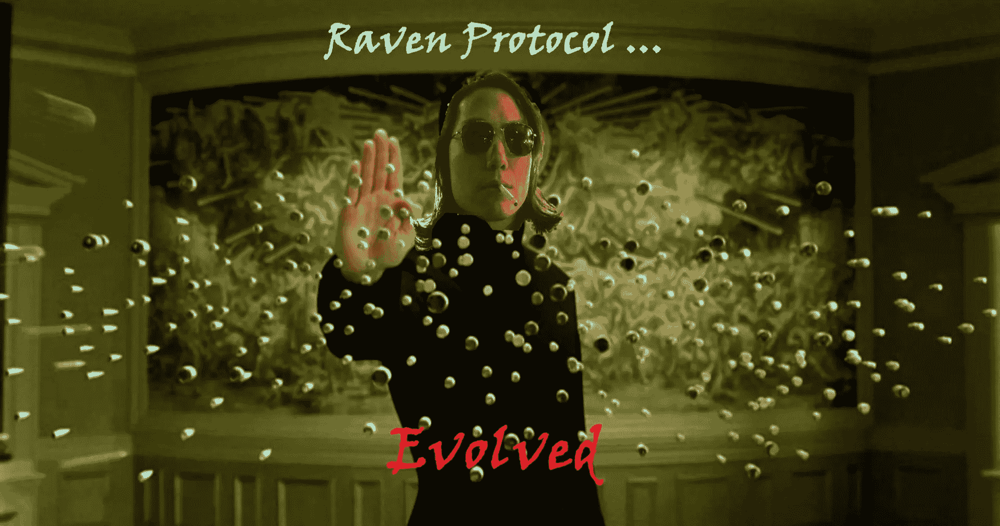
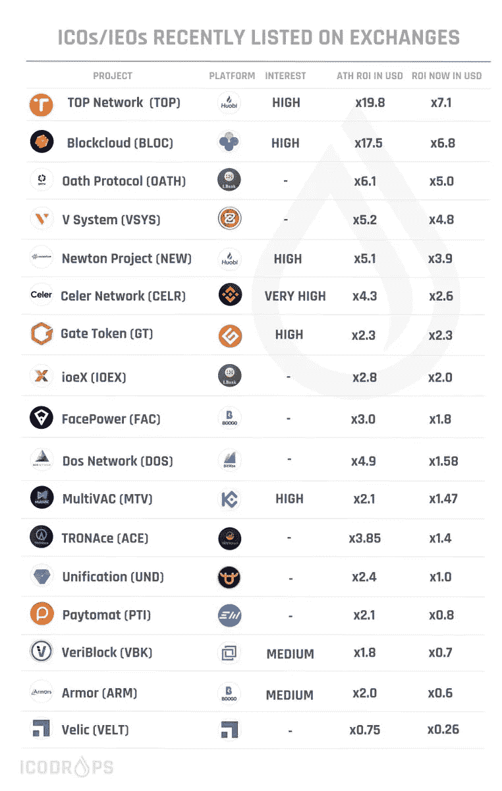
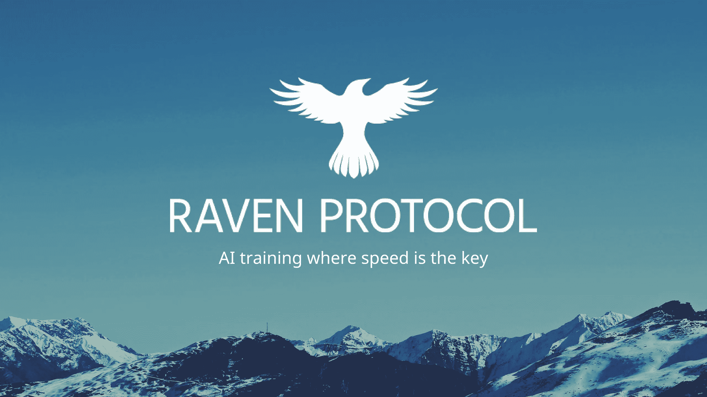

# 加密投资者:你是否已经错过了区块链筹款的下一次演变？迷因又回来了。

> 原文：<https://medium.com/hackernoon/crypto-investors-did-you-already-miss-the-next-evolution-of-blockchain-fundraising-32339aa46daf>

# 币安、Bitmax、ThunderCore 和 Ocean Protocol 将事情推向了新的高度！

*剧透:我们正在推动行业向前发展，并希望让社区参与进来。通读这篇文章的底部，并分享你如何认为区块链筹款，IEOs，或 ICOs 可以改善。我们会奖励你 100 枚渡鸦币。*

You know Crypto Twitter is coming out of hibernation from the winter when memes make their way around Twitter and TG again. If you created the [Raven Protocol](http://t.me/ravenprotocol) meme above, reach out to me. I have something special for you. Binance Launchpad may have single-handedly turned around the bear market with BitTorrent back in the beginning of the year. Everyone doubted CZ and Binance about this performing well. It easily did a 10x in USD at a time when the sentiment was that 1X in ETH was a huge win. Binance proved the world wrong. Will they do it again? :)

作为密码和区块链领域的创始人( [Raven Protocol](/ravenprotocol/overnight-success-raven-protocol-q1-2019-update-ed7dcffa5565) )、[投资人](https://www.zeroth.ai/about)和[作者](http://twitter.com/sherm8n)，我看到了这个行业的每一个进步。我总是惊讶于密码社区如何推动事情向前发展。

我们经历了公开 ico、预售、私人销售、种子轮、战略合作伙伴轮、 ***深度熊市*** *(加密的冬天过得很快，但当我们生活在其中的时候肯定感觉很长)*，到 launchpads，到 ieo，以及这之间的一切。密码社区是一群有创造力的人。

区块链融资使得难以置信的技术得以建立，否则这将是不可能的。天赋是平均分配的，但机会不是。区块链产业让整个世界处于一个公平的竞争环境中。

# 但是区块链筹款的下一步是什么？

很难说接下来会发生什么。所有的交易所都争相加入 ieo，这似乎正在奏效。项目能够筹集资金，这很好。投资者可以从他们的投资中获得丰厚的利润。

Image Credit: ICO Drops

虽然这是 ICOs 的一个健康发展(交易所在推出 IEO 之前正在做大量的项目设计)，但感觉像是再次涌入 ICOs。投资者正跳入 FOMO 和炒作中，寻找下一个 IEO 公告。项目正试图利用这一点，并再次推出白皮书。

这是可持续的吗？谁知道呢。需要出台强有力的激励措施，以防止压低销售压力，从而破坏项目代币的价格。很难从中恢复过来。短期利润很大，但每个参与者(创始人、投资者、交易所)都需要努力思考如何建立长期的加密生态系统。

让我们来看看不同的组织是如何应对区块链筹款的下一次变革的。

# 币安如何进行区块链融资

币安用他们的发射台引发了整个 IEO 热。到目前为止，他们只完成了四个。虽然他们可能有数百个项目，但我很高兴他们正在缓慢但稳步地进行。这对该行业来说是正确的举措。

几个小时前， [CZ(不公开密码)](https://medium.com/u/e411c27b3a2e?source=post_page-----32339aa46daf--------------------------------)在推特上给我发了一个关于一个新项目如何利用整个币安堆栈的建议计划。令人难以置信的是，他们在每个阶段都有如此多的方法来帮助项目。

最近他们推出了[币安链和 DEX](http://binance.org) 。作为第一个迁移到链上的项目和第一个被列入[币安指数](https://www.binance.org/en/trade/MITH-C76_BNB)的项目，Mithril 迈出了一大步。祝贺两个队的成功。

从表面上看，币安德克斯似乎是另一个低容量的德克斯。但是记得迈克尔·阿灵顿说过 CZ 下 4D 象棋。我不反对。如果他在上面的推文中建议的计划得以实施，币安将使更多的公司诞生。

DEX 是社区决定应该列出哪些有前途的项目的地方。如果项目证明了自己，他们可以去 Binance.com 的大联盟。

# **bit max 如何对待区块链筹款**

Bitmax 是一个很有前途的交易所，有一个有趣的方法。他们利用深厚的传统金融专业知识。联合创始人 Ariel Ling 在华尔街工作了近 20 年。她声称自己不“创新”，我觉得这很有趣，因为他们以客户服务和快速发展而闻名。他们正在利用传统金融中的成功经验，改善整体加密交易和交易所市场结构，以提高效率和透明度。

首席执行官乔治·曹(George Cao)获得了计算机科学博士学位。作为一名工程师和理解机器学习可能是我们相处的原因，并且在道德上与行业的长期健康保持一致。我们就 Bitmax 如何与项目合作进行了一次非常有趣的聊天。

他们似乎很小心地对待关系。甚至像家人一样。在代币结构、经济甚至营销方面紧密合作对于长期支持代币价格非常重要。如果你想了解更多关于 Bitmax 的信息，可以看看他们对我的好友 Blockchain Brad 的采访。这真的很好，当然布拉德也有兴趣做对行业长期最有利的事情。

# **迅雷核心如何与火币接触区块链募资**

现在让我们从一个顶级项目的角度来看看它。[迅雷核心](http://www.thundercore.com)2018 年私募。这也不是一个小数目。据 Venture Beat 报道，他们从顶级基金中筹集了 5000 万美元。他们保持低调，在熊市中建仓。2019 年，他们发布了他们的 Mainnet。

I think CryptoDiffer started in early 2018, but it’s fast becoming one of the top resources to learn about IEOs/ICOs. We know there wasn’t much action in the bear market, but these guys hustled and made it through. That positioned them perfectly to become the goto place to learn about projects. This is where investors are going to do their DD.

这种规模的项目可以毫无问题地直接在交易所上市。这就是为什么我对 ThunderCore 决定用 Huobi Prime Lite 做 IEO 有点惊讶。

> “我们希望合作伙伴将客户放在第一位，倡导诚信，真正相信 ThunderCore 的承诺和潜力。这就是我们选择火币 Prime Lite 作为交易所上市合作伙伴的原因。”
> 
> — [增长和](http://twitter.com/shmula)[业务](https://hackernoon.com/tagged/business)发展副总裁 Peter Abilla

在与团队交谈后，很明显这不是为了筹集资金。他们已经筹集了 5000 万美元。ThunderCore 找到了一个真正的合作伙伴，相信它能长期帮助这个项目。为了实现这一点，他们需要有人相信团队的潜力和未来 5 年的技术。

# Ocean Protocol 如何利用 Bittrex 进行区块链融资

另一个 2018 年私募的项目，呆了低头建，现在在做 IEO 的是[海洋协议](http://oceanprotocol.com)。人工智能+区块链是我的难题，他们正在做的事情是巨大的。在人工智能/人工智能行业，寻找人工智能训练数据是一个永无止境的问题。

在 [Raven Protocol](http://www.ravenprotocol.com) ，我们是 [Bruce Pon](http://twitter.com/brucepon) 和 [Trent McConaghy](http://twitter.com/trentmc0) 的支持者，因为他们是罕见的世界级创始人。他们都是 Raven 的支持者(Ocean 上的数据集非常适合用 Raven 进行人工智能训练)。

但是这个团队是世界级的原因很简单。在 2018 年 1 月的泡沫高峰期，他们拒绝让自己的代币掌握在 flippers 或任何短期思想家手中。他们的路线图和时间表反映了这一点。事实上，他们很明确地表示，你会等到 2019 年 Q2 奥运会之后，才会推出任何类型的代币。这自然意味着只有项目的忠实信徒才会投资，他们被超额认购了。

海洋石油也可以直接在交易所上市。但他们知道从曝光的角度来看，IEO 是一个强大的东西。现在，他们与 Bittrex 合作，确保他们的代币将在世界各地的许多人手中。

# 加密基金如何进行区块链融资

在大熊市期间，许多加密基金死亡。大多数幸存下来的公司转而只投资股权项目。有些人甚至做了一些二次探底，以 1:1 的比例获得股权和代币。

少数加密基金仍然对令牌网络充满信心和乐观。Moonchain Capital、Tel-a-viv Capital 和 Cluster Capital 是我想到的几个从未放弃代币的公司。

事实上，在此期间，他们在真正相信廉价的项目中积累了更多的代币。我完全相信，如果他们 HODL 5 年，他们将有世界上最幸福的唱片。充分披露:这些加密基金在熊市期间投资于 Raven。所以，如果你正在筹款，就打电话给他们。它们很坚固。

就 IEOs 而言，他们将其视为曝光的敲门砖。Moonchain 认为，从长远来看，项目应该做对项目最有利的事情。不要只是跳上一个会用一堆垃圾推出你的 IEO 的交易所。弄清楚这种交换将如何帮助你接触到托肯·霍德勒。

# 在 Raven Protocol，我们相信加密社区最了解区块链筹款的下一步发展。那你会怎么做？

交易所仍然拥有巨大的力量。他们是 ieo 的看门人。正因为如此，区块链的筹款已经走向集中化。我们正在倒退。从公共 ico(分散)到 IEOs(集中)。

但我明白了。分散的 ico 引出了很多不良演员和退出骗局。有时候我们需要后退几步才能前进几步。如果我们慢慢地从一个集中的 IEOs 演变成另一种形式的分散的区块链筹款，我们可能会建立一个健康的加密生态系统，以我们永远无法想象的方式造福人类。

**我们需要一种区块链筹款的方法来保护相关的三方:**

*   该项目
*   投资者
*   交换

# 加密社区，你会做什么来提高区块链筹款？我们希望收到您的来信并得到您的反馈。让我们一起推动这个行业前进！

# 如果你伸出你的思想，我们甚至会给你 100 枚渡鸦代币。

**邮件**:[founders@ravenprotocol.com](mailto:founders@ravenprotocol.com?subject=The%20Need%20For%20Speed)
**电报**:[t.me/ravenprotocol](http://t.me/ravenprotocol)
**推特**:[twitter.com/raven_protocol](http://twitter.com/raven_protocol)或[twitter.com/sherm8n](http://twitter.com/sherm8n)

(中等回答也算！)