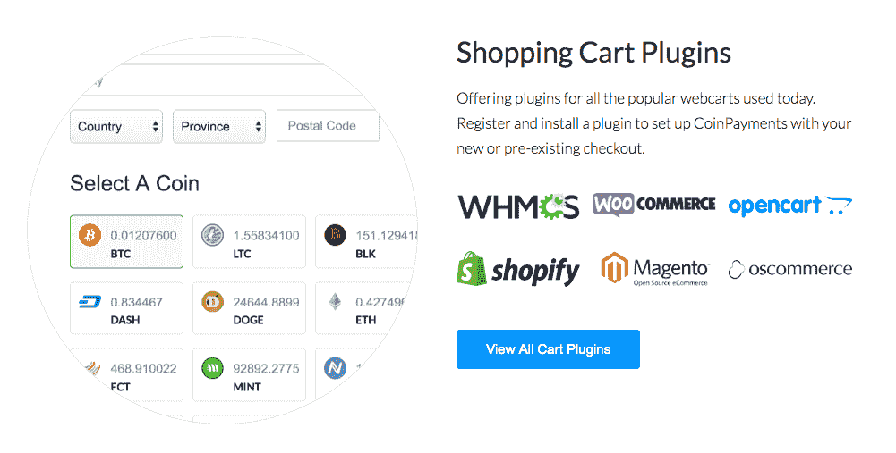

# 大规模采用加密技术:为熟悉的事物带来创新

> 原文：<https://medium.com/hackernoon/crypto-mass-adoption-blockchain-in-retail-900372314210>

众所周知，2018 年对加密市场来说是艰难的一年。随着比特币价格在年初的短短一个月内从 19909 美元跌至 7099 美元，光明的预期逐渐消失。但是区块链产业并没有失去势头，并且已经取得了许多旨在促进加密应用的进展。即时交换服务和加密支付网关在推动加密大规模采用方面发挥了巨大作用。

## **为什么数量有一种自身的质量？**

剑桥替代金融中心(CCAF)最近发布了一份[报告](https://www.jbs.cam.ac.uk/faculty-research/centres/alternative-finance/publications/2nd-global-cryptoasset-benchmarking-study/#.XBNoUC2B27Y)，称加密货币的验证用户数量在今年前三个季度几乎翻了一番，从 1800 万增加到 3500 万。

这些数字对整个加密社区至关重要，因为它们表明公众对加密的兴趣越来越大。即使市场在下跌，社区的兴趣也在增长。这可以指明走出熊市的道路，为整个行业指明发展方向。

## 合作是成功的关键

是什么催化了一些新的和创新的东西的大规模采用，比如说加密货币？答案是——将它(密码)引入一些熟悉的、已经被广泛采用的东西。

这正是[通过将加密支付选项引入最大的支付网关之一 CoinPayments，为加密货币的大规模采用做出贡献的方式。这就是大规模采用的神奇之处。由于这种合作，现在用户有机会从数千家商店购买超过 100 种加密货币的商品。](https://changelly.com/?utm_source=medium&ref_id=medium)

*“2018 年对加密市场来说很艰难——它损失了超过 7000 亿英镑的资本，然而，参与区块链行业的人数却在增长。现在，当世界密码社区成为这个行业最有价值的资产时，证明人们的可信度对我们来说是至关重要的。Changelly 团队很高兴与 CoinPayments 一起为加密货币的大规模采用做出贡献。”*—changely 首席执行官伊利亚·贝雷承认。

*“…在我们这方面，作为一家公司(在支付处理方面)，我们的交易量在增长，我们每月的交易量也在增长，尽管市场在下滑。这告诉我收养正在增长。加密货币作为支付手段的使用在全球范围内持续增长，这让我非常兴奋。”*——coin payments 首席执行官 Alex Alexandrov 在 [Bad Crypto 播客](https://badcryptopodcast.com/2018/12/20/spotlight-056/)上谈论“大规模采用”的持续话题。

## **易买易卖**

购买的过程顺畅简单。所有顾客需要做的就是去 [CoinPayments 商店目录](https://www.coinpayments.net/store-directory)，根据他/她的口味选择一家商店，挑选一件产品，然后用加密资产购买。不需要访问第三方网站来交换一个密码，因为 Changelly 的 API 集成到 CoinPayments 中，允许商家接受各种代币和硬币。

此外，CoinPayments 和 Changelly 不仅为那些想为 crypto 买东西的人，也为那些想为 crypto 卖东西的人提供了一个方便的工具。购物车插件、销售点界面、捐赠和购物卡按钮——欢迎各种规模的商家使用这些工具。

## **在没有市场波动的情况下赚钱**

Changelly 的转换功能使 CoinPayments 能够在平台上实现自动扫码功能，使商家能够将其所有的交易结算为稳定、非易失性的硬币(如 USDT、GUSD 或 TUSD)，从而最大限度地降低市场波动带来的风险。

## **结论**

尽管我们上个月在密码市场上看到了什么，但区块链产业是符合标准的。让事情变得更好和恢复市场的关键是大众的接受。如果没有数百万人每天使用 cryptos，几乎不可能维持这个行业的运转。令人欣慰的是，大规模采用已经指日可待。特别是，当像 Changelly 和 CoinPayments 这样的公司在他们的意愿下合作，为用户提供日常使用加密的最佳工具。