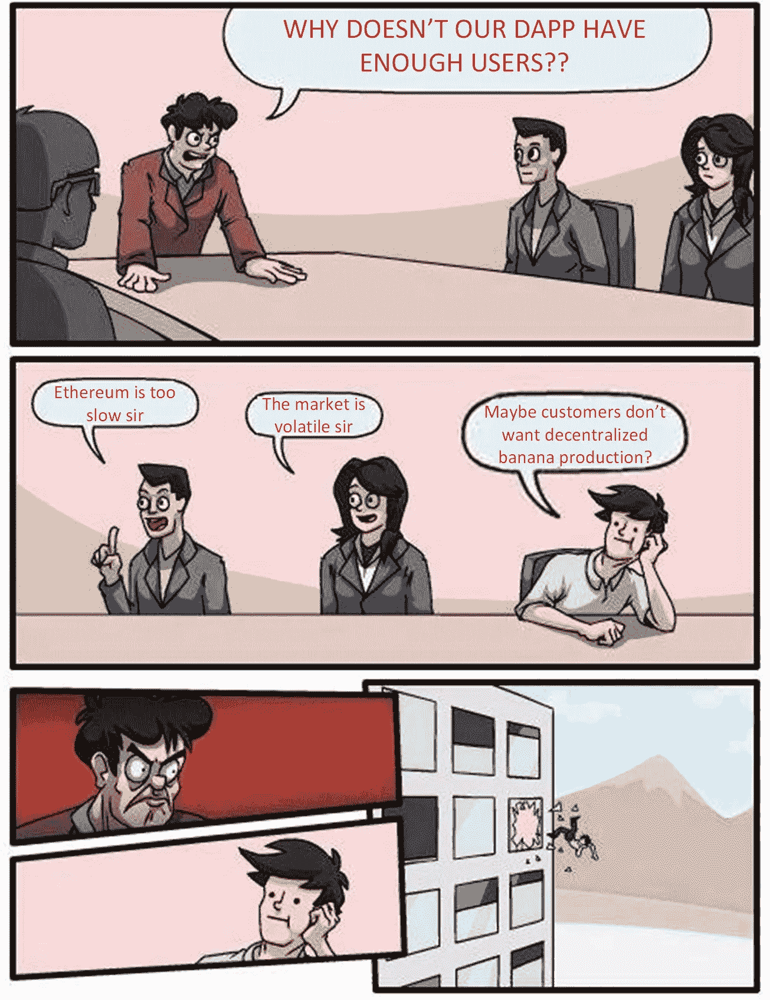
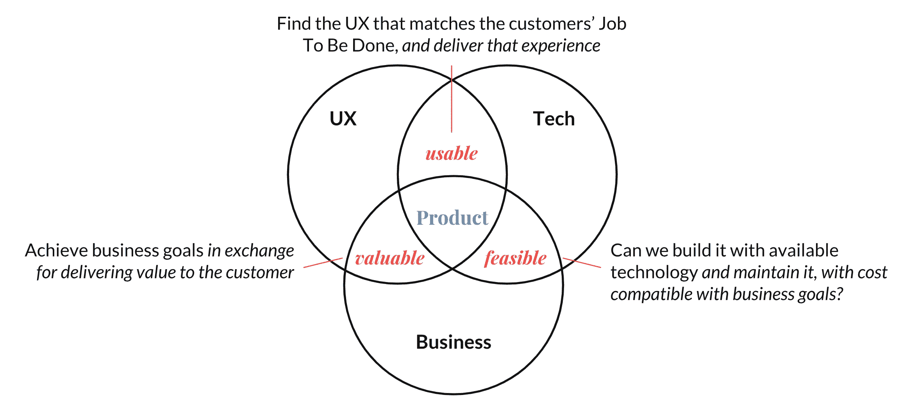
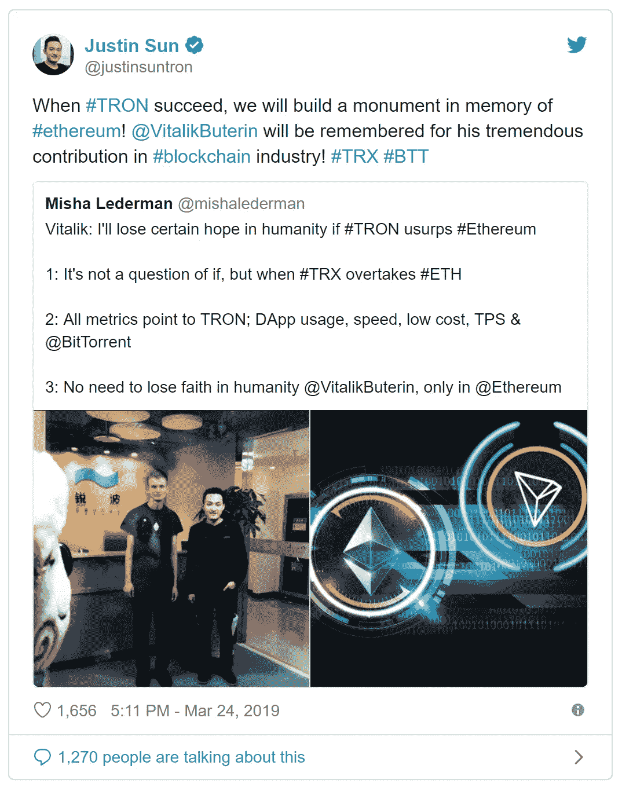
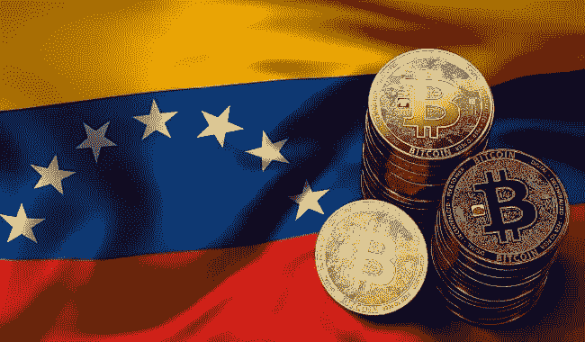
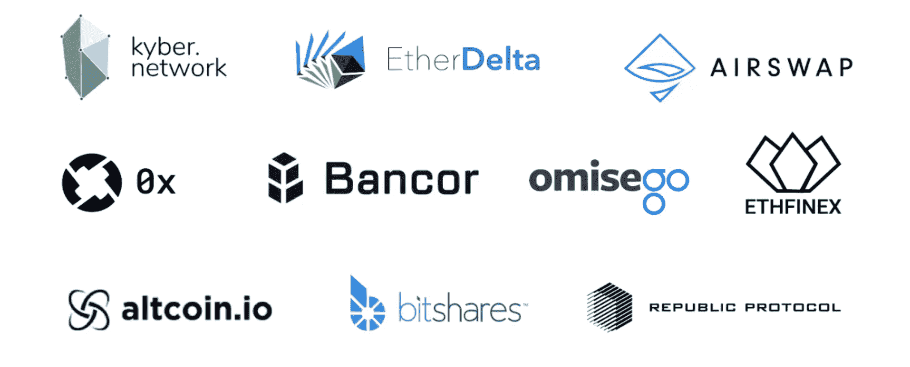
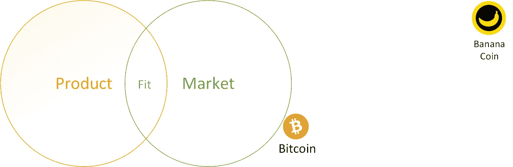

# 加密货币和产品市场匹配-欢迎来到 2019 悖论

> 原文：<https://medium.com/hackernoon/cryptocurrencies-and-product-market-fit-welcome-to-paradox-8062d596a79a>

到目前为止，90%的区块链和加密货币项目的失败是一个相当公开讨论的现象。那些一开始承诺创造“新生态系统”、“T1”、“T2”、“不信任的政权”、“T3”和“T4”、“防篡改的神奇之地”的项目，都在过高的期望面前失败了，给技术专家、投资者和爱好者留下了苦涩的印象。剩下的是数百个“去中心化”的应用程序，它们努力获得可持续的用户基础，由投机者在交易所玩过山车游戏的代币“驱动”。

这么多失败的项目有什么共同点？

简单明了的回答— ***基本产品管理实务***

## **打造伟大的科技产品**

创造伟大的技术产品就是要建立客户喜欢的解决方案，这可以维持一个企业。当一个成功的产品团队开始构建一个产品(或产品中的一个特性)时，他们会问自己以下四个问题:

1.  **消费者会选择使用该产品吗？**
    还是产品**对用户有价值**？
2.  **消费者能知道如何使用它吗？**
    或者说**这个产品**对普通人有用吗？
3.  我们的开发团队能建造这个吗？
    还是打造产品**可行**？
4.  我们的利益相关者能支持吗？
    或者这个产品**对业务**可行吗？

像亚马逊、谷歌、网飞和脸书这样的品牌已经获得了数百万美元的收入，仅仅是在构建任何产品或功能之前考虑这四个因素。这是一个在加密团队中非常缺乏的实践。大多数 DApps、令牌、加密货币甚至财团区块链项目都是在没有充分分析其价值、可用性、可行性和商业可行性的情况下开发和推出的。

© 2018 João Craveiro (inspired by [the work of Martin Eriksson](https://www.mindtheproduct.com/2011/10/what-exactly-is-a-product-manager/)).

## **加密产品哪里出错了**

1.  大多数 DApps 和区块链项目为已经使用 Crypto 的用户带来了**价值**。除此之外，将普通的**非加密乔(NCJ)** 转化为 DApp 的活跃用户的转换成本目前太高了。这是因为传统的“非区块链”应用程序已经完美地工作，并为其用户提供了巨大的价值。这也是为什么大多数人更喜欢在媒体上发表他们的文章，而不是在 T4 网站上发布或者上传视频。上述这些平台提供了更好的内容，因此提供了更大的价值，更不用说他们庞大的现有用户群。
2.  令牌、DApps 和其他区块链应用在**可用性**部门苦苦挣扎，尽管它们正变得越来越好。目前，这个领域仍然受到汽油费、助记短语、丢失的私人钥匙和大量行话的阻碍。足以让一个 NCJ 的兴趣只限于开 C[oinmacetapcap](http://www.coinmarketcap.com)。
3.  这些产品的可行性是一个很难衡量的项目。区块链协议相当不稳定，以太坊 2018 年的天然气价格波动和 EOS 正在进行的 RAM 问题就证明了这一点。DApps 不得不进行链迁移和令牌交换，希望建立更可靠的网络。最重要的是，这些相互竞争的协议之间关于去中心化的“正确”方式和可伸缩性三难困境的争吵不断——这是一种永无止境的、非决定性的尝试，旨在赢得和保留开发人员的喜爱。

Winning Developer Love 101

## **反论证**

但是可以做一些论证，这告诉我们，这些原理不能直接应用于区块链和 Crypto 中的项目。这个案例是这样的—

1.  大多数 dApps 和 token 项目背后的商业模式与传统软件产品非常不同。构建分散化产品的主要商业驱动力并不是希望获得更多用户，从而获得更多收入。相反，代币项目的主要动机是需要提高其基础资产的价格。这是大多数项目的主要驱动力之一，对于大多数团队来说，以这样的目标开发产品是一个未知的领域。
2.  分散的项目将会更加难以使用。密码学还没有发展到让公钥-私钥对更容易管理，或者让助记短语更容易记忆的地步。团队剩下的唯一选择是通过构建托管解决方案来提供更好的 UX，但这是以被称为“集中化”为代价的。
3.  去中心化产品的主要价值是…嗯，它们是**去中心化**！？它们是围绕这样一个理念建立的:向客户**提供**替代**解决方案，并由他们控制**。它从来都不是为了解决客户的棘手问题，而是提供一种去中心化的(因此被认为是更好的)方法来实现同样的目标。
4.  产品管理社区讨厌路线图。不幸的是，即使是最合法的 token 项目也有相关的 ico，伴随着相关的(并且考虑不周的)**路线图，**迫使产品团队向市场推出未经验证和测试的想法。使用这种方法，团队无法优先考虑和适应客户需求，因为他们最终忙于构建下一个大的“赌注回报原语”，而不是客户想要的功能。

## **将所有这些放在一起**

如果你是一个快速判断的人，似乎大多数加密货币和 dApps 都远远没有达到任何形式的产品市场适合度。然而，事实远比这复杂。有经验证据表明，分散化的产品确实有它们茁壮成长的特定市场。也有一些例子表明，预测的加密应用的可行市场已经被可怕的采用。让我们来看几个这样的场景——

Source: [www.coingape.com](http://www.coingape.com)

1.  一些顶级加密货币在通过恶性通货膨胀努力应对货币贬值的国家出现了积极趋势。在委内瑞拉，越来越多的人采用比特币和 Dash，这是一个普遍且有充分证据的故事，值得一读。
2.  批评者喜欢用“加密货币只对毒品和色情有用”的概念抨击 crypto 成人行业的支付渠道平台 SpankChain 在 2018 年 4 月至 12 月期间向表演者支付了 7 万美元。对于支付渠道这样一个新生的概念来说，这是一个不小的成就。这是不是意味着，批评家们有 50%是正确的？！
    说实话，我们在这里可能有一个实际上可以维持技术产品的市场——表演者为他们的工作获得更公平和及时的报酬，而消费者不必担心他们的信用卡账单上出现他们……咳咳，*欲望的名字【the SpankChain 团队在设计他们的用户想要并愿意支付的解决方案方面尽了自己的一份力量。*
3.  分散交易所(dex)是另一个需要研究产品与市场匹配度的非常矛盾的产品类别。从表面上看，它们看起来像一个非常受欢迎的产品，一个已经足够成熟的产品，占据了加密-加密交易量的很大一部分。它们有助于克服集中式交易所的一些缺点，如不托管资金、防止安全漏洞，以及几乎没有 KYC/反洗钱的简单得多的入职程序。然而，统计数据仍有许多不足之处——利用 0x(可以说是更好的 DEX 协议之一)的中继站在 2019 年每天的交易量都低于 100 万美元——[https://0xtracker.com](https://0xtracker.com/)。
    dex 面临的权衡，如匹配和执行速度较慢、潜在的领先优势、隐私性下降、糟糕的 UX 和会计噩梦，使其对机构投资者没有吸引力。这些协议能否单独满足散户投资者的产品市场需求仍有待观察。

尽管如此，我们必须记住，产品与市场的匹配是一种难以预测的现象。任何有经验的产品经理都会告诉你，“当它发生时，你会知道的”。比特币已有 10 多年的历史，只是刚刚开始在特定市场找到自己的位置。其他人甚至更远。

最近，一系列事件的发生预示着一个更光明(可能更分散)的未来。脸书和 JPM 等主流巨头也加入了加密潮流。数字时代的影响者，如 PewDiePie 和 Jordan Peterson 已经发言反对审查(在传统平台上)，甚至已经在[出售几个区块链项目](https://cointelegraph.com/news/top-subscribed-youtuber-pewdiepie-partners-with-blockchain-livestreaming-platform)。到明年这个时候，我们一定会在这个领域看到更好的产品。在此之前，让我们满足于一些集中的香蕉，并尝试在我们的 NCJ 朋友手中获得一些密码。

如果你碰巧在市场上寻找一位在区块链和加密货币领域工作了一辈子的产品经理，请前往[www.consultmelive.com](http://www.consultmelive.com)与我预约一次免费咨询会议。你可以提出你的疑问，要求参加网上研讨会，或者只是顺便过来打声招呼。

**来源**

1.  灵感— [如何创造顾客喜爱的科技产品，作者 Marty Cagan](https://www.amazon.com/INSPIRED-Create-Tech-Products-Customers-ebook/dp/B077NRB36N/ref=tmm_kin_swatch_0?_encoding=UTF8&qid=1555057683&sr=8-1)
2.  媒体上的 Arjun Bala Ji—[2019 年的加密论文](/@arjunblj/crypto-theses-for-2019-dd20cb7f9895)
3.  乔希·斯塔克谈媒介— [以太坊的一年](/@jjmstark/the-year-in-ethereum-87a17d6f8276)
4.  若昂·克拉维罗— [马蒂遇见马丁](https://joao.cravei.ro/blog/marty-meets-martin/)