# 帮助我度过加密寒冬的加密货币分析工具

> 原文：<https://medium.com/hackernoon/cryptocurrency-analytics-tools-that-helped-me-weather-crypto-winter-1362bec6744b>

Photo by [Todd Quackenbush](https://unsplash.com/@toddquackenbush?utm_source=unsplash&utm_medium=referral&utm_content=creditCopyText) on [Unsplash](https://unsplash.com/search/photos/tools?utm_source=unsplash&utm_medium=referral&utm_content=creditCopyText)

> 数字资产不比传统金融资产差，这不是什么秘密。

随着机构投资者的到来，许多加密货币分析工具应运而生。今天我想告诉你最受欢迎的，专业人士和新人都用的。

*又及:大部分都是完全免费的。*

## [1。密码比较](https://www.cryptocompare.com/)

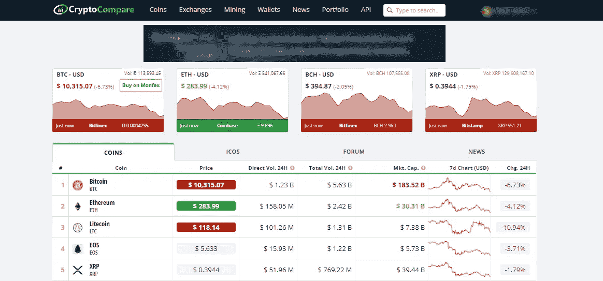

Price in real-time.

Cryptocompare 是一个信息平台，面向对投资加密货币感兴趣的人，他们想知道他们在哪些交易中赚了钱(以及赚了多少)，以及哪些交易不盈利。你对加密货币的所有操作(买入、卖出)都在一个地方，这里给出了课程的完整统计数据，计算了加密货币的收益率，你可以看到其他参与者的投资组合等等。

在这里，您可以制作自己的加密投资组合(跟踪您的加密利润)

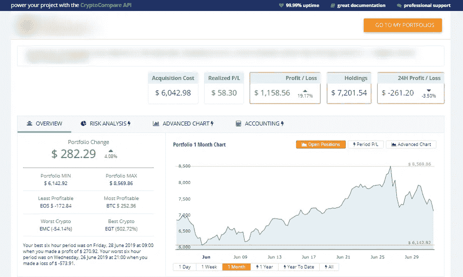

你如何控制你的投资？

你需要知道你有多少硬币，它们值多少钱。最重要的是，你需要看到你所处的盈利/亏损的百分比。为此，你需要一个加密组合工具。

***P.S*** *同样在这个平台上，你可以为自己找到许多其他有用的功能。*

## 2.[交易视图](https://www.tradingview.com/)

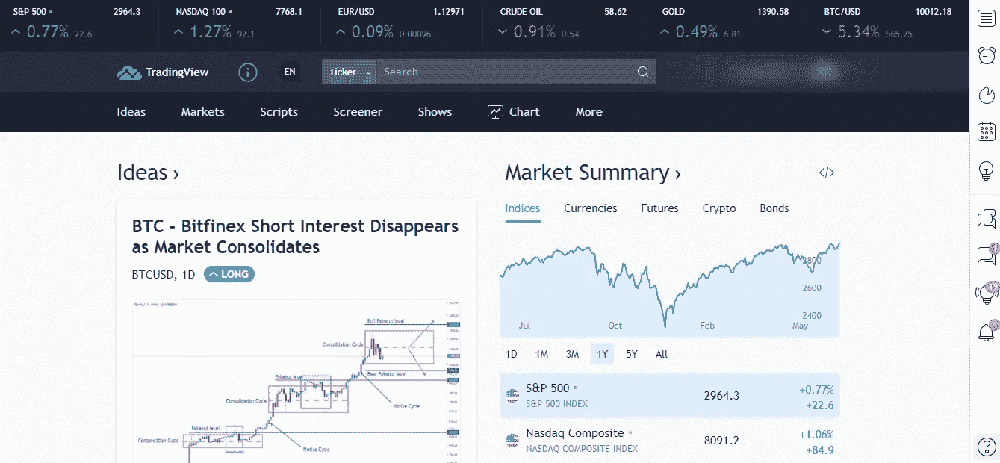

TradingView 是最受欢迎的技术分析网站之一，也是全球企业家、投资者和交易者的社交网络。

在这里您可以找到所有信息:

*   制图法
*   加密货币
*   实时图表
*   其他类型的图表—超过 10 种显示选项，包括 Renko、Kagi、Noughts 等。
*   价格行为的 13 个变量。
*   在 Pine 编辑器中创建您自己的策略的工具
*   附加图形工具。
*   比较指标
*   交易想法，你不仅可以分享自己的预测，还可以利用其他交易者的想法。

在这里，您还可以为图表选择不同类型的显示和时间范围，设置指示器和使用各种图形工具，滚动和缩放图表等。

这项服务对于喜欢 wave 和图形分析的交易者来说是非常好的——对于这项交易，View 提供了许多空白，很容易付诸实践。

但是在使用这种资源时有一个特殊的细微差别——大多数独特的工具只在付费版本上可用。同时，提供三个软件包—专业版、专业版+和高级版。

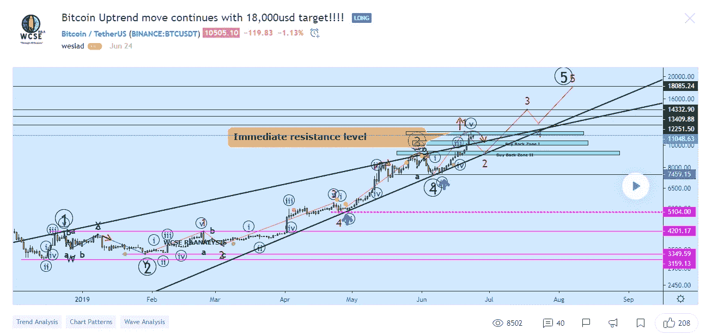

An example of technical analysis from the user.

免费使用的话，你将主要限于一些用于日内分析的功能和用于更深入市场分析的附加功能。然而，你将可以使用该平台的所有标准功能——超过 50 个图形功能、整套基础资产、一个股票筛选工具、一个巨大的指标数据库、演示交易、工具比较、功能性价格标度和绝对所有的标准选项。

***P.S*** *这个工具更多的是为传统市场设计的，而不是最近才在这里出现的加密货币。*

## [3。CoinMarketCap](https://coinmarketcap.com/)

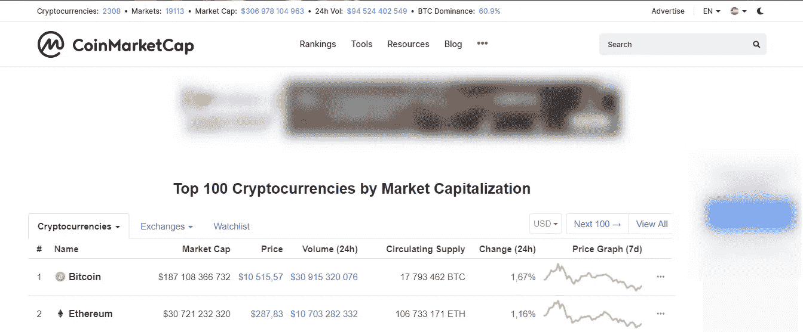

CoinMarketCap 是一个免费的在线平台，用于跟踪市场上所有现有加密货币的市值、价格走势和交易量。

在该平台上，您可以看到特定加密货币的各种最重要的数据(价格的历史动态、市值、过去 24 小时内市场上的价格和供应量的变化、可用硬币的总数等。)

这个平台在资本化方面可以被认为是一种加密货币评级。

“价格”列显示单个加密货币硬币的价格，“可用供应量”会告诉您可用硬币的总数。

如你所知，所有的加密货币都可以分为硬币已经被完全开采的和仍在开采的(例如，同样的比特币，其当前报价为 17 795 100，到 2140 年，所有的加密货币都应被大约 21 000 000 个硬币开采。).那些已经被彻底开采的硬币标有星号(“*”)。

***P.S*** *仔细查看大写，因为它并不总是显示正确的音量。*

## [4。密码恐慌](https://cryptopanic.com/)

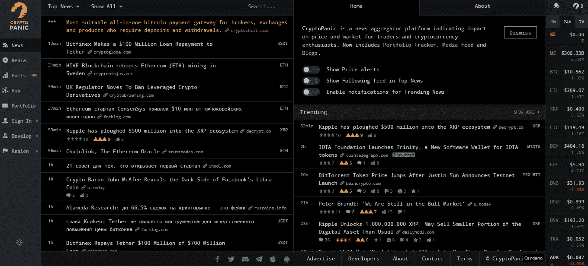

Cryptopanic 是一个新闻聚合器。它收集各种关于加密货币，ICO，IEO 的新闻。这项服务允许用户评估所有发布的新闻。

该平台易于使用，例如:

*   新闻部分将向您显示匹配的新闻提要。您还可以设置您的监控设置；
*   过滤停用词，个性化；
*   在平台上讨论新闻的能力。

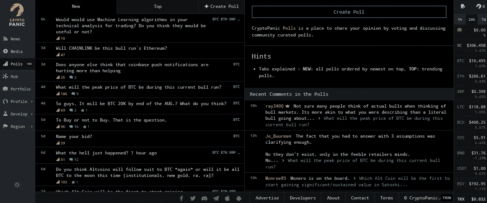

最近他们增加了在平台上直接投票的功能。现在，您可以将任何新闻带到讨论中，并通过平台的整个加密社区的投票获得反馈。

我希望在不久的将来他们会把设计做得更好，但总的来说，这个平台完美地完成了它的任务。

## [5.CryptoIndex.com](http://cryptoindex.com)

CryptoIndex 几乎结合了高级分析所需的一切。Cryptoindex 有两个有趣的工具:索引和分析平台。基于人工智能的 Cryptoindex 算法正在持续分析 2000 多枚硬币，应用 200 多个因素，每秒处理 100 多万个信号，以提供一个高度复杂的前 100 种货币的指数。

首先，让我们看看加密索引。

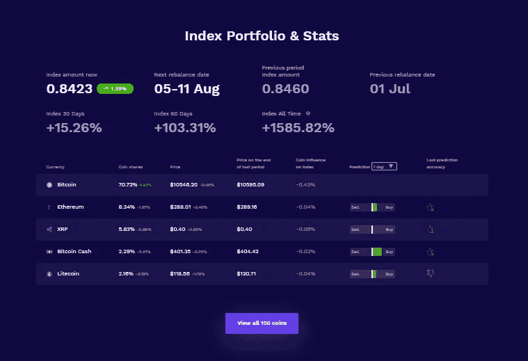

Here you can see predictions in the right column. At the top, you can see “prediction” and “last prediction accuracy.” The algorithm performs as an indicator of probable price movement.

预测功能目前运行得非常好——你可以在平台上检查它。预测准确率约为 70%至 95%。

加密索引的核心概念是:

*   硬币夹杂物过滤器
*   这枚硬币至少有 3 个月的交易历史。
*   硬币至少在一个我们收集数据的交易所上市了。
*   硬币不是任何指数，不是基于法定货币(如 USDT)，也不是基于任何商品或其他资产。
*   硬币不涉及任何骗局丑闻，退市，或诉讼。
*   如果一枚硬币在一段时间内未能满足我们的任何一个标准，它将在下一个周期开始时从指数中排除。

阅读完整的[指数方法](https://cix100.com/docs/Methodology-Cryptoindex.pdf)。

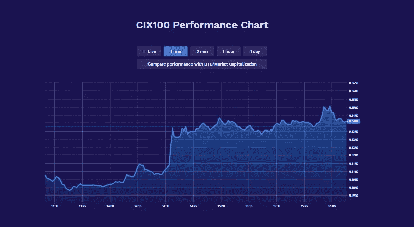

Real-Time CryptoIndex Chart

加密指数的主要目的是创建一个指标(基准)，投资者/交易者/新来者可以通过该指标来描述加密货币运动的总体方向和“速度”。

研究指数的动态有助于交易员理解对个人加密货币的影响——例如，如果比特币价格上涨，那么预期所有替代币的价格都会上涨是合乎逻辑的。然而，不同的硬币以不同的速度增长(有些可能根本没有增长)——该指数有助于了解加密市场细分的总体趋势，而不必评估许多不同硬币的位置。

***P.S*** *该指数在彭博、路透、六团、TradingView 等交易终端均有。*

**Cryptoindex 分析平台**

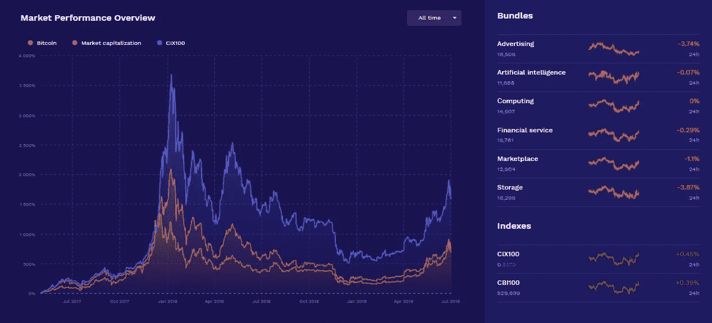

这是一个令人兴奋的平台，将帮助您更好地探索各种替代硬币。该平台包含的数据远不止加密货币及其当前市值的必要信息。目前，该网站提供了 2000 多种不同的替代硬币的信息，在这些信息的帮助下，你可以熟悉它们的市值，此外，由于硬币的基本面和投资分析，你还可以获得更多信息。

该平台还根据市场增长模式发布具体的价格预测，即使你已经熟悉了一种或另一种加密货币，这也会很有用。所有信息都以漂亮的界面提供。

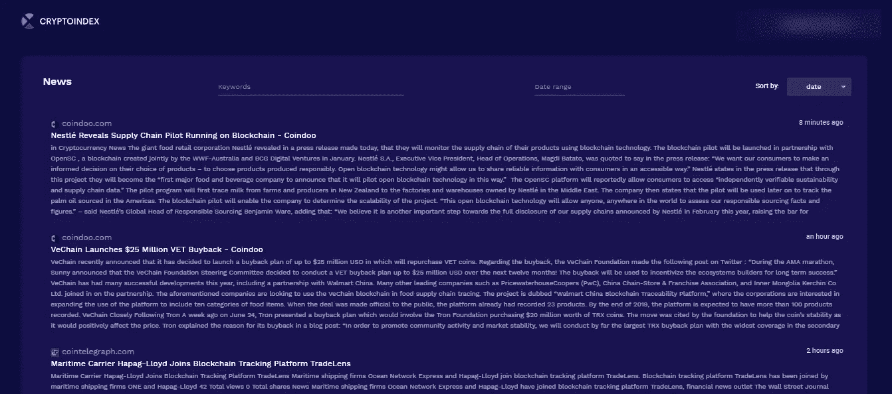

News aggregator by keyword, date range, etc.

这种加密新闻聚合工具有助于投资者/新人/交易者处于市场的顶端，他们可以很容易地从谣言中区分真实。此类新闻聚合器整理来自所有主要加密出版商的新闻，例如:

*   新闻(cointelegraph.com，newsbtc.com，bitcoinist.com)
*   社交媒体(电报频道、Reddit、Slack、脸书、微信等。)
*   网络流量分析网站(Simularweb、Alexa)

此外，一些聚合工具从 Twitter/Telegram 频道提取新闻，这些频道已经被隔离，供投资者分析。
通过这种方式，加密投资者可以快速便捷地了解不同加密货币的消息，并据此制定他们的策略。

***附言*** *该平台结合了一个成熟的加密分析源所需的一切。*

# 结论

这些工具对于任何投资者/新人/交易者来说都是必不可少的，在他们决定把钱投入一个特定的加密项目之前。我一直在协同使用这些工具，为我的投资决策寻找最佳解决方案。

然而，使用这些工具并不意味着你的利润有保证。这意味着你做出了更明智的决定。此外，一开始一起使用这些工具可能会很有挑战性，但是随着您对它们的习惯，您将会理解使用哪种工具、何时使用以及如何使用。

如果您喜欢我的文章并希望了解区块链、加密货币项目和新闻，请订阅我的频道 [**Medium**](https://hackernoon.com/@romanwiligut) 和 [**Twitter**](https://twitter.com/RWiligut) 。

如果您对本文有任何疑问，请联系我。谢谢大家！