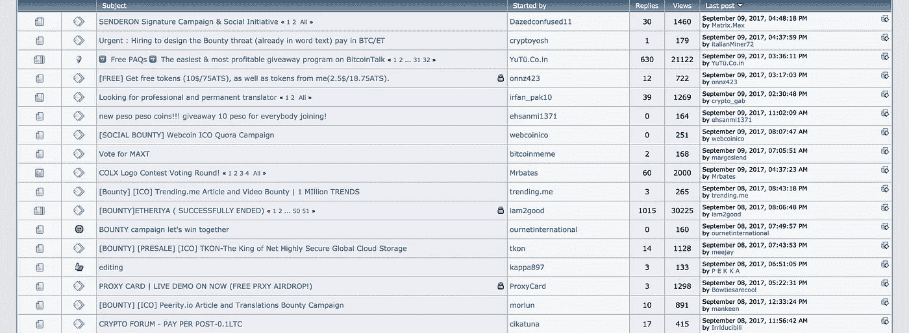
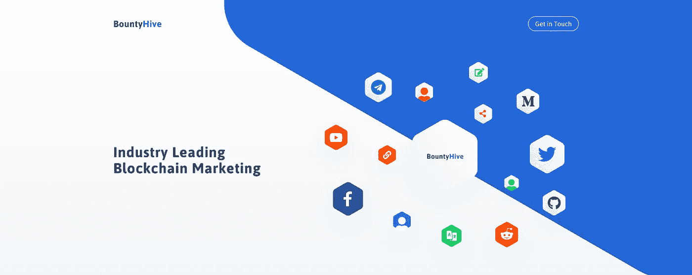
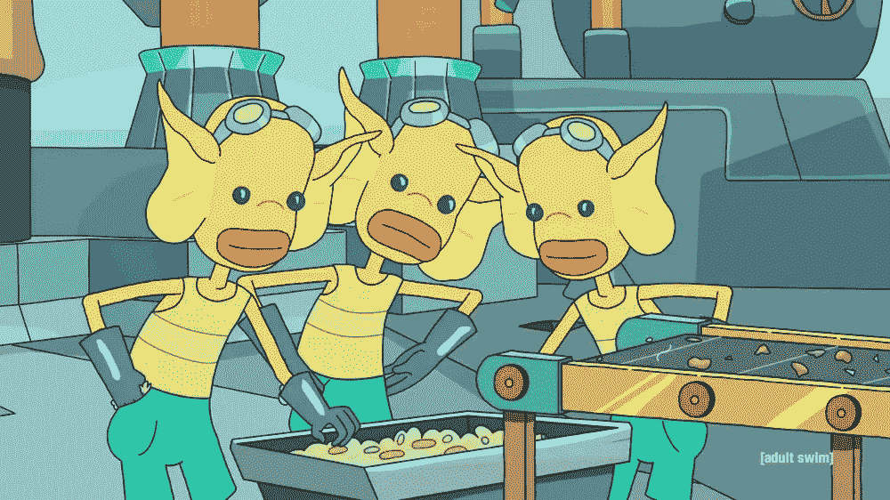

# 赏金运动如何改变营销和我们的工作方式

> 原文：<https://medium.com/hackernoon/cryptocurrency-bounty-campaigns-are-changing-marketing-and-the-way-we-work-3d5362ac6802>

## 密码货币赏金运动在营销行业引入了一种新的分散工作模式。据 Bountyhive 首席执行官图德·斯托莫夫称，这一创新正在将整个行业推向一种对等结构，即公司直接向用户付费，而不是通过第三方中间商来接触这些用户。

# 从狂野西部到密码货币

**我们都熟悉赏金猎人追捕弃保潜逃者的场景。**然而如今，您可能会惊讶地发现，赏金猎人也是神秘货币世界的一大部分。

**过去几年，奖金已经成为区块链初创公司推销 ICO 的首选方式。**简单地说，赏金是对完成任务的奖励或报酬。

> [在赏金运动中]项目提供某种形式的经济奖励，在这种情况下，是本地币或代币。然后，人们为项目完成一些或几种类型的任务，以换取报酬。 *—* [**都铎王朝**](https://blocktv.com/watch/2019-01-13/5c3b6163a4f82-point-of-view-tudor-stomff-seeks-worker-bees-not-drones) **，Bountyhive 首席执行官**

这段话**强调了密码货币奖励的两件重要事情:**

*   首先，隐币奖励提供项目或公司自己的本地硬币，而不是以现金货币提供财务回报。**因此，报酬的价值取决于项目未来的成功**和更普遍的对区块链技术的吸收。
*   其次，因为奖励的价值取决于公司的成功，赏金猎人必须*相信*公司并希望它成功，否则，他们得到的硬币或代币实际上毫无价值。因此，这种类型的奖励**确保赏金猎人和项目有共同的兴趣，这是传统营销所缺乏的。**

# 奖励的演变:从论坛到平台

我坚信，密码货币和区块链技术将改变社会和我们的生活方式。*这就是为什么这些年来我自己也参加了一些慈善活动。*

参与进来很容易。你可以在论坛上找到很多东西，比如[比特币聊天](https://bitcointalk.org)和[比特币花园](https://bitcoingarden.org)。找到一个并不难，因为在任何给定的时刻都会有成百上千的奖金。

> 难的是找到适合你的，适合你的技能和兴趣的，真正合法的。重要的是运用良好的判断力，只选择你相信的项目。

## 这些问题

还有其他的问题。并非所有的赏金战役都以相同的方式组织，可能有不同的规则。**许多人要求参与者跟踪他们自己的推文，等等。并提交每周报告。**有时，直到活动结束，总奖励才明确。

偶尔，**一个赏金项目可能会毫无预警地结束，参与者永远也得不到报酬。**这些只是参与者之前面临的一些问题。

## 解决方案

这就是专门的赏金平台出现的地方。随着加密空间的发展和奖金数量的激增，出现了许多平台，旨在使组织和访问奖金更容易。这些平台不仅迎合猎人，还通过定制赏金程序来满足他们的需求，为 ico 提供服务。

# bounty hive——对活动的不同看法

在这篇文章中，我想把重点放在 [Bounythive](https://bit.ly/2MDggEo) 作为一个例子。这是加密货币领域推出的第一个专门的赏金平台，这给了我足够的时间来研究和观察它。它也被公认为该领域目前的行业领导者。

## 然而，更重要的是，该平台让人们得以一窥奖金如何改变营销领域。

## 现状

Bountyhive 于 2018 年初推出，半年内拥有超过 [10 万用户](/bountyhive/welcome-to-bountyhive-ae4b8eb39d33)，一年内浏览量达到 1000 万。该平台已经成功地为大约 *110 个项目开展了活动，这些项目已经筹集了超过*[*【5 亿美元*](/bountyhive/welcome-to-bountyhive-ae4b8eb39d33) *【的资金。*

它目前支持**八种不同类型的赏金活动**，包括脸书、Twitter、Reddit 和 Telegram 上的社交媒体活动，以及翻译、文章、视频和 bug 狩猎&开发等内容特定的活动。

根据其透明度报告，用户已经为每个项目产生了超过**8500 万次社交媒体展示、** [**2 万篇文章和视频**](/bountyhive/welcome-to-bountyhive-ae4b8eb39d33)**以及 15-20 种不同语言的白皮书翻译。根据 ICO 值，用户已获得价值超过 [80，000 ETH](https://bountyhive.io/browse) 的代币。**

## **是什么让 Bountyhive 成功了？**

**[Bountyhive](https://bit.ly/2MDggEo) 的结果可以归结为**三个主要原因**:**

*   **首先，它对自己发布的项目做了大量尽职调查。**
*   **第二，每个项目都必须将奖金池交由第三方保管，这样参与者的回报才能得到保证。**
*   **第三，平台**使用简单。**不需要提交表格或遵循电子表格。该平台具有 API 和爬虫功能，可以跟踪特定的行为，如注册新产品或服务。用户只需链接他们的社交媒体账户并完成任务。平台会处理所有其他事情。**

**然而， **Bountyhive 不仅仅是一个平台，它还是一个统包营销机构**，负责公关、社区管理、社交媒体管理、数字广告以及为区块链项目组织会议和聚会等活动。**

# **作为一种新的营销形式的奖金活动**

****

**鉴于 Bountyhive 在加密货币和区块链营销方面的领先地位，考虑它如何看待赏金活动在未来的发展是一件有趣的事情。**

****Bountyhive 的首席执行官强调，奖金不同于传统形式的营销**,因为奖金猎人是那些想要支持他们所从事的项目的人，并且是真诚地这样做的:**

> **这是一种你在任何其他类型的营销中都找不到的利益结合；双方都希望公司成功。这与传统营销有很大不同，在传统营销中，项目只是付钱给第三方来制作广告和开发品牌。就奖金而言，只有当人们真的相信这个项目时，他们才会支持它。—[**Tudor stom ff**](https://linkedin.com/in/tudor-stomff-a74771bb)**，Bountyhive** 首席执行官**

**项目不能假设参与奖金的人需要钱，或者他们是在帮他们的忙。相反，他们必须明白，他们正在建立一种基于共同利益的关系。**

**对我来说，吸引我参加奖金活动的不是钱，而是**我相信区块链科技有潜力改变社会。**奖金让我有机会了解更多前沿技术发展，并支持我认为对社会有益的项目。**

## **我的兴趣和我所写的项目之间的匹配使工作变得有趣和令人满意。这种激励模式在营销界是独一无二的。**

****

**Photo by [Campaign Creators](https://unsplash.com/@campaign_creators?utm_source=medium&utm_medium=referral) on [Unsplash](https://unsplash.com?utm_source=medium&utm_medium=referral)**

# **平台之外的赏金战役**

**目前，加密货币领域的营销主要还是为了获得**的大众关注和大众宣传**。然而，赏金运动的成功表明，这种情况可能会在不久的将来发生变化。**

## **奖金 2.0**

**想象一下，如果有影响力的人，例如，**不是因为在社交媒体上发帖而获得现金，而是获得一家公司的股权。**如果你把这种情况转移到区块链，你会发现这实际上就是奖金现在正在做的事情。唯一的区别是提供奖金的人和有影响力的人不在一个水平上。**

**然而，随着市场变得更加规范，**随着 KYC 变得更加重要，随着我们从 ico 转向 sto**，越来越多的人将会了解加密并加入这个行业。**

**随着这种情况的发生，奖金活动将发展成为**点对点营销项目，**因为人们会得到与公司密切相关的东西，并与公司的成功有利害关系。**

## **怎么去？**

**Bountyhive 的首席执行官认为这是该行业的发展方向。为了准备写这篇文章，我联系了他，看看他对奖金行业的未来有什么看法。**

**我惊讶地发现他已经在着手一个新项目，其目标是在更大的范围内重组我们的工作方式。斯托姆夫解释说，他的目标是为自由职业者创造一种真正去中心化的工作模式，不依赖于任何特定的平台。**

> **例如，他解释说，在 Fiverr 上，你可以“提供”一项服务，而在 Upwork 上，你可以接受一份临时工作，在 99designs 上，你可以投标并竞争工作。如果你想使用另一种模式，或者需要比你目前使用的网站提供更多的可定制性，你必须转换平台，并丢失所有你建立的历史。**

**因此，斯托姆夫认为**必须从头开始建立一种新的模式**来支持个人/组织之间所有可能的合作形式，而不是试图通过建立更新的集中式平台来改进过时的技术。**

## **考虑到 Bountyhive 对加密货币领域的影响，看看 Stomff 下一步要做什么将是令人兴奋的。**

***订阅我的* [*中*](/@minadown) *和* [*推特*](https://twitter.com/minad21) *频道如果你想了解更多关于区块链和加密货币项目的信息，

如果您对本文有任何疑问，请在下面的版块发表评论。谢谢大家！***