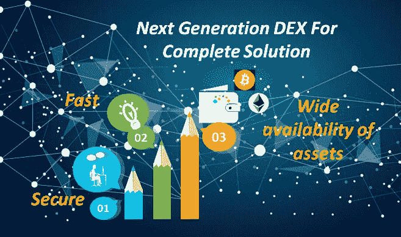
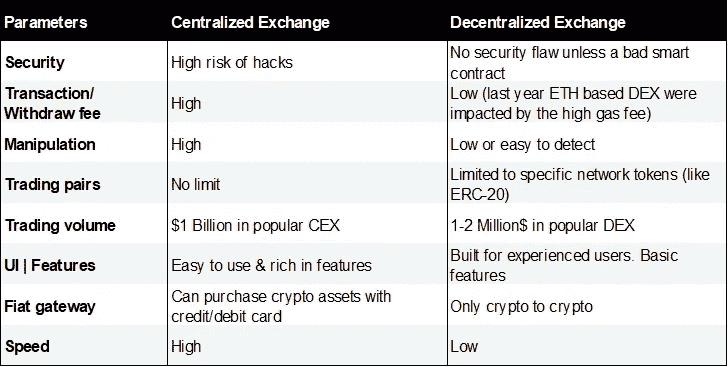
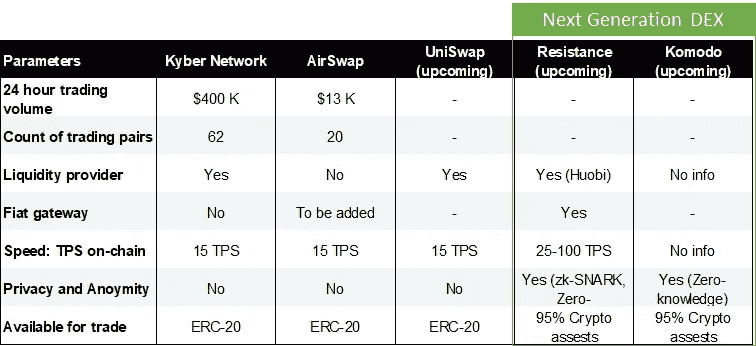
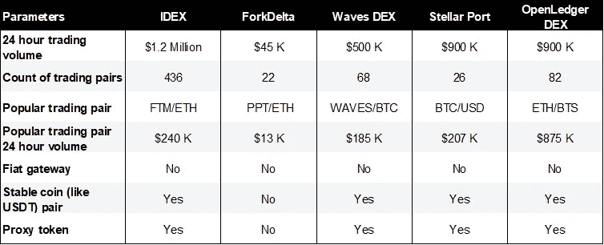

# 加密货币交易所:提供完整解决方案的 DEX

> 原文：<https://medium.com/hackernoon/cryptocurrency-exchange-a-dex-offering-the-complete-solution-6b7386a8c070>

在集中式加密货币交易所，订单和交易被离线记录在一个私人数据库中。虽然这种解决方案在主流金融界使用，但在加密货币市场中，它会产生交易对手和运营风险，如黑客攻击和盗窃(即 Mt. Gox 和 Bitfinex 丑闻)。

此外，集中式交易所更容易受到政府审查。交易所很容易被吊销营业执照，资金也被没收。过去有过几个例子，比如在印度和中国，政府禁止并强制关闭交易所。

控制用户的资产也意味着他们可以在没有通知的情况下对 block 用户的资产或帐户施加自己的条款。更不用说操纵交易订单和由中央加密交易所进行的清洗交易，以创造特定交易对有吸引力的“印象”，并导致大规模的泵和转储场景。

这些越来越多的担忧使得分散的加密货币交易所成为更安全、更有吸引力的选择。由于 DEX 中的订单是点对点直接匹配和执行的，这使得整个过程更加安全、透明，并易于识别虚假交易量。此外，dex 的用户可以从较低的取款费用中受益。

然而，尽管有诸如安全性和对资产的完全控制等好处，dex 仍未能获得大规模采用。一些主要原因是:

## 流动性问题

造成这种低流动性问题的一个主要原因是，目前大多数 dex 不支持大范围的加密货币，并且区块链网络之间缺乏可解释性，将交易对限制为特定网络发行的令牌。

今天，在一些 DEX 平台中，有可能交易其他网络令牌。这些被称为代理令牌，这意味着你已经将你的令牌托管给一个托管人，这意味着最终用户面临着与集中交易所相同的交易对手风险。

此外，使用代理令牌进行交易的过程需要使用网关将外部本地硬币(如比特币)与附属代理令牌相互转换，这增加了终端用户的复杂性。

## 难以使用:

当前的 DEX 平台不直观或不易于使用，并且需要高水平的技术知识。大多数新的加密货币交易商将选择简单的选项，即集中交易。

## 性能缓慢:

dex 的另一个重要缺点是它们处理交易的速度比集中式交易所要慢。dex 需要数以千计的不同计算机相互同步，导致更长的块确认和更慢的交易速度。

**A quick comparison table of centralized Vs Decentralized exchange**

注意:在分散式加密货币交易所中，交易速度取决于底层协议，通常通过以下两种方式之一:

在选项一中，DEX 维护一个链上订单簿，其中通过智能合约来促进令牌的交易(交易速度取决于网络拥塞，网络拥塞可能会很慢)。因此，任何交易(如下订单、取消订单等行为)都可能需要用户支付网络费用。这就是为什么今天大多数 dex 都基于混合方法，即选项二。

**A quick comparison table of DEX (Use Option One for a complete decentralized solution and highest security) — Data as of 24th Mar 2019 10:00 AM CET. Note- Next generation DEX today use Atomic swap. More explained in the later section.**

在第二种选择中，DEX 维护一个离线订单簿，然后为最终结算促进在线交易。在这样的安排下，你永远不必把你的代币放在交易所里，这样更快，并且提供了一种近乎集中的交易体验。

基本上，您离线运行订单簿，让“交易所”匹配订单，然后通过智能合同发送订单进行结算。这意味着交易者仍然依赖可信的第三方来维护正确的订单簿或价格时间优先级，但相对于将密码转移到中央交易所钱包的保管风险而言，这种风险要小得多。

**A quick comparison table of existing DEX (Option Two for near centralized exchange experience) — Data as of 24th Mar 2019 10:00 AM CET**

寻求成功消除集中式加密货币交易所的威胁和限制的分散式交易所必须具有与集中式交易所相同的速度、流动性和便利性。迄今为止，还没有一个分散的交易所成功地取代了任何一个集中的交易所。

# 面向完整解决方案的下一代 DEX

如今，在任何集中式交易所中，交易量最大的是与 BTC 配对作为基础价格的加密资产，然而，在 DEX 中添加 BTC 配对是一项挑战，因为交易确认时间长，可能长达 10 分钟，以及跨链可解释性。

原子交换技术解决了这个问题。原子互换是一种加密驱动的智能合约技术，使双方能够交换不同的加密货币/令牌，而不依赖于第三方或托管经理，并且双方都没有违约风险。

与使用代理令牌从其他网络或区块链项目添加令牌的 dex 相比，这是一个更加安全和用户友好的选项。

通过增加原子互换，交易所可以提供更多的交易对，以确保更好的流动性。正在致力于在其交易所中集成原子互换的交易所有 Komodo、ResDex、Atomic Wallet、swap。在线等。

## [【ResDEX】](https://www.resistance.io/)在交易速度、先进的隐私功能以及与火币的合作伙伴关系等方面比同行更具优势，以确保平台上更好的流动性。

*   Resistance **InstantSwap** 允许用户在不到一分钟的时间内在 ResDEX 上进行交易。ResDEX 消除了交易员等待大宗交易确认的需要，而是让交易各方立即进行掉期交易。
*   **流动性:**为了广泛提供加密资产选项，ResDex 实施了原子互换，允许用户直接交易多达 95%的现有加密货币。此外，与 Huobi 的抵抗伙伴关系将允许 ResDEX 交易所 300 多种加密货币的流动性。
*   **Fiat gateway:**dex 的另一个进入壁垒是他们缺乏对 fiat to crypto 产品的支持。使用 ResDex，用户可以用信用卡/借记卡购买加密卡。
*   ResDEX 在订单匹配过程中为最终用户**提供高级隐私选项**(使用零知识证明、zk-SNARK 和 TOR)，允许投资者私下交易。