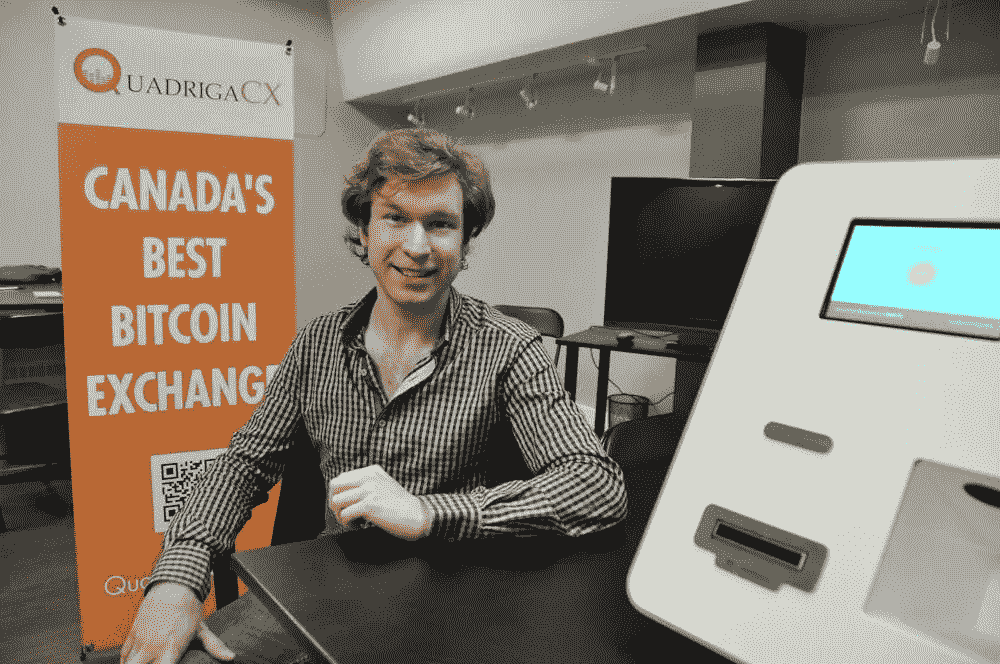

# 加密货币交易所 QuadrigaCX 无法为客户报销

> 原文：<https://medium.com/hackernoon/cryptocurrency-exchange-quadrigacx-could-be-broke-770c8815f60b>

Source: Extremetech.com.

成立于 2013 年的加密货币交易所公司 QuadrigaCX 已经进入黑暗的数字水域。去年 12 月，这家加拿大公司的创始人兼首席执行官杰拉德·科顿(Gerald Cotton)在印度斋浦尔因克罗恩氏病(T4)去世。

他的遗孀詹妮弗·罗伯逊[在 2019 年 1 月 31 日提交的宣誓证词](https://www.coindesk.com/quadriga-creditor-protection-filing)中表示，QuadrigaCX 欠其用户近 2.5 亿加元(相当于 1.9 亿美元)的加密货币和法定货币。

对于 QuadrigaCX 来说，让整个情况变得更加困难的是，罗伯逊告知法庭，客户的加密货币存储在 Cotton 的加密笔记本电脑上。在科顿的笔记本电脑上有一笔不小的财富，到目前为止，Quadriga 雇佣的破解加密的黑客还没有一个能够访问它。

这笔财富据说包括 26500 比特币，11000 比特币现金，11000 比特币现金 SV，35000 比特币黄金，接近 200000[莱特币](https://www.coinbase.com/price/litecoin)，大约 430000 以太。合计起来，这笔无法获得的财富总计达 1.47 亿美元。与此同时，QuadrigaCX 本身拥有不到 50 万美元的现金。

Gerald Cotten, the Late Founder & CEO of QuadrigaCX. Source: Reddit.

QuadrigaCX 最近在其个人网站上的更新内容如下:

> 亲爱的客户:
> 
> 根据《公司债权人安排法案》( CCAA ),今天向新斯科舍省最高法院提交了债权人保护申请，以便我们有机会解决影响我们服务客户能力的重大财务问题。在 2 月 5 日(周二)的初步听证会上，法庭被要求指定一家监管机构安永会计师事务所(Ernst & Young Inc .)作为独立的第三方来监督这些诉讼。
> 
> 在过去的几周里，我们广泛致力于解决我们的流动性问题，包括试图找到并保护我们存放在冷钱包中的非常重要的加密货币储备，这些储备是满足客户加密货币存款余额所必需的，以及寻找一家金融机构接受将转移给我们的银行汇票。不幸的是，这些努力没有成功。进一步的更新将在听证会后发布。

就目前的情况来看，无论是对 QuadrigaCX 还是对其客户来说，结果都不太乐观。正如你所想象的，这不会让顾客高兴。Techspot [的以赛亚·迈尔森报道](https://www.techspot.com/news/78557-cryptocurrency-exchange-loses-145-million-after-ceo-takes.html)该公司的“员工承认他们甚至收到了死亡威胁”

一个合适的法律结果将包括法院允许 QuadrigaCX 使用一笔近 5000 万美元的资金，这笔资金因法律纠纷而滞留在加拿大的一家银行。这些钱中的一部分(目前也无法获得)实际上属于 QuadrigaCX 的客户。

QuadrigaCX 现在[正在考虑出售其操作平台的可能性](https://www.businessinsider.com/quadrigacx-cant-pay-190-million-owed-because-ceo-with-password-died-2019-2)，试图偿还公司欠用户的钱。