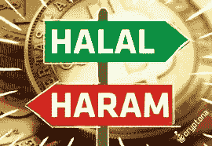

# 加密货币和伊斯兰教法:清真或哈拉姆？

> 原文：<https://medium.com/hackernoon/cryptocurrenices-and-sharia-law-halal-or-haram-ec8d46211580>

根据皮尤报告，2019 年世界人口估计约为 77 亿，其中超过 21 亿是穆斯林。这超过了世界人口的 25%。这一点很重要，值得注意，因为伊斯兰教法的影响和发展与社会所有部门越来越相关。

根据哈佛神学院的宗教扫盲项目，“伊斯兰法，或 *shari'a，*是一系列原则，由法律学者解释、协商和辩论，并在穆斯林的生活中进行调整，以使他们的行动符合真主对公正美好生活的愿景。”扫盲项目继续说，“穆斯林理解*伊斯兰教法*的规则是真主在《古兰经》文本中传达的，但也体现在*圣训*和*圣训*、关于先知穆罕默德的说法和故事中。”

传统伊斯兰教是一种宗教、文化和实用的生活准则，那些生活在最严格的宗教范围内的人将伊斯兰教法视为社会的支柱。因此，伊斯兰法律创造了生活和决策的结构，从而规范了个人、商业和金融决策。从字面上看，世界伊斯兰教法的意思是“道路”

根据汤森路透，到 2021 年，全球伊斯兰经济预计将达到 3 万亿美元以上。在这个市场中，加密货币将在不断涌现的全球市场和贸易资本化中发挥作用。有鉴于此，理解加密货币的问题及其与伊斯兰教法的合规性非常重要。伦敦和中东银行(BLME)是一家符合伊斯兰教法的银行，它声明“伊斯兰金融的主要原则是避免一切有害的活动，如收取利息。除了禁止收取利息之外，伊斯兰金融机构必须确保在交易和合同中最大限度地减少不确定性(gharar)或赌博/投机(maysair)。”为了符合要求，加密货币必须符合这些标准以及其他加密法规。

截至今天，有三种主要的加密货币符合这些标准并符合伊斯兰教法。三者中第一个也是最大的是 Stellar 的加密货币流明(XLM)。今天，XLM 的市值为 474，723 BTC 或 2，394，744，553 美元。随着伊斯兰市场的开放，加密货币变得司空见惯并被理解为伊斯兰教法的抱怨，这一市场份额必将增长。XLM 本身由伊斯兰教法审查局认证，而伊斯兰教法审查局本身则由巴哈马中央银行颁发执照。

目前已经获得 Sharira 批准的第二种加密货币是 OneGramCoin (OGC)。OGC 是一种非常小的硬币，只在一个交易所(Huulk)交易，交易价格为 55.49 美元。其最近的总市场容量为 114.96 万美元，相对较小。然而，这是 Sharira 投诉，这表明了市场的趋势。每一枚 OGC 都至少有一克黄金做后盾，这也是它抱怨的原因。因为，黄金是最古老的穆斯林贸易货币之一。

与我们和发展中的伊斯兰加密货币市场相关的三种加密货币中的第三种是瑞士金融科技初创公司 X8 AG 的稳定货币。这种基于以太坊的硬币也获得了 SRB 的认证，它非常新，在未来几年必须受到密切关注，以掌握其在伊斯兰市场中的市场文明和饱和度。就在最近，有人在讨论将 X8 扩展到阿布扎比、迪拜和巴林。

进一步表明加密货币将在全球伊斯兰经济的未来发挥重要作用的是阿联酋金融服务公司 ADAB 解决方案公司推出 Shairah complaint 加密货币交易所的计划。ADAB 称其平台办公室为第一个伊斯兰密码交易所。虽然这种交换最初将针对 21 亿穆斯林人口，但最终将在全球范围内运作，并向所有最终用户开放。

正如我们所看到的，基于伊斯兰的经济正在向加密货币的数字世界开放，而与此同时，新的和历史悠久的硬币都试图通过成为伊斯兰教徒来饱和市场。在未来几年跟踪这些发展将会很有趣，特别是当伊斯兰教开始与基督教竞争成为世界上最大的宗教，从而成为具有全球影响力的市场。