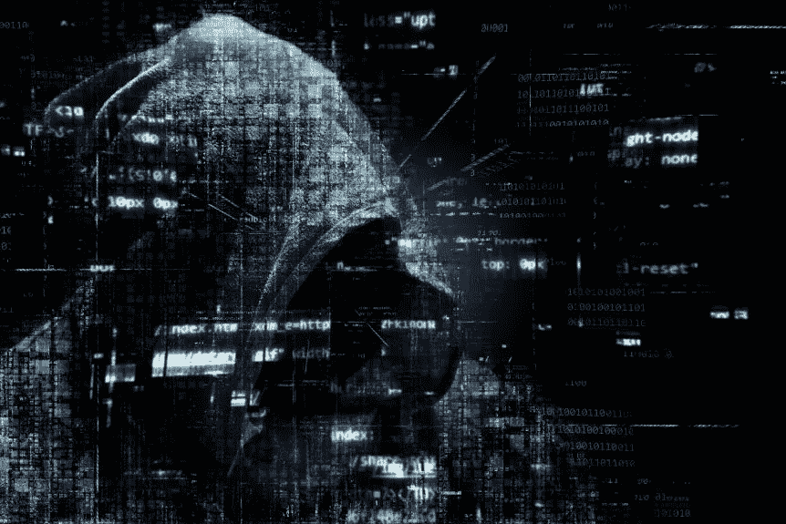

# 2019 年的密码劫持没有死——它在进化！

> 原文：<https://medium.com/hackernoon/cryptojacking-in-2019-is-not-dead-its-evolving-984b97346d16>

密码黑客已经关闭了大学网络和政府网站，但有一个案例吸引了很多关注，那就是使用专注于挖掘 Monero 的 Coinhive 挖掘服务。

随着 Coinhive 的关闭，似乎[密码劫持](https://hackernoon.com/tagged/cryptojacking)可能即将结束。Coinhive 是一个[加密货币](https://hackernoon.com/tagged/cryptocurrency)采矿服务，依赖于网站上安装的一小块计算机代码。它在 2017 年发布了采矿代码，将其作为网站所有者在不运行侵入性或烦人的广告的情况下赚取收入的一种方式。然而，尽管 Coinhive 本身并不是恶意代码，但它却因[密码劫持](https://cointelegraph.com/news/crypto-mining-service-coinhive-to-shut-down-operations-in-march)而在黑客中流行起来。越多的人访问一个网站，越多的处理能力被抽走开采 Monero。

**Coinhive 恶意软件**

Conor Maloney 在《CCN》上撰文指出，这个平台似乎是一个好主意，直到该软件成为臭名昭著的加密劫持恶意软件的基础，最终影响了数百万用户设备，导致电费飙升，并耗尽电池以秘密和非法开采加密货币。此外，随着越来越多的犯罪分子侵入网站并植入 Coinhive 文件，问题完全失控。马洛尼写道:“Coinhive 连续 15 个月被网络安全公司 [Check Point](https://blog.checkpoint.com/2019/03/11/february-2019s-most-wanted-malware-coinhive-quits-gandcrab-cryptomining-ransomware/) 列为世界上最大的在线恶意软件威胁，估计所有 Monero 的 [5%是通过密码劫持](https://researchcenter.paloaltonetworks.com/2018/06/unit42-rise-cryptocurrency-miners/)挖掘的。”

Coinhive 宣布将于 2019 年 3 月 8 日关闭运营，许多人认为这将是密集的加密劫持活动的结束。然而，Maloney 指出，虽然密码黑客不能再求助于 Coinhive，但他们会寻找其他攻击手段。

**coin hive 真空正在等待填充**

安全公司 Proofpoint 的威胁情报主管克里斯·道森(Chris Dawson)评论说，Coinhive 远不是市场上唯一的加密劫持恶意软件，他告诉马洛尼，“Coinhive 的倒台留下了一个等待填补的权力真空”。道森认为威胁来自其他形式的恶意软件，如“银行特洛伊木马、凭证窃取者和机器上的恶意软件。”

其他人，如 Malwarebytes 的杰罗姆·塞古拉，认为犯罪行业正在放缓。他告诉 ZDNet，犯罪行业正在放缓:“仍然有许多被黑客攻击的网站带有 Coinhive 代码，但我有一种感觉，这些大多是过去黑客攻击的残余。这些天我看到的大部分是 CoinIMP(一个 Coinhive 竞争对手),最近它在 Drupal hacks 中又活跃起来了。但总体而言，我认为这一趋势已经接近尾声。”

塞古拉是不是太乐观了？WannaCry 和 Petya 等勒索软件造成了灾难性的打击，导致医院、汽车工厂、政府设施和机场的服务瘫痪，并感染个人设备以提取通常以比特币支付的赎金。密码劫持恶意软件仍然存在——Cryptoloot 就是一个例子，是仅次于 Coinhive 的第二大致命软件。还有一种银行业木马 Emotet，它可以作为恶意附件感染计算机，并被用于传播其他形式的恶意软件，以及一系列收集密码的机器人。

Coinhive 已经关闭可能是个好消息，但我们不能自满，认为加密劫持的威胁已经消失。只要有加密货币可供使用，加密盗窃者就会不断发展他们获取加密货币的策略，我们需要比以往任何时候都更加警惕。