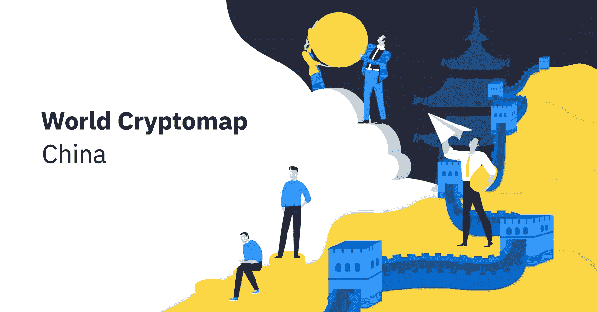
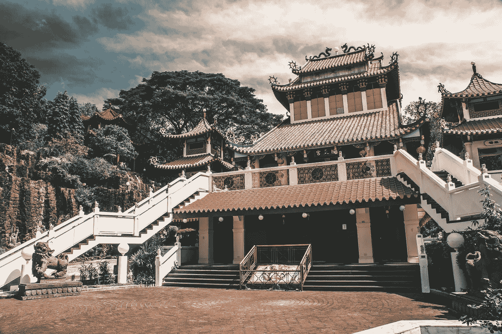

# 加密地图:中国——中国对区块链热情的多面性

> 原文：<https://medium.com/hackernoon/cryptomap-china-the-many-faces-of-chinas-enthusiasm-towards-blockchain-655717f7aae7>

*春节快乐！为了庆祝这个令人惊叹的节日，我们将访问一个拥有大量加密矿工和交易商的国家，在那里，加密货币被视为一种宝贵的资产和安全投资的手段。中国是主要的交易所市场之一，也是世界上一些最大的比特币“矿池”的所在地。不幸的是，中国政府对加密货币的禁令对整个行业产生了负面影响。尽管事实如此，还是有很多理由保持乐观！*

*我们去观光吧！*

## 政府和法规

2016 年，[区块链](https://hackernoon.com/tagged/blockchain)技术发展被纳入[十三五规划](http://www.gov.cn/zhengce/content/2016-12/27/content_5153411.htm)——2016-2020 年国家发展规划——从而使中国成为世界上第一批在其官方政策中接受该技术的国家之一。值得注意的是，国家支持的区块链的使用非常受欢迎，而不是许多区块链项目的分散实践。现在下结论可能还为时过早，但至少，政府的支持可能会促进国家的研发

然而，比特币还没有受到中国官员如此热烈的欢迎。让我们快速浏览一下时间表:

*   ***2013 年 12 月:*** 中国人民银行发布“[关于防范比特币](http://www.csrc.gov.cn/pub/newsite/flb/flfg/bmgf/zh/gfxwjfxq/201401/t20140122_242972.html)金融风险的通知”，禁止银行一切与密码相关的操作。这一措施的主要原因是比特币的去中心化特性导致的安全性不足。在这一点上，比特币已经在中国获得了大规模的普及；
*   ***2016 年 12 月:*** 中国将区块链技术引入十三五规划；
*   ***September 2017:*** China [bans](http://www.pbc.gov.cn/goutongjiaoliu/113456/113469/3374222/index.html) all ICOs. Shortly after, Chinese BTC exchanges are forced to [halt](https://qz.com/1079908/huobi-and-okcoin-chinas-two-biggest-bitcoin-exchanges-will-halt-all-trading-services-for-local-customers/) all trading operations (particularly crypto-to-fiat ones) because of government investigations in the crypto industry. Eventually, the oldest Chinese crypto exchange, BTCC, [shuts down](https://www.ccn.com/china-ico-ban-worlds-oldest-bitcoin-exchange-shuts-doors/) all domestic operations. Yet even after the ban on cryptocurrency trading, the Chinese government along with local corporations like Tencent and Alibaba continue to see huge potential in blockchain technologies and focus on developing decentralized financial platforms;
*   ***January 2018:*** China bans P2P and OTC markets. By this point, Chinese state regulators have worked out a long-term strategy to eliminate cryptocurrency from the national economy by announcing a [ban](http://www.scmp.com/business/banking-finance/article/2132009/china-stamp-out-cryptocurrency-trading-completely-ban) on foreign crypto-related platforms. This is obviously seen as a big deal given the immense amount of crypto mining conducted in China;
*   ***February 2018:*** Access to offshore crypto exchanges and ICO websites is blocked;
*   ***May 2018:*** China’s president Xi Jinping praises the blockchain technology, calling it [“a part of the technological revolution”](https://cointelegraph.com/news/chinas-president-xi-says-blockchain-part-of-new-technological-revolution). The State Council of China [urges](https://www.ccn.com/chinese-government-orders-faster-blockchain-development-urgently-seeking-results/) local financial authorities and state-funded research centres to put extra effort into the development and commercialization of blockchain technologies. A blockchain-powered system to combat fraud is [revealed](https://cointelegraph.com/news/chinese-central-bank-develops-blockchain-system-to-digitize-paper-checks) by the PBoC;
*   ***2018 年 6 月:*** 中国最大的电视广播公司央视告知观众，“[区块链的价值是互联网](https://www.youtube.com/watch?v=PeCTHcAQ_ho)的 10 倍”。在长达一小时的视频中，中国政府官员与国际专家合作，向观众介绍区块链技术的概念和潜力。
*   ***2018 年 7 月:*** 中国央行欢呼其加密货币打击行动取得圆满成功。由中国人民银行(PBoC)宣布并由官方媒体报道的数据显然显示，中国货币现在参与了不到 1%的所有比特币$BTC▼1.62%的全球交易。
*   ***2018 年 8 月:*** 当局[警告](https://www.cnbc.com/2018/09/03/china-clamps-down-on-cryptocurrency-speculation.html)以“加密货币”为幌子的非法集资活动的风险，北京至少一个主要商业区禁止宣传加密货币活动。
*   ***2018 年 11 月*** :台湾[正式收紧](https://cointelegraph.com/news/taiwans-legislature-amends-aml-cft-laws-to-place-new-requirements-on-crypto-exchanges)针对加密交易所的反洗钱(AML)政策，要求交易所监控并阻止任何使用数字资产处理的非法交易。来自中国的压力被认为是这一决定的可能原因。
*   ***2018 年 12 月:*** 中国央行中国人民银行(PBoC)强调了该国证券代币发行(sto)的非法性。
*   ***2019 年 1 月:*** 中国[发布了](http://www.ccidnet.com/2019/0124/10452682.shtml)其最新的政府主办的主要加密货币排名，比特币(BTC)排名第 15，而 EOS 排名第 1，以太坊排名第 2。该排名是在 1 月 24 日的新闻发布会上公布的。中国信息与产业发展中心(CCID)的加密排名于去年 5 月首次公布。在该指数的第九版中，EOS 保持了其作为排名第一的区块链的位置，该平台自 2018 年 6 月以来一直占据该位置。

## 采矿

中国以其众多生产显卡的工厂和 T2 的 ASIC 矿商而闻名。因此，与世界其他地方相比，中国矿商能够以低得多的成本购买必要的设备。

这个国家已经可以夸口说它的电价非常低(T4)；此外，中国政府决定通过向加密农场业主提供额外的电力折扣来鼓励加密货币的工业化生产，你可以明白为什么中国是世界上最大的采矿中心之一。

用于秘密采矿的农场遍布全国。著名的例子包括四川(也被称为[、](https://www.aljazeera.com/indepth/inpictures/world-chinese-bitcoin-mining-180116112117869.html)、[辽宁](https://motherboard.vice.com/en_us/article/qkvxk3/chinas-biggest-secret-bitcoin-mine)(在小城市大连[有一个三层农场，占整个比特币网络杂凑率的](http://www.forklog.net/old-bitcoiner-had-a-farm-ten-amazing-mining-facilities/))、新疆、内蒙古和云南。

## 商业和研究

中国是世界上技术最先进的国家之一。鉴于中国有成为新概念(如二维码支付)首批见长者的趋势，毫不奇怪，甚至在政府对区块链技术进行新的投资之前，中国就已经成为该领域的领导者:

*   2017 年，在令人印象深刻的科学能力壮举中，中国公司申请了全球所有区块链相关专利的[大多数](https://cointelegraph.com/news/china-filed-the-most-blockchain-patents-in-2017)，自 2016 年以来，中国区块链专利数量增加了近 4 倍；
*   中国电子商务巨头阿里巴巴[拥有全球最多的区块链专利](http://en.xfafinance.com/html/Industries/Technology/2018/357980.shtml):估计有 49 项许可证，大多以应用为导向，已被用于医疗保健、公共福利和供应链等领域。然而，这并不能阻止阿里巴巴创始人马云[称](https://cointelegraph.com/news/e-commerce-giant-alibabas-jack-ma-says-blockchain-is-not-a-bubble-bitcoin-is)比特币为“泡沫”。显然，就像中国政府一样，阿里巴巴更多地投资于区块链技术本身，而不是加密货币；
*   马云的另一个创新，众安科技，[计划](http://www.scmp.com/tech/article/2148219/insurtech-giant-zhongan-touts-blockchains-transformational-power-signs)利用区块链的技术来降低医疗保险的风险和成本。据[报道](https://cointelegraph.com/news/alibaba-founded-insurtech-firm-promotes-blockchain-use-in-healthcare-industry)众安科技目前正与上海保险监管部门合作建设区块链再保险平台；
*   按交易量计算，火币网是全球第三大加密货币交易所，它与中国投资公司 NewMargin Capital 和韩国证券公司 Kiwoom Securities Co .，Ltd .合作，为区块链公司推出了 9300 万美元的中韩投资基金。
*   中国搜索巨头百度正计划推出一款基于区块链的新游戏《独孤战》。这将是百度第二次进军区块链的游戏应用:二月份，百度推出了一款区块链游戏“乐狗”，玩家可以在这里照顾狗狗。此外，百度最近[宣布了](https://cointelegraph.com/news/internet-giant-baidu-unveils-energy-efficient-super-chain-blockchain-protocol)另一个基于区块链的产品:一个“超级链”协议；

*   中国其他重要的参与者包括万向区块链实验室(由万向控股和 Vitalik Buterin 共同创立)和中国最大的在线零售商 JD.com，后者[最近宣布了](https://cointelegraph.com/news/chinas-top-retailer-launches-startup-incubator-to-lure-foreign-blockchain-projects)其 Al Catapult 区块链孵化计划的首批四家创业公司。
*   据报道，9 月下旬，[第一家接受](https://cryptoslate.com/no-china-has-not-legalized-nor-put-an-end-to-bitcoin-ban-inaccurate-reports/)以太坊(ETH)支付方式的酒店——以太坊酒店在四川省四姑娘山国家风景区开业。
*   10 月 1 日，中国历史最悠久的科技刊物《北京科技报告》(BSTR) [宣布](https://cryptoslate.com/no-china-has-not-legalized-nor-put-an-end-to-bitcoin-ban-inaccurate-reports/)将从 2019 年初开始接受比特币作为订阅的支付方式，以鼓励在“现实世界的实际行动中”使用加密技术。
*   2019 年 1 月初，中国网络空间管理局(CAC)针对在中国运营的区块链公司推出了新的[规定](http://www.cac.gov.cn/2019-01/10/c_1123971164.htm)。该指导方针要求区块链初创公司允许中国当局访问存储的数据，并引入注册程序，要求用户提供身份证或手机号码。此外，他们将有义务监督内容，审查中国现行法律禁止的信息。

## 人

多年来，人们对加密货币的兴趣一直没有减弱。加密交易似乎是这个国家最受欢迎的消遣之一！不过说真的，看看下面几个案例:

*   据报道，对中国投资者来说，最受欢迎的资产类别是比特币和房地产。房地产是一个安全的赌注，但为什么是比特币？原因可能是，与其他资产类别不同，比特币与中国经济不相关，因此为其他本地投资提供了很好的对冲。最近对加密货币交易的禁令可能在某种程度上挫伤了人们的热情，然而中国的交易者、投资者和交易所似乎都在寻找出路；
*   一只神秘的中国“鲸鱼”——一个拥有足够资产来控制市场价格的投资者——积累了世界上最大的 BTC 钱包之一。总共有 93，947 BTC 被转移到鲸鱼的钱包里；
*   32 岁的中国亿万富翁、人称“矿业大王”的吴正在考虑让自己的公司上市。吴经营【比特大陆】科技有限公司。，世界领先的加密货币采矿芯片生产商。该公司成立于五年前，目前正在寻求将业务扩展到加密之外，并将首次公开募股视为实现这一目标的一种方式。对比特大陆来说，最有吸引力的非加密领域之一是人工智能开发，这是由中国政府慷慨资助的；
*   事实上，中国的工矿农场可能类似于传统的工业城市，那里的工人可能根本不接触外面的世界。该国庞大的人口导致了就业市场的激烈竞争；因此，采矿场管理员愿意全天候住在农场附近，并以相对较低的工资确保加密货币的持续生产。
*   华裔加拿大企业高管赵昌鹏是全球交易量最大的加密货币交易所的创始人兼首席执行官，他被认为是加密领域的“超级明星”。2018 年 2 月，《福布斯》杂志将他列入他们的“加密货币最富有的人”名单第三位。截至 2018 年 9 月，他的净资产估计为 14 亿美元。

## 摘要

尽管中国在国家层面与加密货币交易的关系不稳定，但它对区块链科技的热情是巨大的。在国家资助的研究中，政府对工业秘密采矿的支持以及该国处于技术顶峰的总体趋势中，可以肯定地说，我们应该期待在不久的将来中国在区块链取得一些突破。

***你住在中国吗？如果是这样，请告诉我们更多关于贵国加密的情况。我们渴望在我们的*** [***电报频道***](https://t.me/crypterium) ***听到您的观点！***