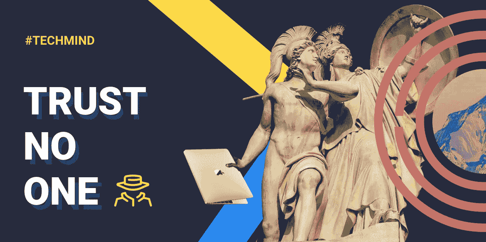

# CTO #TechMind:让你的安全系统“太贵而无法入侵”可以为你节省数百万美元

> 原文：<https://medium.com/hackernoon/cto-techmind-making-your-security-too-expensive-to-hack-can-save-you-millions-7c0170aeaadc>

你早上醒来做的第一件事是什么？如果你和我一样，你要么关掉闹钟继续睡觉，要么打开手机查看你的社交资料。没有什么比几个喜欢开始你的一天…对不对？

成千上万的脸书、Instagram 和 Whatsapp 用户周三带着同样的目的醒来:查看他们宝贵的社交资料和信息。只有一点例外:他们不能。

尽管该公司很快证实了此次宕机与恶意攻击无关，但用户心中已经开始产生疑问……“脸书被黑客攻击了吗？我被黑了吗？世界末日到了吗？”这些问题让我一直在思考。

作为一个一生都在与高端技术打交道的人，我已经能够收集一些有用的技巧，告诉公司如何在这个过程中防止黑客攻击。他们在这里:

## |假装你已经被黑了

防止黑客攻击的最好方法是假装黑客攻击已经发生了。后端不应该信任来自前端的信息。凭证，金额，所有数据都要仔细检查。原因？前端更容易攻击。

如果黑客获得了运行应用程序的设备，他可以将应用程序下载到计算机上，对其进行反编译，浏览代码，修改代码，重新构建应用程序，将其重新加载到设备上，然后利用其漏洞。我坚持:永远不要相信前端。

## |让它超级贵

每次攻击都要花费金钱和时间。通过确保您的安全不会受到某个人、某个地方、某个数据中心或某个提供商的威胁，您提高了黑客的成本。对于攻击者来说，多样化的安全系统意味着破解多种加密算法、防火墙等。规则很清楚:让潜在的黑客攻击尽可能昂贵。

通过将您公司的安全状态提升到“太贵而无法入侵”，您大大降低了成为目标的风险。最简单的方法就是看看你的竞争对手。如果你的系统比你所在领域的其他公司的系统更昂贵，你就间接地把黑客引向了容易赚钱的目标。

我们以索尼为例。该公司在 2011 年被一个有组织的黑客组织 LulzSec 入侵，损失超过 1.7 亿美元。黑客获得了近 100 万名客户的姓名、密码、电子邮件和个人地址。

虽然这听起来可能是提升安全级别的足够理由，但该公司仍然处于黑客级别的较便宜一端。证据？同样的黑客回击索尼，不是环球影城，不是迪士尼，…索尼！不过还好……黑客们让公司付出的代价比上次少多了，只有 1 亿美元。

## |测试一下！

入侵测试非常有用。所有严肃的金融机构都进行这种交易。Crypterium 也不例外。基本上有两种:黑盒和白盒。

黑盒测试是在测试人员不知道公司内部结构的假设下进行的。相反，白盒测试包括向测试人员提供关于你的内部结构的知识。在测试阶段，这些测试有助于发现一些小错误。没什么好担心的…它们都被修好了！"

## 职责分离:权力下放规则

攻击一家公司最常见也是最有效的方式之一就是通过在那里工作的人。黑客可以给你的员工一百万美元来换取密码。他们也可以欺骗你的员工提供敏感信息。职责分离(SoD)限制了员工的影响力。SoD 在防止利益冲突、欺诈和滥用案例方面发挥着重要作用。它还有助于检测潜在的安全漏洞和其他安全威胁。

去年，见证法国电影制作和连锁影院 Pathé发现自己陷入了某种困境。几位高管陷入了所谓的“CEO 欺诈”——一种社会工程师电子邮件骗局——的陷阱。其中的机制非常简单:一个假冒的首席执行官或商业领袖指示组织内的员工将资金汇至指定地点。

在这个特殊的案例中，商业邮件妥协(BEC)骗局让公司损失了大约 2100 万美元。不要关注为什么首席财务官没有发现欺诈，而是为什么现有的系统允许高管以如此武断的方式支付大笔款项。所以看起来法国司法和我的观点一致。这些事件发生后，法院做出了有利于首席财务官的裁决，认定他无罪。

## 最先进的技术

说到防止黑客攻击，加密当然是必须的。现代存储系统允许我们透明地加密所有数据。如果黑客获得了底层硬件的访问权限，他或她将无法读取数据，因为数据将在更高的应用程序或数据级别进行加密。

## |持续教育(不仅仅针对 IT 人员)

对全体员工进行安全教育对于避免公司面临风险至关重要。如果对黑客如何在当今的数字生态系统中运作缺乏足够的了解，您的员工就会处于危险之中，因此您的组织也会处于危险之中。夸张？这些都是真实案例。一名员工接到“老板”的电话，询问密码。销售人员在搜索客户信息时点击了一个可疑的链接。教人们如何预防和快速应对这些情况可能会让你省去一个大麻烦。

## |闭上嘴也没用

有一种先入为主的观念认为，如果你不告诉任何人你的安全性，你会更安全。实际上，这是行不通的。你的公司的安全不能建立在“你认为没人知道你的公司是如何被保护的”的想法上。为什么？因为，不管你喜不喜欢，有人会利用这个想法来伤害你。这就是为什么世界上的安全算法和程序都是开源的。他们接受所有人的检查。开放是安全的来源。

作为 [Crypterium](https://medium.com/u/3c3059b00067?source=post_page-----7c0170aeaadc--------------------------------) 的副首席技术官，我可以告诉你:我们的开发人员正在尽最大努力将所有攻击风险降至最低。此外，他们还做了很多工作来确保你的证书在正确的人手中(当然是你的)。这就是我们如何让它更安全:

## **两步认证**

[Crypterium](http://crypterium.com) 计划在最近的时间内实现两步认证(2FA)。该解决方案要求您在登录并在应用程序中执行特定操作时输入唯一的代码，从而有助于防止对您帐户的未授权访问。

## **托管钱包模式**

此外，托管钱包模式有助于使您的数据不被发现。如果您忘记了密码或丢失了手机，您可以顺利地重新访问您的数字资产。这是其他钱包根本做不到的。托管钱包的工作方式很像一个在线银行应用程序:你把你的私钥交给第三方，以换取安全性。

这种加密钱包的另一个显著特点是能够恢复不需要的交易。假设某个入侵者试图与 [Crypterium 应用](https://itunes.apple.com/US/app/id1360632912&hl=en_US)进行内部交易。如果那笔交易是在区块链进行的，我们将很难恢复它。保持内部交易链外有助于用户轻松收回资金。关于这个问题的有趣阅读[在这里](https://crypterium.com/news/open/ultimate-guide-to-cryptocurrency-wallets)。

就个人而言，我建议你将你的证件视为对你真正重要的东西，就像你的银行卡或汽车钥匙一样。你的证件是对抗网络窃贼的第一道防线。如果你用你的地址，学校，或者一个懒惰的星球大战参考作为你的密码，是时候做一个重大的改变了。检查您正在访问的网站、网络浏览器证书和密码管理器的使用也将帮助您防止潜在的攻击。

让我们面对现实:没有代码是没有 bug 的。希望我的建议能帮助你长期保持安全。