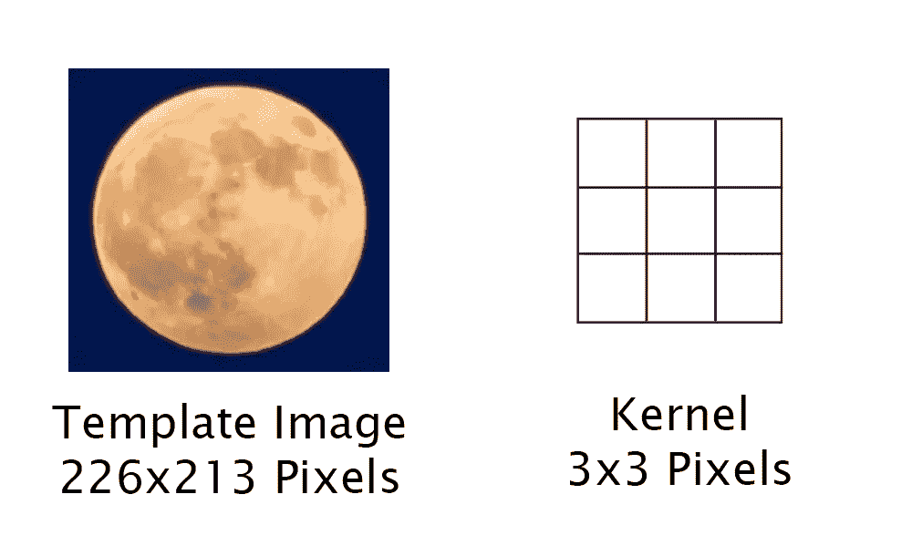
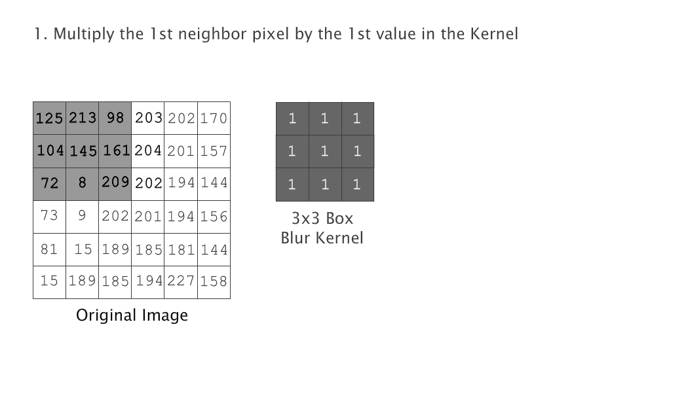
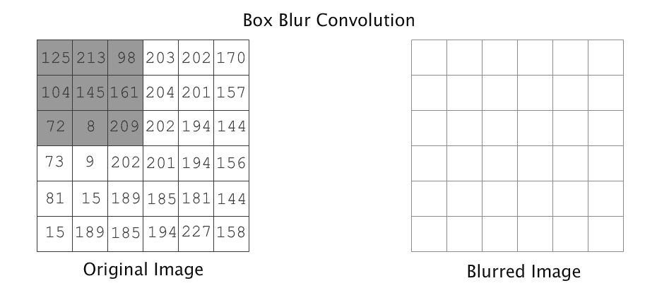
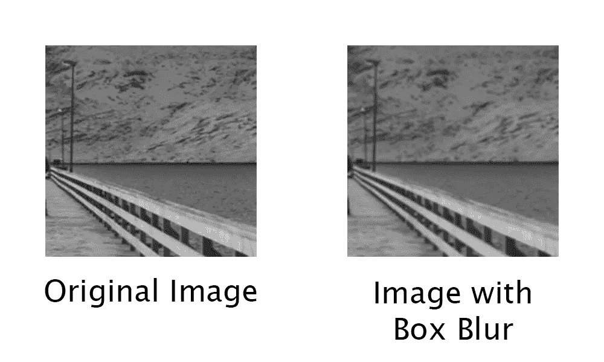
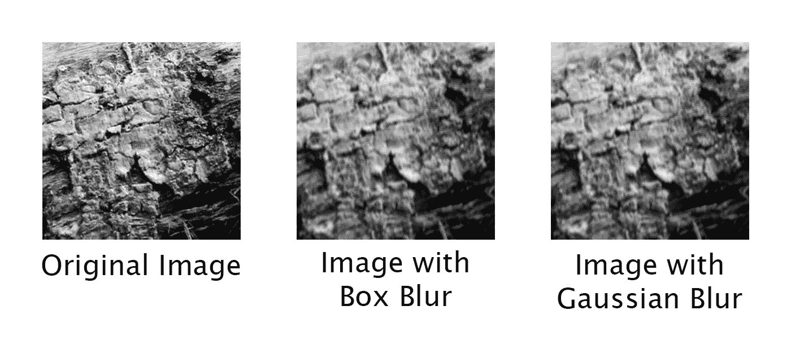
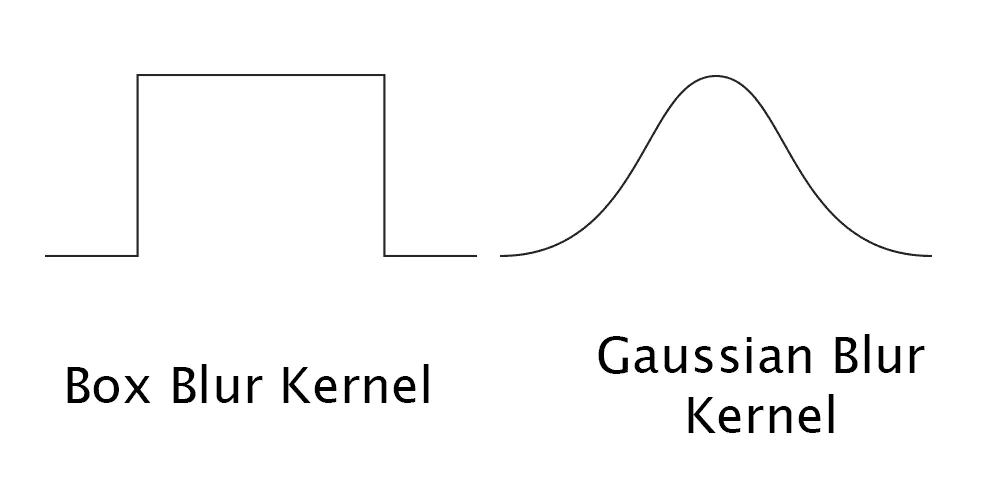

# 忙碌开发者的计算机视觉

> 原文：<https://medium.com/hackernoon/cv-for-busy-developers-convolutions-5c984f216e8c>

回旋

*本文是向开发者介绍* ***计算机视觉*** *系列的一部分。查看本系列* [*其他文章*](/@vad710/computer-vision-for-busy-developers-6a7320222da) *。*


Photo by [Shawn Fields](https://unsplash.com/@shawnsfields?utm_source=medium&utm_medium=referral) on [Unsplash](https://unsplash.com?utm_source=medium&utm_medium=referral)

# 卷积和核

当我们讨论[图像处理](/@vad710/cv-for-busy-developers-image-processing-d93ed4836880)时，我们一次分析一个像素，并针对一个常量值对其进行操作(乘/减)。然后，我们试图根据一个[模板 imag](/@vad710/cv-for-busy-developers-thresholds-and-templates-15d660694c38) e 来寻找对象，这是一个将滑动窗口中的一组像素与模板图像中的一组恒定像素进行比较的过程。我们现在要探索两者之间的空间。我们将着眼于图像区域内相邻像素的关系。我们将基于一个较小的恒定像素组来分析图像。这一小组像素是一个 3×3 或 5×5 的小图像，称为由简单矩阵表示的核心。可以将这种方法想象成使用一个非常小的图像模板，大小为 3x3 或 5x5 像素，而不是更大的图像模板。例如，我们之前使用的月亮模板是 226x213 像素大。



Think of a Kernel as a much smaller Template Image that is 3x3 Pixels large (Template Image Source: [Samer Daboul](https://www.pexels.com/photo/full-moon-746111/))

我们将深入研究一项在计算机视觉中极其重要的技术。这种基本技术被称为卷积。一个**卷积**是通过使用滑动窗口将一个像素及其相邻像素的颜色值乘以一个内核来完成的。卷积和内核操作像素不仅基于像素本身的值，还基于特定像素的紧邻像素(有时称为**连接像素**或**邻居**)。卷积是另一种类型的图像滤波器，在阅读这些主题时，这些术语经常互换使用。

# 虚化

我们将首先看看两个流行的内核卷积模糊图像。**框模糊**(有时称为均值或平均模糊)，查看图像的每个像素，并用其周围所有像素的平均值替换其值。在我们的例子中，我们将使用一个简单的 3×3 矩阵核，其中所有的值都是 1。盒子模糊内核:

```
[1, 1, 1]
[1, 1, 1]
[1, 1, 1]
```

虽然上面的内核非常简单，但它将帮助我们理解卷积是如何工作的。在这个卷积中，因为矩阵值都是 1，所以每个窗口的结果是中心像素及其邻居的平均值。因为我们使用的是滑动窗口，所以我们不能在线更新像素值(否则会影响下一次窗口移动)。我们用对应于核中心的位置处的平均值来更新新图像。



The Box Blur is an example of a convolution. It uses a sliding window the size of the kernel to calculate the average of a neighborhood of pixels.

使用滑动窗口，卷积将处理图像中的所有像素。一旦卷积完成，我们的新图像将出现模糊。



Convolutions generate a new image once the sliding window is complete

在上面的动画中，请注意值为 8 和 9 的像素。与图像中的所有其他像素相比，这两个像素尤其是离群值。这些像素从其余像素中脱颖而出。卷积后，这些像素值被替换为 109 和 95，使这些值与邻居更加一致。

> 旁注:在动画中还可以看到，最靠近边缘的像素没有在卷积中计算。我见过用三种不同方式处理这些边框像素的例子。这些像素可以被丢弃，可以从原始像素中保留，或者可以计算可用像素的平均值。



Original Image Source: [Simon Migaj](https://www.pexels.com/photo/man-standing-on-pier-911085/)

正如我们在上面看到的，框模糊的结果是通过使像素更像它们的邻居来“平滑”图像，从而产生模糊的图像。

# 高斯模糊

另一个值得讨论的模糊核是高斯模糊核。我们给予内核中的每个像素不同的权重，而不是直接平均像素周围的所有值。我们给中心像素最高的优先级，给离中心最远的像素较低的优先级。因此，使用高斯内核的模糊往往看起来不那么“方方正正”。下面是一个简单易读的 3×3 高斯核的例子:

```
[1, 2, 1]
[2, 4, 2]
[1, 2, 1]
```

高斯核的卷积与长方体模糊核相同。把盒子模糊想象成除以内核值的总和，总共是 9。在上面说明的高斯内核中，内核值的总和是 16。


The Gaussian convolution is identical to the Box Blur — we just use a different set of kernel values



For comparison, here are the results of both a Box and Gaussian Blur. (Original Image Source: [Carlos Spitzer](https://www.pexels.com/photo/toucan-bird-parrot-17811/) )

作为一个快速的可视化练习，让我们也比较一下如果我们在 2D 图中绘制它们，方框模糊和高斯模糊核看起来会是什么样子。



The Box Blur and Gaussian Blur Kernel values graphed in 2D — we can see how Box Blur gets its name and how the Gaussian Blur gives priority to the center pixels

上面展示的高斯核是一个非常简单的核，包含简单的整数。高斯核的具体权重可以基于核的大小(曲线的宽度)和强度(曲线的高度)来计算。虽然我们如何获得高斯核的大小和值的具体数学方法超出了这些文章的意图，但需要指出的是，高斯核的计算取决于 sigma 值，sigma 值是一个描述高斯曲线平滑度的数字(标准偏差，对于数学书呆子来说)。也就是说，sigma 表示内核中心的数字与内核边缘的数字之间的关系。当我们稍后讨论高斯特征检测器的**差异时，我们将再次讨论 sigma 的重要性。现在，考虑 sigma 将代表高斯核平滑图像的程度。西格玛越大，模糊越强。**

# 其他内核

有很多很多不同的核用于卷积。另一个流行的内核是锐化内核，它增加了相邻像素之间的对比度——与我们在本文中看到的模糊正好相反。

当涉及到计算机视觉时，卷积和核出现了很多。在本系列的稍后部分，我们将在讨论卷积神经网络等机器学习技术时再次讨论卷积。在下一篇文章中，我们将使用卷积来寻找图像的边缘。

> **旁注:**熟悉卷积的读者会注意到我们直接进入了 2D 卷积。做出这个决定是为了引导读者将内核视为微小的图像，并与我们已经讨论过的其他主题进行比较——比如模板。沿着这条路，希望实现卷积的开发人员绝对应该研究 1D 卷积。有些情况下，2D 卷积可以分解成两个独立的 1D 卷积，从而优化算法的速度。

# TLDR

卷积是一个过程，其中我们使用滑动窗口技术基于像素本身及其邻居对像素进行操作。我们使用核来定义卷积中使用的值。盒子和高斯模糊是我们研究的卷积的例子。“方框”和“高斯”模糊使每个像素更像其相邻像素，从而导致像素“平滑”并模糊图像的外观。

# 来源和更多信息

*   [直观解释图像内核](http://setosa.io/ev/image-kernels/)—Victor Powerll 的文章
*   [图像卷积](http://web.pdx.edu/~jduh/courses/Archive/geog481w07/Students/Ludwig_ImageConvolution.pdf) —杰米·路丁的演讲
*   平滑化——罗伯特·柯林斯的演讲
*   [模糊滤镜如何工作&](https://www.youtube.com/watch?v=C_zFhWdM4ic)—电脑爱好者视频
*   [框模糊](https://en.wikipedia.org/wiki/Box_blur) —维基百科
*   [高斯模糊](https://en.wikipedia.org/wiki/Gaussian_blur) —维基百科