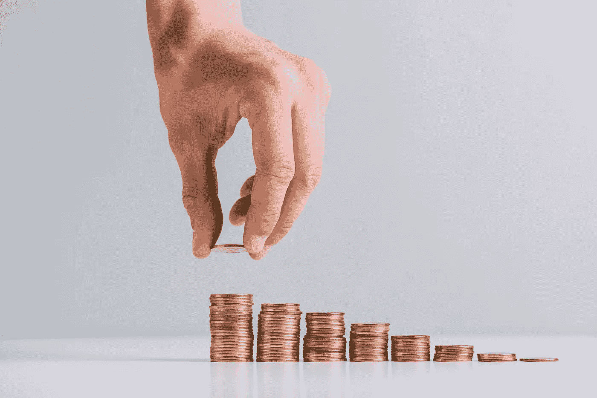

# 网络庞氏骗局——保持警惕！

> 原文：<https://medium.com/hackernoon/cyber-ponzi-scheme-stay-alert-9626247f479f>

庞氏骗局或金字塔计划很容易构建，并使网络攻击者能够隐藏在谎言和干扰的背后。这些网络计划在未经同意的情况下使用知名银行名称，以获得信誉并吸引更多投资者。至关重要的是，我们要弄清楚这个话题，以便更好地教育我们自己了解这些计划，从而避免其后果。

**术语定义&工作原理:**

庞氏骗局被描述为一种欺诈性的投资活动，在这种活动中，人们被骗去投资大笔资金，并被许诺并非来自合法商业活动、利润或交易的高回报率。这些计划标榜对投资者没有风险，并有财务报告和投资者证明支持，炫耀其高收入和生活方式的改变。整个活动依赖于招募新投资者来继续为老投资者提供回报，当这一流量耗尽时，该计划就失败了。这也是用了“抢投资人“X”还投资人“Y”的逻辑。”然而，使用现有投资者的钱来获得新投资者的基本原则是，这种方案不能长期持续，因为继续获得新投资者来偿还老投资者太困难了。这是一个危险的恶性循环，最终会崩溃。

**历史:**

“庞氏骗局”一词来自一个名叫查尔斯·庞兹的人，他是第一个犯下这种罪行的人。在 20 世纪 20 年代，他能够从投资者那里骗走总计 250 万美元以上，这一切都是基于他的想法，即利用汇率的差异来买卖全球邮件优惠券以获取利润。到年底，他每天赚一百万美元。然而，一旦他的行为被抓，这一切都结束了。

迄今为止最大的庞氏骗局之一是伯尼·麦道夫的骗局，总额高达 650 亿美元。据估计，他的投资者损失了 500 亿美元，他的骗局被揭穿，导致他在 2009 年被判入狱 150 年。

**钻石计划(PayDiamond):**

起初，诈骗犯推广黄金庞氏骗局，他们会说服受害者投资黄金，并欺骗他们相信他们会通过虚假承诺和从其他受害者那里获得的一小部分付款获得高回报，而诈骗犯在失踪前收集了大量资金。最近，钻石也被拉进了这个圈子。PayDiamond 计划是活跃的钻石庞氏骗局的一个典型例子，在该计划中，犯罪者说服投资者出资购买原石，然后由公司对原石进行抛光、切割和销售。然后，投资者定期从钻石中获得利润，例如，50 周的初始投资回报率为 5%。此外，如果每个投资者招募更多的人来投资，那么他/她将会得到更高的回报，这样的循环将会持续下去。该公司还利用投资者的成功故事来说服更多人投资他们的资金。这样的故事包括奢华的生活方式、派对、热带岛屿、游艇等等；人们必须知道这些故事都是假的，不要投资这种骗局。

**pay diamond 为什么是庞氏骗局？**

*   高回报率
*   没有实际办公地点
*   虚假声称与著名银行有关联。
*   该公司似乎在香港注册，但默认是用葡萄牙语注册的。

# 细节

**有几个网站被用于同一个庞氏骗局:**

*   【http://paydiamond.com/novo/ 
*   [https://www.paydiamondweb.com/](https://www.paydiamondweb.com/)
*   [http://paydiamondgh.com/](http://paydiamondgh.com/)
*   [http://paydiamond.com.co/](http://paydiamond.com.co/)
*   [http://www.paydiamond.club/](http://www.paydiamond.club/)

**以下是名为 PayDiamond** 的公司在 Linkedin 上的简介

*   [https://www.linkedin.com/company/paydiamondweb/](https://www.linkedin.com/company/paydiamondweb/)
*   [https://www.linkedin.com/company/paydiamond-vale-lacastro/](https://www.linkedin.com/company/paydiamond-vale-lacastro/)
*   [https://www.linkedin.com/company/paydiamond9ja/](https://www.linkedin.com/company/paydiamond9ja/)
*   [https://www.linkedin.com/company/pay-diamond/](https://www.linkedin.com/company/pay-diamond/)
*   [https://www.linkedin.com/company/paydiamondnigeria/](https://www.linkedin.com/company/paydiamondnigeria/)

*根据 Alexa 排名*[*http://paydiamond.com*](http://paydiamond.com)

*30%的游客来自巴基斯坦，在巴基斯坦排名最高。*

**牵连/影响/损失**

经济直接受到庞氏骗局的影响。因为它扼杀创造力，逐渐破坏职业道德，并通过鼓励贪婪和懒惰来减少社会服务。而间接影响是人们在庞氏骗局中损失了大量金钱，因此，他们失去了谋生的能力。

# 如何检测庞氏骗局

**危险信号包括:**

*   高投资回报率和无风险。
*   持续的回报不会因为经济而下降。
*   未登记的投资
*   没有有效许可证的卖家
*   投资策略的未知或秘密信息
*   不一致且容易出错的文书工作
*   难以兑现/接收付款

# 从计划中恢复

庞氏骗局的受害者应该采取的第一步是确保他们不会联系他们的经纪人。到那时，经纪人将无法提供帮助，受害者对他们说的任何话都可能成为对他们不利的证据，这将进一步减少受害者金钱的潜在追回。应收集记录受害者和经纪人之间互动和投资的任何文件或记录。此外，在大多数情况下，追踪阴谋家不会导致追回损失的钱，因为当阴谋结束时，阴谋家已经破产，钱也丢失了。下一个最好的办法是追究经纪公司和其他第三方的责任，他们有能力赔偿受害者。大多数案件都以仲裁告终。因此，需要一位具有欺诈方面专门知识的经验丰富的证券欺诈律师来帮助受害者。

# 结论/建议

**针对金融行业**

*   向官方政府部门报告，以防此类庞氏骗局与您的银行有任何虚假关联。
*   发布一份关于虚假联系的新闻稿。
*   政府
*   在国家层面阻止此类域名和 IP。
*   识别并阻止那些参与这些阴谋的人。

**面向公众**

*   不要投资任何你不了解的东西，也不要投资没有合法网站的公司。
*   确保发行公司获得相关监管机构的投资销售许可。
*   无论整体市场状况如何，避免任何虚假卖家定期提供正回报。
*   报告任何看似可疑或涉及欺诈活动的投资。
*   知道你的钱将被投资到哪里以及如何投资，同时跟踪投资情况。