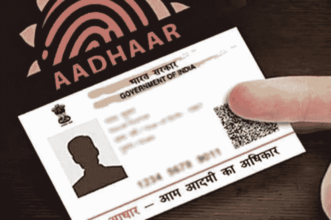

# 记住 2018 年最突出的数据泄露事件

> 原文：<https://medium.com/hackernoon/cyber-security-issues-in-2018-three-most-prominent-data-breaches-baac0b86f48>

## 这一年，全世界都意识到他们的个人信息是多么容易被获取。

## 在保护私人资产方面，2018 年对企业来说是艰难的一年。

剑桥分析报告震惊了万维网的网民，并引发了关于网络隐私、网络安全和遭遇数据泄露的公司的责任的激烈辩论。

在欧洲联盟，人们积极讨论了 GDPR 问题，并提出了违约通知的概念，给予受影响方 72 小时向当局报告违约情况。

[https://threatpost.com/data-leak-hcl-customer-info/144919/](https://threatpost.com/data-leak-hcl-customer-info/144919/) img: data-leak.jpeg

然而，大多数国家都晚了。脸书刚刚从剑桥分析报告中恢复过来，他们的数据库就遭到了另一次攻击，这次攻击利用了三个零日漏洞。在印度，政府完全否认了 Aadhar 的安全漏洞，也否认了网络安全专家的警告，即他们的系统安全性很差。甚至很少使用的 Google+社交网络也遇到了安全问题。

所有这些事件都暴露了我们的个人信息是多么容易获取，即使是 IT 巨头也无法妥善保护他们的服务。在这篇文章中，我将简要讨论 2018 年三个最大和最有争议的数据泄露事件。

## 阿达尔数据泄露

Aadhar 是由印度唯一识别机构(UIDAI)控制的印度政府 ID 数据库。尽管参与是自愿的，但一些社会保障，如免费食物，只提供给拥有 Aadhar 号码的公民。此外，如果一个人有一个 Aadhar 号码，开立银行账户和使用手机会变得更加舒适。考虑到印度的人口数量惊人，11 亿人向 UIDAI 提供了他们的个人信息。

[https://www.financialexpress.com/india-news/aadhaar-data-leak-indias-nightmare-potential-of-large-scale-misuse-of-aadhaar-data-is-real/1551450/](https://www.financialexpress.com/india-news/aadhaar-data-leak-indias-nightmare-potential-of-large-scale-misuse-of-aadhaar-data-is-real/1551450/) img: aadhaar-small.jpg

令人震惊的事实是，UIDAI 可能至少在几年前就意识到了安全问题。这不是 Aadhar 的安全性第一次受到质疑，但在 2018 年，它证明了从他们的数据库中提取个人数据是多么容易。此外，这些数据是非常严重的:从出生日期到虹膜扫描，完整的数据包提供了深度个性化每个注册用户的能力，这反过来可以用于假冒。

[据 ZDNet](https://www.zdnet.com/article/another-data-leak-hits-india-aadhaar-biometric-database/) 报道，一旦他们得知并确认了安全漏洞，他们就此问题联系了印度当局，但没有得到答复。经过几次尝试后，他们通知说，他们将发布这个故事，并且“在发布时，受影响的系统仍然在线并且易受攻击——但是，在我们的故事发布后的几个小时内，受影响的终端就被下线了。”后来，印度当局完全否认了这一问题，使这一规模空前的入侵成为 2018 年最大的网络安全问题。

## 脸书安全漏洞

2018 年，脸书正从剑桥分析公司丑闻中恢复过来。他们与一家数据挖掘公司达成了不负责任的交易，该公司设法收集了多达 8700 万用户数据。然而，这个故事不是关于那个的。9 月 25 日，脸书发现了一个安全问题，这可能会影响到 9000 万被注销的用户。后来，这个数字下降到 5000 万和 3000 万，尽管具体数字不得而知。

[https://www.consumerreports.org/digital-security/what-makes-the-facebook-data-breach-so-harmful/](https://www.consumerreports.org/digital-security/what-makes-the-facebook-data-breach-so-harmful/)

联邦调查局加入了调查，关于幕后黑手的信息很少。有一点可以肯定，这是一次高度协调的袭击。9 月 15 日，脸书注意到一个与“查看为”功能相关的不寻常的活动高峰。激增是由利用了三个零日漏洞的网络罪犯造成的。零日漏洞是复杂、危险和昂贵的。这是软件中的一个安全缺陷，开发者和用户都不知道。利用一个零日漏洞已经是一种严重的犯罪，但同时利用三个零日漏洞暗示了一次精心策划和协调的行动。

网络罪犯能够窃取访问令牌，这些令牌可用于控制受影响用户的帐户。此外，它们可能被用来访问 Instagram 和 WhatsApp 账户，尽管脸书否认这种情况发生过。泄露的信息范围很广，从年龄、性别到用户被标记的照片。此外，今年早些时候，脸书承认以明文形式存储用户密码，这是一个业余的不负责任的错误，将脸书置于第二位，并引发了对其安全结构的充分怀疑。

## 万豪大规模数据泄露

万豪酒店线是如何不做网络安全的另一个例子。9 月 30 日，他们终于透露他们受到了大规模数据泄露的影响。然而，他们花了三个月时间才通知客户他们可能受到了影响。泄露的信息包括姓名、电话号码、支付信息、邮寄地址、电子邮件地址和护照号码。在错误的手中，这是一个完整的包，以发起个性化的模仿或钓鱼活动。

[https://www.itsolutions-inc.com/news-and-training/article/marriott-data-breach/](https://www.itsolutions-inc.com/news-and-training/article/marriott-data-breach/) img: marriott_breach-large.jpg

这个问题最早是在 9 月 8 日被注意到的，所以万豪酒店花了 20 多天才通知他们的客户，他们的个人数据可能处于危险之中。这一事件被 IMBs 发现，IMBs 是为保护数据库安全而开发的 Guardium 软件。9 月 7 日，它发出了一个异常警报，一个来自管理员帐户的查询请求返回数据库中一个表的行数。这暗示了人类的干预，并被证明是正确的。

万豪发起了一项调查，并在一周内发现了一个木马、一个渗透软件和两个已被删除的压缩和加密文件的踪迹。令人震惊的是，证据显示黑客可能早在 2014 年就已经进入了他们的系统。一旦调查人员解密了这些文件，就证明这是他们客户的个人信息，而全部披露发生在近三个月后。这给万豪酒店的声誉造成了相当大的损害，财务损失(如果有的话)还未可知。