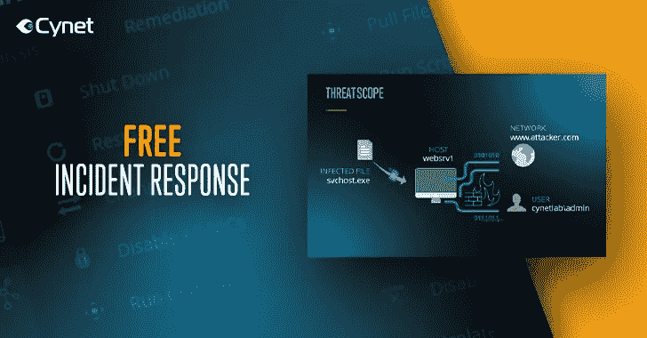
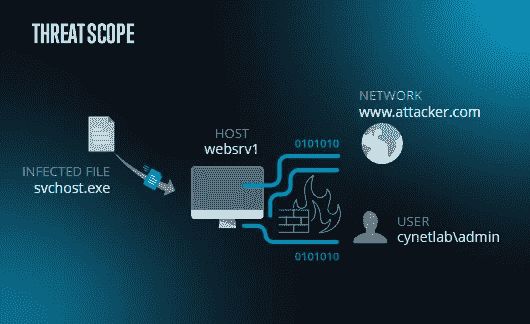
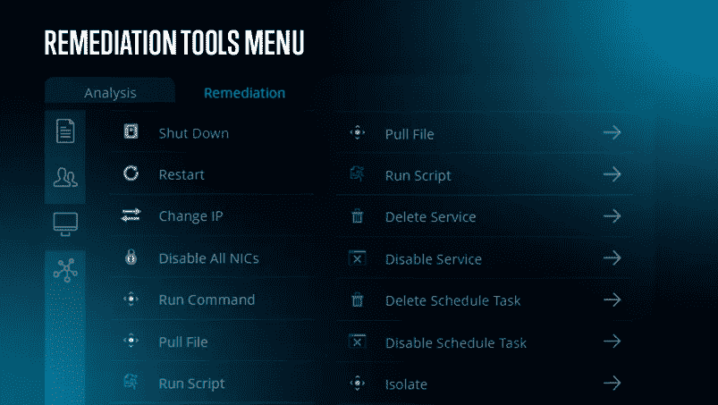

# 我们提供的免费 IR 工具使响应者能够了解并应对主动攻击

> 原文：<https://medium.com/hackernoon/cynet-free-ir-tool-offering-empowers-responders-to-know-and-act-against-active-attacks-8a006f624e25>

有两种类型的组织，一种是已经被入侵的组织，另一种是已经被入侵但还不知道的组织，这种说法从未像现在这样贴切，这使得合理的事件响应成为任何组织的安全堆栈中的一项必备功能。

为了帮助完成这一重要任务，Cynet 推出了一款免费的 IR 工具，适用于需要强大的免费事件响应平台的 IR 服务提供商，以及怀疑发生了安全事件并希望立即了解所发生事件的组织，或者知道自己遭到入侵并需要立即做出响应的组织。

面向 IR 提供商的 Cynet 免费 IR 工具可在此处访问[。](https://www.cynet.com/partners/free-incident-response/?utm_source=hackernoon&utm_medium=article&utm_campaign=incident-response)
Cynet 为组织提供的免费 IR 工具可在此处访问[。](https://go.cynet.com/free-incident-response?utm_source=hackernoon&utm_medium=article&utm_campaign=incident-response)

事件响应是关于尽快完成两件事:准确了解违规范围和影响；并确保完全消除所有恶意存在和活动。Cynet 通过其新的免费 IR 产品在这两个方面都引入了无与伦比的速度和效率。

> Cynet 的联合创始人 Eyal Gruner 说:“我们看到许多组织和服务提供商很难获得他们需要的威胁可见性。“IR 是一个对时间极其敏感的过程，必须在几分钟内启动并运行所需的威胁可见性。”

部署额外产品的需求在许多情况下是一个障碍——在 IR 环境中，快速无缝的部署并不是一件好事。成功的遏制和致命的破坏往往会有所不同。另一个延迟因素是需要通过关联活动和配置来手动搜寻和调查威胁。

出于几个原因，Cynet 360 是事故响应的理想选择。其基于 SaaS 的光速分发能够在几分钟内覆盖数千个端点。其自动化威胁发现从根本上减少了手动调查时间，其完整的补救措施集使响应者能够从任何类型的威胁中恢复。使用 Cynet，您可以:

*   即时了解内部环境中的所有实体:用户、主机、文件、正在运行的进程和网络流量。
*   轻松定位实时攻击并确定其范围和影响。
*   只需点击一个按钮，即可删除恶意文件、禁用受损用户并阻止危险的网络连接。
*   自动化威胁发现和移除流程。
*   利用 Cynet 中央管理在整个环境中分发其他开源工具。
*   使用国际奥委会反馈实时搜索威胁。

> “的确，事件响应被外包了很多次，但我们在 Cynet 360 上花了很多心思，所以它也可以由内部团队使用，”Gruner 说。“这里有很多灰色地带。如果您只是怀疑有违规行为，但并不确定，该怎么办？Cynet IR 可以很容易地告诉你发生了什么。一旦知道了，就可以决定内部处理与否。”

不管喜欢与否，违规是我们现实的一部分。承认这一点意味着确保你有能力去面对他们。参与事件响应的任何人，无论是作为最终用户的服务提供商，都应该认真考虑使用 Cynet free IR 升级其当前的功能。

IR 顾问和服务提供商可以在此访问 Cynet 的免费 IR 工具产品[。](https://www.cynet.com/partners/free-incident-response/?utm_source=hackernoon&utm_medium=article&utm_campaign=incident-response)
内部 IT 和安全团队可以在这里访问 Cynet 的免费 IR 工具[。](https://go.cynet.com/free-incident-response?utm_source=hackernoon&utm_medium=article&utm_campaign=incident-response)